# Lesson 11.21: LangSmith

> **Duration**: 35 min | **Section**: D - Observability

## 🎯 The Problem (3-5 min)

You're using LangChain and need to debug your chains.

```python
chain = prompt | llm | parser
result = chain.invoke({"question": "..."})
# What happened inside? 🤷
```

Each step is opaque. When something breaks, you dig through code.

**LangSmith**: Native tracing for LangChain (works with any LLM too).

---

## 🔍 Under the Hood: LangSmith Architecture


LangSmith automatically captures:
- Every LLM call
- Every chain invocation
- Every tool use
- Every retriever query

---

## 🔍 Setup

### 1. Create Account

Go to [smith.langchain.com](https://smith.langchain.com) and sign up.

### 2. Install SDK

```bash
pip install langsmith
```

### 3. Configure Environment

```bash
export LANGCHAIN_TRACING_V2=true
export LANGCHAIN_API_KEY=ls_xxxxx
export LANGCHAIN_PROJECT="my-rag-project"
```

Or in Python:

```python
import os
os.environ["LANGCHAIN_TRACING_V2"] = "true"
os.environ["LANGCHAIN_API_KEY"] = "ls_xxxxx"
os.environ["LANGCHAIN_PROJECT"] = "my-rag-project"
```

That's it! LangChain auto-traces everything.

---

## 🔍 Basic Tracing

### Automatic Tracing (LangChain)

```python
from langchain_openai import ChatOpenAI
from langchain_core.prompts import ChatPromptTemplate

# Just enable env vars - tracing is automatic
llm = ChatOpenAI(model="gpt-4o")
prompt = ChatPromptTemplate.from_messages([
    ("system", "You are a helpful assistant."),
    ("user", "{question}")
])

chain = prompt | llm

# This call is automatically traced
response = chain.invoke({"question": "What is LangSmith?"})
# Check smith.langchain.com to see the trace!
```

### Manual Tracing (Any Code)

```python
from langsmith import traceable
from openai import OpenAI

client = OpenAI()

@traceable(name="my_llm_call")
def call_openai(prompt: str) -> str:
    """This function is traced even without LangChain."""
    response = client.chat.completions.create(
        model="gpt-4o",
        messages=[{"role": "user", "content": prompt}]
    )
    return response.choices[0].message.content

# Traced!
result = call_openai("Hello, world!")
```

---

## 🔍 Tracing a RAG Pipeline

```python
from langsmith import traceable
from langchain_openai import ChatOpenAI, OpenAIEmbeddings
from langchain_core.prompts import ChatPromptTemplate
from langchain_community.vectorstores import Chroma

embeddings = OpenAIEmbeddings()
vectorstore = Chroma(embedding_function=embeddings)
llm = ChatOpenAI(model="gpt-4o")

@traceable(name="rag_query")
def rag_query(question: str) -> dict:
    """Full RAG pipeline with tracing."""
    
    # Step 1: Retrieve (automatically traced)
    docs = retrieve_docs(question)
    
    # Step 2: Build prompt
    context = "\n".join([d.page_content for d in docs])
    
    # Step 3: Generate (automatically traced)
    response = generate_response(question, context)
    
    return {
        "question": question,
        "answer": response,
        "sources": [d.metadata.get("source") for d in docs]
    }

@traceable(name="retrieve")
def retrieve_docs(question: str, k: int = 3):
    """Retrieve relevant documents."""
    return vectorstore.similarity_search(question, k=k)

@traceable(name="generate")
def generate_response(question: str, context: str) -> str:
    """Generate response using LLM."""
    prompt = ChatPromptTemplate.from_messages([
        ("system", "Answer based on context:\n\n{context}"),
        ("user", "{question}")
    ])
    
    chain = prompt | llm
    return chain.invoke({"question": question, "context": context}).content

# Run - full trace captured
result = rag_query("What is the return policy?")
```

### What You See in LangSmith

```
📊 Trace: rag_query
├── 📥 Input: "What is the return policy?"
├── ⏱️ Duration: 1,234ms
├── 💰 Cost: $0.045
│
├── 📂 Span: retrieve (312ms)
│   ├── Input: "What is the return policy?"
│   └── Output: [Doc1, Doc2, Doc3]
│
├── 📂 Span: generate (922ms)
│   ├── Input: {question, context}
│   ├── Model: gpt-4o
│   ├── Tokens: 1,200 in, 145 out
│   └── Output: "You can return items..."
│
└── 📤 Output: {answer, sources}
```

---

## 🔍 Adding Metadata

```python
from langsmith import traceable

@traceable(
    name="rag_query",
    metadata={"version": "v2.1", "environment": "production"}
)
def rag_query(question: str, user_id: str) -> dict:
    """Query with metadata."""
    # ...
    pass

# Or add metadata dynamically
from langsmith import get_current_run_tree

@traceable
def rag_query(question: str, user_id: str):
    run = get_current_run_tree()
    if run:
        run.metadata["user_id"] = user_id
        run.metadata["session_id"] = "sess_123"
    # ...
```

---

## 🔍 User Feedback

Capture thumbs up/down from users:

```python
from langsmith import Client

client = Client()

# After user gives feedback
def record_feedback(run_id: str, score: float, comment: str = None):
    """Record user feedback for a trace."""
    client.create_feedback(
        run_id=run_id,
        key="user_rating",
        score=score,  # 0.0 to 1.0
        comment=comment
    )

# Usage
result = rag_query("What is the return policy?")
run_id = get_current_run_id()  # Get from trace

# User clicks 👍
record_feedback(run_id, score=1.0)

# User clicks 👎 with comment
record_feedback(run_id, score=0.0, comment="Wrong information about electronics")
```

### Feedback Dashboard

```mermaid
flowchart LR
    subgraph Feedback["USER FEEDBACK LOOP"]
        TRACE["Trace with Response"]
        USER["User Feedback<br/>👍 or 👎"]
        DASHBOARD["LangSmith Dashboard"]
        IMPROVE["Improve System"]
    end
    
    TRACE --> USER --> DASHBOARD --> IMPROVE --> TRACE
    
    style DASHBOARD fill:#E8F5E9
```



---

## 🔍 Datasets & Evaluation

Create test datasets directly from traces:

```python
from langsmith import Client

client = Client()

# Create a dataset
dataset = client.create_dataset("rag-test-cases")

# Add examples from production traces (in dashboard)
# Or programmatically:
client.create_example(
    dataset_id=dataset.id,
    inputs={"question": "What is the return policy?"},
    outputs={"answer": "30 days for most items..."}
)

# Run evaluation
from langsmith.evaluation import evaluate

def accuracy_evaluator(run, example):
    """Check if answer matches expected."""
    predicted = run.outputs["answer"]
    expected = example.outputs["answer"]
    # Your comparison logic
    return {"score": 1.0 if similar(predicted, expected) else 0.0}

results = evaluate(
    rag_query,  # Your function
    data="rag-test-cases",  # Dataset name
    evaluators=[accuracy_evaluator]
)

print(f"Accuracy: {results.aggregate_metrics['accuracy']}")
```

---

## 🔍 Prompt Management

Version and deploy prompts:

```python
from langsmith import Client
from langchain import hub

client = Client()

# Push a prompt to LangSmith Hub
prompt = ChatPromptTemplate.from_messages([
    ("system", "You are a helpful customer service agent for {company}."),
    ("user", "{question}")
])

# Push to hub (versioned)
hub.push("my-org/customer-service-prompt", prompt)

# Pull in production (always latest)
production_prompt = hub.pull("my-org/customer-service-prompt")

# Pull specific version
v1_prompt = hub.pull("my-org/customer-service-prompt:v1")
```

### Prompt Versioning Flow


---

## 🔍 Debugging with LangSmith

### Finding Issues

```python
# In LangSmith dashboard:
# 1. Filter by: error = true
# 2. Filter by: feedback_score < 0.5
# 3. Filter by: latency > 5000ms
# 4. Filter by: user_id = "problem_user"
```

### Playground

Test variations directly in LangSmith:

1. Open a trace
2. Click "Open in Playground"
3. Modify prompt, model, or parameters
4. Compare outputs side-by-side


---

## 🔍 Cost Tracking

LangSmith auto-calculates costs:

```python
# In dashboard, see per-trace costs
# Aggregate by:
# - Project
# - Time period
# - Model
# - User

# API access to costs
from langsmith import Client

client = Client()

# Get project stats
stats = client.get_project_stats("my-rag-project")
print(f"Total cost: ${stats.total_cost:.2f}")
print(f"Avg tokens/request: {stats.avg_tokens}")
```

---

## 💻 Practice: Set Up LangSmith

```python
# Exercise: Add LangSmith to your RAG

# Step 1: Sign up at smith.langchain.com
# Step 2: Get API key
# Step 3: Set environment variables

import os
os.environ["LANGCHAIN_TRACING_V2"] = "true"
os.environ["LANGCHAIN_API_KEY"] = "your-key"
os.environ["LANGCHAIN_PROJECT"] = "my-rag"

# Step 4: Add @traceable to your functions

from langsmith import traceable

@traceable
def your_rag_function(question: str) -> str:
    # Your implementation
    pass

# Step 5: Run queries and check dashboard
your_rag_function("Test question")

# Step 6: Add feedback collection
# TODO: Record user feedback

# Step 7: Create a test dataset
# TODO: Create dataset from production traces

# Verify in dashboard:
# - Traces appear
# - Latency breakdown visible
# - Costs calculated
```

---

## 🔑 Key Takeaways

| Feature | Purpose |
|---------|---------|
| **Auto-tracing** | Zero-config for LangChain |
| **@traceable** | Manual tracing for any code |
| **Feedback** | Capture user quality signals |
| **Datasets** | Create test sets from production |
| **Hub** | Version and deploy prompts |
| **Playground** | Debug and iterate on prompts |

---

## ❓ Common Questions

| Question | Answer |
|----------|--------|
| Free tier limits? | 5K traces/month, 14-day retention |
| Data privacy? | SOC 2 compliant, data encrypted |
| Self-hosted option? | Enterprise plan only |
| Works without LangChain? | Yes, with @traceable decorator |

---

**Next**: 11.22 - Langfuse (Open Source Alternative)
