# Lesson 11.22: Langfuse

> **Duration**: 35 min | **Section**: D - Observability

## 🎯 The Problem (3-5 min)

You want LangSmith-like observability but:
- Need to self-host for compliance
- Want to avoid vendor lock-in
- Need more customization
- Want to keep costs predictable

**Langfuse**: Open-source LLM observability.

---

## 🔍 Under the Hood: Langfuse Architecture


---

## 🔍 Key Concepts


| Concept | Description |
|---------|-------------|
| **Trace** | Root container for one request |
| **Span** | Intermediate step (retrieval, processing) |
| **Generation** | LLM call with tokens/cost |
| **Score** | Quality metric (human or automated) |

---

## 🔍 Setup

### Option 1: Cloud (Easy Start)

```bash
pip install langfuse
```

```python
import os
os.environ["LANGFUSE_PUBLIC_KEY"] = "pk-xxx"
os.environ["LANGFUSE_SECRET_KEY"] = "sk-xxx"
os.environ["LANGFUSE_HOST"] = "https://cloud.langfuse.com"  # or self-hosted URL
```

### Option 2: Self-Hosted (Docker)

```bash
# Clone repo
git clone https://github.com/langfuse/langfuse.git
cd langfuse

# Start with Docker Compose
docker compose up -d

# Access at http://localhost:3000
```

```yaml
# docker-compose.yml (simplified)
version: '3.8'
services:
  langfuse:
    image: langfuse/langfuse:latest
    ports:
      - "3000:3000"
    environment:
      - DATABASE_URL=postgresql://postgres:postgres@db:5432/langfuse
      - NEXTAUTH_SECRET=your-secret
      - SALT=your-salt
    depends_on:
      - db
  
  db:
    image: postgres:15
    environment:
      - POSTGRES_PASSWORD=postgres
      - POSTGRES_DB=langfuse
    volumes:
      - postgres_data:/var/lib/postgresql/data

volumes:
  postgres_data:
```

---

## 🔍 Basic Tracing

### Using the Decorator

```python
from langfuse.decorators import observe, langfuse_context
from openai import OpenAI

client = OpenAI()

@observe()
def rag_query(question: str) -> str:
    """Main RAG function - creates a trace."""
    docs = retrieve_docs(question)
    context = format_context(docs)
    response = generate_response(question, context)
    return response

@observe()
def retrieve_docs(question: str) -> list:
    """Retrieval step - creates a span."""
    # Your retrieval logic
    return ["doc1", "doc2", "doc3"]

@observe()
def format_context(docs: list) -> str:
    """Format docs - creates a span."""
    return "\n".join(docs)

@observe(as_type="generation")
def generate_response(question: str, context: str) -> str:
    """LLM call - creates a generation."""
    response = client.chat.completions.create(
        model="gpt-4o",
        messages=[
            {"role": "system", "content": f"Context: {context}"},
            {"role": "user", "content": question}
        ]
    )
    
    # Update generation with token info
    langfuse_context.update_current_observation(
        model="gpt-4o",
        usage={
            "input": response.usage.prompt_tokens,
            "output": response.usage.completion_tokens
        }
    )
    
    return response.choices[0].message.content

# Run - full trace captured
result = rag_query("What is the return policy?")

# Important: flush at end of request
langfuse_context.flush()
```

### Using Low-Level API

```python
from langfuse import Langfuse

langfuse = Langfuse()

def rag_query(question: str) -> str:
    """Manual tracing with low-level API."""
    
    # Create trace
    trace = langfuse.trace(
        name="rag_query",
        input={"question": question},
        metadata={"user_id": "user_123"}
    )
    
    # Retrieval span
    retrieval_span = trace.span(
        name="retrieval",
        input={"query": question}
    )
    docs = retrieve_docs(question)
    retrieval_span.end(output={"doc_count": len(docs)})
    
    # LLM generation
    generation = trace.generation(
        name="llm_call",
        model="gpt-4o",
        input=[
            {"role": "system", "content": "..."},
            {"role": "user", "content": question}
        ]
    )
    
    response = call_llm(question, docs)
    
    generation.end(
        output=response.content,
        usage={
            "input": response.usage.prompt_tokens,
            "output": response.usage.completion_tokens
        }
    )
    
    # End trace
    trace.update(output={"answer": response.content})
    
    # Flush
    langfuse.flush()
    
    return response.content
```

---

## 🔍 OpenAI Integration

Langfuse wraps OpenAI client for automatic tracing:

```python
from langfuse.openai import openai

# Drop-in replacement - all calls traced automatically
response = openai.chat.completions.create(
    model="gpt-4o",
    messages=[{"role": "user", "content": "Hello!"}]
)

# With trace context
from langfuse.decorators import observe

@observe()
def my_function():
    # OpenAI calls automatically attached to trace
    response = openai.chat.completions.create(
        model="gpt-4o",
        messages=[{"role": "user", "content": "Hello!"}]
    )
    return response.choices[0].message.content
```

---

## 🔍 LangChain Integration

```python
from langfuse.callback import CallbackHandler
from langchain_openai import ChatOpenAI
from langchain_core.prompts import ChatPromptTemplate

# Create Langfuse callback handler
langfuse_handler = CallbackHandler()

# Use with LangChain
llm = ChatOpenAI(model="gpt-4o")
prompt = ChatPromptTemplate.from_messages([
    ("system", "You are helpful."),
    ("user", "{question}")
])

chain = prompt | llm

# Pass handler to invoke
response = chain.invoke(
    {"question": "What is Langfuse?"},
    config={"callbacks": [langfuse_handler]}
)

# Flush
langfuse_handler.flush()
```

---

## 🔍 Scoring & Evaluation

### Manual Scores

```python
from langfuse import Langfuse

langfuse = Langfuse()

# Add score to a trace
langfuse.score(
    trace_id="trace_xxx",
    name="user_feedback",
    value=1,  # 0 or 1 for binary
    comment="User clicked thumbs up"
)

# Numeric scores
langfuse.score(
    trace_id="trace_xxx",
    name="relevance",
    value=0.85,  # 0.0 to 1.0
    data_type="NUMERIC"
)
```

### Automated Scoring

```python
from langfuse.decorators import observe, langfuse_context

@observe()
def rag_query(question: str) -> dict:
    response = generate_response(question)
    
    # Auto-score the response
    quality_score = evaluate_response(question, response)
    
    # Attach score to current trace
    langfuse_context.score_current_trace(
        name="auto_quality",
        value=quality_score,
        comment="Automated evaluation"
    )
    
    return {"answer": response, "score": quality_score}

def evaluate_response(question: str, response: str) -> float:
    """LLM-as-judge evaluation."""
    judgment = client.chat.completions.create(
        model="gpt-4o-mini",
        messages=[
            {"role": "system", "content": "Rate the response quality 0-10."},
            {"role": "user", "content": f"Q: {question}\nA: {response}"}
        ]
    )
    score = extract_score(judgment.choices[0].message.content)
    return score / 10.0  # Normalize to 0-1
```

---

## 🔍 Datasets & Experiments

### Create Dataset

```python
from langfuse import Langfuse

langfuse = Langfuse()

# Create dataset
dataset = langfuse.create_dataset("rag-golden-set")

# Add items
langfuse.create_dataset_item(
    dataset_name="rag-golden-set",
    input={"question": "What is the return policy?"},
    expected_output={"answer": "30 days for most items..."}
)
```

### Run Experiments

```python
from langfuse import Langfuse

langfuse = Langfuse()

def run_experiment(experiment_name: str, rag_function):
    """Run experiment on dataset."""
    dataset = langfuse.get_dataset("rag-golden-set")
    
    for item in dataset.items:
        # Run your function
        with item.observe(run_name=experiment_name) as trace:
            result = rag_function(item.input["question"])
            
            # Score against expected
            score = evaluate_against_expected(
                result,
                item.expected_output
            )
            
            trace.score(name="accuracy", value=score)

# Compare experiments
run_experiment("baseline_v1", rag_query_v1)
run_experiment("improved_v2", rag_query_v2)

# View comparison in Langfuse dashboard
```

---

## 🔍 Prompt Management

```python
from langfuse import Langfuse

langfuse = Langfuse()

# Create/update prompt
langfuse.create_prompt(
    name="customer-service",
    prompt="You are a helpful customer service agent for {company}.\n\nAnswer the following question: {question}",
    labels=["production"],
    config={
        "model": "gpt-4o",
        "temperature": 0.7
    }
)

# Fetch prompt in production
prompt = langfuse.get_prompt("customer-service", label="production")

# Use prompt
formatted = prompt.compile(company="TechCorp", question="What's the return policy?")

# Track which prompt version was used
@observe()
def query_with_prompt(question: str):
    prompt = langfuse.get_prompt("customer-service")
    
    langfuse_context.update_current_trace(
        metadata={"prompt_version": prompt.version}
    )
    
    # Use prompt...
```

---

## 🔍 Dashboard Features

```mermaid
flowchart TD
    subgraph Dashboard["LANGFUSE DASHBOARD"]
        TRACES["📊 Traces<br/>Browse all requests"]
        METRICS["📈 Metrics<br/>Latency, cost, usage"]
        SCORES["⭐ Scores<br/>Quality over time"]
        DATASETS["🗂️ Datasets<br/>Test cases"]
        PROMPTS["📝 Prompts<br/>Version control"]
    end
    
    style TRACES fill:#E3F2FD
    style METRICS fill:#E8F5E9
    style SCORES fill:#FFF3E0
```



### Key Views

| View | Use Case |
|------|----------|
| **Traces** | Debug individual requests |
| **Sessions** | Group traces by user session |
| **Metrics** | Monitor latency, costs, errors |
| **Scores** | Track quality over time |
| **Users** | Per-user analytics |

---

## 🔍 Langfuse vs LangSmith

| Feature | Langfuse | LangSmith |
|---------|----------|-----------|
| **Open source** | ✅ Yes | ❌ No |
| **Self-hosted** | ✅ Easy | Enterprise only |
| **LangChain integration** | ✅ Good | ✅ Native |
| **OpenAI wrapper** | ✅ Yes | ✅ Yes |
| **Prompt management** | ✅ Yes | ✅ Yes (Hub) |
| **Pricing** | Free self-host | Free tier + paid |
| **Playground** | ✅ Yes | ✅ Yes |
| **A/B testing** | Via experiments | Via datasets |

---

## 💻 Practice: Set Up Langfuse

```python
# Exercise: Add Langfuse to your RAG

# Option A: Use Langfuse Cloud
# 1. Sign up at cloud.langfuse.com
# 2. Create project, get keys
# 3. Set environment variables

import os
os.environ["LANGFUSE_PUBLIC_KEY"] = "pk-xxx"
os.environ["LANGFUSE_SECRET_KEY"] = "sk-xxx"

# Option B: Self-host
# docker compose up -d

# Step 1: Add decorators
from langfuse.decorators import observe, langfuse_context

@observe()
def your_rag_function(question: str) -> str:
    # Your implementation
    pass

# Step 2: Track generations
@observe(as_type="generation")
def your_llm_call(prompt: str) -> str:
    response = client.chat.completions.create(...)
    
    langfuse_context.update_current_observation(
        model="gpt-4o",
        usage={
            "input": response.usage.prompt_tokens,
            "output": response.usage.completion_tokens
        }
    )
    
    return response.choices[0].message.content

# Step 3: Add scores
langfuse_context.score_current_trace(
    name="quality",
    value=0.9
)

# Step 4: Flush at request end
langfuse_context.flush()

# Verify:
# - Traces appear in dashboard
# - Costs calculated
# - Scores tracked
```

---

## 🔑 Key Takeaways

| Feature | Benefit |
|---------|---------|
| **Open source** | Self-host, no vendor lock-in |
| **@observe decorator** | Easy tracing |
| **Generations** | LLM call tracking with costs |
| **Scores** | Quality tracking |
| **Datasets** | Experiments and evaluation |
| **Prompts** | Version control |

---

## ❓ Common Questions

| Question | Answer |
|----------|--------|
| Cloud vs self-host? | Cloud for quick start, self-host for control |
| Data retention? | Self-host: unlimited; Cloud: based on plan |
| Performance impact? | Async logging, minimal overhead |
| Works with any LLM? | Yes, via low-level API |

---

**Next**: 11.23 - A/B Testing Prompts
