# Lesson 11.23: A/B Testing Prompts

> **Duration**: 30 min | **Section**: D - Observability

## 🎯 The Problem (3-5 min)

You've written two versions of a prompt. Which is better?

```python
# Version A
prompt_a = "You are a helpful assistant. Answer the question."

# Version B
prompt_b = "You are a customer service expert for TechCorp. Be concise and friendly."
```

**Gut feeling isn't enough.** You need data.

---

## 🔍 Under the Hood: A/B Testing Flow


---

## 🔍 What to Measure


| Metric Type | Examples |
|-------------|----------|
| **Quality** | Accuracy, helpfulness, relevance |
| **Engagement** | Thumbs up %, follow-up questions |
| **Efficiency** | Tokens used, response time |
| **Business** | Conversion rate, support ticket resolution |

---

## 🔍 Basic A/B Testing Implementation

```python
import random
import hashlib
from dataclasses import dataclass
from typing import Callable, Optional
from datetime import datetime

@dataclass
class PromptVariant:
    """A prompt variant for A/B testing."""
    name: str
    template: str
    weight: float = 0.5  # Traffic allocation

@dataclass
class ABTestResult:
    """Result of an A/B test query."""
    variant: str
    response: str
    metrics: dict

class PromptABTest:
    """A/B testing for prompts."""
    
    def __init__(self, test_name: str, variants: list[PromptVariant]):
        self.test_name = test_name
        self.variants = {v.name: v for v in variants}
        self.weights = [v.weight for v in variants]
        self.results: list[dict] = []
    
    def get_variant(self, user_id: Optional[str] = None) -> PromptVariant:
        """
        Get variant for user.
        If user_id provided, same user always gets same variant (sticky).
        """
        if user_id:
            # Deterministic assignment based on user_id
            hash_val = int(hashlib.md5(
                f"{self.test_name}:{user_id}".encode()
            ).hexdigest(), 16)
            
            # Normalize to 0-1
            normalized = (hash_val % 10000) / 10000
            
            # Assign to variant based on weights
            cumulative = 0
            for variant in self.variants.values():
                cumulative += variant.weight
                if normalized < cumulative:
                    return variant
            
            return list(self.variants.values())[-1]
        
        # Random assignment
        return random.choices(
            list(self.variants.values()),
            weights=self.weights
        )[0]
    
    def record_result(
        self,
        variant_name: str,
        metrics: dict,
        user_id: Optional[str] = None
    ):
        """Record test result."""
        self.results.append({
            "timestamp": datetime.now().isoformat(),
            "variant": variant_name,
            "user_id": user_id,
            **metrics
        })
    
    def analyze(self) -> dict:
        """Analyze test results."""
        from collections import defaultdict
        import statistics
        
        by_variant = defaultdict(list)
        
        for result in self.results:
            by_variant[result["variant"]].append(result)
        
        analysis = {}
        
        for variant_name, results in by_variant.items():
            scores = [r.get("quality_score", 0) for r in results]
            thumbs_up = [r.get("thumbs_up", False) for r in results]
            
            analysis[variant_name] = {
                "count": len(results),
                "avg_quality": statistics.mean(scores) if scores else 0,
                "thumbs_up_rate": sum(thumbs_up) / len(thumbs_up) if thumbs_up else 0,
                "avg_tokens": statistics.mean([r.get("tokens", 0) for r in results])
            }
        
        return analysis

# Usage
test = PromptABTest(
    test_name="customer_service_prompt_v2",
    variants=[
        PromptVariant(
            name="control",
            template="You are a helpful assistant. Answer: {question}",
            weight=0.5
        ),
        PromptVariant(
            name="treatment",
            template="You are a friendly TechCorp expert. Be concise. Answer: {question}",
            weight=0.5
        )
    ]
)

def query_with_ab_test(question: str, user_id: str) -> ABTestResult:
    """Query with A/B testing."""
    # Get variant
    variant = test.get_variant(user_id)
    
    # Build prompt
    prompt = variant.template.format(question=question)
    
    # Call LLM
    response = call_llm(prompt)
    
    # Record metrics
    metrics = {
        "tokens": response.usage.total_tokens,
        "latency_ms": response.latency_ms,
        "quality_score": auto_evaluate(question, response.content)
    }
    
    test.record_result(variant.name, metrics, user_id)
    
    return ABTestResult(
        variant=variant.name,
        response=response.content,
        metrics=metrics
    )
```

---

## 🔍 A/B Testing with Langfuse

```python
from langfuse import Langfuse
from langfuse.decorators import observe, langfuse_context

langfuse = Langfuse()

# Create prompts in Langfuse
langfuse.create_prompt(
    name="customer-service",
    prompt="You are a helpful assistant. Answer: {question}",
    labels=["control"]
)

langfuse.create_prompt(
    name="customer-service",
    prompt="You are a friendly TechCorp expert. Be concise. Answer: {question}",
    labels=["treatment"]
)

@observe()
def ab_test_query(question: str, user_id: str) -> str:
    """A/B test with Langfuse tracking."""
    
    # Deterministic variant assignment
    variant = "treatment" if hash(user_id) % 2 == 0 else "control"
    
    # Get prompt for variant
    prompt = langfuse.get_prompt("customer-service", label=variant)
    
    # Track variant in trace
    langfuse_context.update_current_trace(
        metadata={
            "ab_test": "customer_service_v2",
            "variant": variant
        },
        tags=[f"variant:{variant}"]
    )
    
    # Generate response
    formatted = prompt.compile(question=question)
    response = call_llm(formatted)
    
    langfuse_context.flush()
    
    return response

# Analyze in Langfuse dashboard:
# Filter by tag "variant:control" vs "variant:treatment"
# Compare scores, latency, costs
```

---

## 🔍 Statistical Significance

Don't declare a winner too early!

```python
from scipy import stats
import numpy as np

def is_significant(
    control_scores: list[float],
    treatment_scores: list[float],
    confidence_level: float = 0.95
) -> dict:
    """Check if difference is statistically significant."""
    
    # t-test for means
    t_stat, p_value = stats.ttest_ind(control_scores, treatment_scores)
    
    # Calculate effect size (Cohen's d)
    pooled_std = np.sqrt(
        (np.std(control_scores)**2 + np.std(treatment_scores)**2) / 2
    )
    effect_size = (np.mean(treatment_scores) - np.mean(control_scores)) / pooled_std
    
    significant = p_value < (1 - confidence_level)
    
    return {
        "control_mean": np.mean(control_scores),
        "treatment_mean": np.mean(treatment_scores),
        "p_value": p_value,
        "effect_size": effect_size,
        "significant": significant,
        "interpretation": interpret_effect_size(effect_size),
        "sample_size": {
            "control": len(control_scores),
            "treatment": len(treatment_scores)
        }
    }

def interpret_effect_size(d: float) -> str:
    """Interpret Cohen's d effect size."""
    d = abs(d)
    if d < 0.2:
        return "negligible"
    elif d < 0.5:
        return "small"
    elif d < 0.8:
        return "medium"
    else:
        return "large"

# Usage
analysis = test.analyze()

control_scores = [r["quality_score"] for r in test.results if r["variant"] == "control"]
treatment_scores = [r["quality_score"] for r in test.results if r["variant"] == "treatment"]

significance = is_significant(control_scores, treatment_scores)

print(f"Control mean: {significance['control_mean']:.3f}")
print(f"Treatment mean: {significance['treatment_mean']:.3f}")
print(f"P-value: {significance['p_value']:.4f}")
print(f"Effect size: {significance['effect_size']:.3f} ({significance['interpretation']})")
print(f"Significant: {significance['significant']}")
```

---

## 🔍 Sample Size Calculator

```python
from scipy.stats import norm
import math

def required_sample_size(
    baseline_rate: float,
    minimum_detectable_effect: float,
    power: float = 0.8,
    confidence: float = 0.95
) -> int:
    """
    Calculate required sample size per variant.
    
    Args:
        baseline_rate: Current metric (e.g., 0.70 for 70% success)
        minimum_detectable_effect: Smallest effect worth detecting (e.g., 0.05)
        power: Probability of detecting effect if it exists (typically 0.8)
        confidence: Confidence level (typically 0.95)
    """
    alpha = 1 - confidence
    
    # Z-scores
    z_alpha = norm.ppf(1 - alpha / 2)
    z_power = norm.ppf(power)
    
    # Variance
    p1 = baseline_rate
    p2 = baseline_rate + minimum_detectable_effect
    p_pooled = (p1 + p2) / 2
    
    # Sample size formula
    numerator = (z_alpha * math.sqrt(2 * p_pooled * (1 - p_pooled)) + 
                 z_power * math.sqrt(p1 * (1 - p1) + p2 * (1 - p2))) ** 2
    denominator = (p2 - p1) ** 2
    
    return int(math.ceil(numerator / denominator))

# Example: Testing a prompt change
# Current: 70% thumbs up rate
# Want to detect: 5% improvement
# Need: X samples per variant

sample_size = required_sample_size(
    baseline_rate=0.70,
    minimum_detectable_effect=0.05
)

print(f"Required samples per variant: {sample_size}")
# Output: ~783 samples per variant
```

---

## 🔍 Multi-Armed Bandit (Adaptive Testing)

Instead of fixed 50/50 split, allocate more traffic to winning variant:


### Thompson Sampling Implementation

```python
import numpy as np
from dataclasses import dataclass, field

@dataclass
class BanditVariant:
    """Variant for multi-armed bandit."""
    name: str
    successes: int = 0
    failures: int = 0
    
    @property
    def sample(self) -> float:
        """Sample from Beta distribution."""
        return np.random.beta(self.successes + 1, self.failures + 1)

class ThompsonSamplingABTest:
    """Adaptive A/B testing with Thompson Sampling."""
    
    def __init__(self, variant_names: list[str]):
        self.variants = {
            name: BanditVariant(name=name)
            for name in variant_names
        }
    
    def get_variant(self) -> str:
        """Get variant using Thompson Sampling."""
        samples = {
            name: variant.sample
            for name, variant in self.variants.items()
        }
        
        # Return variant with highest sample
        return max(samples, key=samples.get)
    
    def record_outcome(self, variant_name: str, success: bool):
        """Record outcome for variant."""
        variant = self.variants[variant_name]
        
        if success:
            variant.successes += 1
        else:
            variant.failures += 1
    
    def get_stats(self) -> dict:
        """Get current statistics."""
        return {
            name: {
                "successes": v.successes,
                "failures": v.failures,
                "success_rate": v.successes / (v.successes + v.failures) if (v.successes + v.failures) > 0 else 0,
                "total": v.successes + v.failures
            }
            for name, v in self.variants.items()
        }

# Usage
bandit = ThompsonSamplingABTest(["control", "treatment"])

def query_with_bandit(question: str, user_id: str) -> str:
    # Get variant (adaptive allocation)
    variant_name = bandit.get_variant()
    
    # Get prompt for variant
    prompt = get_prompt_for_variant(variant_name)
    
    # Generate response
    response = call_llm(prompt.format(question=question))
    
    # Later, when you get user feedback:
    # bandit.record_outcome(variant_name, thumbs_up=True)
    
    return response

# Over time, traffic automatically shifts to better variant
```

---

## 🔍 A/B Testing Checklist

```mermaid
flowchart TD
    subgraph Checklist["A/B TEST CHECKLIST"]
        C1["✓ Define success metric"]
        C2["✓ Calculate sample size"]
        C3["✓ Implement sticky assignment"]
        C4["✓ Track all variants"]
        C5["✓ Wait for significance"]
        C6["✓ Document and deploy winner"]
    end
    
    C1 --> C2 --> C3 --> C4 --> C5 --> C6
```



| Step | Details |
|------|---------|
| **1. Define metric** | Thumbs up rate? Quality score? Conversion? |
| **2. Sample size** | Use calculator, typically 500-2000 per variant |
| **3. Sticky assignment** | Same user = same variant |
| **4. Track variants** | Log variant with every request |
| **5. Wait** | Don't peek! Wait for required samples |
| **6. Deploy** | Roll out winner to 100% |

---

## 💻 Practice: Run an A/B Test

```python
# Exercise: A/B test two prompt versions

# Step 1: Define variants
variants = [
    PromptVariant(
        name="formal",
        template="Please provide a professional response to: {question}"
    ),
    PromptVariant(
        name="friendly",
        template="Hey! Happy to help with: {question} 😊"
    )
]

# Step 2: Set up test
test = PromptABTest("tone_test", variants)

# Step 3: Run queries with tracking
# TODO: Implement query function

# Step 4: Collect feedback
# TODO: Record thumbs up/down

# Step 5: Analyze results
# TODO: Check statistical significance

# Step 6: Deploy winner
# TODO: Roll out to 100%

# Questions to answer:
# - What's the minimum sample size needed?
# - How long to run the test?
# - Is the difference significant?
```

---

## 🔑 Key Takeaways

| Concept | Importance |
|---------|------------|
| **Sticky assignment** | Same user, same experience |
| **Statistical significance** | Don't declare winner too early |
| **Sample size** | Calculate before starting |
| **Multi-armed bandit** | Adaptive for optimization |

---

## ❓ Common Questions

| Question | Answer |
|----------|--------|
| How long to run test? | Until sample size reached (days to weeks) |
| Can I peek at results? | Yes, but don't stop early |
| What p-value threshold? | < 0.05 is standard |
| A/B vs A/B/C? | Same process, just more variants |

---

**Next**: 11.24 - Observability Q&A (Section Recap)
