# Lesson 11.24: Observability Q&A

> **Duration**: 15 min | **Section**: D - Observability (Recap)

## 📋 Section D Summary

You learned to see inside your LLM applications.


---

## 🎯 What You Can Now Build

| Capability | Tools |
|------------|-------|
| **Trace requests** | LangSmith, Langfuse |
| **Debug issues** | View full prompts, context, responses |
| **Track costs** | Automatic token/cost calculation |
| **Monitor quality** | Scores, user feedback |
| **Run experiments** | A/B testing with statistical analysis |
| **Manage prompts** | Version control, deployment |

---

## 📊 Tool Comparison


| Feature | LangSmith | Langfuse |
|---------|-----------|----------|
| **LangChain integration** | ⭐ Native | ✅ Good |
| **Self-hosted** | Enterprise only | ✅ Free |
| **Open source** | ❌ | ✅ |
| **Free tier** | 5K traces/month | Unlimited (self-host) |
| **Prompt hub** | ✅ | ✅ |
| **Playground** | ✅ | ✅ |

---

## 🔑 Key Patterns

### Tracing Pattern

```python
# LangSmith
from langsmith import traceable

@traceable
def my_function():
    pass

# Langfuse
from langfuse.decorators import observe

@observe()
def my_function():
    pass
```

### Feedback Pattern

```python
# Record user feedback
def record_feedback(trace_id: str, score: float, comment: str = None):
    # LangSmith
    langsmith_client.create_feedback(
        run_id=trace_id,
        key="user_rating",
        score=score
    )
    
    # Langfuse
    langfuse.score(
        trace_id=trace_id,
        name="user_rating",
        value=score
    )
```

### A/B Testing Pattern

```python
# Deterministic assignment
def get_variant(user_id: str, test_name: str) -> str:
    import hashlib
    hash_val = int(hashlib.md5(
        f"{test_name}:{user_id}".encode()
    ).hexdigest(), 16)
    
    return "treatment" if hash_val % 2 == 0 else "control"

# Statistical analysis
from scipy import stats

def is_winner(control: list, treatment: list) -> bool:
    _, p_value = stats.ttest_ind(control, treatment)
    return p_value < 0.05
```

---

## 🏗️ Complete Observability Setup

```python
from langfuse.decorators import observe, langfuse_context
from langfuse import Langfuse
from dataclasses import dataclass
from typing import Optional
import hashlib

langfuse = Langfuse()

@dataclass
class ObservableRAG:
    """RAG with full observability."""
    
    def __init__(self):
        self.ab_tests = {}
    
    @observe()
    def query(
        self,
        question: str,
        user_id: str,
        session_id: Optional[str] = None
    ) -> dict:
        """Fully observable RAG query."""
        
        # Track user and session
        langfuse_context.update_current_trace(
            user_id=user_id,
            session_id=session_id,
            metadata={"source": "api"}
        )
        
        # A/B test variant
        variant = self._get_ab_variant(user_id, "prompt_v2_test")
        langfuse_context.update_current_trace(
            tags=[f"variant:{variant}"],
            metadata={"ab_variant": variant}
        )
        
        # Retrieval
        docs = self._retrieve(question)
        
        # Generation
        prompt = self._get_prompt(variant)
        response = self._generate(question, docs, prompt)
        
        # Auto-score
        quality = self._auto_evaluate(question, response)
        langfuse_context.score_current_trace(
            name="auto_quality",
            value=quality
        )
        
        return {
            "answer": response,
            "variant": variant,
            "trace_id": langfuse_context.get_current_trace_id()
        }
    
    @observe()
    def _retrieve(self, question: str) -> list:
        """Traced retrieval."""
        docs = vectorstore.similarity_search(question, k=3)
        
        langfuse_context.update_current_observation(
            metadata={
                "doc_count": len(docs),
                "sources": [d.metadata.get("source") for d in docs]
            }
        )
        
        return docs
    
    @observe(as_type="generation")
    def _generate(self, question: str, docs: list, prompt_template: str) -> str:
        """Traced generation."""
        context = "\n".join([d.page_content for d in docs])
        prompt = prompt_template.format(question=question, context=context)
        
        response = client.chat.completions.create(
            model="gpt-4o",
            messages=[{"role": "user", "content": prompt}]
        )
        
        langfuse_context.update_current_observation(
            model="gpt-4o",
            usage={
                "input": response.usage.prompt_tokens,
                "output": response.usage.completion_tokens
            }
        )
        
        return response.choices[0].message.content
    
    def _get_ab_variant(self, user_id: str, test_name: str) -> str:
        """Deterministic variant assignment."""
        hash_val = int(hashlib.md5(
            f"{test_name}:{user_id}".encode()
        ).hexdigest(), 16)
        return "treatment" if hash_val % 2 == 0 else "control"
    
    def _get_prompt(self, variant: str) -> str:
        """Get prompt for variant."""
        prompts = {
            "control": "Answer based on context:\n\n{context}\n\nQuestion: {question}",
            "treatment": "You are a helpful expert. Use only the context below.\n\n{context}\n\nQ: {question}\nA:"
        }
        return prompts[variant]
    
    def _auto_evaluate(self, question: str, response: str) -> float:
        """Automated quality evaluation."""
        # Simple heuristics or LLM-as-judge
        if len(response) < 20:
            return 0.3
        if "I don't know" in response:
            return 0.4
        return 0.8
    
    def record_feedback(self, trace_id: str, thumbs_up: bool):
        """Record user feedback."""
        langfuse.score(
            trace_id=trace_id,
            name="user_feedback",
            value=1.0 if thumbs_up else 0.0
        )
        langfuse.flush()

# Usage
rag = ObservableRAG()
result = rag.query("What's the return policy?", user_id="user_123")

# When user gives feedback
rag.record_feedback(result["trace_id"], thumbs_up=True)
```

---

## ✅ Section D Checklist

Before moving on, verify you can:

| Task | Status |
|------|--------|
| Add tracing to your RAG | ⬜ |
| View traces in dashboard | ⬜ |
| Track token usage and costs | ⬜ |
| Record user feedback | ⬜ |
| Run A/B tests | ⬜ |
| Analyze statistical significance | ⬜ |
| Version prompts | ⬜ |

---

## 🧠 Quick Quiz

1. **What's a trace vs a span?**
   - Trace: Complete request journey
   - Span: Single step within trace

2. **When to use LangSmith vs Langfuse?**
   - LangSmith: LangChain native, managed
   - Langfuse: Self-hosted, open source

3. **What's sticky assignment in A/B testing?**
   - Same user always gets same variant

4. **How many samples for A/B test?**
   - Calculate: typically 500-2000 per variant

5. **What's Thompson Sampling?**
   - Adaptive allocation that shifts traffic to winning variant

---

## 💥 Common Pitfalls

| Pitfall | Problem | Solution |
|---------|---------|----------|
| No tracing in production | Can't debug user issues | Enable tracing before launch |
| Logging sensitive data | PII in traces | Redact before logging |
| A/B test too short | False conclusions | Calculate sample size, wait for significance |
| Ignoring user feedback | Missing ground truth | Add thumbs up/down, link to traces |
| Too many metrics | Dashboard overload | Focus on 3-5 key metrics |
| Not linking traces to users | Can't debug specific complaints | Always set user_id, session_id |

## 🔑 Key Takeaways

| Principle | Action |
|-----------|--------|
| **Trace everything** | Requests, tokens, costs, latency |
| **Collect feedback** | User signals = ground truth |
| **Test with data** | A/B testing > gut feeling |
| **Version prompts** | Track which prompt produced which output |
| **Alert on anomalies** | Error rate, latency spikes |

---

## 🏆 Module 11 Complete!

You've mastered LLMOps:

```mermaid
flowchart TD
    subgraph Module11["MODULE 11: LLMOps COMPLETE"]
        A["Section A: Security<br/>8 lessons ✅"]
        B["Section B: Evaluation<br/>7 lessons ✅"]
        C["Section C: Token Economics<br/>5 lessons ✅"]
        D["Section D: Observability<br/>5 lessons ✅"]
    end
    
    A --> B --> C --> D
    
    style A fill:#E8F5E9
    style B fill:#E8F5E9
    style C fill:#E8F5E9
    style D fill:#E8F5E9
```



---

## 🎓 Independence Check

| Level | Question | Your Answer |
|-------|----------|-------------|
| **Know** | What is LLMOps? | |
| **Understand** | Why do we need observability? | |
| **Apply** | How do you add tracing to a RAG? | |
| **Analyze** | When would A/B testing fail? | |
| **Create** | Can you build a monitored RAG? | |

---

## 🚀 What's Next?

You've completed:
- ✅ Module 10: AWS Deployment
- ✅ Module 11: LLMOps

**You now have production-ready skills!**

Key abilities:
1. Deploy to AWS (ECS, RDS, ALB)
2. Secure your AI (guardrails, rate limiting)
3. Evaluate quality (Ragas, LLM-as-judge)
4. Control costs (caching, tiering, budgets)
5. Monitor everything (LangSmith/Langfuse)
6. Optimize with data (A/B testing)

---

**Congratulations on completing Module 11!** 🎉
