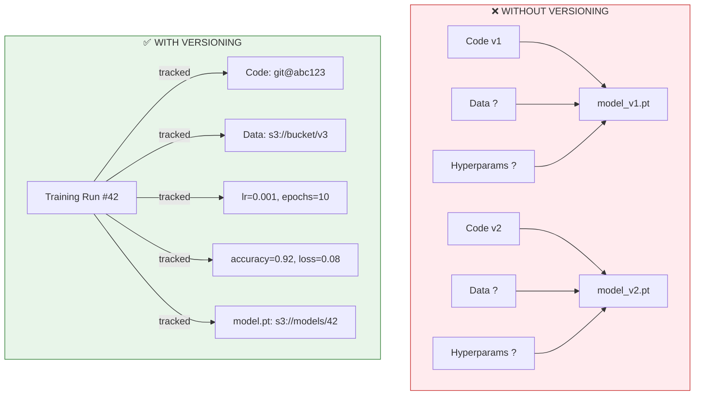
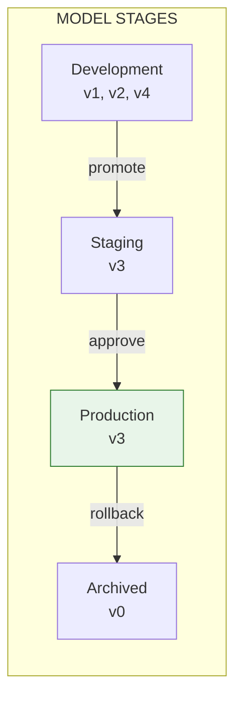
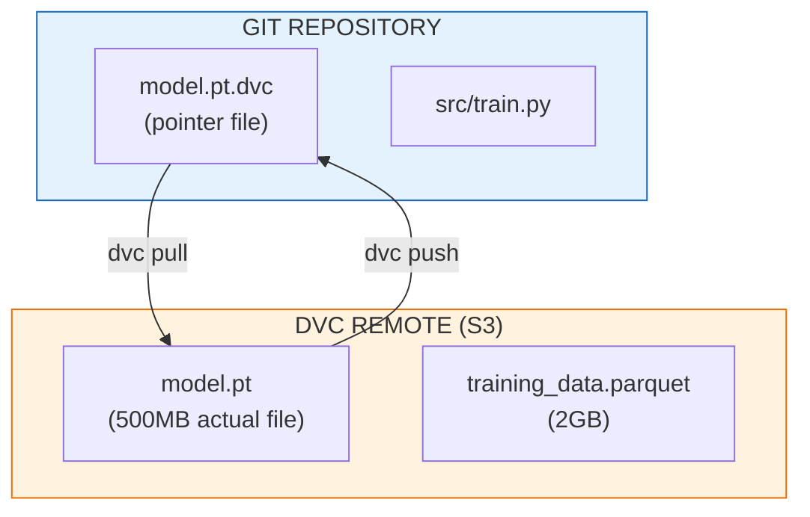
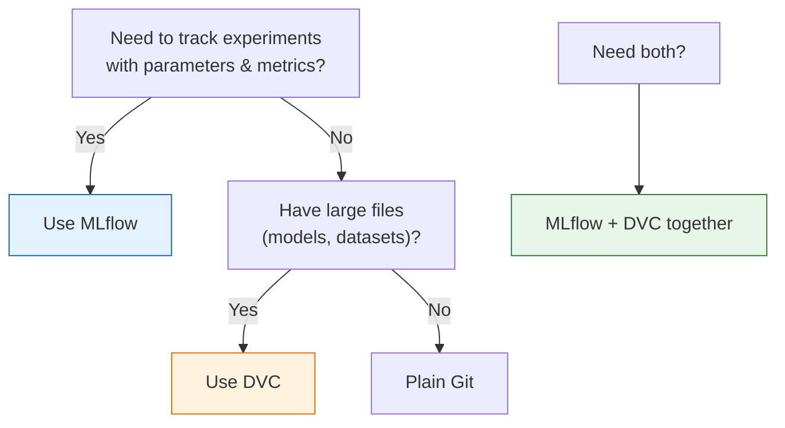

# Lesson 11.25: Model Versioning with MLflow & DVC

> **Duration**: 35 min | **Section**: E - Model Management

## 🎯 The Problem

Your LLM app is live. You fine-tune the model. Deploy. Accuracy drops. You want to rollback. But...

```
├── models/
│   ├── model_final.pt
│   ├── model_final_v2.pt
│   ├── model_final_v2_fixed.pt
│   ├── model_really_final.pt
│   └── model_REALLY_really_final_USE_THIS.pt  # 😱
```

Which one was in production last week? What hyperparameters produced the best one? What training data was used?

> **Scenario**: You're managing a RAG system with a fine-tuned embedding model. The model is 500MB. You've trained 15 versions. Each version has different hyperparameters, training data, and evaluation metrics. Your teammate asks: "What was the recall@10 for the model we deployed on March 15th?" You have no idea.

## 🧪 Try It: The Naive Approach

```python
# Train a model
model = train_model(
    learning_rate=0.001,
    epochs=10,
    data="training_data_v3.parquet"
)

# Save with datetime
model.save(f"models/model_{datetime.now().strftime('%Y%m%d_%H%M%S')}.pt")

# Log metrics to... a text file?
with open("training_log.txt", "a") as f:
    f.write(f"Model: {model_path}, Accuracy: {accuracy}\n")
```

**Problems**:
- ❌ No link between code, data, and model
- ❌ Metrics scattered in text files
- ❌ Can't reproduce training run
- ❌ No comparison between versions
- ❌ Model files not tracked in Git (too big)

## 🔍 Under the Hood: Model Versioning



**Model versioning tools** link everything: code commit + data version + hyperparameters + metrics + model artifact.

---

## 🛠️ Tool 1: MLflow

### What is MLflow?

MLflow is an open-source platform for ML lifecycle management:
- **Tracking**: Log parameters, metrics, artifacts
- **Models**: Package and deploy models
- **Registry**: Version and stage models
- **Projects**: Reproducible runs

### Setup

```bash
pip install mlflow

# Start tracking server (local)
mlflow server --host 0.0.0.0 --port 5000
```

### Basic Tracking

```python
import mlflow

# Start a run
mlflow.set_tracking_uri("http://localhost:5000")
mlflow.set_experiment("rag-embedding-model")

with mlflow.start_run(run_name="experiment-001"):
    # Log parameters (hyperparameters)
    mlflow.log_param("learning_rate", 0.001)
    mlflow.log_param("epochs", 10)
    mlflow.log_param("batch_size", 32)
    mlflow.log_param("model_type", "sentence-transformers")
    
    # Train your model
    model = train_model(lr=0.001, epochs=10)
    
    # Log metrics
    mlflow.log_metric("train_loss", 0.08)
    mlflow.log_metric("val_accuracy", 0.92)
    mlflow.log_metric("recall_at_10", 0.87)
    
    # Log the model artifact
    mlflow.pytorch.log_model(model, "model")
    
    # Log additional files
    mlflow.log_artifact("training_config.yaml")
    mlflow.log_artifact("evaluation_report.json")
```

### Tracking UI

```
http://localhost:5000

┌─────────────────────────────────────────────────────────────┐
│  Experiments  │  rag-embedding-model                        │
├───────────────┼─────────────────────────────────────────────┤
│  Run Name     │  Parameters          │  Metrics             │
├───────────────┼──────────────────────┼──────────────────────┤
│  exp-001      │  lr=0.001, epochs=10 │  accuracy=0.92       │
│  exp-002      │  lr=0.01, epochs=5   │  accuracy=0.88       │
│  exp-003      │  lr=0.001, epochs=20 │  accuracy=0.94 ★     │
└───────────────┴──────────────────────┴──────────────────────┘
```

### Model Registry

```python
# Register a model version
mlflow.register_model(
    model_uri="runs:/abc123/model",
    name="rag-embedding-model"
)

# Transition to production
client = mlflow.tracking.MlflowClient()
client.transition_model_version_stage(
    name="rag-embedding-model",
    version=3,
    stage="Production"
)

# Load production model in your app
model = mlflow.pytorch.load_model("models:/rag-embedding-model/Production")
```



---

## 🛠️ Tool 2: DVC (Data Version Control)

### What is DVC?

DVC extends Git for data science:
- **Data versioning**: Track large files without Git bloat
- **Pipeline management**: Define reproducible training pipelines
- **Remote storage**: Push data/models to S3, GCS, Azure

### Setup

```bash
pip install dvc dvc-s3  # or dvc-gs, dvc-azure

cd your-project
dvc init
dvc remote add -d myremote s3://my-bucket/dvc-storage
```

### Track Large Files

```bash
# Track a large model file
dvc add models/embedding_model.pt

# Creates:
# models/embedding_model.pt.dvc  (pointer file, tracked by Git)
# .gitignore updated to ignore the actual file

# Commit the pointer
git add models/embedding_model.pt.dvc models/.gitignore
git commit -m "Add embedding model v1"

# Push actual file to remote storage
dvc push
```

### How DVC Works



### Reproduce Training

```yaml
# dvc.yaml - Define your pipeline
stages:
  prepare:
    cmd: python src/prepare_data.py
    deps:
      - data/raw/
    outs:
      - data/processed/
      
  train:
    cmd: python src/train.py
    deps:
      - data/processed/
      - src/train.py
    params:
      - train.learning_rate
      - train.epochs
    outs:
      - models/model.pt
    metrics:
      - metrics.json:
          cache: false
          
  evaluate:
    cmd: python src/evaluate.py
    deps:
      - models/model.pt
      - data/test/
    metrics:
      - evaluation.json:
          cache: false
```

```bash
# Reproduce the entire pipeline
dvc repro

# Compare metrics between Git commits
dvc metrics diff HEAD~1

# Switch to a different model version
git checkout v1.0
dvc checkout  # Fetches the model from that commit
```

---

## 📊 MLflow vs DVC

| Feature | MLflow | DVC |
|---------|--------|-----|
| **Primary focus** | Experiment tracking | Data/model versioning |
| **UI** | Built-in web UI | Git-based (no UI) |
| **Model registry** | ✅ Full-featured | ⚠️ Basic |
| **Data versioning** | ⚠️ Artifacts only | ✅ Full pipeline |
| **Git integration** | Separate from Git | Native Git extension |
| **Best for** | ML experiments | Large data/model files |

### When to Use What?



---

## ✅ Complete Example: RAG Model Versioning

### Project Structure

```
rag-project/
├── .dvc/                    # DVC config
├── .git/                    # Git repo
├── data/
│   ├── documents.dvc        # Tracked by DVC
│   └── embeddings.dvc       # Tracked by DVC
├── models/
│   └── fine_tuned.dvc       # Tracked by DVC
├── src/
│   ├── train.py
│   └── evaluate.py
├── dvc.yaml                 # Pipeline definition
├── params.yaml              # Hyperparameters
└── mlruns/                  # MLflow tracking
```

### Workflow

```python
# src/train.py
import mlflow
import yaml

# Load params
with open("params.yaml") as f:
    params = yaml.safe_load(f)["train"]

# Track with MLflow
mlflow.set_experiment("rag-fine-tuning")

with mlflow.start_run():
    # Log all params
    mlflow.log_params(params)
    
    # Train
    model = train_embedding_model(
        base_model=params["base_model"],
        learning_rate=params["learning_rate"],
        epochs=params["epochs"]
    )
    
    # Evaluate
    metrics = evaluate_model(model, test_data)
    mlflow.log_metrics(metrics)
    
    # Save model (DVC will track the file)
    model.save("models/fine_tuned.pt")
    
    # Log model path to MLflow
    mlflow.log_param("model_path", "models/fine_tuned.pt")
    mlflow.log_param("git_commit", get_git_commit())
    mlflow.log_param("dvc_version", get_dvc_version())
```

```bash
# Full workflow
# 1. Train new model
dvc repro

# 2. If metrics are good, commit
git add .
git commit -m "Model v2: improved recall"
dvc push

# 3. Tag the release
git tag -a model-v2 -m "Recall@10: 0.92"

# 4. Register in MLflow
mlflow models register -m runs:/xxx/model -n rag-model

# 5. Deploy
# Load from MLflow registry in production
```

---

## 🎯 Practice

1. **Install MLflow** and run the tracking server locally
2. **Create an experiment** that logs 3 training runs with different hyperparameters
3. **Initialize DVC** in a project and track a large file
4. **Create a pipeline** with `dvc.yaml` that has prepare → train → evaluate stages
5. **Compare versions**: checkout an old commit and use `dvc checkout` to get that model

```bash
# Quick practice commands
pip install mlflow dvc

# MLflow
mlflow server --port 5000 &
python train_with_mlflow.py
open http://localhost:5000

# DVC
dvc init
dvc add models/model.pt
git add models/model.pt.dvc
git commit -m "Track model with DVC"
dvc push
```

## 🔑 Key Takeaways

- **Never use filenames for versioning** - use proper tools
- **MLflow** = experiment tracking + model registry
- **DVC** = data/model versioning with Git
- **Link everything** - code commit, data version, hyperparams, metrics, model
- **Tag releases** - easy rollback with `git checkout` + `dvc checkout`
- **Use both together** - MLflow for experiments, DVC for large file storage

## ❓ Common Questions

| Question | Answer |
|----------|--------|
| Where should models be stored? | S3/GCS for DVC, MLflow artifact store, or model registry |
| Can I use MLflow without a server? | Yes, it stores locally in `mlruns/` folder |
| How do I rollback a production model? | Change MLflow stage or checkout Git tag + DVC |
| Is DVC only for ML? | No, great for any large files (videos, images, datasets) |
| What about HuggingFace Hub? | Good alternative for public models, similar concept |

## 🔗 Further Reading

- [MLflow Documentation](https://mlflow.org/docs/latest/index.html)
- [DVC Documentation](https://dvc.org/doc)
- [MLflow Model Registry Guide](https://mlflow.org/docs/latest/model-registry.html)
- [DVC Pipelines Tutorial](https://dvc.org/doc/start/data-management/pipelines)
- [Weights & Biases](https://wandb.ai/) - MLflow alternative
- [HuggingFace Hub](https://huggingface.co/docs/hub/) - for public models

---

**Next**: [Module 11 Review](Lesson-24-Observability-QA.md) | **Up**: [Module 11 README](README.md)
