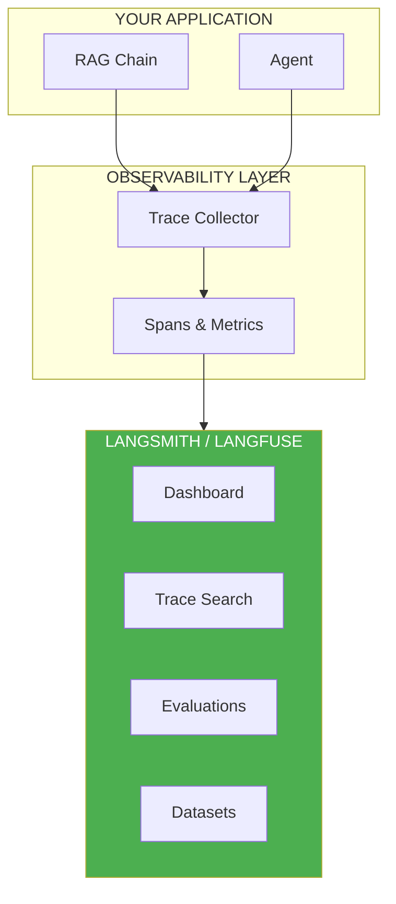
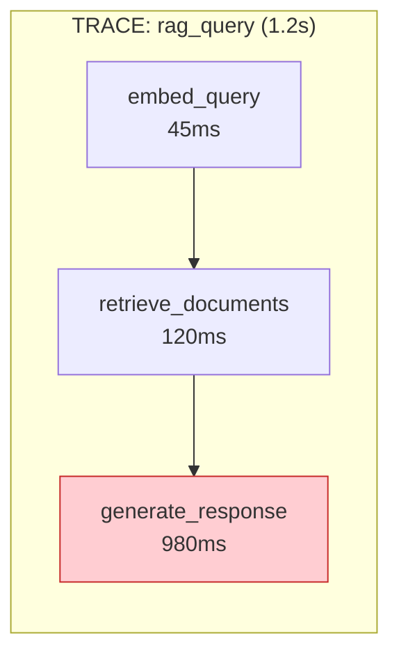

# Lesson 11.26: LLM Observability with LangSmith

> **Duration**: 35 min | **Section**: E - Production Monitoring

## 🎯 The Problem

Your RAG application is in production. Users complain about bad answers, but you can't see:
- What prompts were sent?
- What context was retrieved?
- Why did the LLM give that response?
- Which step in the chain failed?

You're debugging blind. Adding `print()` statements everywhere isn't sustainable.

> **Scenario**: A user reports "The chatbot gave me completely wrong information about our refund policy." You check the logs. All you see is `POST /query 200 OK`. No idea what prompt was sent, what documents were retrieved, or why the LLM hallucinated.

## 🧪 Try It: The Naive Approach

```python
# Logging everything manually
import logging

logger = logging.getLogger(__name__)

def query_rag(question: str):
    logger.info(f"Question: {question}")
    
    docs = retriever.get_relevant_docs(question)
    logger.info(f"Retrieved {len(docs)} docs")
    logger.info(f"Doc contents: {[d.content[:100] for d in docs]}")
    
    prompt = build_prompt(question, docs)
    logger.info(f"Prompt: {prompt[:500]}...")
    
    response = llm.invoke(prompt)
    logger.info(f"Response: {response}")
    
    return response

# Problems:
# - Logs are unstructured, hard to search
# - No visualization of chain flow
# - No latency breakdown
# - No cost tracking
# - PII in logs = compliance nightmare
# - Gigabytes of text logs nobody reads
```

## 🔍 Under the Hood: LLM Observability Stack



| Platform | Open Source | Cloud | Best For |
|----------|-------------|-------|----------|
| **LangSmith** | No | Yes | LangChain users, enterprise |
| **Langfuse** | Yes | Yes | Self-hosted, budget-conscious |
| **Phoenix** | Yes | No | Local debugging |

---

## ✅ The Fix: LangSmith Integration

### Step 1: Setup

```bash
# Install
pip install langsmith langchain langchain-openai

# Set environment variables
export LANGCHAIN_TRACING_V2=true
export LANGCHAIN_API_KEY="ls_..."
export LANGCHAIN_PROJECT="rag-production"
```

### Step 2: Automatic Tracing (Zero Code Change)

```python
# Just setting env vars enables tracing for all LangChain code!
from langchain_openai import ChatOpenAI
from langchain_core.prompts import ChatPromptTemplate

# This is automatically traced
llm = ChatOpenAI(model="gpt-4")
prompt = ChatPromptTemplate.from_messages([
    ("system", "You are a helpful assistant."),
    ("user", "{question}")
])

chain = prompt | llm

# Every call is traced with full details
response = chain.invoke({"question": "What is RAG?"})
# View in LangSmith dashboard: https://smith.langchain.com
```

### Step 3: Custom Tracing with Decorators

```python
from langsmith import traceable
from langsmith.run_helpers import get_current_run_tree

@traceable(name="rag_query", tags=["production", "v2"])
def query_rag(question: str, user_id: str) -> dict:
    """Full RAG pipeline with tracing."""
    
    # Add metadata to trace
    run = get_current_run_tree()
    if run:
        run.metadata["user_id"] = user_id
        run.metadata["environment"] = "production"
    
    # Step 1: Embed query
    embedding = embed_query(question)
    
    # Step 2: Retrieve documents
    docs = retrieve_documents(embedding)
    
    # Step 3: Generate response
    response = generate_response(question, docs)
    
    return {
        "answer": response,
        "sources": [d.metadata["source"] for d in docs]
    }


@traceable(name="embed_query")
def embed_query(text: str) -> list[float]:
    """Embed with tracing."""
    return embedding_model.encode(text).tolist()


@traceable(name="retrieve_documents")
def retrieve_documents(embedding: list[float], top_k: int = 5) -> list:
    """Retrieve with tracing."""
    return vector_store.similarity_search(embedding, k=top_k)


@traceable(name="generate_response")
def generate_response(question: str, docs: list) -> str:
    """Generate with tracing."""
    context = "\n".join([d.content for d in docs])
    prompt = f"Context: {context}\n\nQuestion: {question}"
    return llm.invoke(prompt)
```



---

## 🔄 Langfuse (Self-Hosted Alternative)

```python
# pip install langfuse
from langfuse import Langfuse
from langfuse.decorators import observe, langfuse_context

# Initialize
langfuse = Langfuse(
    public_key="pk-...",
    secret_key="sk-...",
    host="https://langfuse.your-domain.com"  # Self-hosted
)

@observe()
def query_rag(question: str) -> str:
    """Traced with Langfuse."""
    
    # Add custom attributes
    langfuse_context.update_current_observation(
        metadata={"question_length": len(question)},
        tags=["production"]
    )
    
    docs = retrieve_docs(question)
    response = generate_response(question, docs)
    
    # Track token usage and cost
    langfuse_context.update_current_trace(
        input=question,
        output=response,
        metadata={"doc_count": len(docs)}
    )
    
    return response


@observe(as_type="generation")
def generate_response(question: str, docs: list) -> str:
    """Track as LLM generation."""
    response = llm.invoke(build_prompt(question, docs))
    
    # Langfuse auto-captures token usage from OpenAI responses
    return response
```

### Self-Hosted Langfuse with Docker

```yaml
# docker-compose.yml
version: "3.8"

services:
  langfuse:
    image: langfuse/langfuse:latest
    ports:
      - "3000:3000"
    environment:
      - DATABASE_URL=postgresql://postgres:postgres@db:5432/langfuse
      - NEXTAUTH_SECRET=your-secret
      - NEXTAUTH_URL=http://localhost:3000
    depends_on:
      - db
  
  db:
    image: postgres:15
    environment:
      - POSTGRES_PASSWORD=postgres
      - POSTGRES_DB=langfuse
    volumes:
      - langfuse_data:/var/lib/postgresql/data

volumes:
  langfuse_data:
```

---

## 📊 What You Can See in the Dashboard

### Trace View
```
✓ rag_query (user_id: u123) - 1.2s
  ├── embed_query - 45ms
  │   └── Input: "What is your refund policy?"
  │   └── Output: [0.123, 0.456, ...]
  ├── retrieve_documents - 120ms
  │   └── Retrieved 5 docs
  │   └── Top doc: "Refund Policy v2.pdf"
  └── generate_response - 980ms
      └── Model: gpt-4
      └── Tokens: 1,234 (input: 890, output: 344)
      └── Cost: $0.042
      └── Output: "Our refund policy allows..."
```

### Metrics Available
| Metric | Use Case |
|--------|----------|
| **Latency breakdown** | Find slow steps |
| **Token usage** | Cost attribution |
| **Success/failure rate** | Reliability |
| **User feedback** | Quality tracking |
| **Trace search** | Debug specific issues |

---

## 🔍 Searching and Debugging

```python
from langsmith import Client

client = Client()

# Find traces with errors
runs = client.list_runs(
    project_name="rag-production",
    filter='eq(status, "error")',
    limit=10
)

for run in runs:
    print(f"Error: {run.error}")
    print(f"Input: {run.inputs}")
    print(f"Trace: https://smith.langchain.com/runs/{run.id}")

# Find slow traces
slow_runs = client.list_runs(
    project_name="rag-production",
    filter='gt(latency, 5000)',  # > 5 seconds
    limit=10
)

# Search by metadata
user_runs = client.list_runs(
    project_name="rag-production",
    filter='eq(metadata.user_id, "u123")',
)
```

---

## 📈 Evaluations and Datasets

```python
from langsmith import Client
from langsmith.evaluation import evaluate

client = Client()

# Create a dataset from production traces
dataset = client.create_dataset("rag-test-cases")

# Add examples
client.create_example(
    dataset_id=dataset.id,
    inputs={"question": "What is your refund policy?"},
    outputs={"answer": "We offer 30-day refunds..."}
)

# Run evaluation
def my_rag_app(inputs: dict) -> dict:
    return {"answer": query_rag(inputs["question"])}

results = evaluate(
    my_rag_app,
    data="rag-test-cases",
    evaluators=[
        "qa",           # Built-in QA evaluator
        "relevance",    # Check relevance
    ],
)

print(f"Score: {results.aggregate_metrics}")
```

---

## 🎯 Practice

1. **Sign up for LangSmith** (free tier) or deploy Langfuse locally
2. **Set environment variables** and run a LangChain chain
3. **View traces** in the dashboard
4. **Add custom metadata** with `@traceable`
5. **Search for errors** using the Python client
6. **Create a dataset** from production traces

```python
# Quick test
import os
os.environ["LANGCHAIN_TRACING_V2"] = "true"
os.environ["LANGCHAIN_API_KEY"] = "ls_..."

from langchain_openai import ChatOpenAI
llm = ChatOpenAI()
response = llm.invoke("Hello!")

# Now check https://smith.langchain.com
print("Check LangSmith for the trace!")
```

## 🔑 Key Takeaways

- **Zero-code tracing** = just set env vars for LangChain
- **`@traceable` decorator** = trace any function
- **See the full chain** = every step, latency, tokens, cost
- **Search traces** = find errors, slow calls, specific users
- **Langfuse** = self-hosted alternative, same concepts
- **Datasets** = build test sets from production data

## ❓ Common Questions

| Question | Answer |
|----------|--------|
| LangSmith vs Langfuse? | LangSmith is polished but cloud-only; Langfuse is open-source |
| Cost? | LangSmith free tier = 5k traces/month; Langfuse = free self-hosted |
| PII concerns? | Both support PII masking; Langfuse can be fully on-prem |
| Works without LangChain? | Yes, use `@traceable` or Langfuse SDK directly |

## 🔗 Further Reading

- [LangSmith Documentation](https://docs.smith.langchain.com/)
- [Langfuse Documentation](https://langfuse.com/docs)
- [Phoenix (Local)](https://docs.arize.com/phoenix/)
- [OpenTelemetry for LLMs](https://opentelemetry.io/)

---

**Previous**: [Lesson 25 - Model Versioning](Lesson-25-Model-Versioning.md) | **Up**: [Module 11 README](README.md)
