# Lesson 12.0: The Speed Problem

> **Duration**: 10 min | **Section**: A - What IS Redis?

## 🎯 The Problem

Your RAG app works perfectly. Users ask questions, get great answers. Then you check the logs:

```
User "alice" asked: "What is our refund policy?"
  → Embedding: 200ms, $0.0001
  → Vector search: 150ms
  → LLM response: 2.5s, $0.02
  → Total: 2.85s, $0.0201

User "bob" asked: "What is your refund policy?"  
  → Embedding: 200ms, $0.0001
  → Vector search: 150ms
  → LLM response: 2.5s, $0.02
  → Total: 2.85s, $0.0201

User "alice" asked: "What is our refund policy?"  # Same user, same question!
  → Embedding: 200ms, $0.0001
  → Vector search: 150ms
  → LLM response: 2.5s, $0.02
  → Total: 2.85s, $0.0201
```

Three nearly identical questions. Three full processing cycles. ~$0.06 spent. 8.5 seconds of compute.

> **Scenario**: You have 10,000 users. 30% ask questions that have been asked before. Your monthly LLM bill is $3,000. About $900 of that is answering the SAME questions repeatedly.

## 🧪 Try It: The Naive Approach

"I'll just store results in a Python dictionary!"

```python
# In-memory cache (naive)
cache = {}

async def get_answer(question: str) -> str:
    # Check cache first
    if question in cache:
        return cache[question]
    
    # Cache miss - do the work
    embedding = await embed(question)
    context = await search_vectors(embedding)
    answer = await call_llm(question, context)
    
    # Store in cache
    cache[question] = answer
    return answer
```

Looks good! Let's test it...

## 💥 Where It Breaks

```python
# Problem 1: Exact match required
cache["What is our refund policy?"] = "..."
cache.get("What is your refund policy?")  # None! Different wording

# Problem 2: Server restart = cache gone
# You restart the server, cache = {} again

# Problem 3: Multiple servers
# Server 1 caches the answer
# Server 2 doesn't have it
# User hits Server 2, cache miss!

# Problem 4: Memory grows forever
# No expiration, no limits
# Eventually: MemoryError

# Problem 5: No persistence
# Power outage = all cache lost
```



```mermaid
flowchart TD
    subgraph Problems["❌ IN-MEMORY DICT PROBLEMS"]
        P1["Exact match only<br/>'refund policy' ≠ 'refund policy?'"]
        P2["Lost on restart<br/>Deploy = cache gone"]
        P3["Not shared<br/>Each server has own cache"]
        P4["Unbounded growth<br/>No TTL, no limits"]
        P5["No persistence<br/>Crash = data lost"]
    end
    
    style Problems fill:#FFEBEE,stroke:#C62828
```

## 🔍 Under the Hood: What We Actually Need


## ✅ The Fix: Redis as Cache Layer

```python
import redis
import hashlib

# Connect to Redis (shared across all servers)
r = redis.Redis(host="redis", port=6379, decode_responses=True)

async def get_answer(question: str) -> str:
    # Create cache key from question hash
    cache_key = f"qa:{hashlib.md5(question.lower().encode()).hexdigest()}"
    
    # Check Redis cache
    cached = r.get(cache_key)
    if cached:
        return cached  # Cache hit! 5ms instead of 3 seconds
    
    # Cache miss - do the work
    embedding = await embed(question)
    context = await search_vectors(embedding)
    answer = await call_llm(question, context)
    
    # Store with 1-hour expiration
    r.setex(cache_key, 3600, answer)
    
    return answer
```

**Result**:
- ✅ Shared across all servers
- ✅ Survives restarts (optional persistence)
- ✅ Auto-expires after 1 hour
- ✅ Memory limits configurable
- ✅ 0.5ms latency vs 3 seconds

## 🎯 What We'll Learn

| Lesson | Topic |
|--------|-------|
| 12.1 | How Redis works under the hood |
| 12.2 | When to use Redis vs PostgreSQL |
| 12.3 | Redis data structures beyond strings |
| 12.4 | Python + Redis integration |
| 12.5-12.11 | Caching patterns for RAG apps |

## 🔑 Key Takeaways

- In-memory dictionaries don't scale (no sharing, no persistence)
- Repeated queries waste money (LLM calls aren't free)
- Redis = shared, persistent, fast key-value store
- Caching can reduce latency from seconds to milliseconds
- Caching can cut LLM costs by 30%+ for common queries

## ❓ Common Questions

| Question | Answer |
|----------|--------|
| Why not just use PostgreSQL? | Too slow for cache (~10ms vs ~0.5ms) |
| Is Redis expensive? | Free tier available, ~$15/month for small production |
| What if Redis goes down? | Your app falls back to computing (slower, not broken) |
| How much can I cache? | Depends on memory, typically 1-16GB |

---

**Next**: 12.1 - Redis Under the Hood
