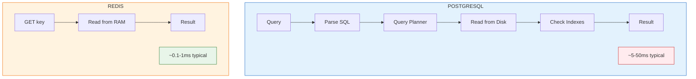
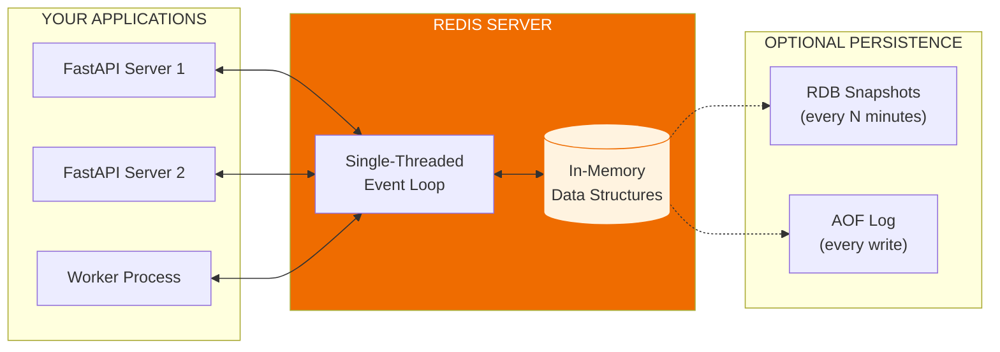

# Lesson 12.1: Redis Under the Hood

> **Duration**: 25 min | **Section**: A - What IS Redis?

## 🎯 The Problem

You've heard "Redis is fast." But why? What makes it different from a database? How does it actually work?

> **Scenario**: Your team lead asks: "Why Redis instead of just adding more PostgreSQL indexes?" You need to explain the fundamental architectural difference.

## 🧪 Try It: The Mental Model

Think of Redis as a **giant Python dictionary that lives outside your application**:

```python
# Python dict (in your app's memory)
cache = {
    "user:1": "Alice",
    "user:2": "Bob",
    "session:abc123": {"user_id": 1, "expires": "..."}
}

# Redis (separate server, shared memory)
# Same concept, but:
# - Lives in its own process
# - Accessible from any server
# - Can persist to disk
# - Has built-in expiration
```

## 🔍 Under the Hood: Why Redis is Fast



### Key Differences

| PostgreSQL | Redis |
|------------|-------|
| Disk-based (SSD/HDD) | RAM-based (memory) |
| Complex queries (SQL) | Simple key-value |
| ACID transactions | Single-threaded atomic |
| Parse → Plan → Execute | Direct memory access |
| 5-50ms typical | 0.1-1ms typical |

### Why RAM is 100x Faster Than Disk

```
Memory Hierarchy Speed:
┌─────────────────────────────────────────┐
│ CPU Cache (L1/L2)     ~1 nanosecond     │
├─────────────────────────────────────────┤
│ RAM                   ~100 nanoseconds  │  ← Redis lives here
├─────────────────────────────────────────┤
│ SSD                   ~100 microseconds │  ← PostgreSQL (with cache)
├─────────────────────────────────────────┤
│ HDD                   ~10 milliseconds  │
└─────────────────────────────────────────┘

RAM is ~1000x faster than SSD!
```

## 🔍 Redis Architecture



### Single-Threaded? Isn't That Slow?

**No!** Single-threaded is actually an advantage:

```python
# Multi-threaded problems:
# - Locks and synchronization
# - Race conditions
# - Context switching overhead

# Redis single-threaded:
# - No locks needed (one operation at a time)
# - Atomic operations guaranteed
# - No context switching
# - CPU-bound operations are rare (mostly I/O)
```

Redis processes **100,000+ operations per second** on a single thread because:
1. Operations are simple (no complex queries)
2. Data is in RAM (no disk wait)
3. No locking overhead

## 🔍 Basic Redis Operations

```python
import redis

# Connect to Redis
r = redis.Redis(host="localhost", port=6379, decode_responses=True)

# ===== STRINGS (most common) =====

# SET: Store a value
r.set("user:1:name", "Alice")

# GET: Retrieve a value
name = r.get("user:1:name")  # "Alice"

# SETEX: Set with expiration (seconds)
r.setex("session:abc123", 3600, "user_data_here")  # Expires in 1 hour

# SETNX: Set only if NOT exists
r.setnx("lock:job123", "worker-1")  # Returns True if set, False if exists

# INCR: Atomic increment
r.set("page:views", "0")
r.incr("page:views")  # 1
r.incr("page:views")  # 2

# ===== KEY OPERATIONS =====

# EXISTS: Check if key exists
r.exists("user:1:name")  # 1 (true) or 0 (false)

# DEL: Delete key
r.delete("user:1:name")

# EXPIRE: Set expiration on existing key
r.expire("session:abc123", 7200)  # Reset to 2 hours

# TTL: Check remaining time
r.ttl("session:abc123")  # Seconds until expiration

# KEYS: Find keys by pattern (careful in production!)
r.keys("user:*")  # ["user:1:name", "user:2:name", ...]
```

## 🔍 Key Naming Conventions

```python
# ✅ GOOD: Hierarchical with colons
"user:1:name"           # User 1's name
"user:1:email"          # User 1's email
"session:abc123"        # Session data
"cache:qa:hash123"      # Cached Q&A response
"rate:user:1:minute"    # Rate limiting counter

# ❌ BAD: No structure
"alice_name"            # Hard to query/manage
"1"                     # What is this?
"x"                     # Meaningless
```

**Pattern**: `type:id:field` or `namespace:type:id`

## 💥 Where It Breaks

### Problem 1: Redis is Not a Database

```python
# ❌ DON'T: Store critical data ONLY in Redis
r.set("user:1:balance", "1000.00")  # What if Redis restarts?

# ✅ DO: Use Redis as cache, PostgreSQL as truth
# 1. Write to PostgreSQL first
# 2. Update Redis cache
# 3. On cache miss, reload from PostgreSQL
```

### Problem 2: Memory is Limited

```python
# Redis stores EVERYTHING in RAM
# 16GB RAM = 16GB max data

# Configure maxmemory in redis.conf:
# maxmemory 4gb
# maxmemory-policy allkeys-lru  # Evict least recently used
```

### Problem 3: Keys Pattern is Dangerous

```python
# ❌ DANGEROUS in production
r.keys("*")  # Blocks Redis while scanning ALL keys

# ✅ SAFE: Use SCAN for iteration
for key in r.scan_iter("user:*"):
    print(key)  # Non-blocking, cursor-based
```

## 🎯 Practice

**1. Start Redis locally with Docker**:

```bash
docker run -d --name redis -p 6379:6379 redis:7
```

**2. Connect and experiment**:

```python
import redis

r = redis.Redis(host="localhost", port=6379, decode_responses=True)

# Store some data
r.set("greeting", "Hello, Redis!")
print(r.get("greeting"))

# Try expiration
r.setex("temp", 10, "I disappear in 10 seconds")
print(r.get("temp"))  # "I disappear..."
import time; time.sleep(11)
print(r.get("temp"))  # None

# Try increment
r.set("counter", 0)
for _ in range(5):
    print(r.incr("counter"))
```

## 🔑 Key Takeaways

- Redis is an in-memory data store (like a shared Python dict)
- RAM is ~1000x faster than disk → sub-millisecond latency
- Single-threaded = atomic operations without locks
- Use colon-separated key names: `type:id:field`
- Redis is a CACHE, not a database of truth
- Configure memory limits and eviction policy

## ❓ Common Questions

| Question | Answer |
|----------|--------|
| What if Redis crashes? | Data in RAM is lost unless persistence enabled |
| How much memory do I need? | Depends on data; start with 1GB, monitor usage |
| Can Redis cluster? | Yes, Redis Cluster for horizontal scaling |
| Is Redis free? | Open source is free; Redis Cloud has free tier |

---

## 📚 Further Reading

- [Redis Introduction](https://redis.io/docs/about/)
- [Redis Commands Reference](https://redis.io/commands/)
- [Why Redis is Fast](https://redis.io/docs/getting-started/faq/#why-is-redis-so-fast)

---

**Next**: 12.2 - Redis vs PostgreSQL
