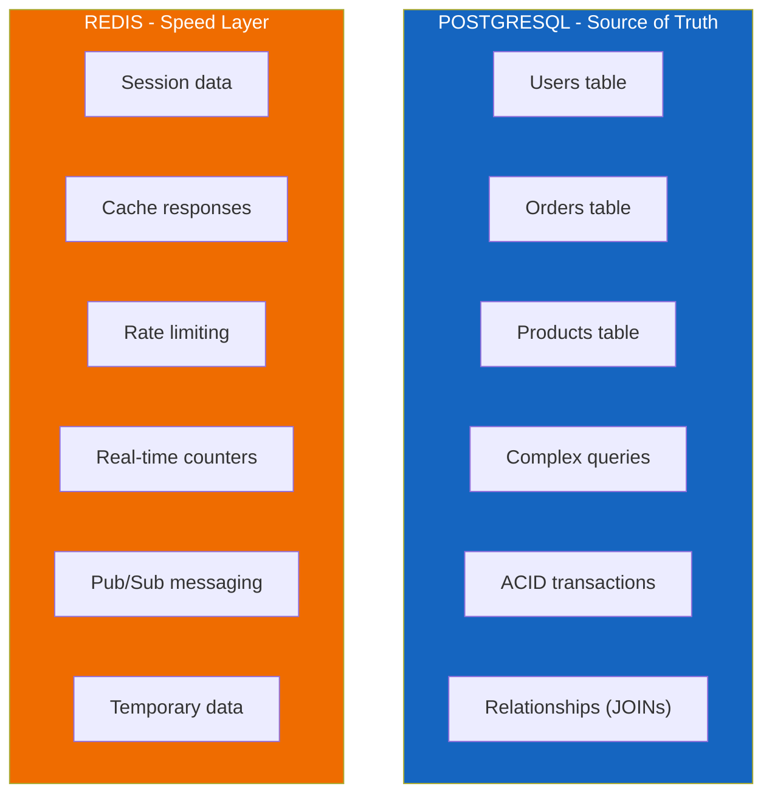
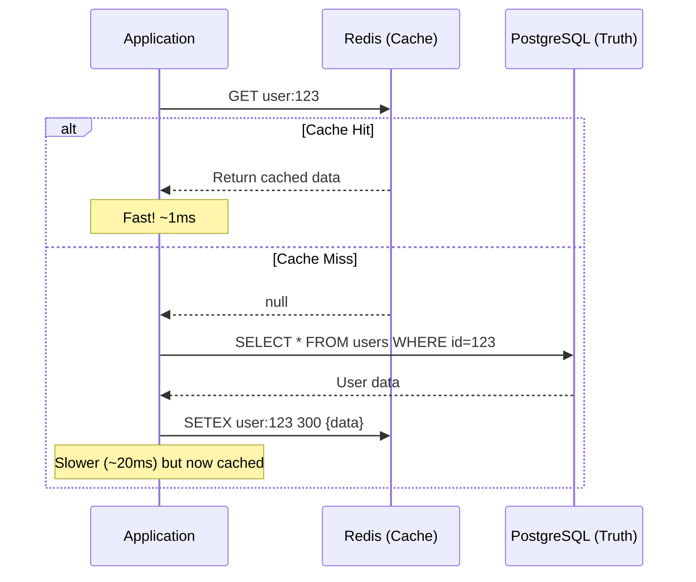

# Lesson 12.2: Redis vs PostgreSQL

> **Duration**: 20 min | **Section**: A - What IS Redis?

## 🎯 The Problem

You already have PostgreSQL. Why add another database? When should you use Redis, and when should you use PostgreSQL?

> **Scenario**: Your team wants to add session storage. One developer says "Just use PostgreSQL, we already have it." Another says "Use Redis, it's faster." Who's right?

## 🧪 Try It: Compare Both

```python
# PostgreSQL for sessions
async def get_session_pg(session_id: str):
    return await db.fetchone(
        "SELECT data FROM sessions WHERE id = $1 AND expires_at > NOW()",
        session_id
    )
# ~5-15ms per request

# Redis for sessions
def get_session_redis(session_id: str):
    return r.get(f"session:{session_id}")
# ~0.5-1ms per request
```

For sessions checked on EVERY request, that 10x speed difference matters.

## 🔍 Under the Hood: The Right Tool for the Job



## 🔍 Decision Matrix

| Criteria | PostgreSQL | Redis | Winner |
|----------|------------|-------|--------|
| **Speed** | 5-50ms | 0.1-1ms | Redis |
| **Durability** | ACID, crash-safe | RAM-based | PostgreSQL |
| **Complex Queries** | Full SQL | Key-value only | PostgreSQL |
| **Relationships** | JOINs, FKs | None | PostgreSQL |
| **Data Size** | Terabytes | Gigabytes (RAM) | PostgreSQL |
| **Expiration** | Manual cleanup | Built-in TTL | Redis |
| **Atomic Counters** | Locks needed | Built-in INCR | Redis |

## 🔍 Use Case Guide

### Use PostgreSQL When...

```python
# 1. Data must never be lost
async def create_order(order: Order):
    # This MUST persist, even if server crashes
    await db.execute(
        "INSERT INTO orders (user_id, total, status) VALUES ($1, $2, $3)",
        order.user_id, order.total, "pending"
    )

# 2. You need complex queries
async def get_sales_report():
    return await db.fetch("""
        SELECT 
            DATE_TRUNC('month', created_at) as month,
            SUM(total) as revenue,
            COUNT(*) as order_count
        FROM orders
        WHERE status = 'completed'
        GROUP BY month
        ORDER BY month DESC
    """)

# 3. You need relationships
async def get_order_with_items(order_id: int):
    return await db.fetch("""
        SELECT o.*, i.product_name, i.quantity
        FROM orders o
        JOIN order_items i ON o.id = i.order_id
        WHERE o.id = $1
    """, order_id)
```

### Use Redis When...

```python
# 1. Session storage (checked every request)
def get_session(session_id: str) -> dict | None:
    data = r.get(f"session:{session_id}")
    return json.loads(data) if data else None

def set_session(session_id: str, data: dict, ttl: int = 3600):
    r.setex(f"session:{session_id}", ttl, json.dumps(data))

# 2. Caching expensive operations
def get_user_profile(user_id: int) -> dict:
    cache_key = f"profile:{user_id}"
    
    cached = r.get(cache_key)
    if cached:
        return json.loads(cached)
    
    # Cache miss - query database
    profile = db.get_user_profile(user_id)  # Slow
    r.setex(cache_key, 300, json.dumps(profile))  # Cache for 5 min
    return profile

# 3. Rate limiting
def is_rate_limited(user_id: int, limit: int = 100) -> bool:
    key = f"rate:{user_id}:{datetime.now().strftime('%Y%m%d%H%M')}"
    count = r.incr(key)
    
    if count == 1:
        r.expire(key, 60)  # Expire after 1 minute
    
    return count > limit

# 4. Real-time counters
def increment_page_views(page_id: str):
    r.incr(f"views:{page_id}")  # Atomic, no locks

def get_page_views(page_id: str) -> int:
    return int(r.get(f"views:{page_id}") or 0)

# 5. Temporary locks
def acquire_lock(resource: str, holder: str, ttl: int = 30) -> bool:
    return r.setnx(f"lock:{resource}", holder)

def release_lock(resource: str, holder: str):
    if r.get(f"lock:{resource}") == holder:
        r.delete(f"lock:{resource}")
```

## 🔍 The Cache Pattern



**This is the fundamental pattern**: Redis is a SPEED LAYER in front of PostgreSQL, not a replacement.

## 💥 Where It Breaks

### Don't Replace PostgreSQL with Redis

```python
# ❌ WRONG: Critical data only in Redis
def create_user(user: User):
    r.hset(f"user:{user.id}", mapping={
        "email": user.email,
        "name": user.name,
        "balance": str(user.balance)  # 💀 Money in RAM only?!
    })

# ✅ RIGHT: PostgreSQL for truth, Redis for speed
async def create_user(user: User):
    # 1. Write to PostgreSQL (durable)
    await db.execute(
        "INSERT INTO users (id, email, name, balance) VALUES ($1, $2, $3, $4)",
        user.id, user.email, user.name, user.balance
    )
    # 2. Optionally cache in Redis
    r.setex(f"user:{user.id}", 300, user.json())
```

### Don't Query PostgreSQL for Every Request

```python
# ❌ WRONG: Database hit on every page load
@app.get("/")
async def home():
    settings = await db.fetchone("SELECT * FROM settings WHERE id = 1")
    # This query runs thousands of times per hour, same result

# ✅ RIGHT: Cache frequently-read, rarely-changed data
@app.get("/")
async def home():
    settings = r.get("app:settings")
    if not settings:
        settings = await db.fetchone("SELECT * FROM settings WHERE id = 1")
        r.setex("app:settings", 3600, json.dumps(settings))
    return json.loads(settings)
```

## 🎯 Practice

Create a simple cache wrapper:

```python
import redis
import json
from functools import wraps

r = redis.Redis(host="localhost", port=6379, decode_responses=True)

def cached(ttl_seconds: int = 300):
    """Decorator to cache function results in Redis."""
    def decorator(func):
        @wraps(func)
        async def wrapper(*args, **kwargs):
            # Create cache key from function name and arguments
            key = f"cache:{func.__name__}:{hash((args, tuple(kwargs.items())))}"
            
            # Check cache
            cached_result = r.get(key)
            if cached_result:
                return json.loads(cached_result)
            
            # Cache miss - call function
            result = await func(*args, **kwargs)
            r.setex(key, ttl_seconds, json.dumps(result))
            return result
        return wrapper
    return decorator

# Usage
@cached(ttl_seconds=60)
async def get_expensive_data(user_id: int):
    # Simulate expensive operation
    return {"user_id": user_id, "data": "expensive result"}
```

## 🔑 Key Takeaways

- PostgreSQL = **source of truth** (durable, complex queries)
- Redis = **speed layer** (cache, sessions, counters)
- Never store critical data ONLY in Redis
- Use Redis for data that's:
  - Read frequently
  - OK to lose (or can be rebuilt)
  - Temporary (sessions, cache)
- Pattern: Check Redis → Miss → Query PostgreSQL → Store in Redis

## ❓ Common Questions

| Question | Answer |
|----------|--------|
| Can I use only Redis? | Only for non-critical, temporary data |
| What about Redis persistence? | Helps with restarts, but not a replacement for proper DB |
| How do I keep cache in sync? | Cache invalidation (see Lesson 12.8) |
| What's the cost of running both? | Redis is lightweight; benefits outweigh costs |

---

**Next**: 12.3 - Data Structures
