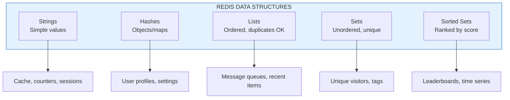
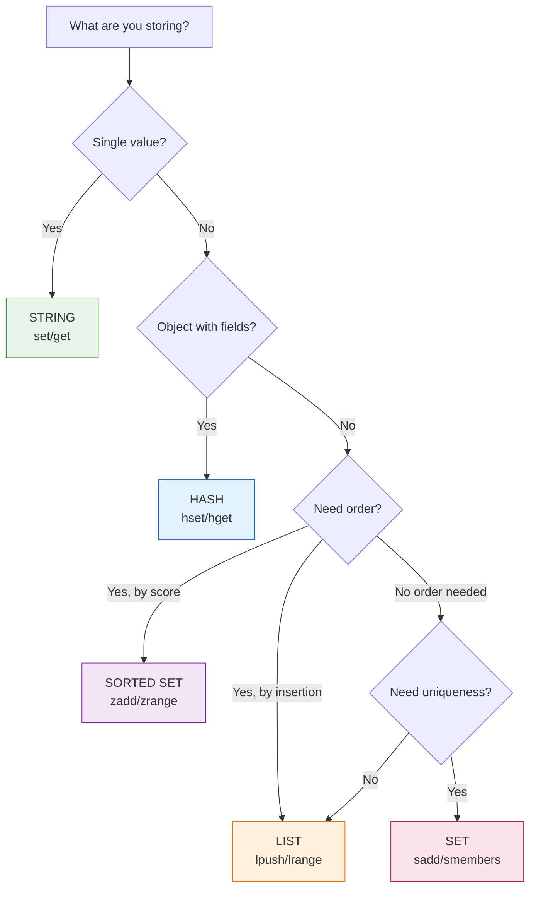

# Lesson 12.3: Data Structures

> **Duration**: 30 min | **Section**: A - What IS Redis?

## 🎯 The Problem

Redis isn't just key-value strings. It has powerful data structures built-in. But which one should you use for your use case?

> **Scenario**: You need to track the last 100 chat messages, unique visitors per page, and a leaderboard of top users. Using strings for all of these would be awkward and inefficient.

## 🧪 Try It: String-Only Approach

```python
# ❌ Awkward: Storing a list as JSON string
r.set("chat:room1:messages", json.dumps(messages))
messages = json.loads(r.get("chat:room1:messages"))
messages.append(new_message)
r.set("chat:room1:messages", json.dumps(messages))
# Problem: Race condition! Two users add at same time = one lost

# ❌ Awkward: Storing unique visitors
r.set("visitors:page1", json.dumps(list(visitor_set)))
# Problem: No efficient "add if not exists" check
```

## 🔍 Under the Hood: Redis Data Structures



## 🔍 1. Strings (Basic Key-Value)

Already covered, but here's a quick reference:

```python
# Set and get
r.set("key", "value")
r.get("key")  # "value"

# With expiration
r.setex("temp", 60, "expires in 1 minute")

# Atomic increment (great for counters!)
r.set("views", 0)
r.incr("views")  # 1
r.incrby("views", 10)  # 11

# Set only if not exists (distributed lock!)
r.setnx("lock:job1", "worker-1")  # True if set, False if exists
```

**Use for**: Simple cache, counters, locks, session data (as JSON)

## 🔍 2. Hashes (Object-Like)

Store multiple field-value pairs under one key:

```python
# Like a Python dict, but in Redis

# Set multiple fields
r.hset("user:1", mapping={
    "name": "Alice",
    "email": "alice@example.com",
    "role": "admin",
    "login_count": "42"
})

# Get single field
r.hget("user:1", "name")  # "Alice"

# Get all fields
r.hgetall("user:1")  
# {"name": "Alice", "email": "alice@example.com", "role": "admin", "login_count": "42"}

# Increment a field
r.hincrby("user:1", "login_count", 1)  # 43

# Check if field exists
r.hexists("user:1", "email")  # True

# Delete a field
r.hdel("user:1", "role")
```

**Use for**: User profiles, settings, any object with multiple fields

**Advantage over JSON string**: Can update individual fields without read-modify-write

```python
# ❌ With strings: Must read entire object to update one field
user = json.loads(r.get("user:1"))
user["login_count"] += 1
r.set("user:1", json.dumps(user))

# ✅ With hashes: Direct field update
r.hincrby("user:1", "login_count", 1)
```

## 🔍 3. Lists (Ordered Collection)

Ordered sequence, duplicates allowed:

```python
# Add to left (newest first) or right (oldest first)
r.lpush("chat:room1", "Hello!")  # Add to left (head)
r.lpush("chat:room1", "Hi there!")
r.lpush("chat:room1", "Anyone here?")

# Get range (0 = first, -1 = last)
r.lrange("chat:room1", 0, -1)
# ["Anyone here?", "Hi there!", "Hello!"]

# Get last 10 messages
r.lrange("chat:room1", 0, 9)

# Keep only last 100 messages (trim)
r.ltrim("chat:room1", 0, 99)

# Pop from right (oldest first) - good for queues
r.rpop("chat:room1")  # "Hello!"

# Blocking pop (wait for item) - task queue!
r.blpop("queue:tasks", timeout=30)  # Waits up to 30 seconds
```

**Use for**: Recent items, message history, simple queues

```python
# Pattern: Recent activity feed
def add_activity(user_id: int, activity: str):
    key = f"activity:{user_id}"
    r.lpush(key, json.dumps({"action": activity, "time": time.time()}))
    r.ltrim(key, 0, 49)  # Keep only last 50

def get_recent_activity(user_id: int, count: int = 10):
    key = f"activity:{user_id}"
    items = r.lrange(key, 0, count - 1)
    return [json.loads(item) for item in items]
```

## 🔍 4. Sets (Unique Collection)

Unordered, no duplicates:

```python
# Add members
r.sadd("visitors:page1", "user:1")
r.sadd("visitors:page1", "user:2")
r.sadd("visitors:page1", "user:1")  # Ignored, already exists!

# Get all members
r.smembers("visitors:page1")  # {"user:1", "user:2"}

# Count unique members
r.scard("visitors:page1")  # 2

# Check membership
r.sismember("visitors:page1", "user:1")  # True

# Remove member
r.srem("visitors:page1", "user:1")

# Set operations!
r.sadd("visitors:page2", "user:2", "user:3")

r.sinter("visitors:page1", "visitors:page2")  # Intersection: {"user:2"}
r.sunion("visitors:page1", "visitors:page2")  # Union: {"user:1", "user:2", "user:3"}
r.sdiff("visitors:page1", "visitors:page2")   # Difference: {"user:1"}
```

**Use for**: Unique visitors, tags, following/followers, online users

```python
# Pattern: Track online users
def user_online(user_id: int):
    r.sadd("online:users", str(user_id))
    r.expire("online:users", 300)  # Refresh TTL

def get_online_count() -> int:
    return r.scard("online:users")

def is_user_online(user_id: int) -> bool:
    return r.sismember("online:users", str(user_id))
```

## 🔍 5. Sorted Sets (Ranked Collection)

Like sets, but each member has a score for ordering:

```python
# Add members with scores
r.zadd("leaderboard", {
    "alice": 1500,
    "bob": 1200,
    "charlie": 1800,
    "diana": 1350
})

# Get top 3 (highest scores)
r.zrevrange("leaderboard", 0, 2, withscores=True)
# [("charlie", 1800), ("alice", 1500), ("diana", 1350)]

# Get rank (0-indexed, highest = 0 with zrevrank)
r.zrevrank("leaderboard", "alice")  # 1 (second place)

# Get score
r.zscore("leaderboard", "bob")  # 1200.0

# Increment score
r.zincrby("leaderboard", 100, "bob")  # bob is now 1300

# Count in score range
r.zcount("leaderboard", 1300, 1600)  # 3 (alice, diana, bob)

# Get by score range
r.zrangebyscore("leaderboard", 1300, 1600)
```

**Use for**: Leaderboards, priority queues, time-series (timestamp as score)

```python
# Pattern: Rate limiting with sliding window
def is_rate_limited(user_id: int, limit: int = 100, window: int = 60) -> bool:
    key = f"ratelimit:{user_id}"
    now = time.time()
    window_start = now - window
    
    # Remove old entries
    r.zremrangebyscore(key, 0, window_start)
    
    # Count requests in window
    count = r.zcard(key)
    
    if count >= limit:
        return True
    
    # Add current request
    r.zadd(key, {str(now): now})
    r.expire(key, window)
    
    return False
```

## 🔍 Choosing the Right Structure



## 🎯 Practice

Build a simple analytics tracker:

```python
import redis
import time

r = redis.Redis(host="localhost", port=6379, decode_responses=True)

def track_page_view(page: str, user_id: str):
    """Track a page view with multiple data structures."""
    today = time.strftime("%Y-%m-%d")
    
    # 1. Total views (String with INCR)
    r.incr(f"views:{page}:total")
    
    # 2. Daily views (String with INCR)
    r.incr(f"views:{page}:{today}")
    
    # 3. Unique visitors today (Set)
    r.sadd(f"visitors:{page}:{today}", user_id)
    
    # 4. Recent views (List - last 100)
    r.lpush(f"recent:{page}", f"{user_id}:{time.time()}")
    r.ltrim(f"recent:{page}", 0, 99)
    
    # 5. Page popularity (Sorted Set - for ranking)
    r.zincrby("popular:pages", 1, page)

def get_page_stats(page: str) -> dict:
    """Get stats for a page."""
    today = time.strftime("%Y-%m-%d")
    
    return {
        "total_views": int(r.get(f"views:{page}:total") or 0),
        "today_views": int(r.get(f"views:{page}:{today}") or 0),
        "unique_today": r.scard(f"visitors:{page}:{today}"),
        "rank": r.zrevrank("popular:pages", page),
    }

# Test it
track_page_view("/home", "user:1")
track_page_view("/home", "user:2")
track_page_view("/home", "user:1")  # Same user again
track_page_view("/about", "user:1")

print(get_page_stats("/home"))
# {"total_views": 3, "today_views": 3, "unique_today": 2, "rank": 0}
```

## 🔑 Key Takeaways

- **Strings**: Simple values, counters, JSON blobs
- **Hashes**: Objects with fields (update fields individually)
- **Lists**: Ordered sequences, queues, recent items
- **Sets**: Unique members, set operations
- **Sorted Sets**: Ranked data, leaderboards, time windows
- Choose structure based on access patterns, not just data shape

## ❓ Common Questions

| Question | Answer |
|----------|--------|
| Which is most common? | Strings (cache) and Hashes (sessions) |
| Can I nest structures? | No, but you can store JSON in string values |
| Memory efficiency? | Hashes and Sets are very memory efficient |
| Max list size? | Over 4 billion elements (practical limit is memory) |

---

## 📚 Further Reading

- [Redis Data Types Tutorial](https://redis.io/docs/data-types/tutorial/)
- [Redis Commands by Data Type](https://redis.io/commands/)

---

**Next**: 12.4 - Python + Redis
