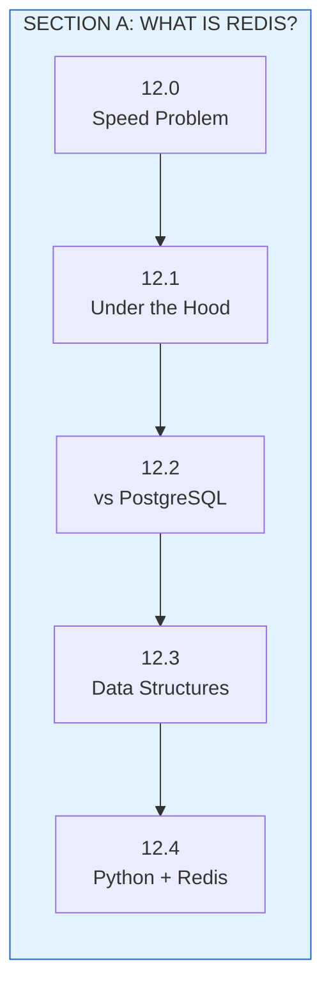

# Lesson 12.5: Redis Basics Q&A

> **Duration**: 10 min | **Type**: Section A Recap

## 📍 Section A Summary



You now know:

| Lesson | Skill | Key Pattern |
|--------|-------|-------------|
| 12.0 | Why caching | Repeated work = wasted time/money |
| 12.1 | How Redis works | In-memory, single-threaded, fast |
| 12.2 | When to use Redis | Cache, sessions, counters (not primary DB) |
| 12.3 | Data structures | Strings, Hashes, Lists, Sets, Sorted Sets |
| 12.4 | Python integration | Connection pool, async, FastAPI |

## ❓ Frequently Asked Questions

### Q1: What if Redis crashes?

```mermaid
flowchart TD
    CRASH["Redis Crashes"] --> CHECK{"Persistence<br/>enabled?"}
    
    CHECK -->|"Yes (AOF/RDB)"| RECOVER["Restart → Data recovered"]
    CHECK -->|"No"| LOST["Data lost (cache only)"]
    
    LOST --> REBUILD["Rebuild cache from DB<br/>(This is fine for cache!)"]
    
    style CRASH fill:#FFEBEE,stroke:#C62828
    style RECOVER fill:#E8F5E9,stroke:#2E7D32
    style REBUILD fill:#FFF3E0,stroke:#EF6C00
```



**For caching**: Redis crash = slower app (cache miss), not broken app.

**For sessions**: Enable persistence or use sticky sessions.

```python
# Your app should handle Redis being down
async def get_data(key: str):
    try:
        cached = await r.get(key)
        if cached:
            return json.loads(cached)
    except RedisError:
        pass  # Redis down, continue without cache
    
    # Fallback to database
    return await db.get_data(key)
```

### Q2: How do I enable persistence?

Two options in Redis:

| Mode | Description | Use When |
|------|-------------|----------|
| **RDB** | Snapshot every N minutes | Speed > durability |
| **AOF** | Log every write | Durability > speed |

```bash
# docker-compose.yml
redis:
  image: redis:7
  command: redis-server --appendonly yes  # Enable AOF
  volumes:
    - redis_data:/data  # Persist data directory
```

### Q3: What about memory limits?

```python
# Redis config (redis.conf or command line)
# maxmemory 4gb
# maxmemory-policy allkeys-lru

# Eviction policies:
# - noeviction: Error when full
# - allkeys-lru: Evict least recently used
# - volatile-lru: Evict LRU keys with TTL set
# - allkeys-random: Random eviction
```

**Best practice**: Set `allkeys-lru` for caching, so Redis auto-evicts old entries.

### Q4: Redis vs Memcached?

| Feature | Redis | Memcached |
|---------|-------|-----------|
| Data structures | Rich (lists, sets, etc.) | Strings only |
| Persistence | Yes | No |
| Pub/Sub | Yes | No |
| Clustering | Yes | Yes |
| Memory efficiency | Good | Slightly better |

**Verdict**: Use Redis. More features, same speed.

### Q5: How do I monitor Redis?

```python
# Get info
info = r.info()
print(f"Memory used: {info['used_memory_human']}")
print(f"Connected clients: {info['connected_clients']}")
print(f"Commands processed: {info['total_commands_processed']}")

# Key space info
print(f"Keys in db0: {info['db0']['keys']}")
```

```bash
# CLI monitoring
redis-cli monitor  # See all commands in real-time
redis-cli info     # Get server stats
```

### Q6: How do I delete all keys?

```python
# Delete all keys in current database
r.flushdb()

# Delete all keys in ALL databases
r.flushall()

# Delete by pattern (use SCAN, not KEYS)
async def delete_pattern(pattern: str):
    cursor = 0
    while True:
        cursor, keys = await r.scan(cursor, match=pattern, count=100)
        if keys:
            await r.delete(*keys)
        if cursor == 0:
            break
```

## 💥 Common Pitfalls

### 1. Using KEYS in Production

```python
# ❌ DANGEROUS: Blocks Redis while scanning ALL keys
keys = r.keys("user:*")  # DON'T DO THIS

# ✅ SAFE: Use SCAN for iteration
async for key in r.scan_iter("user:*"):
    process(key)
```

### 2. Forgetting decode_responses

```python
# ❌ Returns bytes
r = redis.Redis(host="localhost")
r.get("key")  # b'value'

# ✅ Returns strings
r = redis.Redis(host="localhost", decode_responses=True)
r.get("key")  # 'value'
```

### 3. Not Setting TTL on Cache Keys

```python
# ❌ Cache grows forever
r.set("cache:query:abc", result)

# ✅ Auto-expires
r.setex("cache:query:abc", 3600, result)  # 1 hour TTL
```

### 4. Creating Connections Per Request

```python
# ❌ New connection every time
@app.get("/data")
async def get_data():
    r = redis.Redis()  # Bad!
    return await r.get("key")

# ✅ Reuse from pool
@app.get("/data")
async def get_data(r = Depends(get_redis)):
    return await r.get("key")
```

### 5. Not Handling Redis Errors

```python
# ❌ App crashes if Redis is down
value = await r.get("key")  # ConnectionError!

# ✅ Graceful degradation
try:
    value = await r.get("key")
except RedisError:
    value = None  # Continue without cache
```

## 🔑 Key Takeaways

### Redis Fundamentals
- Redis is an in-memory data store (~1000x faster than disk)
- Single-threaded = atomic operations, no locks
- Use as cache/speed layer, not primary database

### Data Structures
- **Strings**: Simple cache, counters
- **Hashes**: Objects with fields
- **Lists**: Queues, recent items
- **Sets**: Unique collections
- **Sorted Sets**: Leaderboards, rankings

### Python Best Practices
- Always use connection pooling
- Use async client with FastAPI
- Handle errors gracefully
- Set TTL on cache entries
- Use SCAN, not KEYS

## ❓ Quick Reference

| Task | Command |
|------|---------|
| Store value | `SET key value` |
| Get value | `GET key` |
| Store with TTL | `SETEX key seconds value` |
| Increment | `INCR key` |
| Store object | `HSET key field value` |
| Get object | `HGETALL key` |
| Add to list | `LPUSH key value` |
| Get list range | `LRANGE key 0 -1` |
| Add to set | `SADD key member` |
| Check set member | `SISMEMBER key member` |

---

**Next**: Section B - Caching Patterns (12.6 - 12.11)
