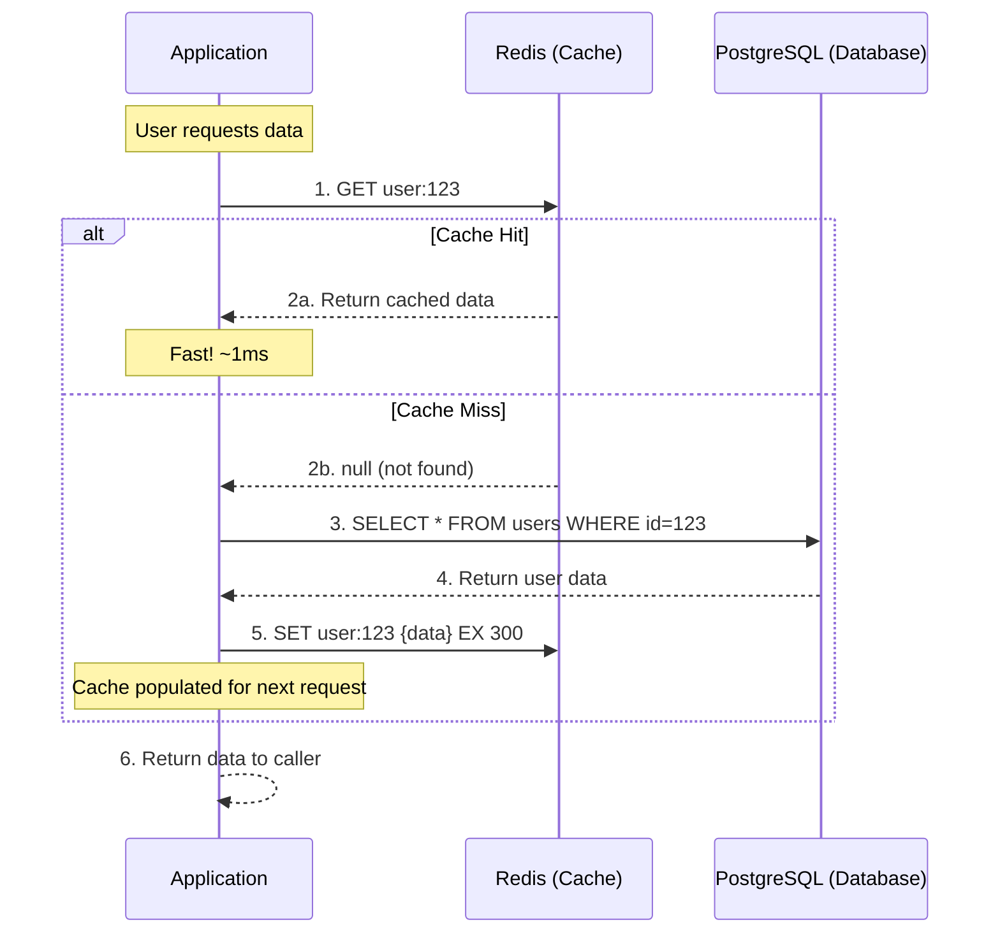
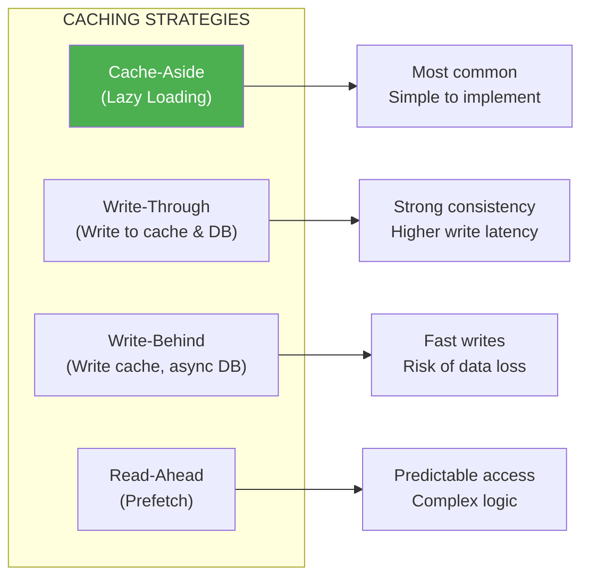

# Lesson 12.6: Cache-Aside Pattern

> **Duration**: 30 min | **Section**: B - Caching Patterns

## 🎯 The Problem

You want to add caching. But when do you check the cache? When do you update it? What happens on a cache miss?

> **Scenario**: You implement caching but forget to update the cache when data changes. Users see stale data. Or you cache everything and run out of memory. You need a PATTERN.

## 🧪 Try It: The Naive Approach

```python
# ❌ Cache everything forever
async def get_user(user_id: int):
    user = await db.get_user(user_id)
    r.set(f"user:{user_id}", json.dumps(user))  # Never expires!
    return user

# Problems:
# 1. Cache grows forever
# 2. Cache never refreshed (stale data)
# 3. Database queried even when cached
```

## 🔍 Under the Hood: Cache-Aside Pattern

Also called "Lazy Loading" or "Read-Through with Lazy Population":



## ✅ The Fix: Cache-Aside Implementation

```python
import redis.asyncio as redis
import json
from typing import Optional, TypeVar, Callable
from functools import wraps

T = TypeVar('T')

async def cache_aside(
    cache_key: str,
    fetch_func: Callable[[], T],
    r: redis.Redis,
    ttl: int = 300
) -> T:
    """
    Cache-aside pattern implementation.
    
    1. Check cache
    2. If hit, return cached
    3. If miss, fetch from source, cache it, return
    """
    # Step 1: Check cache
    cached = await r.get(cache_key)
    
    if cached is not None:
        # Step 2a: Cache hit
        return json.loads(cached)
    
    # Step 2b: Cache miss
    # Step 3: Fetch from source
    data = await fetch_func()
    
    # Step 5: Populate cache (with TTL)
    if data is not None:
        await r.setex(cache_key, ttl, json.dumps(data))
    
    return data

# Usage
async def get_user(user_id: int, r: redis.Redis) -> dict:
    return await cache_aside(
        cache_key=f"user:{user_id}",
        fetch_func=lambda: db.get_user(user_id),
        r=r,
        ttl=300  # 5 minutes
    )
```

## 🔍 Cache-Aside as a Decorator

```python
def cached(ttl: int = 300, prefix: str = "cache"):
    """
    Decorator version of cache-aside pattern.
    
    Requires 'r' (Redis client) as keyword argument.
    """
    def decorator(func):
        @wraps(func)
        async def wrapper(*args, r: redis.Redis, **kwargs):
            # Build cache key from function name and arguments
            # Remove 'r' from kwargs for key generation
            key_kwargs = {k: v for k, v in kwargs.items() if k != 'r'}
            cache_key = f"{prefix}:{func.__name__}:{args}:{key_kwargs}"
            
            # Check cache
            cached_result = await r.get(cache_key)
            if cached_result is not None:
                return json.loads(cached_result)
            
            # Cache miss - call function
            result = await func(*args, **kwargs)
            
            # Cache result
            if result is not None:
                await r.setex(cache_key, ttl, json.dumps(result))
            
            return result
        return wrapper
    return decorator

# Usage
@cached(ttl=60, prefix="user")
async def get_user_profile(user_id: int) -> dict:
    # This only runs on cache miss
    return await db.get_user_with_stats(user_id)

# In route
@app.get("/users/{user_id}")
async def get_user(user_id: int, r: redis.Redis = Depends(get_redis)):
    return await get_user_profile(user_id, r=r)
```

## 🔍 Full FastAPI Example

```python
from fastapi import FastAPI, Depends, HTTPException
from pydantic import BaseModel
import redis.asyncio as redis
import json

# ... (Redis setup from previous lesson)

class UserResponse(BaseModel):
    id: int
    name: str
    email: str

class CacheStats(BaseModel):
    hits: int = 0
    misses: int = 0

cache_stats = CacheStats()

@app.get("/users/{user_id}", response_model=UserResponse)
async def get_user(user_id: int, r: redis.Redis = Depends(get_redis)):
    cache_key = f"user:{user_id}"
    
    # Check cache
    cached = await r.get(cache_key)
    if cached:
        cache_stats.hits += 1
        return json.loads(cached)
    
    # Cache miss
    cache_stats.misses += 1
    
    # Fetch from database
    user = await db.get_user(user_id)
    if not user:
        raise HTTPException(404, "User not found")
    
    # Cache for 5 minutes
    await r.setex(cache_key, 300, json.dumps(user))
    
    return user

@app.get("/cache/stats")
async def get_cache_stats():
    total = cache_stats.hits + cache_stats.misses
    hit_rate = (cache_stats.hits / total * 100) if total > 0 else 0
    return {
        "hits": cache_stats.hits,
        "misses": cache_stats.misses,
        "hit_rate": f"{hit_rate:.1f}%"
    }
```

## 🔍 When to Invalidate Cache

The cache-aside pattern only handles READS. For WRITES, you need to invalidate:

```python
@app.put("/users/{user_id}")
async def update_user(
    user_id: int, 
    update: UserUpdate, 
    r: redis.Redis = Depends(get_redis)
):
    # Update database
    user = await db.update_user(user_id, update)
    
    # Invalidate cache (two options):
    
    # Option 1: Delete cache (next read will repopulate)
    await r.delete(f"user:{user_id}")
    
    # Option 2: Update cache (saves a DB read on next request)
    await r.setex(f"user:{user_id}", 300, json.dumps(user))
    
    return user

@app.delete("/users/{user_id}")
async def delete_user(user_id: int, r: redis.Redis = Depends(get_redis)):
    await db.delete_user(user_id)
    await r.delete(f"user:{user_id}")  # Remove from cache
    return {"status": "deleted"}
```

## 🔍 Comparison: Cache Strategies



**Cache-Aside is the most common** because:
- Simple to understand and implement
- Only caches data that's actually requested
- Works with any database
- Cache failure = slower, not broken

## 💥 Common Pitfalls

### 1. Not Handling Cache Stampede

```python
# Problem: Cache expires, 1000 requests hit DB simultaneously

# Solution: Stale-while-revalidate pattern
async def get_with_background_refresh(
    key: str,
    fetch_func,
    r: redis.Redis,
    ttl: int = 300,
    stale_ttl: int = 60
):
    cached = await r.get(key)
    
    if cached:
        data = json.loads(cached)
        remaining_ttl = await r.ttl(key)
        
        # If TTL is low, trigger background refresh
        if remaining_ttl < stale_ttl:
            asyncio.create_task(refresh_cache(key, fetch_func, r, ttl))
        
        return data
    
    # Cache miss
    return await cache_and_return(key, fetch_func, r, ttl)
```

### 2. Caching Null Results

```python
# ❌ Problem: Non-existent user causes DB hit every time
user = await r.get("user:999")  # None
user = await db.get_user(999)   # None - not cached!

# ✅ Solution: Cache null results with short TTL
if user is None:
    await r.setex("user:999", 60, "null")  # Cache "not found" for 1 min
```

### 3. Inconsistent Key Formats

```python
# ❌ Inconsistent keys
await r.set("user-123", ...)
await r.set("user:123", ...)
await r.set("User:123", ...)

# ✅ Consistent pattern
def user_cache_key(user_id: int) -> str:
    return f"user:{user_id}"
```

## 🎯 Practice

Implement a cached product catalog:

```python
from dataclasses import dataclass
from typing import List

@dataclass
class Product:
    id: int
    name: str
    price: float
    category: str

# Implement these functions using cache-aside:

async def get_product(product_id: int, r: redis.Redis) -> Product:
    """Get single product with caching."""
    pass

async def get_products_by_category(category: str, r: redis.Redis) -> List[Product]:
    """Get all products in category with caching."""
    pass

async def update_product(product_id: int, update: dict, r: redis.Redis) -> Product:
    """Update product and invalidate cache."""
    pass
```

## 🔑 Key Takeaways

- Cache-aside: Check cache → Miss → Fetch → Cache → Return
- Always set TTL on cache entries
- Invalidate cache on writes (delete or update)
- Handle null results (cache "not found" briefly)
- Monitor hit rate to measure effectiveness
- Cache-aside is simple but doesn't prevent stampede

## ❓ Common Questions

| Question | Answer |
|----------|--------|
| What TTL should I use? | Start with 5 min, adjust based on data freshness needs |
| Delete or update cache on write? | Delete is simpler; update if you need consistency |
| What hit rate is good? | 80%+ is good, 95%+ is excellent |
| Cache lists or individual items? | Both! Different keys for different queries |

---

## 📚 Further Reading

- [Caching Strategies and How to Choose the Right One](https://codeahoy.com/2017/08/11/caching-strategies-and-how-to-choose-the-right-one/)

---

**Next**: 12.7 - TTL Strategies
