# Lesson 12.7: TTL Strategies

> **Duration**: 25 min | **Section**: B - Caching Patterns

## 🎯 The Problem

You're setting TTL (Time To Live) on cache entries. But what's the right value? Too short = cache misses, slow. Too long = stale data, users see outdated info.

> **Scenario**: You cache user profiles for 24 hours. A user changes their name. For 24 hours, half your servers show the old name, half show the new name. Support tickets flood in.

## 🧪 Try It: The Naive Approach

```python
# ❌ One TTL for everything
TTL = 3600  # 1 hour for everything

r.setex("user:profile:123", TTL, user_data)
r.setex("product:details:456", TTL, product_data)
r.setex("settings:global", TTL, settings)
r.setex("stock:count:789", TTL, stock_count)
```

**Problems**:
- User profile changes rarely → 1 hour might be too short (unnecessary DB hits)
- Stock count changes constantly → 1 hour is WAY too long (oversold items!)
- Global settings almost never change → why refetch every hour?

## 🔍 Under the Hood: TTL Decision Framework

```mermaid
flowchart TD
    START["What data are you caching?"]
    
    START --> Q1{"How often does<br/>it change?"}
    
    Q1 -->|"Never/Rarely<br/>(settings, configs)"| LONG["LONG TTL<br/>1 hour - 24 hours"]
    
    Q1 -->|"Sometimes<br/>(user profiles, products)"| MEDIUM["MEDIUM TTL<br/>5 - 60 minutes"]
    
    Q1 -->|"Frequently<br/>(counters, stock)"| SHORT["SHORT TTL<br/>10 - 60 seconds"]
    
    Q1 -->|"Real-time required"| NONE["NO CACHE<br/>or use pub/sub"]
    
    LONG --> CHECK1{"Invalidate on change?"}
    MEDIUM --> CHECK2{"Stale OK temporarily?"}
    SHORT --> CHECK3{"Can rebuild quickly?"}
    
    CHECK1 -->|"Yes"| SAFE1["✅ Safe to use long TTL"]
    CHECK2 -->|"Yes"| SAFE2["✅ Medium TTL works"]
    CHECK3 -->|"Yes"| SAFE3["✅ Short TTL + high miss rate OK"]
    
    style LONG fill:#E8F5E9,stroke:#2E7D32
    style MEDIUM fill:#FFF3E0,stroke:#EF6C00
    style SHORT fill:#E3F2FD,stroke:#1565C0
    style NONE fill:#FFEBEE,stroke:#C62828
```



## 🔍 TTL Categories

### Category 1: Static/Rare Changes (Long TTL)

```python
# Settings that almost never change
r.setex("config:feature_flags", 86400, flags)  # 24 hours
r.setex("config:api_keys", 3600, keys)         # 1 hour

# Reference data
r.setex("countries:list", 86400, countries)    # 24 hours
r.setex("categories:tree", 3600, categories)   # 1 hour
```

**Recommendation**: 1-24 hours + invalidate on admin change

### Category 2: User Data (Medium TTL)

```python
# User profile (changes occasionally)
r.setex(f"user:{user_id}:profile", 300, profile)  # 5 minutes

# User preferences
r.setex(f"user:{user_id}:prefs", 600, prefs)      # 10 minutes

# Computed data (aggregations)
r.setex(f"user:{user_id}:stats", 900, stats)      # 15 minutes
```

**Recommendation**: 5-30 minutes + invalidate on update

### Category 3: Volatile Data (Short TTL)

```python
# Inventory counts (changes frequently)
r.setex(f"product:{id}:stock", 30, count)         # 30 seconds

# Real-time metrics
r.setex("metrics:active_users", 10, count)        # 10 seconds

# Search results (personalized, many variations)
r.setex(f"search:{query_hash}", 60, results)      # 1 minute
```

**Recommendation**: 10-60 seconds

### Category 4: Session/Temporary (TTL = Lifespan)

```python
# User sessions
r.setex(f"session:{session_id}", 3600, data)      # 1 hour (or until logout)

# Rate limiting windows
r.setex(f"rate:{user_id}:minute", 60, count)      # 1 minute exactly

# One-time tokens
r.setex(f"token:reset:{token}", 900, user_id)     # 15 minutes (password reset)
```

**Recommendation**: Match TTL to intended lifespan

## 🔍 Implementation: Multi-Tier TTL

```python
from enum import IntEnum
from typing import Any
import json

class CacheTTL(IntEnum):
    """Standardized TTL values."""
    INSTANT = 10        # 10 seconds - volatile data
    SHORT = 60          # 1 minute - frequently changing
    MEDIUM = 300        # 5 minutes - user data
    LONG = 3600         # 1 hour - stable data
    VERY_LONG = 86400   # 24 hours - static data

class CacheService:
    def __init__(self, redis_client):
        self.r = redis_client
    
    async def get(self, key: str) -> Any | None:
        """Get from cache."""
        data = await self.r.get(key)
        return json.loads(data) if data else None
    
    async def set(
        self, 
        key: str, 
        value: Any, 
        ttl: CacheTTL = CacheTTL.MEDIUM
    ) -> None:
        """Set with appropriate TTL."""
        await self.r.setex(key, ttl, json.dumps(value))
    
    # Convenience methods with appropriate TTLs
    async def cache_user_profile(self, user_id: int, profile: dict):
        await self.set(f"user:{user_id}:profile", profile, CacheTTL.MEDIUM)
    
    async def cache_product_stock(self, product_id: int, stock: int):
        await self.set(f"product:{product_id}:stock", stock, CacheTTL.INSTANT)
    
    async def cache_settings(self, settings: dict):
        await self.set("app:settings", settings, CacheTTL.VERY_LONG)

# Usage
cache = CacheService(redis_client)

await cache.cache_user_profile(123, {"name": "Alice", "email": "..."})
await cache.cache_product_stock(456, 42)
await cache.cache_settings({"feature_x": True})
```

## 🔍 Advanced: Sliding TTL

For data that should stay cached as long as it's being accessed:

```python
async def get_with_sliding_ttl(
    key: str,
    fetch_func,
    r: redis.Redis,
    ttl: int = 300
) -> Any:
    """
    Cache-aside with sliding TTL.
    Each access refreshes the TTL.
    """
    cached = await r.get(key)
    
    if cached:
        # Refresh TTL on hit (sliding window)
        await r.expire(key, ttl)
        return json.loads(cached)
    
    # Cache miss
    data = await fetch_func()
    await r.setex(key, ttl, json.dumps(data))
    return data
```

**Use for**: Session data, frequently accessed hot data

## 🔍 Advanced: Stale-While-Revalidate

Serve stale data while refreshing in background:

```python
import asyncio

async def get_with_swr(
    key: str,
    fetch_func,
    r: redis.Redis,
    ttl: int = 300,
    stale_threshold: int = 60  # Start refresh when TTL < 60s
) -> Any:
    """
    Stale-while-revalidate pattern.
    Returns cached data immediately, refreshes in background if stale.
    """
    cached = await r.get(key)
    
    if cached:
        remaining_ttl = await r.ttl(key)
        
        # If getting stale, trigger background refresh
        if remaining_ttl < stale_threshold:
            asyncio.create_task(refresh_in_background(key, fetch_func, r, ttl))
        
        return json.loads(cached)
    
    # Cache miss - must wait
    return await fetch_and_cache(key, fetch_func, r, ttl)

async def refresh_in_background(key: str, fetch_func, r: redis.Redis, ttl: int):
    """Refresh cache in background."""
    try:
        data = await fetch_func()
        await r.setex(key, ttl, json.dumps(data))
    except Exception as e:
        # Log but don't fail - stale data is still being served
        logger.warning(f"Background refresh failed: {e}")
```

**Benefit**: Users never wait for cache refresh

## 💥 Common Pitfalls

### 1. Same TTL for Everything

```python
# ❌ Bad: Everything gets same treatment
TTL = 3600
r.setex("user:123", TTL, ...)
r.setex("stock:456", TTL, ...)  # Stock changes every second!

# ✅ Good: TTL matches data volatility
r.setex("user:123", CacheTTL.MEDIUM, ...)
r.setex("stock:456", CacheTTL.INSTANT, ...)
```

### 2. TTL Too Long Without Invalidation

```python
# ❌ Bad: Long TTL, no invalidation
r.setex(f"user:{id}", 86400, user)  # 24 hours
# User changes name... waits 24 hours to see it?

# ✅ Good: Long TTL + invalidation on change
r.setex(f"user:{id}", 86400, user)

async def update_user(user_id, data):
    await db.update_user(user_id, data)
    await r.delete(f"user:{user_id}")  # Invalidate cache
```

### 3. Not Considering Cache Stampede

```python
# All caches expire at the same time → DB overwhelmed

# Solution 1: Jittered TTL
import random
base_ttl = 300
jitter = random.randint(-30, 30)
ttl = base_ttl + jitter  # 270-330 seconds

# Solution 2: Stale-while-revalidate
```

## 🎯 Practice

Create a TTL configuration for an e-commerce app:

```python
class EcommerceCacheTTL:
    """Define appropriate TTLs for e-commerce data."""
    
    # TODO: Define TTL for each data type
    PRODUCT_DETAILS = ???      # Name, description, images
    PRODUCT_PRICE = ???        # Price (can change with sales)
    PRODUCT_STOCK = ???        # Inventory count
    USER_CART = ???            # Shopping cart
    USER_PROFILE = ???         # User account info
    CATEGORY_LIST = ???        # Product categories
    SEARCH_RESULTS = ???       # Search results
    RECOMMENDATIONS = ???      # "You might like" suggestions
```

## 🔑 Key Takeaways

- TTL should match data volatility (how often it changes)
- Static data → long TTL (hours)
- User data → medium TTL (minutes) + invalidation
- Volatile data → short TTL (seconds)
- Add jitter to prevent cache stampede
- Consider stale-while-revalidate for zero-wait experience

## ❓ Common Questions

| Question | Answer |
|----------|--------|
| What if I don't know how often data changes? | Start with 5 min, monitor, adjust |
| Can TTL be too short? | Yes - high cache miss rate = no benefit |
| Should I always invalidate on write? | For important data, yes. For metrics, TTL is fine |
| What about distributed TTL sync? | Use consistent TTLs + jitter |

---

**Next**: 12.8 - Cache Invalidation
