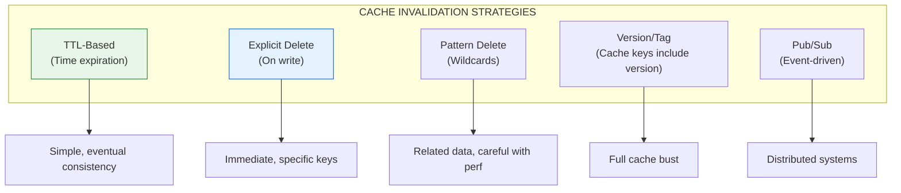

# Lesson 12.8: Cache Invalidation

> **Duration**: 25 min | **Section**: B - Caching Patterns

## 🎯 The Problem

> "There are only two hard things in Computer Science: cache invalidation and naming things." — Phil Karlton

When data changes, how do you ensure the cache reflects the change? Do you delete the cache? Update it? What if related data also needs to update?

> **Scenario**: User changes their profile picture. You update the cache for `user:123:profile`. But the picture also appears in `user:123:avatar`, `team:5:members`, and `chat:room:42:participants`. You forgot to invalidate those. Now users see mixed old/new pictures across the app.

## 🧪 Try It: The Naive Approach

```python
# ❌ Only invalidate the obvious key
async def update_user_profile(user_id: int, data: dict):
    await db.update_user(user_id, data)
    await r.delete(f"user:{user_id}:profile")
    # What about other caches containing this user's data?
```

## 🔍 Under the Hood: Invalidation Strategies



## 🔍 Strategy 1: TTL-Based (Passive)

Let time handle it:

```python
# Cache with TTL - eventually consistent
r.setex(f"user:{user_id}", 300, data)  # Stale for max 5 min

# Pros:
# - Simple, no extra code on writes
# - Self-healing (cache refreshes automatically)

# Cons:
# - Data can be stale for TTL duration
# - Not suitable for critical data
```

**Best for**: Non-critical data, high-read/low-write ratios

## 🔍 Strategy 2: Explicit Delete (Active)

Delete on every write:

```python
async def update_user(user_id: int, data: dict, r: redis.Redis):
    # Update database
    await db.update_user(user_id, data)
    
    # Explicitly delete cache
    await r.delete(f"user:{user_id}")
    
    # Next read will repopulate cache

async def delete_user(user_id: int, r: redis.Redis):
    await db.delete_user(user_id)
    await r.delete(f"user:{user_id}")
```

**Best for**: Simple cases, one-to-one cache-to-entity mapping

## 🔍 Strategy 3: Pattern Delete (Related Data)

Delete all related keys:

```python
async def invalidate_user_caches(user_id: int, r: redis.Redis):
    """Delete all caches related to a user."""
    
    # Using SCAN (safe for production)
    pattern = f"*user:{user_id}*"
    
    async for key in r.scan_iter(match=pattern):
        await r.delete(key)
    
    # This deletes:
    # - user:123:profile
    # - user:123:avatar
    # - user:123:settings
    # - team:5:user:123:role
    # etc.
```

⚠️ **Warning**: Pattern matching can be slow with many keys. Use thoughtfully.

**Better approach**: Track related keys:

```python
async def cache_with_tracking(
    key: str, 
    value: Any, 
    tags: list[str],
    r: redis.Redis,
    ttl: int = 300
):
    """Cache data and track by tags for grouped invalidation."""
    
    # Store the data
    await r.setex(key, ttl, json.dumps(value))
    
    # Track key under each tag
    for tag in tags:
        await r.sadd(f"tag:{tag}", key)
        await r.expire(f"tag:{tag}", ttl + 60)  # Tag expires after keys

async def invalidate_by_tag(tag: str, r: redis.Redis):
    """Delete all keys with a given tag."""
    keys = await r.smembers(f"tag:{tag}")
    if keys:
        await r.delete(*keys)
    await r.delete(f"tag:{tag}")

# Usage
await cache_with_tracking(
    key="user:123:profile",
    value=profile_data,
    tags=["user:123", "team:5"],
    r=r
)

# When user 123 changes anything:
await invalidate_by_tag("user:123", r)  # Clears all user:123 related caches
```

## 🔍 Strategy 4: Version-Based (Cache Busting)

Include version in cache keys:

```python
class VersionedCache:
    def __init__(self, r: redis.Redis):
        self.r = r
    
    async def get_version(self, entity: str, entity_id: int) -> int:
        """Get current version for an entity."""
        version = await self.r.get(f"version:{entity}:{entity_id}")
        return int(version) if version else 1
    
    async def increment_version(self, entity: str, entity_id: int):
        """Bump version (invalidates all caches using old version)."""
        await self.r.incr(f"version:{entity}:{entity_id}")
    
    def cache_key(self, entity: str, entity_id: int, suffix: str, version: int) -> str:
        """Build versioned cache key."""
        return f"{entity}:{entity_id}:v{version}:{suffix}"
    
    async def get(self, entity: str, entity_id: int, suffix: str) -> Any | None:
        version = await self.get_version(entity, entity_id)
        key = self.cache_key(entity, entity_id, suffix, version)
        data = await self.r.get(key)
        return json.loads(data) if data else None
    
    async def set(
        self, 
        entity: str, 
        entity_id: int, 
        suffix: str, 
        value: Any,
        ttl: int = 300
    ):
        version = await self.get_version(entity, entity_id)
        key = self.cache_key(entity, entity_id, suffix, version)
        await self.r.setex(key, ttl, json.dumps(value))

# Usage
cache = VersionedCache(r)

# Read (uses current version)
profile = await cache.get("user", 123, "profile")

# Write with invalidation
await db.update_user(123, new_data)
await cache.increment_version("user", 123)  # Old keys now orphaned

# Next read gets fresh data (new version = new key = cache miss)
profile = await cache.get("user", 123, "profile")
```

**Benefit**: Old cached data naturally expires via TTL, no explicit deletion needed.

## 🔍 Strategy 5: Pub/Sub (Event-Driven)

For distributed systems with multiple app servers:

```python
import asyncio

# Publisher (on data change)
async def publish_invalidation(entity: str, entity_id: int, r: redis.Redis):
    """Notify all subscribers to invalidate their local caches."""
    message = json.dumps({"entity": entity, "id": entity_id})
    await r.publish("cache:invalidate", message)

# Subscriber (each app server runs this)
async def listen_for_invalidations(r: redis.Redis):
    """Listen for invalidation messages and clear local cache."""
    pubsub = r.pubsub()
    await pubsub.subscribe("cache:invalidate")
    
    async for message in pubsub.listen():
        if message["type"] == "message":
            data = json.loads(message["data"])
            entity = data["entity"]
            entity_id = data["id"]
            
            # Clear local/Redis caches
            await r.delete(f"{entity}:{entity_id}")
            logger.info(f"Invalidated {entity}:{entity_id}")

# On write
async def update_user(user_id: int, data: dict, r: redis.Redis):
    await db.update_user(user_id, data)
    await publish_invalidation("user", user_id, r)
```

**Best for**: Multiple app servers that need synchronized cache invalidation.

## 🔍 Full Example: User Profile Invalidation

```python
from dataclasses import dataclass
from typing import List

@dataclass
class InvalidationConfig:
    """Define what to invalidate when an entity changes."""
    keys: List[str]
    patterns: List[str]
    tags: List[str]

def get_user_invalidation_config(user_id: int) -> InvalidationConfig:
    """What to invalidate when user changes."""
    return InvalidationConfig(
        keys=[
            f"user:{user_id}:profile",
            f"user:{user_id}:settings",
            f"user:{user_id}:avatar",
        ],
        patterns=[
            # Be careful with patterns in production!
        ],
        tags=[
            f"user:{user_id}",
        ]
    )

async def invalidate_entity(config: InvalidationConfig, r: redis.Redis):
    """Invalidate all caches for an entity."""
    
    # Delete specific keys
    if config.keys:
        await r.delete(*config.keys)
    
    # Delete by tags
    for tag in config.tags:
        keys = await r.smembers(f"tag:{tag}")
        if keys:
            await r.delete(*keys)
        await r.delete(f"tag:{tag}")

# Usage
async def update_user_profile(user_id: int, data: dict, r: redis.Redis):
    # 1. Update database
    await db.update_user(user_id, data)
    
    # 2. Invalidate all related caches
    config = get_user_invalidation_config(user_id)
    await invalidate_entity(config, r)
    
    # 3. Optionally, pre-warm the cache
    fresh_data = await db.get_user(user_id)
    await r.setex(f"user:{user_id}:profile", 300, json.dumps(fresh_data))
```

## 💥 Common Pitfalls

### 1. Forgetting Related Caches

```python
# ❌ Only invalidating one key
await r.delete(f"user:{user_id}:profile")
# But user data is also in team:members, chat:participants, etc.

# ✅ Use tags or explicit list
await invalidate_by_tag(f"user:{user_id}", r)
```

### 2. Race Condition on Update

```python
# ❌ Race condition
await r.delete(f"user:{user_id}")  # Delete cache
await db.update_user(user_id, data)  # Update DB
# Another request reads stale data between these two lines!

# ✅ Update DB first, then invalidate
await db.update_user(user_id, data)  # DB is source of truth
await r.delete(f"user:{user_id}")  # Now invalidate
```

### 3. Pattern Matching Performance

```python
# ❌ Slow: KEYS blocks Redis
keys = await r.keys("user:*")

# ✅ Better: SCAN is non-blocking
async for key in r.scan_iter("user:*"):
    await r.delete(key)

# ✅✅ Best: Use tags
await invalidate_by_tag("user:123", r)
```

## 🎯 Practice

Implement a blog post cache with proper invalidation:

```python
class BlogCache:
    def __init__(self, r: redis.Redis):
        self.r = r
    
    async def cache_post(self, post_id: int, post: dict):
        """Cache a blog post and track by author."""
        pass
    
    async def cache_author_posts(self, author_id: int, posts: list):
        """Cache list of posts by author."""
        pass
    
    async def invalidate_post(self, post_id: int, author_id: int):
        """Invalidate post and author's post list."""
        pass
    
    async def invalidate_author(self, author_id: int):
        """Invalidate all caches for an author."""
        pass
```

## 🔑 Key Takeaways

- TTL-based: Simple, eventually consistent
- Explicit delete: Immediate, requires knowing all keys
- Tags: Group related data for bulk invalidation
- Versioning: Orphan old data, no explicit delete needed
- Pub/Sub: Distribute invalidation across servers
- Always update DB before invalidating cache

## ❓ Common Questions

| Question | Answer |
|----------|--------|
| Delete or update cache on write? | Delete is safer (avoids stale data bugs) |
| How to handle cascade invalidation? | Use tags or define relationships explicitly |
| What about consistency during deploy? | Version-based or full cache flush |
| Best practice for high-write data? | Don't cache it, or use very short TTL |

---

**Next**: 12.9 - RAG Caching
