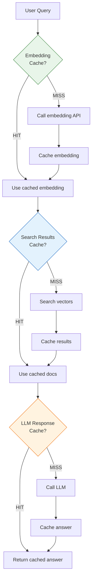

# Lesson 12.9: RAG Caching

> **Duration**: 35 min | **Section**: B - Caching Patterns

## 🎯 The Problem

Your RAG pipeline has multiple expensive steps. Each step can be cached:

```
User Query → [Embedding] → [Vector Search] → [LLM Generation]
               200ms         150ms             2000-5000ms
               $0.0001       free              $0.01-0.05
```

How do you cache each layer effectively?

> **Scenario**: 1000 users ask "What is your refund policy?" Each time: embed ($0.0001), search, LLM call ($0.02). Total: $20.10. With caching: 1 embed, 1 LLM call = $0.0201. **99.9% cost savings**.

## 🔍 Under the Hood: The Three Cache Layers



## 🔍 Layer 1: Embedding Cache

Embeddings are deterministic: same input → same output.

```python
import hashlib
import numpy as np

class EmbeddingCache:
    def __init__(self, r: redis.Redis, model: str = "text-embedding-3-small"):
        self.r = r
        self.model = model
        self.ttl = 86400 * 7  # 7 days (embeddings don't change)
    
    def _cache_key(self, text: str) -> str:
        """Generate cache key from text hash."""
        text_hash = hashlib.sha256(
            f"{self.model}:{text.strip().lower()}".encode()
        ).hexdigest()[:16]
        return f"embed:{self.model}:{text_hash}"
    
    async def get_embedding(self, text: str) -> list[float]:
        """Get embedding, using cache if available."""
        cache_key = self._cache_key(text)
        
        # Check cache
        cached = await self.r.get(cache_key)
        if cached:
            return json.loads(cached)
        
        # Cache miss - call API
        embedding = await self._call_embedding_api(text)
        
        # Cache for 7 days
        await self.r.setex(cache_key, self.ttl, json.dumps(embedding))
        
        return embedding
    
    async def _call_embedding_api(self, text: str) -> list[float]:
        """Call OpenAI embedding API."""
        response = await openai_client.embeddings.create(
            model=self.model,
            input=text
        )
        return response.data[0].embedding

# Usage
embed_cache = EmbeddingCache(r)
embedding = await embed_cache.get_embedding("What is your refund policy?")
```

**Key insight**: Normalize input (lowercase, strip) for better cache hits.

## 🔍 Layer 2: Search Results Cache

Vector search results depend on:
1. The query embedding
2. The document corpus (which may change)

```python
class SearchCache:
    def __init__(self, r: redis.Redis, vector_store):
        self.r = r
        self.vector_store = vector_store
        self.ttl = 3600  # 1 hour (documents may be updated)
    
    def _cache_key(self, query: str, top_k: int) -> str:
        """Cache key from query hash and parameters."""
        query_hash = hashlib.md5(query.lower().encode()).hexdigest()[:12]
        return f"search:{query_hash}:k{top_k}"
    
    async def search(
        self, 
        query: str, 
        embedding: list[float],
        top_k: int = 5
    ) -> list[dict]:
        """Search with caching."""
        cache_key = self._cache_key(query, top_k)
        
        # Check cache
        cached = await self.r.get(cache_key)
        if cached:
            return json.loads(cached)
        
        # Cache miss - do search
        results = await self.vector_store.similarity_search(
            embedding=embedding,
            k=top_k
        )
        
        # Cache results
        await self.r.setex(cache_key, self.ttl, json.dumps(results))
        
        return results
    
    async def invalidate_all(self):
        """Invalidate all search caches (when documents change)."""
        async for key in self.r.scan_iter("search:*"):
            await self.r.delete(key)

# Invalidate when corpus changes
async def add_document(doc: Document):
    await vector_store.add(doc)
    await search_cache.invalidate_all()  # Clear all search caches
```

## 🔍 Layer 3: LLM Response Cache (Semantic)

The most impactful cache - saves the most money and time.

### Option A: Exact Match Cache

```python
class ExactMatchLLMCache:
    """Cache LLM responses by exact query match."""
    
    def __init__(self, r: redis.Redis):
        self.r = r
        self.ttl = 3600  # 1 hour
    
    def _cache_key(self, query: str, context_hash: str) -> str:
        """Key from query and context hash."""
        query_hash = hashlib.md5(query.lower().strip().encode()).hexdigest()
        return f"llm:{query_hash}:{context_hash[:8]}"
    
    async def get_response(
        self,
        query: str,
        context: list[str],
        llm_func
    ) -> str:
        context_hash = hashlib.md5("".join(context).encode()).hexdigest()
        cache_key = self._cache_key(query, context_hash)
        
        # Check cache
        cached = await self.r.get(cache_key)
        if cached:
            return cached
        
        # Cache miss
        response = await llm_func(query, context)
        await self.r.setex(cache_key, self.ttl, response)
        
        return response
```

**Limitation**: "What is your refund policy?" ≠ "What's your refund policy?"

### Option B: Semantic Cache (GPTCache-style)

```python
class SemanticLLMCache:
    """
    Cache LLM responses with semantic similarity matching.
    
    Uses embeddings to find similar previous queries.
    """
    
    def __init__(
        self, 
        r: redis.Redis, 
        embed_cache: EmbeddingCache,
        similarity_threshold: float = 0.95
    ):
        self.r = r
        self.embed_cache = embed_cache
        self.threshold = similarity_threshold
        self.ttl = 3600
    
    async def get_response(
        self,
        query: str,
        context: list[str],
        llm_func
    ) -> str:
        # Get query embedding
        query_embedding = await self.embed_cache.get_embedding(query)
        
        # Search for similar cached queries
        cached_response = await self._find_similar_cached(
            query_embedding, 
            context
        )
        
        if cached_response:
            return cached_response
        
        # Cache miss - call LLM
        response = await llm_func(query, context)
        
        # Cache with embedding for future semantic search
        await self._cache_response(query, query_embedding, context, response)
        
        return response
    
    async def _find_similar_cached(
        self, 
        query_embedding: list[float],
        context: list[str]
    ) -> str | None:
        """Find cached response with similar query."""
        context_hash = hashlib.md5("".join(context).encode()).hexdigest()[:8]
        
        # Get all cached embeddings for this context
        cached_keys = await self.r.keys(f"llm_embed:{context_hash}:*")
        
        for key in cached_keys:
            cached = json.loads(await self.r.get(key))
            cached_embedding = cached["embedding"]
            
            # Calculate cosine similarity
            similarity = self._cosine_similarity(
                query_embedding, 
                cached_embedding
            )
            
            if similarity >= self.threshold:
                # Found similar query!
                response_key = f"llm_response:{cached['response_id']}"
                return await self.r.get(response_key)
        
        return None
    
    def _cosine_similarity(self, a: list[float], b: list[float]) -> float:
        a = np.array(a)
        b = np.array(b)
        return np.dot(a, b) / (np.linalg.norm(a) * np.linalg.norm(b))
    
    async def _cache_response(
        self,
        query: str,
        embedding: list[float],
        context: list[str],
        response: str
    ):
        response_id = hashlib.md5(
            f"{query}:{time.time()}".encode()
        ).hexdigest()[:12]
        context_hash = hashlib.md5("".join(context).encode()).hexdigest()[:8]
        
        # Store embedding for similarity search
        await self.r.setex(
            f"llm_embed:{context_hash}:{response_id}",
            self.ttl,
            json.dumps({"embedding": embedding, "response_id": response_id})
        )
        
        # Store actual response
        await self.r.setex(
            f"llm_response:{response_id}",
            self.ttl,
            response
        )
```

## 🔍 Complete RAG Pipeline with Caching

```python
class CachedRAGPipeline:
    """Complete RAG pipeline with multi-layer caching."""
    
    def __init__(
        self,
        r: redis.Redis,
        vector_store,
        llm_client
    ):
        self.embed_cache = EmbeddingCache(r)
        self.search_cache = SearchCache(r, vector_store)
        self.llm_cache = ExactMatchLLMCache(r)
        self.llm_client = llm_client
        
        # Stats
        self.stats = {
            "embed_hits": 0, "embed_misses": 0,
            "search_hits": 0, "search_misses": 0,
            "llm_hits": 0, "llm_misses": 0
        }
    
    async def query(self, user_query: str) -> dict:
        """Process query through cached RAG pipeline."""
        
        # Layer 1: Get embedding (cached)
        embedding = await self.embed_cache.get_embedding(user_query)
        
        # Layer 2: Search for context (cached)
        documents = await self.search_cache.search(
            query=user_query,
            embedding=embedding,
            top_k=5
        )
        context = [doc["content"] for doc in documents]
        
        # Layer 3: Generate response (cached)
        response = await self.llm_cache.get_response(
            query=user_query,
            context=context,
            llm_func=self._call_llm
        )
        
        return {
            "answer": response,
            "sources": documents
        }
    
    async def _call_llm(self, query: str, context: list[str]) -> str:
        """Call LLM with context."""
        prompt = f"""Answer the question based on the context.

Context:
{chr(10).join(context)}

Question: {query}

Answer:"""
        
        response = await self.llm_client.chat.completions.create(
            model="gpt-4o-mini",
            messages=[{"role": "user", "content": prompt}]
        )
        
        return response.choices[0].message.content

# Usage
pipeline = CachedRAGPipeline(r, vector_store, openai_client)

# First call: all cache misses
result1 = await pipeline.query("What is your refund policy?")

# Second call: all cache hits!
result2 = await pipeline.query("What is your refund policy?")
```

## 🔍 Cache Metrics and Monitoring

```python
class RAGCacheMetrics:
    """Track cache performance for RAG pipeline."""
    
    def __init__(self, r: redis.Redis):
        self.r = r
    
    async def record_hit(self, layer: str):
        await self.r.incr(f"metrics:cache:{layer}:hits")
    
    async def record_miss(self, layer: str):
        await self.r.incr(f"metrics:cache:{layer}:misses")
    
    async def get_stats(self) -> dict:
        layers = ["embed", "search", "llm"]
        stats = {}
        
        for layer in layers:
            hits = int(await self.r.get(f"metrics:cache:{layer}:hits") or 0)
            misses = int(await self.r.get(f"metrics:cache:{layer}:misses") or 0)
            total = hits + misses
            hit_rate = (hits / total * 100) if total > 0 else 0
            
            stats[layer] = {
                "hits": hits,
                "misses": misses,
                "hit_rate": f"{hit_rate:.1f}%"
            }
        
        return stats

# Endpoint to check cache performance
@app.get("/metrics/cache")
async def cache_metrics(r: redis.Redis = Depends(get_redis)):
    metrics = RAGCacheMetrics(r)
    return await metrics.get_stats()
```

## 💥 Common Pitfalls

### 1. Caching Non-Deterministic Outputs

```python
# ❌ LLM with temperature > 0 gives different answers
response = await llm.generate(query, temperature=0.7)
r.set(cache_key, response)  # Next time, user expects same answer?

# ✅ For caching, use temperature=0
response = await llm.generate(query, temperature=0)
```

### 2. Not Handling Corpus Updates

```python
# ❌ Documents change, but search cache still returns old results
await vector_store.add_document(new_doc)
# Search cache still returns old results!

# ✅ Invalidate search cache on corpus update
await vector_store.add_document(new_doc)
await search_cache.invalidate_all()
```

### 3. Cache Key Doesn't Include All Inputs

```python
# ❌ Missing context in cache key
cache_key = f"llm:{query_hash}"  # Same query, different context = wrong answer!

# ✅ Include all inputs
cache_key = f"llm:{query_hash}:{context_hash}"
```

## 🎯 Practice

Implement cache hit/miss tracking:

```python
class TrackedEmbeddingCache(EmbeddingCache):
    async def get_embedding(self, text: str) -> list[float]:
        cache_key = self._cache_key(text)
        cached = await self.r.get(cache_key)
        
        if cached:
            # TODO: Record cache hit
            return json.loads(cached)
        
        # TODO: Record cache miss
        embedding = await self._call_embedding_api(text)
        await self.r.setex(cache_key, self.ttl, json.dumps(embedding))
        return embedding
```

## 🔑 Key Takeaways

- Cache at three layers: embedding, search, LLM response
- Embeddings are deterministic → long TTL (days)
- Search results depend on corpus → medium TTL + invalidation
- LLM responses → exact match or semantic similarity
- Use temperature=0 for cacheable LLM calls
- Invalidate search cache when documents change
- Track hit rates to measure effectiveness

## ❓ Common Questions

| Question | Answer |
|----------|--------|
| Which layer saves most money? | LLM cache (99% of cost) |
| What hit rate should I target? | 80%+ for embeddings, 50%+ for LLM |
| Semantic or exact match? | Start exact, add semantic if needed |
| What about streaming responses? | Cache full response, stream from cache |

---

## 📚 Further Reading

- [GPTCache - Semantic LLM Caching](https://github.com/zilliztech/GPTCache)
- [LangChain Caching](https://python.langchain.com/docs/modules/model_io/llms/llm_caching)

---

**Next**: 12.10 - Caching Q&A
