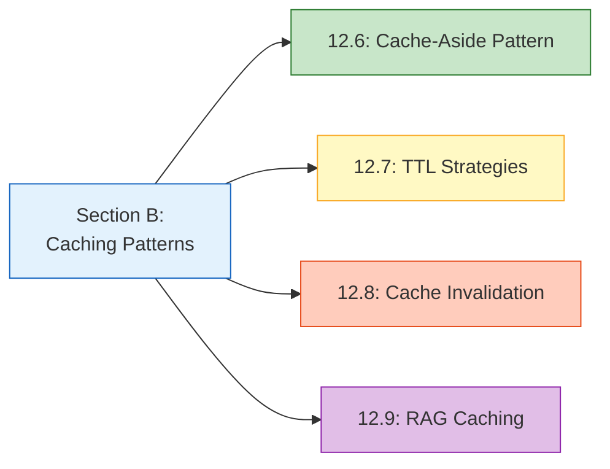
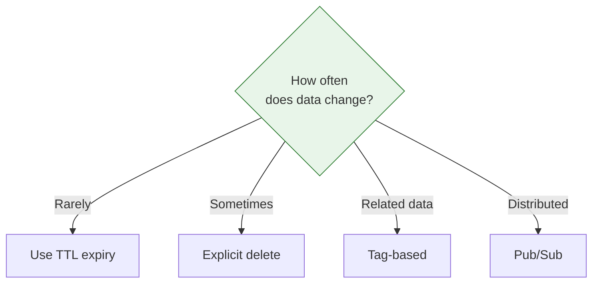

# Lesson 12.10: Caching Q&A

> **Duration**: 20 min | **Section**: B - Caching Patterns Recap

## 🔍 Section B: What We Learned

Section B covered practical caching patterns:



## 🔑 Key Concepts Summary

### Cache-Aside Pattern (12.6)

The fundamental read-through pattern:

```
1. Check cache
2. If HIT → return cached
3. If MISS → fetch from source
4. Store in cache
5. Return data
```

```python
async def get_with_cache(key: str, fetch_func) -> Any:
    cached = await r.get(key)
    if cached:
        return json.loads(cached)
    
    data = await fetch_func()
    await r.setex(key, 3600, json.dumps(data))
    return data
```

### TTL Strategies (12.7)

| Data Type | TTL | Reason |
|-----------|-----|--------|
| Session | 30 min | Security |
| API responses | 5 min | Freshness |
| User profiles | 1 hour | Balance |
| Static config | 24 hours | Rarely changes |
| Embeddings | 7 days | Deterministic |

**Patterns**:
- **Fixed TTL**: Simple, predictable
- **Sliding TTL**: Active users stay cached
- **Stale-While-Revalidate**: Never wait for refresh

### Cache Invalidation (12.8)

Five strategies ranked by complexity:

| Strategy | When to Use |
|----------|-------------|
| TTL Expiry | Default, simple |
| Explicit Delete | Single key changes |
| Pattern/Tags | Related data changes |
| Version Keys | Atomic bulk invalidation |
| Pub/Sub | Distributed systems |

```python
# Tag-based invalidation
async def invalidate_by_tag(tag: str):
    keys = await r.smembers(f"tag:{tag}")
    if keys:
        await r.delete(*keys)
        await r.delete(f"tag:{tag}")
```

### RAG Caching (12.9)

Three-layer caching for RAG pipelines:

| Layer | TTL | Cost Savings |
|-------|-----|--------------|
| Embeddings | 7 days | Minor ($) |
| Search results | 1 hour | None |
| LLM responses | 1 hour | Major ($$$) |

```python
# Complete flow
embedding = await embed_cache.get(query)      # Layer 1
documents = await search_cache.search(embed)   # Layer 2
response = await llm_cache.generate(query, docs)  # Layer 3
```

## 💥 Common Pitfalls (Section B)

### 1. No Invalidation Strategy

```python
# ❌ Data updated but cache still has old value
await db.update_user(user_id, new_data)
# Cache still returns old data!

# ✅ Always invalidate on write
await db.update_user(user_id, new_data)
await r.delete(f"user:{user_id}")
```

### 2. Cache Stampede

```python
# ❌ TTL expires, 100 requests all fetch from DB
async def get_user(user_id: str):
    cached = await r.get(f"user:{user_id}")  # All 100 miss at same time!
    if not cached:
        user = await db.get_user(user_id)  # 100 DB queries!
        await r.setex(f"user:{user_id}", 3600, user)
    return user

# ✅ Lock to prevent stampede
async def get_user_safe(user_id: str):
    cached = await r.get(f"user:{user_id}")
    if cached:
        return cached
    
    # Try to acquire lock
    lock_key = f"lock:user:{user_id}"
    got_lock = await r.set(lock_key, "1", nx=True, ex=5)
    
    if got_lock:
        # Only this request fetches
        user = await db.get_user(user_id)
        await r.setex(f"user:{user_id}", 3600, user)
        await r.delete(lock_key)
        return user
    else:
        # Wait for lock holder to populate cache
        await asyncio.sleep(0.1)
        return await get_user_safe(user_id)
```

### 3. Inconsistent Serialization

```python
# ❌ Different serialization formats
await r.set("data", str(my_dict))  # Python repr
data = await r.get("data")
parsed = json.loads(data)  # Fails!

# ✅ Consistent JSON
await r.set("data", json.dumps(my_dict))
data = json.loads(await r.get("data"))
```

### 4. Caching Errors

```python
# ❌ Caching error responses
async def get_external_api():
    try:
        response = await fetch_api()
        await r.setex("api_result", 3600, response)
        return response
    except Exception as e:
        await r.setex("api_result", 3600, str(e))  # Caching the error!
        raise

# ✅ Only cache successful responses
async def get_external_api():
    try:
        response = await fetch_api()
        await r.setex("api_result", 3600, response)
        return response
    except Exception:
        # Don't cache errors
        raise
```

### 5. Wrong TTL for RAG Components

```python
# ❌ Same TTL for all RAG caches
CACHE_TTL = 3600  # 1 hour for everything

# ✅ Different TTLs based on volatility
EMBED_TTL = 86400 * 7  # 7 days (deterministic)
SEARCH_TTL = 3600      # 1 hour (corpus may change)
LLM_TTL = 3600         # 1 hour (context-dependent)
```

## ❓ Frequently Asked Questions

### Pattern Questions

**Q: When should I NOT use cache-aside?**

When writes are more frequent than reads. Consider write-through or write-behind patterns instead.

---

**Q: How do I choose between invalidation strategies?**



---

**Q: What's the difference between cache miss and cache stampede?**

- **Cache miss**: One request finds no cached data, fetches from source
- **Cache stampede**: Many requests simultaneously find no cached data, all fetch from source

---

### RAG Questions

**Q: Should I use semantic caching for LLM responses?**

Start with exact match. Add semantic caching only if:
- You have high query volume
- Many queries are semantically similar
- You're willing to accept occasional wrong cache hits

---

**Q: How do I handle streaming LLM responses with caching?**

```python
# Cache the complete response, stream from cache
async def cached_stream(query: str):
    cached = await r.get(f"llm:{query_hash}")
    if cached:
        # Stream from cache
        for chunk in cached.split(" "):
            yield chunk
    else:
        # Collect full response while streaming
        full_response = ""
        async for chunk in llm.stream(query):
            full_response += chunk
            yield chunk
        # Cache complete response
        await r.setex(f"llm:{query_hash}", 3600, full_response)
```

---

**Q: What happens if embeddings model changes?**

Include model name in cache key:

```python
cache_key = f"embed:{model_name}:{text_hash}"
```

When you switch models, all old cache entries become irrelevant (different keys).

---

### Performance Questions

**Q: How do I measure if caching is helping?**

Track these metrics:
- Cache hit rate (target: >80%)
- Average latency with/without cache
- Database query reduction
- API cost reduction

---

**Q: How much memory should I allocate to Redis?**

Rule of thumb:
- Start with 256MB for development
- Monitor with `INFO memory`
- Production: calculate `(avg_value_size × expected_keys × 1.5)`
- Set `maxmemory` policy (usually `allkeys-lru`)

---

## 🧪 Mini Quiz

Test your understanding:

### Question 1

What's wrong with this code?

```python
async def get_product(product_id: str):
    data = await db.get_product(product_id)
    await r.set(f"product:{product_id}", json.dumps(data))
    return data
```

<details>
<summary>Answer</summary>

No TTL set! Use `setex` or add `ex` parameter:

```python
await r.setex(f"product:{product_id}", 3600, json.dumps(data))
```

</details>

### Question 2

User updates their profile. Which invalidation strategy?

<details>
<summary>Answer</summary>

**Explicit delete** - simple and effective for single-entity updates:

```python
await db.update_profile(user_id, new_data)
await r.delete(f"profile:{user_id}")
```

</details>

### Question 3

You change from `text-embedding-ada-002` to `text-embedding-3-small`. What cache key consideration?

<details>
<summary>Answer</summary>

Include model name in cache key. Old embeddings become invalid with new model:

```python
cache_key = f"embed:{model}:{text_hash}"
# Old: embed:ada-002:abc123
# New: embed:3-small:abc123
```

</details>

## 🎯 Independence Check (Section B)

| Level | Question | Can You Answer? |
|-------|----------|-----------------|
| **Know** | What is the cache-aside pattern? | ☐ |
| **Understand** | Why use different TTLs for different data? | ☐ |
| **Apply** | How would you implement tag-based invalidation? | ☐ |
| **Analyze** | When would semantic caching fail? | ☐ |
| **Create** | Design a caching strategy for a new RAG feature | ☐ |

---

## 📚 Resources

- [Redis Best Practices](https://redis.io/docs/getting-started/)
- [Cache Stampede Prevention](https://en.wikipedia.org/wiki/Cache_stampede)

---

**Next**: 12.11 - Module Review
