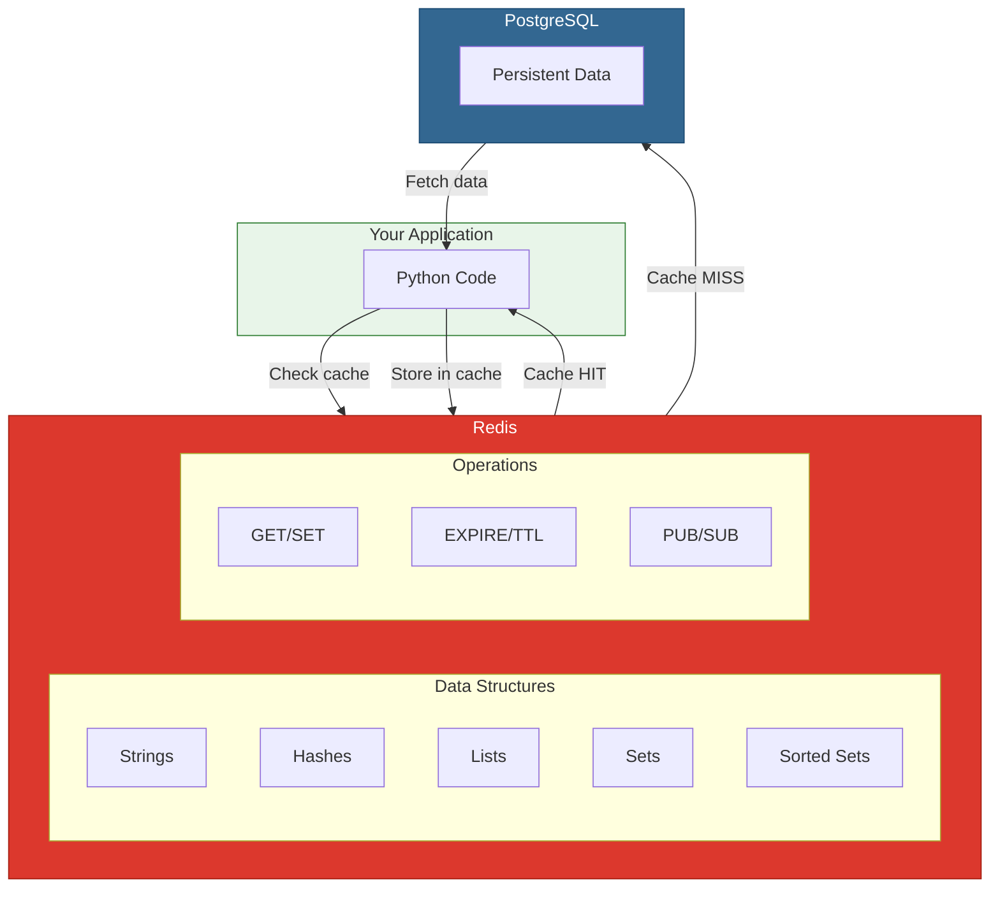
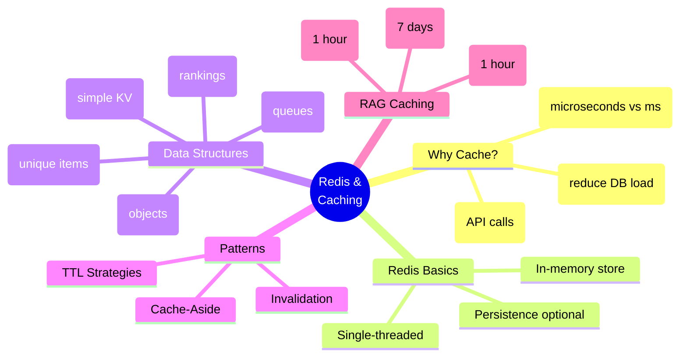

# Lesson 12.11: Module Review - Redis & Caching

> **Duration**: 15 min | **Type**: Module Review

## 🎯 Module Objectives Recap

In this module, you learned to:

1. ✅ Understand why caching matters for AI applications
2. ✅ Use Redis as a high-performance cache
3. ✅ Choose appropriate data structures
4. ✅ Implement cache-aside pattern
5. ✅ Design TTL strategies for different data types
6. ✅ Handle cache invalidation correctly
7. ✅ Cache RAG pipeline components

## 🔍 The Complete Redis Mental Model



## 🔑 Key Concepts Map



## 📊 Decision Matrix

### When to Use Redis

| Scenario | Use Redis? | Why |
|----------|:----------:|-----|
| Frequently accessed data | ✅ | Reduce DB queries |
| Session storage | ✅ | Fast, auto-expire |
| Rate limiting | ✅ | Atomic counters |
| Leaderboards | ✅ | Sorted sets perfect fit |
| Job queues | ✅ | Lists as queues |
| RAG embeddings | ✅ | Expensive to recompute |
| LLM responses | ✅ | Cost savings |
| Primary database | ❌ | Not durable by default |
| Complex queries | ❌ | Use PostgreSQL |
| Large files | ❌ | Use object storage |

### Data Structure Selection

| Need | Use | Example |
|------|-----|---------|
| Simple value | String | `SET user:123 "John"` |
| Object with fields | Hash | `HSET user:123 name "John" email "..."` |
| Queue | List | `LPUSH tasks "task1"` |
| Unique items | Set | `SADD tags "python" "redis"` |
| Ranked items | Sorted Set | `ZADD leaderboard 100 "user1"` |

### TTL Selection

| Data Type | TTL | Rationale |
|-----------|-----|-----------|
| Session | 30 min | Security |
| Rate limit | 1 min | Per-minute limits |
| API response | 5 min | Freshness |
| User profile | 1 hour | Balance |
| Config | 24 hours | Rarely changes |
| Embeddings | 7 days | Deterministic |

### Invalidation Strategy

| Situation | Strategy |
|-----------|----------|
| Simple TTL-based | TTL expiry |
| Single entity update | Explicit delete |
| Related entities change | Tag-based |
| Many keys, infrequent changes | Version keys |
| Distributed systems | Pub/Sub |

## 💡 Code Patterns Cheatsheet

### Basic Cache-Aside

```python
async def get_cached(key: str, fetch_func, ttl: int = 3600):
    cached = await r.get(key)
    if cached:
        return json.loads(cached)
    
    data = await fetch_func()
    await r.setex(key, ttl, json.dumps(data))
    return data
```

### Connection Pool

```python
pool = redis.ConnectionPool(
    host="localhost",
    port=6379,
    max_connections=20,
    decode_responses=True
)
r = redis.Redis(connection_pool=pool)
```

### Async Redis with FastAPI

```python
@asynccontextmanager
async def lifespan(app: FastAPI):
    app.state.redis = redis.asyncio.Redis(host="localhost")
    yield
    await app.state.redis.close()

async def get_redis(request: Request) -> redis.asyncio.Redis:
    return request.app.state.redis
```

### Tag-Based Invalidation

```python
async def cache_with_tag(key: str, value: str, tag: str, ttl: int):
    await r.setex(key, ttl, value)
    await r.sadd(f"tag:{tag}", key)

async def invalidate_tag(tag: str):
    keys = await r.smembers(f"tag:{tag}")
    if keys:
        await r.delete(*keys, f"tag:{tag}")
```

### RAG Cache Layers

```python
# Layer 1: Embeddings
embed_key = f"embed:{model}:{hash(text)}"
await r.setex(embed_key, 86400 * 7, json.dumps(embedding))

# Layer 2: Search results
search_key = f"search:{hash(query)}:k{top_k}"
await r.setex(search_key, 3600, json.dumps(results))

# Layer 3: LLM responses
llm_key = f"llm:{hash(query)}:{hash(context)}"
await r.setex(llm_key, 3600, response)
```

## 🎯 Independence Check

Can you answer these questions without looking back?

| Level | Question | Check |
|-------|----------|:-----:|
| **Know** | What data structures does Redis provide? | ☐ |
| **Understand** | Why is Redis faster than PostgreSQL for caching? | ☐ |
| **Apply** | How would you implement cache-aside in FastAPI? | ☐ |
| **Analyze** | When would you use tag-based vs TTL invalidation? | ☐ |
| **Create** | Design a caching strategy for a RAG chatbot | ☐ |

## 🧪 Self-Assessment

### Scenario 1: High-Traffic API

You have an endpoint that fetches user profiles. It's called 1000 times/second.

**Question**: Design the caching strategy.

<details>
<summary>Solution</summary>

```python
# Cache-aside with connection pooling
pool = redis.ConnectionPool(max_connections=100)
r = redis.Redis(connection_pool=pool)

async def get_user(user_id: str):
    cache_key = f"user:{user_id}"
    
    # Check cache
    cached = await r.get(cache_key)
    if cached:
        return json.loads(cached)
    
    # Cache miss - fetch from DB
    user = await db.get_user(user_id)
    
    # Cache for 1 hour
    await r.setex(cache_key, 3600, json.dumps(user))
    
    return user

# Invalidate on update
async def update_user(user_id: str, data: dict):
    await db.update_user(user_id, data)
    await r.delete(f"user:{user_id}")
```

</details>

### Scenario 2: RAG Cost Optimization

Your RAG pipeline costs $50/day on LLM calls. 60% of queries are similar.

**Question**: How do you reduce costs?

<details>
<summary>Solution</summary>

1. **Cache embeddings** (saves ~$0.50/day)
2. **Cache LLM responses** (saves ~$30/day for exact matches)
3. **Consider semantic caching** (could save more for similar queries)

```python
class CostOptimizedRAG:
    def __init__(self, r: redis.Redis):
        self.embed_cache = EmbeddingCache(r, ttl=86400*7)
        self.llm_cache = ExactMatchCache(r, ttl=3600)
    
    async def query(self, q: str) -> str:
        # Check LLM cache first (biggest savings)
        cached_response = await self.llm_cache.get(q)
        if cached_response:
            return cached_response  # $0 cost!
        
        # Get cached embedding
        embedding = await self.embed_cache.get(q)
        
        # Generate response
        response = await self.generate(q, embedding)
        
        # Cache for future
        await self.llm_cache.set(q, response)
        
        return response
```

Target: 60% hit rate on LLM cache = $30/day savings.

</details>

### Scenario 3: Real-Time Leaderboard

You need a gaming leaderboard with 1M users, updated in real-time.

**Question**: Which Redis data structure and why?

<details>
<summary>Solution</summary>

**Sorted Set** - perfect for leaderboards:

```python
# Update score
await r.zadd("leaderboard", {"user_123": 1500})

# Get top 10
top_10 = await r.zrevrange("leaderboard", 0, 9, withscores=True)

# Get user's rank
rank = await r.zrevrank("leaderboard", "user_123")

# Get users around a rank
nearby = await r.zrevrange("leaderboard", rank-5, rank+5, withscores=True)
```

Why sorted set:
- O(log N) insert/update
- O(log N + M) range queries
- Built-in ranking
- Atomic updates

</details>

## 🚀 What's Next?

With Redis caching mastered, you're ready for:

| Module | Topic | How Redis Helps |
|--------|-------|-----------------|
| 13 | Celery | Redis as message broker |
| 14 | pgvector | Cache embedding lookups |
| 15 | Kubernetes | Redis as shared state |

---

## 📚 Resources for Deeper Learning

- [Redis University (Free)](https://university.redis.com/)
- [Redis Best Practices](https://redis.io/docs/management/optimization/)
- [Python redis-py Documentation](https://redis-py.readthedocs.io/)

---

**Module Complete!** 🎉

You now understand Redis caching from fundamentals through advanced RAG patterns. In Module 13, you'll use Redis as a message broker for Celery background tasks.
