```mermaid
flowchart TD
    subgraph CACHE["LAYER CACHING"]
        L1["Layer 1: Base image ✓ CACHED"]
        L2["Layer 2: System deps ✓ CACHED"]
        L3["Layer 3: pip install ✓ CACHED"]
        L4["Layer 4: COPY app/ ✗ REBUILT"]
    end
    
    L1 --> L2 --> L3 --> L4
    
    style L1 fill:#C8E6C9,stroke:#2E7D32
    style L2 fill:#C8E6C9,stroke:#2E7D32
    style L3 fill:#C8E6C9,stroke:#2E7D32
    style L4 fill:#FFF9C4,stroke:#F9A825
```

# Lesson 12.12: Docker Image Optimization for ML

> **Duration**: 35 min | **Section**: D - Production Optimization

## 🎯 The Problem

Your RAG application Docker image is **4.7 GB**. Every deployment:
- Takes 8 minutes to build
- Takes 5 minutes to pull
- Costs money in registry storage
- Slows down CI/CD pipelines

> **Scenario**: You push a one-line bug fix. CI builds for 12 minutes. Deployment takes another 8. Your hotfix reaches production 20+ minutes later. Meanwhile, users are frustrated.

## 🧪 Try It: The Naive Dockerfile

```dockerfile
# The "everything in one layer" approach
FROM python:3.11

WORKDIR /app

# Copy everything
COPY . .

# Install everything
RUN pip install torch transformers sentence-transformers \
    langchain chromadb fastapi uvicorn redis \
    pandas numpy scikit-learn jupyter matplotlib

# Run
CMD ["uvicorn", "app.main:app", "--host", "0.0.0.0"]
```

```bash
# Check the damage
docker build -t rag-app .
docker images rag-app
# REPOSITORY   TAG     SIZE
# rag-app      latest  4.7GB

# Every code change = rebuild everything = 8+ minutes
```

## 🔍 Under the Hood: Image Layers


**Key Insight**: Docker caches layers. If `requirements.txt` hasn't changed, the pip install layer is reused. But if you copy code BEFORE installing deps, every code change invalidates the cache.

---

## ✅ The Fix: Multi-Stage Optimized Dockerfile

### Stage 1: Optimized Single-Stage

```dockerfile
# Dockerfile
FROM python:3.11-slim

# Set environment variables
ENV PYTHONDONTWRITEBYTECODE=1 \
    PYTHONUNBUFFERED=1 \
    PIP_NO_CACHE_DIR=1 \
    PIP_DISABLE_PIP_VERSION_CHECK=1

WORKDIR /app

# Install system dependencies (rarely changes - cached)
RUN apt-get update && apt-get install -y --no-install-recommends \
    build-essential \
    && rm -rf /var/lib/apt/lists/*

# Copy only requirements first (layer caching!)
COPY requirements.txt .

# Install Python dependencies (cached if requirements unchanged)
RUN pip install --no-cache-dir -r requirements.txt

# Copy application code last (changes frequently)
COPY app/ app/

# Create non-root user
RUN useradd --create-home appuser && chown -R appuser:appuser /app
USER appuser

# Run
CMD ["uvicorn", "app.main:app", "--host", "0.0.0.0", "--port", "8000"]
```

### Stage 2: Multi-Stage Build (Even Smaller)

```dockerfile
# Dockerfile.multistage
# ===== BUILD STAGE =====
FROM python:3.11-slim AS builder

ENV PIP_NO_CACHE_DIR=1

WORKDIR /build

# Install build dependencies
RUN apt-get update && apt-get install -y --no-install-recommends \
    build-essential \
    && rm -rf /var/lib/apt/lists/*

# Create virtual environment
RUN python -m venv /opt/venv
ENV PATH="/opt/venv/bin:$PATH"

# Install dependencies
COPY requirements.txt .
RUN pip install --no-cache-dir -r requirements.txt


# ===== RUNTIME STAGE =====
FROM python:3.11-slim AS runtime

ENV PYTHONDONTWRITEBYTECODE=1 \
    PYTHONUNBUFFERED=1 \
    PATH="/opt/venv/bin:$PATH"

WORKDIR /app

# Copy virtual environment from builder
COPY --from=builder /opt/venv /opt/venv

# Copy application code
COPY app/ app/

# Security: non-root user
RUN useradd --create-home --no-log-init appuser && \
    chown -R appuser:appuser /app
USER appuser

EXPOSE 8000
CMD ["uvicorn", "app.main:app", "--host", "0.0.0.0", "--port", "8000"]
```


---

## ⚡ CPU-Only PyTorch (Huge Savings!)

```txt
# requirements-cpu.txt
# Instead of: torch (2.5GB with CUDA)
--extra-index-url https://download.pytorch.org/whl/cpu
torch
torchvision
torchaudio

# These are much smaller without CUDA
sentence-transformers
transformers
```

```dockerfile
# For inference-only containers (no GPU)
FROM python:3.11-slim

COPY requirements-cpu.txt .
RUN pip install --no-cache-dir -r requirements-cpu.txt
# Saves ~2GB compared to default torch!
```

| Package | With CUDA | CPU Only | Savings |
|---------|-----------|----------|---------|
| torch | 2.5 GB | 200 MB | 2.3 GB |
| Full image | 4.7 GB | 1.2 GB | 3.5 GB |

---

## 📦 .dockerignore (Don't Copy Junk)

```gitignore
# .dockerignore
__pycache__/
*.pyc
*.pyo
.git/
.gitignore
.env
.venv/
venv/
*.egg-info/
dist/
build/
.pytest_cache/
.mypy_cache/
.ruff_cache/
*.md
docs/
tests/
notebooks/
*.ipynb
.coverage
htmlcov/
```

---

## 🏗️ Layer Caching Strategy

```dockerfile
# Order matters! Least-changing → Most-changing

# 1. Base image (almost never changes)
FROM python:3.11-slim

# 2. System packages (rarely change)
RUN apt-get update && apt-get install -y ...

# 3. Python dependencies (change occasionally)
COPY requirements.txt .
RUN pip install -r requirements.txt

# 4. Application code (changes frequently)
COPY app/ app/

# Now: code changes = only last layer rebuilds = seconds, not minutes
```



---

## 🔒 Security Best Practices

```dockerfile
# 1. Use specific version tags (not :latest)
FROM python:3.11.9-slim-bookworm

# 2. Non-root user
RUN useradd --create-home --no-log-init --shell /bin/bash appuser
USER appuser

# 3. Read-only filesystem (in docker-compose)
# docker-compose.yml:
#   read_only: true
#   tmpfs:
#     - /tmp

# 4. No unnecessary capabilities
# docker run --cap-drop=ALL --cap-add=NET_BIND_SERVICE ...

# 5. Scan for vulnerabilities
# docker scout cves rag-app:latest
```

---

## 📊 Size Comparison

```bash
# Check your image sizes
docker images --format "table {{.Repository}}\t{{.Tag}}\t{{.Size}}"

# Analyze layers
docker history rag-app:latest

# Find the biggest layers
docker history rag-app:latest --format "{{.Size}}\t{{.CreatedBy}}" | sort -hr | head -10
```

| Approach | Image Size | Build Time | Pull Time |
|----------|------------|------------|-----------|
| Naive | 4.7 GB | 8 min | 5 min |
| Slim base | 2.5 GB | 6 min | 3 min |
| Multi-stage | 1.8 GB | 5 min | 2 min |
| + CPU torch | 1.2 GB | 3 min | 1 min |
| + .dockerignore | 1.1 GB | 2.5 min | 50 sec |

---

## 🎯 Practice

1. **Check your current image size** with `docker images`
2. **Add a .dockerignore** file to your project
3. **Switch to python:3.11-slim** base image
4. **Reorder Dockerfile** for layer caching (deps before code)
5. **Try multi-stage build** and compare sizes
6. **Use CPU-only PyTorch** if you don't need GPU

```bash
# Quick wins checklist
docker build -t rag-app:naive .
docker build -f Dockerfile.optimized -t rag-app:optimized .
docker images | grep rag-app
# Compare the sizes!
```

## 🔑 Key Takeaways

- **python:3.11-slim** = 150MB vs 1GB for full image
- **COPY deps before code** = leverage layer caching
- **Multi-stage builds** = build deps discarded, only runtime kept
- **CPU-only PyTorch** = saves 2+ GB for inference containers
- **.dockerignore** = don't copy tests, docs, git history
- **Non-root user** = security best practice

## ❓ Common Questions

| Question | Answer |
|----------|--------|
| When to use multi-stage? | When build deps differ from runtime deps |
| alpine vs slim? | slim is more compatible, alpine can have issues |
| How small can I go? | Distroless images are smallest but hardest to debug |
| GPU in Docker? | Need nvidia-docker and CUDA base image |

## 🔗 Further Reading

- [Docker Best Practices](https://docs.docker.com/develop/develop-images/dockerfile_best-practices/)
- [Python Docker Images](https://hub.docker.com/_/python)
- [Multi-stage Builds](https://docs.docker.com/build/building/multi-stage/)
- [PyTorch CPU Wheels](https://pytorch.org/get-started/locally/)
- [Docker Scout (Vulnerability Scanning)](https://docs.docker.com/scout/)

---

**Previous**: [Lesson 11 - Module Review](Lesson-11-Module-Review.md) | **Up**: [Module 12 README](README.md)
