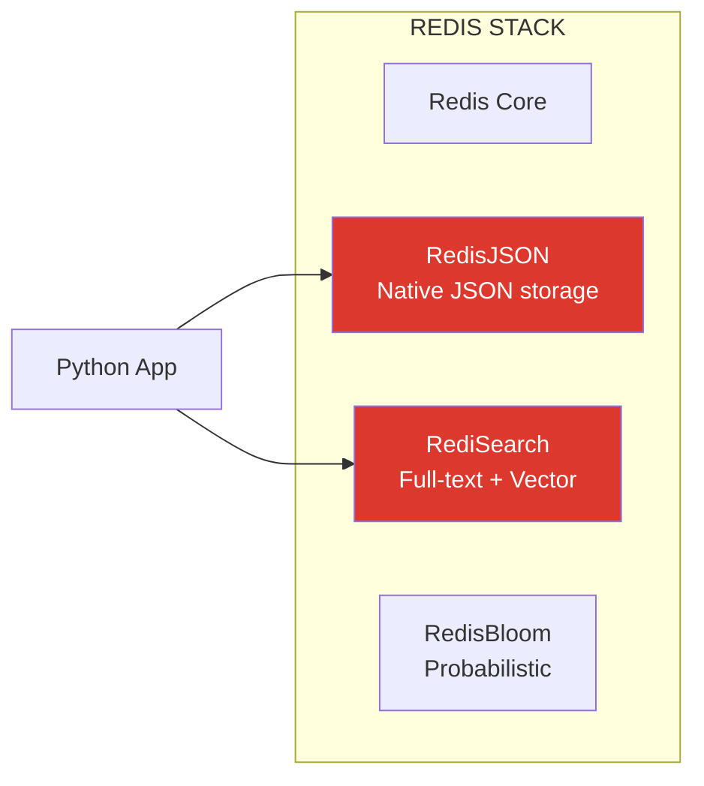
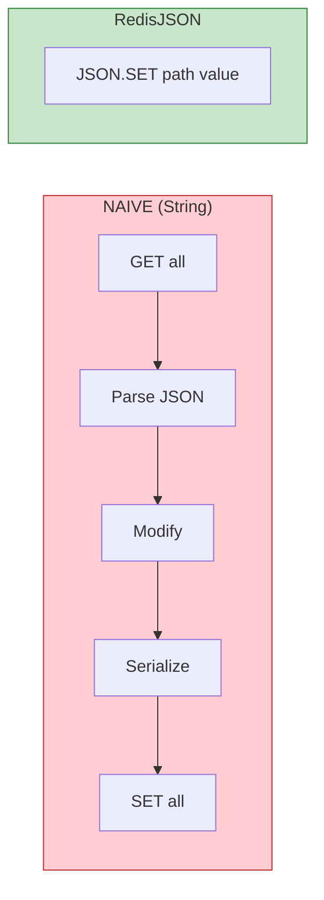
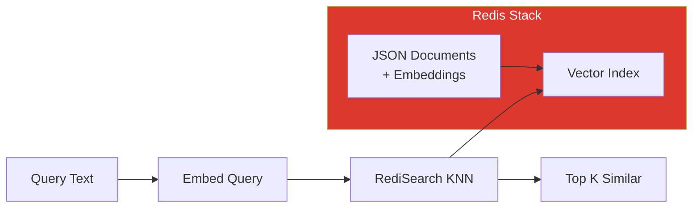

# Lesson 12.13: Redis Stack - JSON and Search for AI

> **Duration**: 35 min | **Section**: D - Advanced Redis

## 🎯 The Problem

Your RAG application needs to store and search structured data:
- Chat sessions with nested message history
- Document metadata with flexible schemas
- Full-text search across cached responses
- Semantic search on embeddings

Plain Redis strings work, but you're constantly serializing/deserializing JSON. And searching? You're pulling everything to Python and filtering there.

> **Scenario**: "Find all chat sessions from the last week where the user asked about 'pricing'." You have 100,000 cached sessions. You load them all, parse JSON, filter by date, search content. It takes 30 seconds. Redis could do this in milliseconds.

## 🧪 Try It: The Naive Approach

```python
import redis
import json

r = redis.Redis()

# Store a chat session
session = {
    "user_id": "user123",
    "messages": [
        {"role": "user", "content": "What's the pricing?"},
        {"role": "assistant", "content": "Our plans start at $10/month"}
    ],
    "created_at": "2024-01-15T10:30:00Z",
    "metadata": {"topic": "pricing", "resolved": True}
}

# Naive: Serialize entire object
r.set("session:abc123", json.dumps(session))

# To update just one field, you must:
# 1. GET the entire object
# 2. Parse JSON
# 3. Modify in Python
# 4. Serialize back
# 5. SET again
data = json.loads(r.get("session:abc123"))
data["metadata"]["resolved"] = False
r.set("session:abc123", json.dumps(data))

# Searching? Load EVERYTHING
def search_sessions(keyword):
    results = []
    for key in r.scan_iter("session:*"):
        data = json.loads(r.get(key))
        for msg in data["messages"]:
            if keyword in msg["content"].lower():
                results.append(data)
                break
    return results  # Scans 100k keys... slowly
```

## 🔍 Under the Hood: Redis Stack



**Redis Stack** bundles Redis with powerful modules:
- **RedisJSON**: Store and manipulate JSON natively
- **RediSearch**: Full-text search, aggregations, and vector similarity
- **RedisBloom**: Bloom filters, count-min sketch

---

## ✅ The Fix: RedisJSON

### Setup Redis Stack

```bash
# Docker (includes all modules)
docker run -d --name redis-stack \
  -p 6379:6379 \
  -p 8001:8001 \
  redis/redis-stack:latest

# Port 8001 = RedisInsight web UI
```

### Store and Query JSON

```python
import redis
from redis.commands.json.path import Path

# Connect to Redis Stack
r = redis.Redis(host="localhost", port=6379, decode_responses=True)

# Store JSON document
session = {
    "user_id": "user123",
    "messages": [
        {"role": "user", "content": "What's the pricing?"},
        {"role": "assistant", "content": "Our plans start at $10/month"}
    ],
    "created_at": "2024-01-15T10:30:00Z",
    "metadata": {
        "topic": "pricing",
        "resolved": True,
        "tokens_used": 150
    }
}

# JSON.SET - store entire document
r.json().set("session:abc123", Path.root_path(), session)

# Get entire document
doc = r.json().get("session:abc123")
print(doc)

# Get specific path (no full fetch!)
user_id = r.json().get("session:abc123", "$.user_id")
# Returns: ['user123']

# Get nested value
topic = r.json().get("session:abc123", "$.metadata.topic")
# Returns: ['pricing']

# Update specific field (atomic, no fetch-modify-set!)
r.json().set("session:abc123", "$.metadata.resolved", False)
r.json().set("session:abc123", "$.metadata.tokens_used", 200)

# Increment a number
r.json().numincrby("session:abc123", "$.metadata.tokens_used", 50)
# Now tokens_used = 250

# Append to array
r.json().arrappend(
    "session:abc123", 
    "$.messages",
    {"role": "user", "content": "Can I get a discount?"}
)

# Get array length
msg_count = r.json().arrlen("session:abc123", "$.messages")
# Returns: [3]
```



---

## 🔍 RediSearch: Full-Text + Vector Search

### Create a Search Index

```python
from redis.commands.search.field import TextField, NumericField, TagField, VectorField
from redis.commands.search.indexDefinition import IndexDefinition, IndexType
from redis.commands.search.query import Query

# Define index schema
schema = [
    TextField("$.user_id", as_name="user_id"),
    TextField("$.messages[*].content", as_name="content"),
    TagField("$.metadata.topic", as_name="topic"),
    NumericField("$.metadata.tokens_used", as_name="tokens_used"),
    TextField("$.created_at", as_name="created_at"),
]

# Create index on JSON documents
r.ft("idx:sessions").create_index(
    schema,
    definition=IndexDefinition(
        prefix=["session:"],
        index_type=IndexType.JSON
    )
)

# Now searching is FAST!
```

### Search Queries

```python
# Full-text search
results = r.ft("idx:sessions").search(
    Query("pricing").return_fields("user_id", "topic")
)
for doc in results.docs:
    print(f"User: {doc.user_id}, Topic: {doc.topic}")

# Filter by tag
results = r.ft("idx:sessions").search(
    Query("@topic:{pricing}")
)

# Numeric range
results = r.ft("idx:sessions").search(
    Query("@tokens_used:[100 500]")  # Between 100 and 500
)

# Combined query
results = r.ft("idx:sessions").search(
    Query("@topic:{pricing} @tokens_used:[0 200]")
    .return_fields("user_id", "content")
    .paging(0, 10)  # Pagination
)

# Aggregations
from redis.commands.search import aggregation

request = aggregation.AggregateRequest("*")\
    .group_by("@topic", 
        aggregation.reducers.count().alias("count"),
        aggregation.reducers.avg("@tokens_used").alias("avg_tokens")
    )\
    .sort_by("@count", asc=False)\
    .limit(0, 10)

results = r.ft("idx:sessions").aggregate(request)
```

---

## 🧠 Vector Search with RediSearch

```python
import numpy as np
from sentence_transformers import SentenceTransformer

# Embedding model
model = SentenceTransformer("all-MiniLM-L6-v2")

# Create vector index
vector_schema = [
    TextField("$.content", as_name="content"),
    VectorField(
        "$.embedding",
        "FLAT",  # or "HNSW" for larger datasets
        {
            "TYPE": "FLOAT32",
            "DIM": 384,  # Model dimension
            "DISTANCE_METRIC": "COSINE"
        },
        as_name="embedding"
    )
]

r.ft("idx:docs").create_index(
    vector_schema,
    definition=IndexDefinition(
        prefix=["doc:"],
        index_type=IndexType.JSON
    )
)

# Store document with embedding
def store_document(doc_id: str, content: str):
    embedding = model.encode(content).tolist()
    r.json().set(f"doc:{doc_id}", Path.root_path(), {
        "content": content,
        "embedding": embedding
    })

store_document("1", "Redis is an in-memory database")
store_document("2", "Python is a programming language")
store_document("3", "Machine learning uses data patterns")

# Vector similarity search
def search_similar(query: str, top_k: int = 5):
    query_embedding = model.encode(query).astype(np.float32).tobytes()
    
    q = Query(f"*=>[KNN {top_k} @embedding $vec AS score]")\
        .return_fields("content", "score")\
        .sort_by("score")\
        .dialect(2)
    
    results = r.ft("idx:docs").search(
        q, 
        query_params={"vec": query_embedding}
    )
    
    return [(doc.content, float(doc.score)) for doc in results.docs]

# Search!
results = search_similar("database technology")
for content, score in results:
    print(f"{score:.3f}: {content}")
# 0.234: Redis is an in-memory database
# 0.567: Python is a programming language
# 0.789: Machine learning uses data patterns
```



---

## 🚀 Hybrid Search (Text + Vector)

```python
# Combine full-text and vector search
def hybrid_search(query: str, topic: str = None, top_k: int = 5):
    query_embedding = model.encode(query).astype(np.float32).tobytes()
    
    # Build filter
    filter_query = f"@topic:{{{topic}}}" if topic else "*"
    
    q = Query(
        f"({filter_query})=>[KNN {top_k} @embedding $vec AS score]"
    )\
        .return_fields("content", "topic", "score")\
        .sort_by("score")\
        .dialect(2)
    
    return r.ft("idx:docs").search(q, query_params={"vec": query_embedding})

# Search in specific topic
results = hybrid_search("how to cache data", topic="redis")
```

---

## 🎯 Practice

1. **Start Redis Stack** with Docker
2. **Store JSON documents** with nested structure
3. **Update specific paths** without fetching entire document
4. **Create a search index** on your documents
5. **Perform full-text search** with filters
6. **Add vector embeddings** and do similarity search

```python
# Quick start script
import redis
from redis.commands.json.path import Path

r = redis.Redis(decode_responses=True)

# Store
r.json().set("test:1", Path.root_path(), {
    "title": "Redis Guide",
    "tags": ["database", "cache"],
    "views": 100
})

# Query path
print(r.json().get("test:1", "$.title"))

# Update
r.json().numincrby("test:1", "$.views", 1)

# Verify
print(r.json().get("test:1"))
```

## 🔑 Key Takeaways

- **RedisJSON** = native JSON storage, path-based updates
- **No more serialize/deserialize** = atomic field updates
- **RediSearch** = full-text, filters, aggregations, vectors
- **Vector search in Redis** = perfect for caching RAG embeddings
- **Hybrid search** = combine text filters with vector similarity
- **Redis Stack** = one container, all modules included

## ❓ Common Questions

| Question | Answer |
|----------|--------|
| JSON.GET vs GET? | JSON.GET supports JSONPath, GET returns raw string |
| FLAT vs HNSW index? | FLAT = exact, small data. HNSW = approximate, large data |
| Can I migrate from plain Redis? | Yes, store JSON with JSON.SET, build index after |
| Cost of indexes? | Memory overhead ~20-50%, but search is O(log n) |

## 🔗 Further Reading

- [RedisJSON Documentation](https://redis.io/docs/stack/json/)
- [RediSearch Documentation](https://redis.io/docs/stack/search/)
- [Vector Similarity Search](https://redis.io/docs/stack/search/reference/vectors/)
- [Redis Stack Docker](https://hub.docker.com/r/redis/redis-stack)
- [redis-py JSON Commands](https://redis-py.readthedocs.io/en/stable/commands.html#json-commands)

---

**Previous**: [Lesson 12 - Docker Optimization](Lesson-12-Docker-Optimization.md) | **Up**: [Module 12 README](README.md)
