# Module 12: Redis & Caching

> **Duration**: 1 Week | **Lessons**: 12

## 🎯 Module Overview

Your RAG app works, but it's slow and expensive. User asks the same question 3 times - each time: 2 seconds to embed, 500ms to search vectors, 3 seconds for LLM. Same answer, $0.03 wasted per repeat. This module teaches you to add a speed layer that makes your app 10x faster and cuts costs dramatically.

## 🧠 Mental Model

```mermaid
flowchart LR
    subgraph Without["❌ WITHOUT CACHE"]
        R1["Request"] --> DB1["Database"]
        DB1 --> LLM1["LLM API"]
        LLM1 --> RES1["Response<br/>3-5 seconds"]
    end
    
    subgraph With["✅ WITH CACHE"]
        R2["Request"] --> CHECK{"Cache?"}
        CHECK -->|"HIT"| FAST["Response<br/>5ms! 🚀"]
        CHECK -->|"MISS"| DB2["Database"]
        DB2 --> LLM2["LLM API"]
        LLM2 --> STORE["Store in Cache"]
        STORE --> RES2["Response"]
    end
    
    style Without fill:#FFEBEE,stroke:#C62828
    style With fill:#E8F5E9,stroke:#2E7D32
    style FAST fill:#4CAF50,color:#fff
```

**The Key Insight**: Redis is a giant Python dictionary that persists across requests, servers, and restarts. It sits between your app and your database/LLM as a speed layer.

## 📋 Prerequisites

- FastAPI basics (Module 6)
- Docker (Module 5)
- Basic understanding of key-value stores
- Python async/await

## 🗂️ Module Structure

| Section | Lessons | Focus |
|---------|:-------:|-------|
| A: What IS Redis? | 12.0 - 12.5 | Redis fundamentals, data structures, Python integration |
| B: Caching Patterns | 12.6 - 12.11 | Cache-aside, TTL, invalidation, RAG caching |

## 📚 Lessons

### Section A: What IS Redis?

| # | Lesson | Duration | What We're Solving |
|:-:|--------|:--------:|-------------------|
| 12.0 | The Speed Problem | 10 min | Why repeated requests waste time and money |
| 12.1 | Redis Under the Hood | 25 min | In-memory key-value store fundamentals |
| 12.2 | Redis vs PostgreSQL | 20 min | When to use cache vs database |
| 12.3 | Data Structures | 30 min | Strings, hashes, lists, sets, sorted sets |
| 12.4 | Python + Redis | 25 min | redis-py, connection pooling, async Redis |
| 12.5 | Redis Basics Q&A | 10 min | "What if Redis dies?" "Memory limits?" |

### Section B: Caching Patterns

| # | Lesson | Duration | What We're Solving |
|:-:|--------|:--------:|-------------------|
| 12.6 | Cache-Aside Pattern | 30 min | Check cache → miss → compute → store → return |
| 12.7 | TTL Strategies | 25 min | When to expire cached data |
| 12.8 | Cache Invalidation | 25 min | When and how to delete cache entries |
| 12.9 | RAG Caching | 35 min | Cache embeddings, LLM responses, query hash |
| 12.10 | Caching Q&A | 10 min | "Cache hit ratio?" "When NOT to cache?" |
| 12.11 | Module 12 Review | 15 min | Redis mental model recap |

## 🎯 Module Project

**Speed Up Your RAG App 10x**:
- Add Redis caching layer
- Cache query embeddings (save embedding API calls)
- Cache retrieved context (save vector DB queries)
- Cache LLM responses (save LLM API calls + cost)
- Measure and compare latency before/after

## ✅ Independence Check

| Level | Question |
|-------|----------|
| **Know** | What is Redis and how is it different from PostgreSQL? |
| **Understand** | Why does caching improve both speed AND cost? |
| **Apply** | Can you implement cache-aside pattern in FastAPI? |
| **Analyze** | When should you NOT cache something? |
| **Create** | Can you design a cache invalidation strategy for your RAG app? |

## 🔗 External References

- [Redis Documentation](https://redis.io/docs/)
- [redis-py Documentation](https://redis-py.readthedocs.io/)
- [Redis Data Types](https://redis.io/docs/data-types/)
- [Caching Best Practices](https://aws.amazon.com/caching/best-practices/)
- [Redis University (Free Courses)](https://university.redis.com/)

---

**Next**: [Module 13: Celery & Background Tasks](../Module-13-Celery/README.md)
