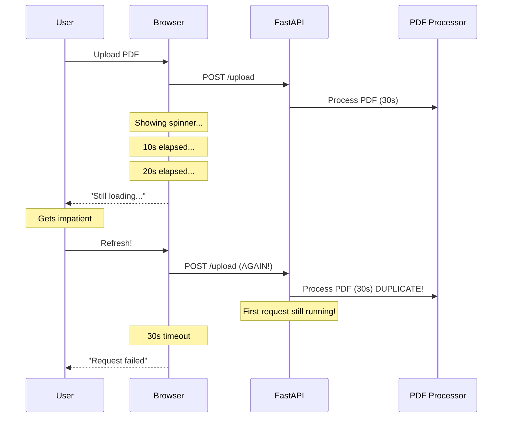
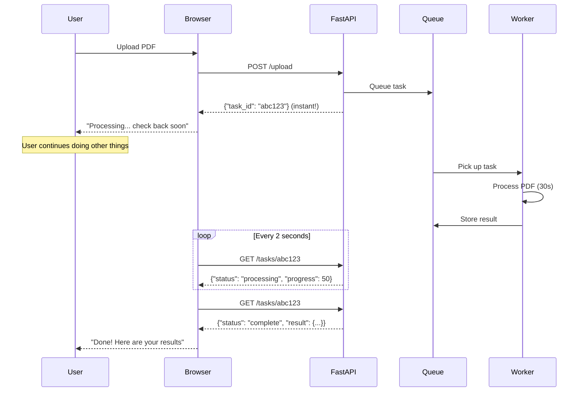
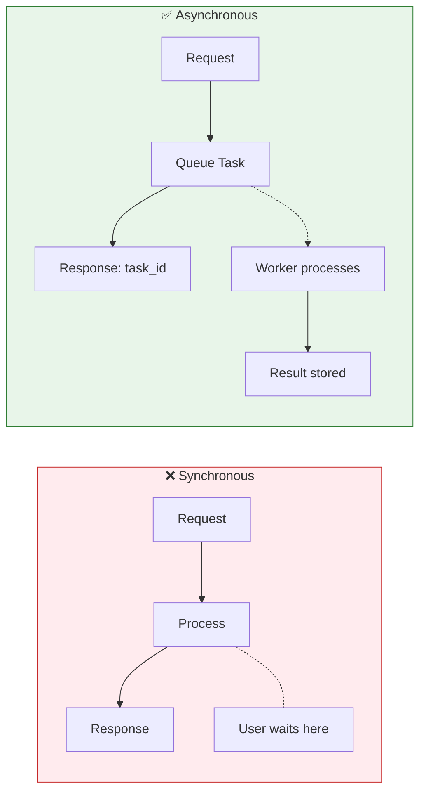

# Lesson 13.0: The Waiting Problem

> **Duration**: 10 min | **Section**: A - Task Queue Under the Hood

## 🎯 The Problem

You built an amazing RAG application. Users can upload documents and ask questions.

Then a user uploads a 200-page PDF.

```
User: [Uploads file]
Browser: "Loading..."
30 seconds pass...
User: "Is it broken?"
User: [Refreshes page]
System: [Starts processing AGAIN]
User: [Leaves]
```

**This happens every day in production systems.**

## 🔍 Under the Hood: Why Long Requests Fail



### The Numbers That Kill UX

| Operation | Typical Time | User Tolerance |
|-----------|-------------:|:--------------:|
| API call | 100ms | ✅ |
| Database query | 50ms | ✅ |
| LLM generation | 2s | 😬 |
| Document parsing | 10-30s | ❌ |
| Video transcription | 1-5 min | ❌❌ |
| Bulk data import | 5-30 min | ❌❌❌ |

**Browser default timeout**: 30 seconds  
**Mobile timeout**: Often 10 seconds  
**User patience**: About 3 seconds

## 🤔 Naive Approach: Just Make It Faster?

```python
# "I'll optimize the PDF processing!"
@app.post("/upload")
async def upload_document(file: UploadFile):
    content = await file.read()
    
    # Still takes 30 seconds no matter what...
    text = extract_text_from_pdf(content)  # 10s
    chunks = chunk_text(text)               # 2s
    embeddings = get_embeddings(chunks)     # 15s
    store_in_vectordb(embeddings)           # 3s
    
    return {"message": "Done!"}  # User never sees this
```

**Reality check**: Some operations are fundamentally slow:
- Calling external APIs (LLM, embeddings)
- Processing large files
- Network I/O to multiple services
- CPU-intensive transformations

**You can't optimize waiting for a third-party API.**

## 🔍 The Real Solution: Don't Make Them Wait

What if the workflow was:



### The Key Insight

> **Instant response ≠ Instant completion**

The user gets an immediate response: "We received your request."  
The actual work happens **in the background**.

## 🔍 Real-World Examples

This pattern is **everywhere**:

| Service | What You See | What Happens Behind |
|---------|--------------|---------------------|
| **Uber** | "Finding driver..." | Background matching algorithm |
| **YouTube** | "Upload complete!" | Video processing for hours |
| **Gmail** | "Email sent!" | Actual delivery takes seconds |
| **Amazon** | "Order placed!" | Fulfillment takes days |
| **Slack** | "Message sent" | Delivery, indexing, notifications |

**None of these make you wait for the actual work to complete.**

## 🔍 The Architecture Change



## 💡 What This Means for RAG

In your RAG application:

| Operation | Sync OK? | Why |
|-----------|:--------:|-----|
| Simple question | ✅ | 2-3s is acceptable |
| Document upload | ❌ | Could take minutes |
| Bulk embedding | ❌ | Rate limits, slow |
| Daily reindexing | ❌ | Could take hours |
| Export to PDF | ❌ | Generation takes time |

## 🔑 Key Takeaways

1. **Some operations are inherently slow** - you can't always optimize
2. **Users hate waiting** - 3 seconds is the threshold
3. **Instant response ≠ Instant completion**
4. **Background processing** is the solution
5. **Task queues** enable this pattern

## ❓ Questions to Consider

Before moving on, think about:

1. What operations in YOUR application take more than 3 seconds?
2. What would users see if those operations happened in the background?
3. How would you tell users when background work is done?

---

**Next**: 13.1 - Sync vs Async (The mental model)
