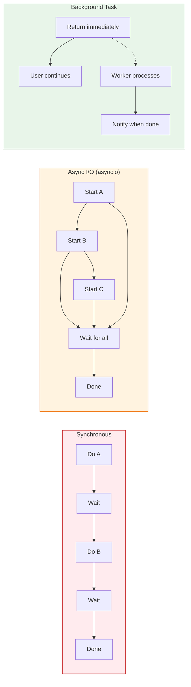
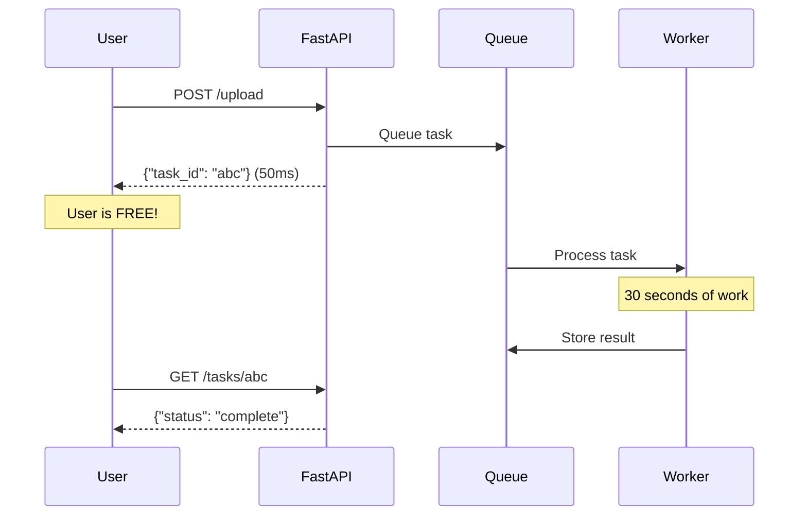

# Lesson 13.1: Sync vs Async

> **Duration**: 20 min | **Section**: A - Task Queue Under the Hood

## 🎯 The Problem

You see these terms everywhere:
- "Synchronous"
- "Asynchronous"  
- "async/await"
- "Background tasks"

But what do they actually mean for your code?

## 🔍 Under the Hood: Synchronous Execution

**Synchronous** = Do one thing, wait for it to finish, then do the next thing.

```python
# Synchronous code
def process_documents(files: list[str]):
    results = []
    for file in files:
        text = extract_text(file)      # Wait 10s
        chunks = chunk_text(text)       # Wait 1s
        embeds = get_embeddings(chunks) # Wait 5s
        results.append(embeds)
    return results

# 3 files × 16s = 48 seconds total
# User waits ALL 48 seconds
```



```mermaid
gantt
    title Synchronous Processing (3 files)
    dateFormat ss
    axisFormat %S
    section File 1
        Extract: f1e, 00, 10s
        Chunk: f1c, after f1e, 1s
        Embed: f1m, after f1c, 5s
    section File 2
        Extract: f2e, after f1m, 10s
        Chunk: f2c, after f2e, 1s
        Embed: f2m, after f2c, 5s
    section File 3
        Extract: f3e, after f2m, 10s
        Chunk: f3c, after f3e, 1s
        Embed: f3m, after f3c, 5s
```

**Everything runs sequentially. Total time = sum of all operations.**

## 🔍 Under the Hood: Python's async/await

Python's `async/await` helps with I/O-bound operations:

```python
import asyncio

async def process_documents_async(files: list[str]):
    tasks = [process_single(f) for f in files]
    results = await asyncio.gather(*tasks)
    return results

async def process_single(file: str):
    text = await extract_text_async(file)      # Non-blocking I/O
    chunks = await chunk_text_async(text)
    embeds = await get_embeddings_async(chunks)
    return embeds

# 3 files processed "concurrently"
# BUT still within the same request
```



```mermaid
gantt
    title Async I/O (3 files concurrent)
    dateFormat ss
    axisFormat %S
    section File 1
        Extract: f1e, 00, 10s
        Chunk: f1c, after f1e, 1s
        Embed: f1m, after f1c, 5s
    section File 2
        Extract: f2e, 00, 10s
        Chunk: f2c, after f2e, 1s
        Embed: f2m, after f2c, 5s
    section File 3
        Extract: f3e, 00, 10s
        Chunk: f3c, after f3e, 1s
        Embed: f3m, after f3c, 5s
```

**Better!** Files process concurrently. Total time ≈ 16 seconds.

**But the user STILL waits 16 seconds for the HTTP response.**

## 🔍 The Key Distinction



| Pattern | User Waits? | When to Use |
|---------|:-----------:|-------------|
| **Synchronous** | Yes (full time) | Simple, fast operations |
| **Async I/O** | Yes (reduced time) | Multiple I/O operations |
| **Background** | No! | Slow operations |

## 🔍 When async/await Is NOT Enough

```python
# This looks async but STILL blocks the user
@app.post("/upload")
async def upload_document(file: UploadFile):
    content = await file.read()
    
    # These are async, but user waits for ALL of them
    text = await extract_text_async(content)    # 10s
    chunks = await chunk_text_async(text)        # 2s
    embeds = await get_embeddings_async(chunks)  # 15s
    await store_in_vectordb(embeds)              # 3s
    
    # User waited 30 seconds!
    return {"message": "Done!"}
```

**The request is still open. The user is still waiting.**

`async/await` doesn't mean "run in background" - it means "don't block OTHER requests while waiting for I/O."

## 🔍 What We Actually Need

```python
@app.post("/upload")
async def upload_document(file: UploadFile):
    content = await file.read()
    
    # Queue the work - instant!
    task_id = queue_background_task(process_document, content)
    
    # Return immediately - user doesn't wait!
    return {
        "task_id": task_id,
        "status_url": f"/tasks/{task_id}"
    }

# This runs SEPARATELY from the web request
def process_document(content: bytes):
    text = extract_text(content)         # 10s - no user waiting
    chunks = chunk_text(text)            # 2s
    embeds = get_embeddings(chunks)      # 15s
    store_in_vectordb(embeds)            # 3s
    return {"chunks": len(chunks)}
```



## 🔍 Comparison Table

| Aspect | Sync | Async I/O | Background |
|--------|:----:|:---------:|:----------:|
| User waits | ✅ Full time | ✅ Reduced | ❌ No wait |
| Code complexity | Simple | Medium | Higher |
| Separate process | No | No | Yes |
| Can survive restart | No | No | Yes (with broker) |
| Scalable | No | Somewhat | Yes |
| Use case | Fast ops | I/O-bound | Long-running |

## 💡 Real-World Analogy

### Restaurant Ordering

**Synchronous (fast food counter)**:
- You order → Wait at counter → Get food → Leave
- One customer at a time blocks the line

**Async I/O (restaurant with buzzer)**:
- You order → Get buzzer → Sit down
- Kitchen works on multiple orders
- Buzzer goes off → Get food
- **You're still IN the restaurant waiting**

**Background Task (delivery app)**:
- You order → Get confirmation → Go home
- Restaurant prepares whenever
- Delivery arrives when ready
- **You're not waiting at all**

## 🎯 Practice

Categorize these operations:

| Operation | Sync OK? | Async I/O? | Background? |
|-----------|:--------:|:----------:|:-----------:|
| Simple DB query (50ms) | ? | ? | ? |
| LLM generation (3s) | ? | ? | ? |
| PDF processing (30s) | ? | ? | ? |
| Daily batch job | ? | ? | ? |
| Health check | ? | ? | ? |

<details>
<summary>Answers</summary>

| Operation | Sync OK? | Async I/O? | Background? |
|-----------|:--------:|:----------:|:-----------:|
| Simple DB query (50ms) | ✅ | ✅ | Overkill |
| LLM generation (3s) | Maybe | ✅ | For batch |
| PDF processing (30s) | ❌ | Not enough | ✅ |
| Daily batch job | ❌ | ❌ | ✅ |
| Health check | ✅ | ✅ | Overkill |

</details>

## 🔑 Key Takeaways

1. **Synchronous** = Wait for each step sequentially
2. **Async I/O (asyncio)** = Overlap I/O operations, but still within request
3. **Background tasks** = Return immediately, process separately
4. `async/await` doesn't mean "background" - it means "non-blocking I/O"
5. For truly long operations, you need **task queues**

## ❓ Common Questions

| Question | Answer |
|----------|--------|
| Why not just use `asyncio.create_task()`? | Doesn't survive server restart. No visibility. No retries. |
| What if the background worker crashes? | With a broker (Redis), tasks are requeued. |
| How does the user know it's done? | Polling, webhooks, or WebSockets. |

---

**Next**: 13.2 - Task Queue Architecture
