# Lesson 13.2: Task Queue Architecture

> **Duration**: 25 min | **Section**: A - Task Queue Under the Hood

## 🎯 The Problem

You understand WHY background processing is needed.

But HOW do you:
- Send work from your API to a background worker?
- Ensure work isn't lost if something crashes?
- Scale to many workers?
- Track task status?

## 🔍 Under the Hood: The Three Components

Every task queue has three parts:


| Component | Role | Example |
|-----------|------|---------|
| **Producer** | Creates tasks, sends to broker | FastAPI endpoint |
| **Broker** | Stores tasks, delivers to workers | Redis, RabbitMQ |
| **Worker** | Picks up tasks, executes them | Celery worker |

## 🔍 Deep Dive: The Producer

The producer is your application code that **creates** tasks:

```python
# Producer code (in FastAPI)
from tasks import process_document

@app.post("/upload")
async def upload(file: UploadFile):
    content = await file.read()
    
    # This PRODUCES a task
    task = process_document.delay(content)
    
    return {"task_id": task.id}
```

**What happens when you call `.delay()`?**

1. Serialize the function name and arguments
2. Create a unique task ID
3. Send message to the broker
4. Return immediately with task ID

```python
# What .delay() actually does (simplified)
def delay(self, *args, **kwargs):
    message = {
        "task": "tasks.process_document",
        "id": str(uuid.uuid4()),
        "args": args,
        "kwargs": kwargs
    }
    broker.send("celery", json.dumps(message))
    return AsyncResult(message["id"])
```

## 🔍 Deep Dive: The Broker

The broker is the **message queue** between producers and workers.


**Why Redis works great as a broker:**

| Feature | How Redis Helps |
|---------|-----------------|
| Lists | FIFO queue with `LPUSH`/`BRPOP` |
| Persistence | Optional AOF for durability |
| Speed | In-memory = fast |
| Blocking | `BRPOP` waits efficiently |
| You know it! | Already learned in Module 12 |

### Redis Commands for Task Queue

```redis
# Producer adds task to end of queue
LPUSH celery '{"task": "process_doc", "args": ["file.pdf"]}'

# Worker blocks waiting for task, pops from front
BRPOP celery 0  # 0 = wait forever
# Returns: '{"task": "process_doc", "args": ["file.pdf"]}'
```

## 🔍 Deep Dive: The Workers

Workers are **separate processes** that:
1. Wait for tasks from the broker
2. Execute the task function
3. Store results (optional)


```python
# Worker code (tasks.py)
from celery import Celery

app = Celery("tasks", broker="redis://localhost:6379/0")

@app.task
def process_document(content: bytes):
    """This runs in a WORKER PROCESS, not in FastAPI."""
    text = extract_text(content)
    chunks = chunk_text(text)
    embeddings = get_embeddings(chunks)
    return {"chunk_count": len(chunks)}
```

**Starting a worker:**
```bash
celery -A tasks worker --loglevel=info
```

## 🔍 The Complete Flow


## 🔍 Why This Architecture?

### Decoupling

```mermaid
flowchart LR
    subgraph Coupled["❌ Coupled"]
        A1["API"] --> P1["Process"]
        A1 --> |"blocks"| A1
    end
    
    subgraph Decoupled["✅ Decoupled"]
        A2["API"]
        B2["Broker"]
        W2["Worker"]
        A2 --> B2
        B2 --> W2
        A2 -.- |"independent"| W2
    end
    
    style Coupled fill:#FFEBEE,stroke:#C62828
    style Decoupled fill:#E8F5E9,stroke:#2E7D32
```



| Benefit | Without Queue | With Queue |
|---------|--------------|------------|
| API crash | Task lost | Task safe in broker |
| Worker crash | API blocks forever | Task requeued |
| Scale processing | Add more API pods | Add more workers |
| Retry failed tasks | Implement yourself | Built-in |
| Monitor tasks | ??? | Flower dashboard |

### Scalability


**Need more processing power?** Just start more workers. No code changes.

### Reliability


## 🔍 Broker Options

| Broker | Pros | Cons |
|--------|------|------|
| **Redis** | Fast, you know it, result storage | Less durable by default |
| **RabbitMQ** | AMQP standard, durable | More complex setup |
| **Amazon SQS** | Managed, serverless | AWS only, higher latency |

**For this course**: Redis. You already know it from Module 12!

## 🎯 Practice

Draw the architecture for this scenario:

> Users upload CSVs. Each row becomes a vector embedding. Store in database.

Questions:
1. What's the producer?
2. What's the broker?
3. What does the worker do?
4. How does the user know it's done?

<details>
<summary>Solution</summary>


1. **Producer**: FastAPI `/upload` endpoint
2. **Broker**: Redis with Celery queue
3. **Worker**: Loops through CSV rows, creates embeddings, inserts to DB
4. **Notification**: User polls `/tasks/{id}` or receives webhook

</details>

## 🔑 Key Takeaways

1. **Producer** creates tasks (your API)
2. **Broker** stores and delivers tasks (Redis)
3. **Worker** executes tasks (Celery)
4. Tasks survive crashes because broker persists them
5. Scale by adding workers, not changing code
6. Decoupling = reliability + scalability

## ❓ Common Questions

| Question | Answer |
|----------|--------|
| Can I use the same Redis for caching AND broker? | Yes! Use different databases (0 vs 1) |
| How many workers do I need? | Start with 2-4, scale based on queue length |
| What if broker crashes? | Enable Redis persistence (AOF) |
| What about priority tasks? | Celery supports priority queues |

---

**Next**: 13.3 - Celery Setup
