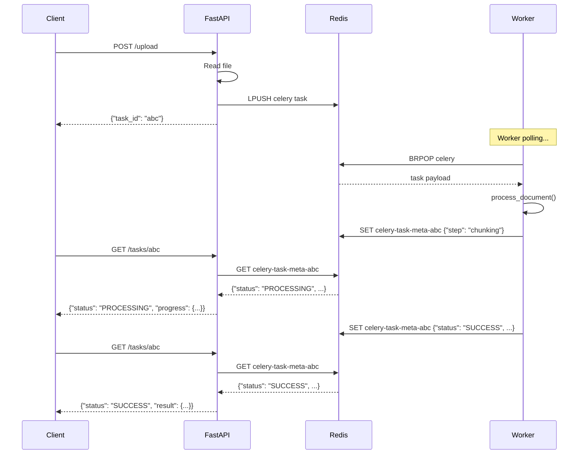

# Lesson 13.3: Celery Setup

> **Duration**: 30 min | **Section**: A - Task Queue Under the Hood

## 🎯 The Problem

You understand the architecture. Now you need to:
1. Install Celery
2. Configure Redis as broker
3. Create your first task
4. Start workers

Let's build.

## 🔍 Step 1: Project Structure

```
my-rag-app/
├── app/
│   ├── __init__.py
│   ├── main.py          # FastAPI app
│   └── api/
│       └── routes.py    # API endpoints
├── workers/
│   ├── __init__.py
│   ├── celery_app.py    # Celery configuration
│   └── tasks.py         # Task definitions
├── docker-compose.yml
└── requirements.txt
```

## 🔍 Step 2: Install Dependencies

```bash
pip install celery[redis]
```

Or in `requirements.txt`:
```
celery[redis]==5.3.6
redis==5.0.1
fastapi==0.109.0
uvicorn==0.27.0
```

**What's `celery[redis]`?**

The `[redis]` is an "extra" that installs Redis dependencies:
- `redis` - Python Redis client
- `kombu` - Celery's messaging library

## 🔍 Step 3: Configure Celery

```python
# workers/celery_app.py
from celery import Celery

# Create Celery app
celery_app = Celery(
    "rag_tasks",                           # App name
    broker="redis://localhost:6379/0",     # Message broker
    backend="redis://localhost:6379/1",    # Result storage
)

# Configuration
celery_app.conf.update(
    # Task settings
    task_serializer="json",                # How to serialize tasks
    accept_content=["json"],               # What content types to accept
    result_serializer="json",              # How to serialize results
    
    # Timezone
    timezone="UTC",
    enable_utc=True,
    
    # Task execution
    task_track_started=True,               # Track when task starts
    task_time_limit=300,                   # 5 min max per task
    
    # Result backend
    result_expires=3600,                   # Results expire after 1 hour
)

# Auto-discover tasks in this package
celery_app.autodiscover_tasks(["workers"])
```

**Key configuration explained:**

| Setting | Value | Why |
|---------|-------|-----|
| `broker` | Redis DB 0 | Where tasks are queued |
| `backend` | Redis DB 1 | Where results are stored |
| `task_serializer` | json | Tasks as JSON (readable, safe) |
| `task_track_started` | True | Know when task begins |
| `task_time_limit` | 300 | Kill tasks running too long |
| `result_expires` | 3600 | Auto-cleanup old results |

## 🔍 Step 4: Define Tasks

```python
# workers/tasks.py
from workers.celery_app import celery_app
import time

@celery_app.task(bind=True)
def process_document(self, file_content: str, filename: str) -> dict:
    """
    Process a document for RAG pipeline.
    
    Args:
        self: Task instance (for accessing task.id, etc.)
        file_content: Base64 encoded file content
        filename: Original filename
        
    Returns:
        Processing result dictionary
    """
    # Update task state
    self.update_state(state="PROCESSING", meta={"step": "extracting"})
    
    # Simulate text extraction (real: use pypdf, docx, etc.)
    time.sleep(5)
    text = f"Extracted text from {filename}"
    
    # Update progress
    self.update_state(state="PROCESSING", meta={"step": "chunking"})
    time.sleep(2)
    chunks = [text[i:i+100] for i in range(0, len(text), 100)]
    
    # Simulate embedding
    self.update_state(state="PROCESSING", meta={"step": "embedding"})
    time.sleep(3)
    
    return {
        "filename": filename,
        "chunk_count": len(chunks),
        "status": "indexed"
    }


@celery_app.task
def simple_add(x: int, y: int) -> int:
    """Simple task for testing."""
    return x + y
```

**Understanding `bind=True`:**

```python
@celery_app.task(bind=True)  # bind=True gives access to 'self'
def my_task(self, arg1, arg2):
    print(self.request.id)    # Access task ID
    self.update_state(...)    # Update task state
    self.retry(...)           # Retry on failure
```

## 🔍 Step 5: Docker Compose Setup

```yaml
# docker-compose.yml
version: "3.8"

services:
  redis:
    image: redis:7-alpine
    ports:
      - "6379:6379"
    volumes:
      - redis_data:/data
    command: redis-server --appendonly yes

  api:
    build: .
    ports:
      - "8000:8000"
    environment:
      - CELERY_BROKER_URL=redis://redis:6379/0
      - CELERY_RESULT_BACKEND=redis://redis:6379/1
    depends_on:
      - redis

  celery-worker:
    build: .
    command: celery -A workers.celery_app worker --loglevel=info
    environment:
      - CELERY_BROKER_URL=redis://redis:6379/0
      - CELERY_RESULT_BACKEND=redis://redis:6379/1
    depends_on:
      - redis

volumes:
  redis_data:
```

## 🔍 Step 6: FastAPI Integration

```python
# app/main.py
from fastapi import FastAPI, UploadFile, HTTPException
from celery.result import AsyncResult
from workers.tasks import process_document
import base64

app = FastAPI()

@app.post("/documents/upload")
async def upload_document(file: UploadFile):
    """Upload document for background processing."""
    
    # Read file content
    content = await file.read()
    content_b64 = base64.b64encode(content).decode()
    
    # Queue background task
    task = process_document.delay(content_b64, file.filename)
    
    return {
        "task_id": task.id,
        "status": "queued",
        "status_url": f"/tasks/{task.id}"
    }


@app.get("/tasks/{task_id}")
async def get_task_status(task_id: str):
    """Check status of a background task."""
    
    result = AsyncResult(task_id)
    
    response = {
        "task_id": task_id,
        "status": result.status,
    }
    
    if result.status == "PROCESSING":
        response["progress"] = result.info
    elif result.status == "SUCCESS":
        response["result"] = result.result
    elif result.status == "FAILURE":
        response["error"] = str(result.result)
    
    return response
```

## 🔍 Step 7: Running Everything

### Terminal 1: Start Redis
```bash
docker-compose up redis
```

### Terminal 2: Start Celery Worker
```bash
celery -A workers.celery_app worker --loglevel=info

# Output:
# [2024-01-15 10:00:00,000: INFO/MainProcess] Connected to redis://localhost:6379/0
# [2024-01-15 10:00:00,001: INFO/MainProcess] celery@hostname ready.
```

### Terminal 3: Start FastAPI
```bash
uvicorn app.main:app --reload

# Output:
# INFO:     Uvicorn running on http://127.0.0.1:8000
```

### Terminal 4: Test It
```bash
# Upload a document
curl -X POST "http://localhost:8000/documents/upload" \
  -F "file=@test.pdf"

# Response:
# {"task_id": "abc123", "status": "queued", "status_url": "/tasks/abc123"}

# Check status
curl "http://localhost:8000/tasks/abc123"

# Response (while processing):
# {"task_id": "abc123", "status": "PROCESSING", "progress": {"step": "chunking"}}

# Response (when done):
# {"task_id": "abc123", "status": "SUCCESS", "result": {"chunk_count": 42}}
```

## 🔍 Under the Hood: What Happens



## 🔍 Environment-Based Configuration

```python
# workers/celery_app.py
import os

BROKER_URL = os.getenv("CELERY_BROKER_URL", "redis://localhost:6379/0")
BACKEND_URL = os.getenv("CELERY_RESULT_BACKEND", "redis://localhost:6379/1")

celery_app = Celery(
    "rag_tasks",
    broker=BROKER_URL,
    backend=BACKEND_URL,
)
```

```bash
# Development
export CELERY_BROKER_URL=redis://localhost:6379/0

# Production
export CELERY_BROKER_URL=redis://prod-redis:6379/0
```

## 🎯 Practice

Create a task that:
1. Accepts a URL
2. Simulates fetching content (sleep 3s)
3. Returns word count

```python
# Your code here
@celery_app.task(bind=True)
def fetch_and_count(self, url: str) -> dict:
    # 1. Update state to "FETCHING"
    # 2. Sleep 3 seconds (simulate HTTP request)
    # 3. Return {"url": url, "word_count": 42}
    pass
```

<details>
<summary>Solution</summary>

```python
@celery_app.task(bind=True)
def fetch_and_count(self, url: str) -> dict:
    import time
    
    self.update_state(state="FETCHING", meta={"url": url})
    time.sleep(3)  # Simulate HTTP request
    
    # In real code: content = requests.get(url).text
    content = "This is simulated content from the URL"
    word_count = len(content.split())
    
    return {
        "url": url,
        "word_count": word_count,
        "status": "fetched"
    }
```

</details>

## 🔑 Key Takeaways

1. **Celery app** = Configuration + task registry
2. **Broker** = Redis DB 0 (messages)
3. **Backend** = Redis DB 1 (results)
4. **`@app.task`** = Register function as task
5. **`bind=True`** = Access to `self` (task instance)
6. **`.delay()`** = Queue task immediately
7. **`AsyncResult`** = Check task status

## ❓ Common Questions

| Question | Answer |
|----------|--------|
| Why separate Redis databases? | Isolation. Clear which data is what. |
| Can I run multiple workers? | Yes! `celery -A app worker --concurrency=4` |
| How to run tasks immediately (for testing)? | `task.apply()` instead of `.delay()` |
| What if Redis is down? | Tasks will fail. Use connection retry config. |

---

**Next**: 13.4 - Queue Basics Q&A
