# Lesson 13.4: Queue Basics Q&A

> **Duration**: 10 min | **Section**: A - Task Queue Recap

## 🔍 Section A: What We Learned


### Core Concepts Summary

| Lesson | Key Concept |
|--------|-------------|
| 13.0 | Users won't wait 30s. Return instantly, process later. |
| 13.1 | async/await ≠ background. Task queues = true background. |
| 13.2 | Producer → Broker → Worker architecture |
| 13.3 | Celery + Redis = production task queue |

## ❓ Frequently Asked Questions

### Architecture Questions

**Q: What if the worker crashes mid-task?**

Celery has **task acknowledgment**:

```mermaid
sequenceDiagram
    participant B as Broker
    participant W as Worker
    
    B->>W: Here's a task
    W->>W: Processing...
    Note over W: 💥 CRASH!
    
    Note over B: No ACK received
    Note over B: Task still in queue
    
    W->>B: (Worker restarts) Give me work
    B->>W: Same task again
    W->>W: Process successfully
    W->>B: ACK - task done
    B->>B: Remove from queue
```



By default, tasks are re-queued if the worker dies before completing.

Configure acknowledgment behavior:
```python
@celery_app.task(acks_late=True)  # ACK after task completes
def my_task():
    pass
```

---

**Q: Can I run multiple workers?**

Yes! Each worker picks up different tasks:

```bash
# Terminal 1
celery -A workers.celery_app worker --loglevel=info -n worker1

# Terminal 2
celery -A workers.celery_app worker --loglevel=info -n worker2

# Terminal 3
celery -A workers.celery_app worker --loglevel=info -n worker3
```


Tasks are distributed automatically. No code changes needed.

---

**Q: What's the difference between Redis for caching vs Redis as broker?**

| Aspect | Cache (Module 12) | Broker (Module 13) |
|--------|-------------------|-------------------|
| Purpose | Store computed results | Queue task messages |
| Pattern | GET/SET | LPUSH/BRPOP |
| Expiry | TTL-based | After task consumed |
| Data | Any serializable | Task payloads |
| Operations | Key-value lookups | FIFO queue ops |

**Best practice**: Use different Redis databases:
- DB 0: Caching
- DB 1: Celery broker
- DB 2: Celery results

```python
# Separate concerns
CACHE_REDIS = "redis://localhost:6379/0"
BROKER_REDIS = "redis://localhost:6379/1"
RESULT_REDIS = "redis://localhost:6379/2"
```

---

### Practical Questions

**Q: How do I know which tasks are queued?**

Use `celery inspect`:

```bash
# Show active (currently running) tasks
celery -A workers.celery_app inspect active

# Show scheduled tasks
celery -A workers.celery_app inspect scheduled

# Show registered tasks
celery -A workers.celery_app inspect registered
```

Or use Flower (we'll cover in 13.9).

---

**Q: Can I cancel a queued task?**

Yes, with `revoke`:

```python
from celery.result import AsyncResult
from workers.celery_app import celery_app

# Cancel a task
result = AsyncResult(task_id)
result.revoke(terminate=True)  # terminate=True kills running task

# Or directly
celery_app.control.revoke(task_id, terminate=True)
```

**Warning**: Terminating running tasks can leave things in inconsistent state.

---

**Q: How do I handle task dependencies?**

Use **chains** and **groups**:

```python
from celery import chain, group

# Sequential: A → B → C
workflow = chain(
    task_a.s(arg1),
    task_b.s(),  # Gets result from task_a
    task_c.s()   # Gets result from task_b
)
result = workflow.apply_async()

# Parallel: A, B, C run simultaneously
workflow = group(
    task_a.s(arg1),
    task_b.s(arg2),
    task_c.s(arg3)
)
result = workflow.apply_async()
```

---

### Performance Questions

**Q: How many tasks can Redis handle?**

Redis can handle **millions** of messages per second.

Your bottleneck is usually:
1. Number of workers
2. Task execution time
3. Network between services

**Rule of thumb**: Start with 2-4 workers, monitor queue depth, scale as needed.

---

**Q: What about memory? Will queued tasks use too much?**

Each task message is small (JSON payload, ~1KB typical).

100,000 queued tasks ≈ 100MB

If you're queuing millions, consider:
1. Rate limiting at the producer
2. Using SQS or RabbitMQ for disk-based queuing
3. Breaking into smaller batches

---

## 💥 Common Pitfalls

### 1. Forgetting to Start Workers

```python
# API queues tasks...
task = process_doc.delay(content)

# But no workers running!
# Tasks sit in queue forever
```

**Always verify workers are running:**
```bash
celery -A workers.celery_app status
```

### 2. Passing Large Objects

```python
# ❌ BAD - Sending large file through broker
@app.post("/upload")
async def upload(file: UploadFile):
    content = await file.read()  # 100MB PDF
    task = process.delay(content)  # 100MB through Redis!

# ✅ GOOD - Store file, send path
@app.post("/upload")
async def upload(file: UploadFile):
    file_path = await save_to_storage(file)
    task = process.delay(file_path)  # Just a string!
```

**Rule**: Tasks should receive small, serializable arguments. Store large data separately.

### 3. Blocking the Event Loop

```python
# ❌ BAD - Calling sync Celery from async FastAPI
@app.post("/upload")
async def upload(file: UploadFile):
    result = process.delay(content).get()  # BLOCKS!
    return {"result": result}

# ✅ GOOD - Return task ID, don't wait
@app.post("/upload")
async def upload(file: UploadFile):
    task = process.delay(content)
    return {"task_id": task.id}  # Instant!
```

### 4. Not Handling Task Results

```python
# ❌ BAD - Results pile up in Redis
celery_app.conf.update(
    result_expires=None  # Results never expire!
)

# ✅ GOOD - Expire old results
celery_app.conf.update(
    result_expires=3600  # 1 hour
)
```

## 🎯 Quick Quiz

**Q1**: What happens if Redis crashes while tasks are queued?

<details>
<summary>Answer</summary>

If Redis is configured with `appendonly yes` (AOF persistence), tasks are recovered after restart. Without persistence, queued tasks are lost.

</details>

**Q2**: Which is better for a 500MB video file?

A) `process_video.delay(video_bytes)`
B) `process_video.delay(video_path)`

<details>
<summary>Answer</summary>

**B** - Never pass large data through the broker. Store the file (S3, disk) and pass the path/URL.

</details>

**Q3**: How do you scale from 1 worker to 10?

<details>
<summary>Answer</summary>

Just start more worker processes:
```bash
celery -A app worker --concurrency=10
```
Or in Kubernetes/Docker, increase replica count.

</details>

## 🔑 Key Takeaways

1. Workers auto-recover tasks on crash (with proper ACK config)
2. Scale by adding workers, not changing code
3. Keep task arguments small - pass paths, not data
4. Use different Redis DBs for cache vs broker
5. Set `result_expires` to avoid memory bloat

---

**Next**: 13.5 - Task Definition (Deep dive into @celery.task)
