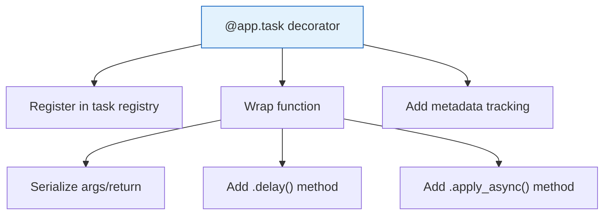
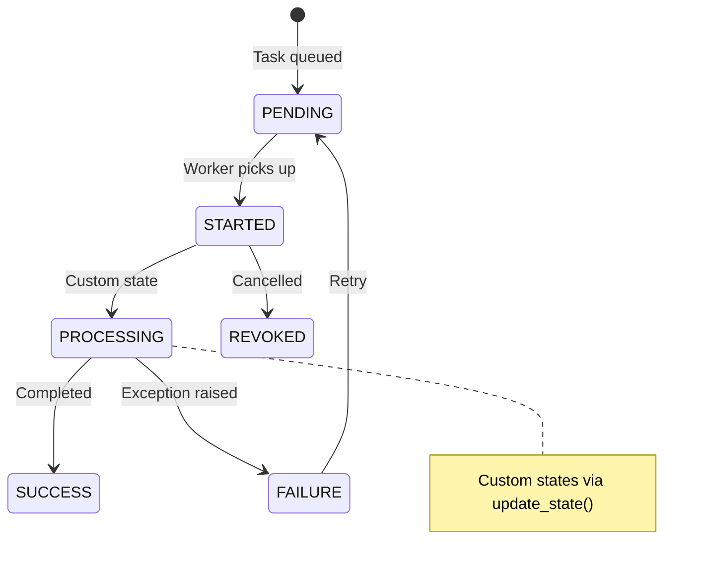

# Lesson 13.5: Task Definition

> **Duration**: 25 min | **Section**: B - Real-World Patterns

## 🎯 The Problem

You've seen basic `@celery.task`. But production tasks need:
- Custom configuration
- Logging and visibility
- Input validation
- Proper naming

Let's master task definitions.

## 🔍 Under the Hood: The @task Decorator

```python
from celery import Celery

app = Celery("myapp", broker="redis://localhost:6379/0")

@app.task
def add(x: int, y: int) -> int:
    return x + y
```

**What does `@app.task` do?**

1. Registers the function in Celery's task registry
2. Wraps it to handle serialization/deserialization
3. Adds Celery methods (`.delay()`, `.apply_async()`)
4. Tracks execution metadata



## 🔍 Task Invocation Methods

### Method 1: `.delay()` - Simple

```python
# Quick and simple
task = process_document.delay(file_path)
```

Equivalent to:
```python
task = process_document.apply_async(args=[file_path])
```

### Method 2: `.apply_async()` - Full Control

```python
task = process_document.apply_async(
    args=[file_path],              # Positional args
    kwargs={"priority": "high"},   # Keyword args
    countdown=60,                  # Delay execution by 60s
    expires=300,                   # Task expires after 5 min
    retry=True,                    # Enable retries
    queue="high-priority"          # Specific queue
)
```

### Method 3: `.apply()` - Synchronous (Testing)

```python
# Runs immediately in current process (for testing)
result = process_document.apply(args=[file_path])
print(result.result)  # Blocks until complete
```

## 🔍 Task Configuration Options

```python
@app.task(
    name="rag.process_document",      # Custom task name
    bind=True,                         # Access to self
    max_retries=3,                     # Retry limit
    default_retry_delay=60,            # Delay between retries
    autoretry_for=(ConnectionError,),  # Auto-retry for these exceptions
    retry_backoff=True,                # Exponential backoff
    rate_limit="10/m",                 # Max 10 per minute
    time_limit=300,                    # Hard timeout (5 min)
    soft_time_limit=240,               # Soft timeout (4 min)
    ignore_result=False,               # Store result
    acks_late=True,                    # ACK after completion
    track_started=True                 # Track STARTED state
)
def process_document(self, file_path: str) -> dict:
    """Process a document for RAG indexing."""
    pass
```

### Configuration Explained

| Option | Purpose | Default |
|--------|---------|---------|
| `name` | Task identifier | `module.function` |
| `bind` | Access `self` in task | `False` |
| `max_retries` | Retry limit | `3` |
| `rate_limit` | Execution rate limit | None |
| `time_limit` | Hard kill timeout | None |
| `soft_time_limit` | Raises exception | None |
| `ignore_result` | Don't store result | `False` |
| `acks_late` | ACK after completion | `False` |

## 🔍 Bound Tasks with `self`

When `bind=True`, the first argument is the task instance:

```python
@app.task(bind=True)
def process_with_context(self, data: str) -> dict:
    # Access task metadata
    print(f"Task ID: {self.request.id}")
    print(f"Retries: {self.request.retries}")
    print(f"Args: {self.request.args}")
    
    # Update state
    self.update_state(state="PROCESSING", meta={"progress": 50})
    
    # Manual retry
    try:
        result = risky_operation(data)
    except TemporaryError as e:
        self.retry(exc=e, countdown=60)
    
    return result
```

**`self.request` contains:**

| Attribute | Description |
|-----------|-------------|
| `id` | Task UUID |
| `args` | Positional arguments |
| `kwargs` | Keyword arguments |
| `retries` | Current retry count |
| `eta` | Scheduled execution time |
| `expires` | Expiration time |
| `origin` | Name of host that sent task |

## 🔍 Task Naming Best Practices

```python
# ❌ BAD - Default names are fragile
@app.task
def process():  # Name: "workers.tasks.process"
    pass

# If you move/rename the file, name changes = old tasks fail!

# ✅ GOOD - Explicit, stable names
@app.task(name="documents.process")
def process():
    pass

# Name stays the same regardless of file location
```

**Naming convention:**
```
{domain}.{action}

Examples:
- documents.process
- documents.embed
- notifications.send_email
- rag.index_collection
```

## 🔍 Task with Full Production Pattern

```python
import logging
from celery import Celery
from pydantic import BaseModel, ValidationError

logger = logging.getLogger(__name__)

class DocumentInput(BaseModel):
    file_path: str
    user_id: str
    priority: str = "normal"

@app.task(
    name="documents.process",
    bind=True,
    max_retries=3,
    autoretry_for=(ConnectionError, TimeoutError),
    retry_backoff=True,
    time_limit=600,
    soft_time_limit=540,
    acks_late=True
)
def process_document(
    self, 
    file_path: str, 
    user_id: str,
    priority: str = "normal"
) -> dict:
    """
    Process document for RAG indexing.
    
    Args:
        file_path: Path to document file
        user_id: Owner of the document
        priority: Processing priority
        
    Returns:
        Processing result with chunk count
    """
    # Validate input
    try:
        input_data = DocumentInput(
            file_path=file_path,
            user_id=user_id,
            priority=priority
        )
    except ValidationError as e:
        logger.error(f"Invalid input: {e}")
        raise ValueError(f"Invalid task input: {e}")
    
    # Log start
    logger.info(
        f"Task {self.request.id}: Processing {file_path} for user {user_id}"
    )
    
    try:
        # Update state
        self.update_state(
            state="PROCESSING", 
            meta={"step": "extracting", "file": file_path}
        )
        
        # Do the work
        text = extract_text(file_path)
        
        self.update_state(
            state="PROCESSING",
            meta={"step": "chunking", "text_length": len(text)}
        )
        
        chunks = chunk_text(text)
        
        self.update_state(
            state="PROCESSING",
            meta={"step": "embedding", "chunk_count": len(chunks)}
        )
        
        embeddings = get_embeddings(chunks)
        store_embeddings(embeddings, user_id)
        
        result = {
            "file_path": file_path,
            "chunk_count": len(chunks),
            "user_id": user_id,
            "status": "indexed"
        }
        
        logger.info(f"Task {self.request.id}: Completed successfully")
        return result
        
    except SoftTimeLimitExceeded:
        logger.warning(f"Task {self.request.id}: Soft time limit exceeded")
        # Cleanup and return partial result
        return {"status": "timeout", "partial": True}
        
    except Exception as e:
        logger.exception(f"Task {self.request.id}: Failed - {e}")
        raise  # Let Celery handle retry
```

## 🔍 Task States



| State | Meaning |
|-------|---------|
| `PENDING` | Task is waiting in queue |
| `STARTED` | Worker has picked up task |
| `SUCCESS` | Task completed successfully |
| `FAILURE` | Task raised an exception |
| `RETRY` | Task is being retried |
| `REVOKED` | Task was cancelled |

## 🎯 Practice

Create a production-ready task for sending emails:

```python
@app.task(
    # TODO: Add proper configuration
)
def send_email(self, to: str, subject: str, body: str) -> dict:
    """
    Send an email notification.
    
    Should:
    - Have explicit name
    - Retry on network errors
    - Have rate limit (don't spam)
    - Log start/end
    """
    pass
```

<details>
<summary>Solution</summary>

```python
import logging
import smtplib

logger = logging.getLogger(__name__)

@app.task(
    name="notifications.send_email",
    bind=True,
    max_retries=3,
    autoretry_for=(smtplib.SMTPException, ConnectionError),
    retry_backoff=True,
    default_retry_delay=30,
    rate_limit="100/m",  # Max 100 emails per minute
    time_limit=60,
    acks_late=True
)
def send_email(self, to: str, subject: str, body: str) -> dict:
    """Send an email notification."""
    
    logger.info(f"Task {self.request.id}: Sending email to {to}")
    
    self.update_state(
        state="SENDING",
        meta={"to": to, "subject": subject}
    )
    
    try:
        # Send email (simplified)
        send_smtp_email(to, subject, body)
        
        logger.info(f"Task {self.request.id}: Email sent successfully")
        return {"to": to, "status": "sent"}
        
    except smtplib.SMTPRecipientsRefused as e:
        # Don't retry for invalid recipients
        logger.error(f"Invalid recipient: {to}")
        return {"to": to, "status": "invalid_recipient"}
```

</details>

## 🔑 Key Takeaways

1. **`.delay()`** for simple calls, **`.apply_async()`** for options
2. **`bind=True`** gives access to task instance (`self`)
3. **Explicit names** prevent refactoring breakage
4. **`acks_late=True`** ensures tasks survive worker crashes
5. **Input validation** with Pydantic keeps tasks clean
6. **Logging** is essential for debugging production tasks

## ❓ Common Questions

| Question | Answer |
|----------|--------|
| When to use `ignore_result=True`? | Fire-and-forget tasks (emails, logs) |
| What's `acks_late` vs `acks_on_failure_or_timeout`? | `acks_late` = ACK after success. Other = ACK on any completion. |
| Can I use type hints? | Yes! Celery respects them for documentation. |

---

**Next**: 13.6 - Task Results (Tracking progress and getting results)
