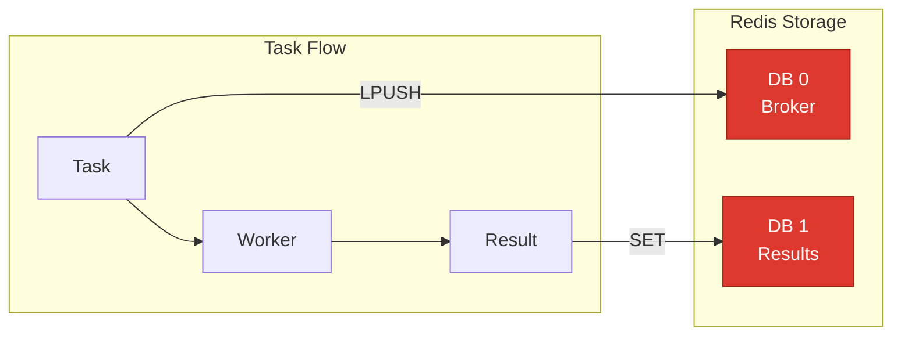
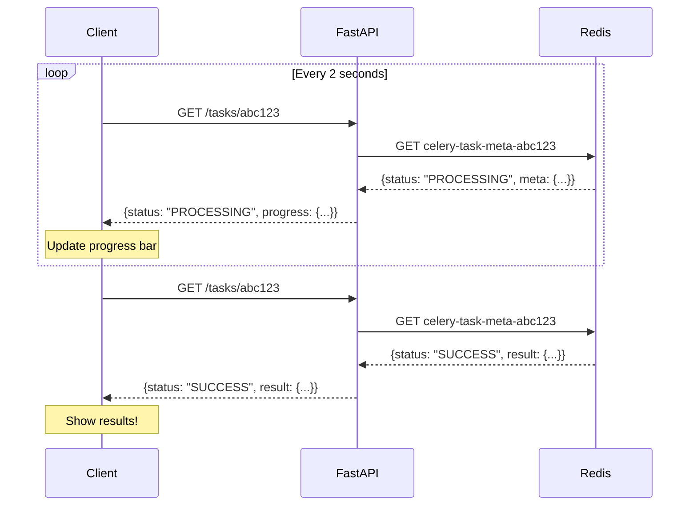

# Lesson 13.6: Task Results

> **Duration**: 25 min | **Section**: B - Real-World Patterns

## 🎯 The Problem

Your task is running in the background. Users want to know:
- Is it done yet?
- How far along is it?
- What's the result?

You need **result tracking**.

## 🔍 Under the Hood: Result Backend

When you configure Celery with a result backend, every task stores its result:

```python
celery_app = Celery(
    "tasks",
    broker="redis://localhost:6379/0",   # Task messages
    backend="redis://localhost:6379/1",  # Task results
)
```



**What gets stored:**

```json
// Key: celery-task-meta-{task_id}
{
  "status": "SUCCESS",
  "result": {"chunk_count": 42, "status": "indexed"},
  "traceback": null,
  "children": [],
  "date_done": "2024-01-15T10:30:00.000000"
}
```

## 🔍 AsyncResult: Reading Task Status

```python
from celery.result import AsyncResult

# Get task by ID
result = AsyncResult("abc123-def456-...")

# Check status
print(result.status)    # PENDING, STARTED, SUCCESS, FAILURE, etc.
print(result.ready())   # True if completed (success or failure)
print(result.successful())  # True only if SUCCESS
print(result.failed())  # True only if FAILURE

# Get result (blocks if not ready!)
data = result.result    # The return value of the task
# Or
data = result.get()     # Blocks until ready, with timeout option

# Get result with timeout
try:
    data = result.get(timeout=10)  # Wait max 10 seconds
except TimeoutError:
    print("Task not ready yet")
```

## 🔍 Progress Tracking with update_state

For long tasks, update progress:

```python
@app.task(bind=True)
def process_documents(self, file_paths: list[str]) -> dict:
    """Process multiple documents with progress tracking."""
    results = []
    total = len(file_paths)
    
    for i, path in enumerate(file_paths):
        # Update progress
        self.update_state(
            state="PROCESSING",
            meta={
                "current": i + 1,
                "total": total,
                "percent": int((i + 1) / total * 100),
                "current_file": path
            }
        )
        
        # Do the work
        result = process_single_document(path)
        results.append(result)
    
    return {"processed": len(results), "results": results}
```

**Reading progress:**

```python
result = AsyncResult(task_id)

if result.status == "PROCESSING":
    progress = result.info  # The 'meta' dict
    print(f"Progress: {progress['percent']}%")
    print(f"Processing: {progress['current_file']}")
elif result.status == "SUCCESS":
    print(f"Done! {result.result}")
```

## 🔍 FastAPI Endpoint for Status

```python
from fastapi import FastAPI, HTTPException
from celery.result import AsyncResult
from pydantic import BaseModel
from typing import Optional, Any

app = FastAPI()

class TaskStatus(BaseModel):
    task_id: str
    status: str
    progress: Optional[dict] = None
    result: Optional[Any] = None
    error: Optional[str] = None

@app.get("/tasks/{task_id}", response_model=TaskStatus)
async def get_task_status(task_id: str) -> TaskStatus:
    """Get the status of a background task."""
    
    result = AsyncResult(task_id)
    
    response = TaskStatus(
        task_id=task_id,
        status=result.status
    )
    
    if result.status == "PENDING":
        # Task hasn't started yet
        response.progress = {"message": "Task is queued"}
        
    elif result.status == "STARTED":
        # Task has been picked up by worker
        response.progress = {"message": "Task is starting"}
        
    elif result.status in ("PROCESSING", "PROGRESS"):
        # Custom state with progress info
        response.progress = result.info
        
    elif result.status == "SUCCESS":
        # Task completed successfully
        response.result = result.result
        
    elif result.status == "FAILURE":
        # Task failed
        response.error = str(result.result)  # Exception message
        
    elif result.status == "REVOKED":
        # Task was cancelled
        response.error = "Task was cancelled"
    
    return response
```

**Example responses:**

```json
// Queued
{"task_id": "abc", "status": "PENDING", "progress": {"message": "Task is queued"}}

// Processing
{"task_id": "abc", "status": "PROCESSING", "progress": {"current": 5, "total": 10, "percent": 50}}

// Success
{"task_id": "abc", "status": "SUCCESS", "result": {"chunk_count": 42}}

// Failure
{"task_id": "abc", "status": "FAILURE", "error": "File not found: /path/to/doc.pdf"}
```

## 🔍 Polling Pattern

Client-side polling for task completion:

```javascript
// Frontend JavaScript
async function pollTaskStatus(taskId) {
    const maxAttempts = 60;  // 60 * 2s = 2 minutes max
    let attempts = 0;
    
    while (attempts < maxAttempts) {
        const response = await fetch(`/tasks/${taskId}`);
        const data = await response.json();
        
        // Update UI with progress
        updateProgressBar(data.progress?.percent || 0);
        
        if (data.status === 'SUCCESS') {
            return data.result;
        } else if (data.status === 'FAILURE') {
            throw new Error(data.error);
        }
        
        // Wait 2 seconds before next poll
        await new Promise(resolve => setTimeout(resolve, 2000));
        attempts++;
    }
    
    throw new Error('Task timed out');
}
```



## 🔍 Result Expiration

Don't let results pile up:

```python
celery_app.conf.update(
    result_expires=3600,  # Results expire after 1 hour
)
```

**What happens:**
- Task completes, result stored in Redis
- After 1 hour, Redis deletes the key
- Query for expired task returns `PENDING` (no result found)

**For long-term storage**, copy results to your database:

```python
@app.task(bind=True)
def process_document(self, file_path: str, job_id: str) -> dict:
    result = do_processing(file_path)
    
    # Store result in database for long-term
    save_job_result(job_id, result)
    
    # Return for short-term Celery access
    return result
```

## 🔍 Handling Failure Results

```python
@app.task(bind=True)
def risky_task(self, data: str) -> dict:
    try:
        result = risky_operation(data)
        return {"status": "success", "data": result}
    except ValueError as e:
        # Return error as result (not exception)
        return {"status": "error", "message": str(e)}
    except Exception as e:
        # Re-raise to mark task as FAILURE
        raise

# Reading results
result = AsyncResult(task_id)
if result.status == "SUCCESS":
    data = result.result
    if data["status"] == "error":
        # Task succeeded but operation failed
        print(f"Operation error: {data['message']}")
    else:
        # Task and operation succeeded
        print(f"Success: {data['data']}")
elif result.status == "FAILURE":
    # Task itself failed (uncaught exception)
    print(f"Task failed: {result.result}")
```

## 🔍 Grouped Tasks and Results

When you need results from multiple tasks:

```python
from celery import group

# Create group of tasks
job = group([
    process_chunk.s(chunk) 
    for chunk in chunks
])

# Execute group
group_result = job.apply_async()

# Wait for all to complete
results = group_result.get(timeout=60)  # List of all results

# Or check individually
for result in group_result.results:
    if result.ready():
        print(f"Task {result.id}: {result.result}")
```

## 🎯 Practice

Implement a task that reports progress percentages:

```python
@app.task(bind=True)
def batch_embed(self, texts: list[str]) -> dict:
    """
    Embed a batch of texts.
    
    Should update progress with:
    - current: index
    - total: len(texts)
    - percent: current/total * 100
    """
    # Your code here
    pass
```

<details>
<summary>Solution</summary>

```python
@app.task(bind=True)
def batch_embed(self, texts: list[str]) -> dict:
    """Embed a batch of texts with progress tracking."""
    embeddings = []
    total = len(texts)
    
    for i, text in enumerate(texts):
        # Update progress
        self.update_state(
            state="PROCESSING",
            meta={
                "current": i + 1,
                "total": total,
                "percent": int((i + 1) / total * 100),
                "message": f"Embedding text {i + 1} of {total}"
            }
        )
        
        # Do the embedding
        embedding = get_embedding(text)
        embeddings.append(embedding)
    
    return {
        "count": len(embeddings),
        "status": "completed"
    }
```

</details>

## 🔑 Key Takeaways

1. **Result backend** stores task outcomes in Redis
2. **`AsyncResult`** reads status, progress, and results
3. **`update_state()`** enables real-time progress tracking
4. **Polling** is the simplest pattern for checking status
5. **Set `result_expires`** to avoid memory bloat
6. **Store important results** in your database, not just Celery

## ❓ Common Questions

| Question | Answer |
|----------|--------|
| What if I don't need results? | Use `ignore_result=True` to skip storage |
| Can I use webhooks instead of polling? | Yes! Task can call a webhook on completion |
| How to get results from multiple tasks? | Use `group()` and iterate over results |
| What happens to results on Redis restart? | Lost unless Redis has persistence enabled |

---

**Next**: 13.7 - Error Handling (Retries and recovery)
