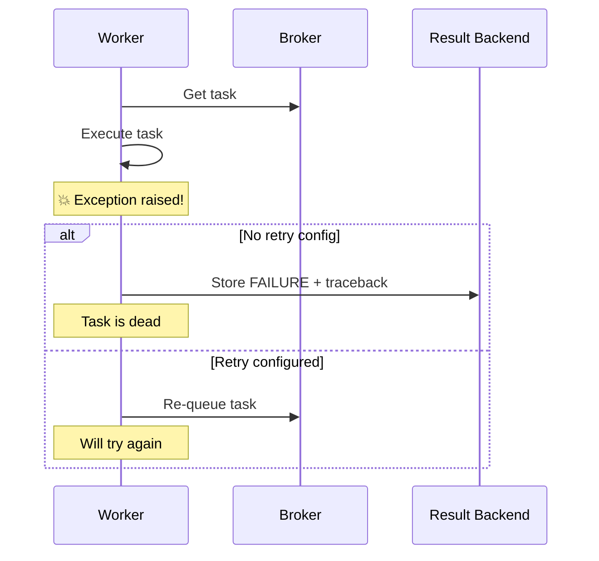
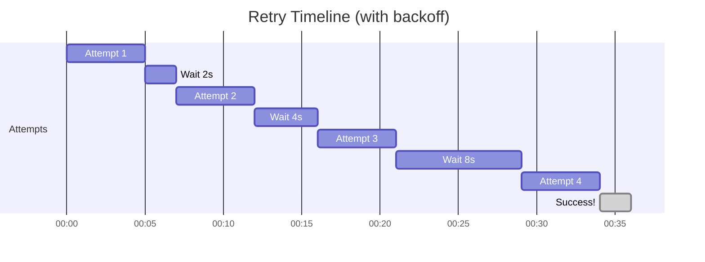
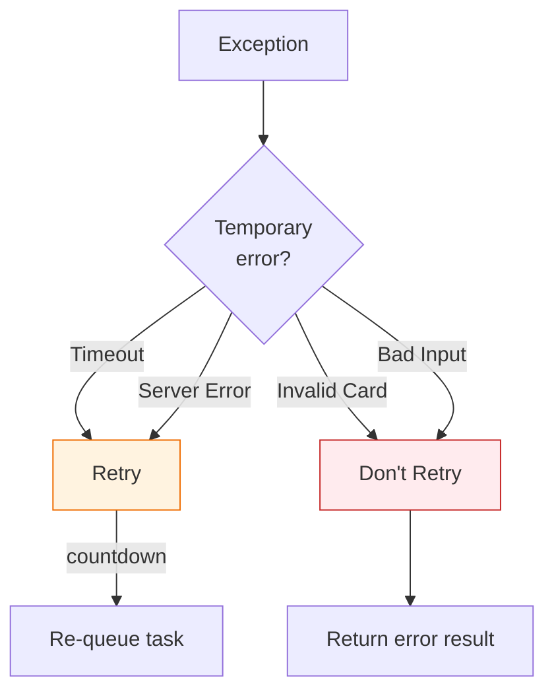
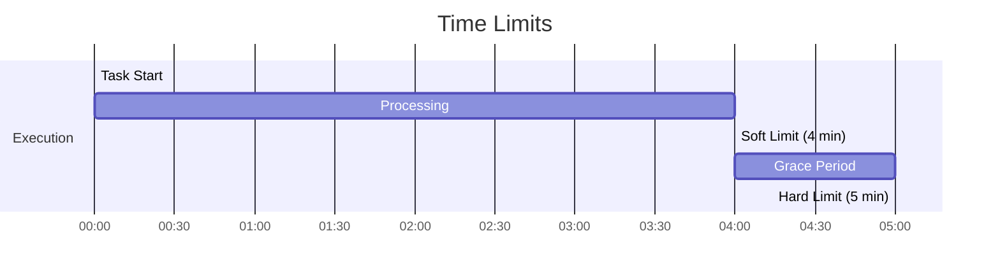

# Lesson 13.7: Error Handling

> **Duration**: 30 min | **Section**: B - Real-World Patterns

## 🎯 The Problem

Background tasks fail. APIs timeout. Databases go down. Workers crash.

If you don't handle errors properly:
- Tasks silently disappear
- Users get stuck in "processing" forever
- You have no idea what went wrong

## 🔍 Under the Hood: What Happens on Failure



## 🔍 Basic Retry with `self.retry()`

```python
from celery import Celery
from celery.exceptions import MaxRetriesExceededError

app = Celery("tasks")

@app.task(bind=True, max_retries=3)
def call_external_api(self, url: str) -> dict:
    """Call an external API with retries."""
    try:
        response = requests.get(url, timeout=10)
        response.raise_for_status()
        return response.json()
        
    except requests.RequestException as e:
        # Retry in 60 seconds
        try:
            self.retry(exc=e, countdown=60)
        except MaxRetriesExceededError:
            # All retries exhausted
            return {"error": f"Failed after 3 retries: {e}"}
```

**`self.retry()` parameters:**

| Parameter | Description |
|-----------|-------------|
| `exc` | The exception that caused the retry |
| `countdown` | Seconds to wait before retrying |
| `eta` | Specific datetime to retry at |
| `max_retries` | Override task's max_retries |
| `throw` | If False, don't raise Retry exception |

## 🔍 Automatic Retry with `autoretry_for`

Instead of manual try/except:

```python
@app.task(
    bind=True,
    autoretry_for=(
        requests.RequestException,
        ConnectionError,
        TimeoutError
    ),
    retry_kwargs={"max_retries": 5},
    retry_backoff=True,         # Exponential backoff
    retry_backoff_max=600,      # Max 10 min between retries
    retry_jitter=True           # Add randomness to prevent thundering herd
)
def call_api_auto(self, url: str) -> dict:
    """API call with automatic retries - no try/except needed!"""
    response = requests.get(url, timeout=10)
    response.raise_for_status()
    return response.json()
```

**Exponential backoff pattern:**



| Retry | Delay (backoff) | Cumulative Time |
|-------|-----------------|-----------------|
| 1 | 0s | 0s |
| 2 | 2s | ~7s |
| 3 | 4s | ~16s |
| 4 | 8s | ~29s |
| 5 | 16s | ~50s |

## 🔍 Selective Retry Logic

Some errors should retry, some shouldn't:

```python
@app.task(bind=True, max_retries=3)
def process_payment(self, payment_id: str) -> dict:
    try:
        result = payment_gateway.charge(payment_id)
        return {"status": "success", "transaction_id": result.id}
        
    except PaymentGatewayTimeout as e:
        # Network issue - RETRY
        self.retry(exc=e, countdown=30)
        
    except InvalidCardError as e:
        # User error - DON'T RETRY
        return {"status": "failed", "error": "Invalid card"}
        
    except InsufficientFundsError as e:
        # User error - DON'T RETRY
        return {"status": "failed", "error": "Insufficient funds"}
        
    except PaymentGatewayError as e:
        # Server error - RETRY with longer delay
        self.retry(exc=e, countdown=300)  # 5 min
```



## 🔍 Error Callbacks

Execute specific logic on failure:

```python
from celery import Task

class AlertOnFailureTask(Task):
    """Custom task base that alerts on failure."""
    
    def on_failure(self, exc, task_id, args, kwargs, einfo):
        """Called when task fails after all retries."""
        send_slack_alert(
            f"Task {self.name} failed!\n"
            f"Task ID: {task_id}\n"
            f"Error: {exc}\n"
            f"Args: {args}"
        )
    
    def on_retry(self, exc, task_id, args, kwargs, einfo):
        """Called on each retry attempt."""
        logger.warning(f"Task {task_id} retrying: {exc}")
    
    def on_success(self, retval, task_id, args, kwargs):
        """Called on successful completion."""
        logger.info(f"Task {task_id} succeeded: {retval}")


@app.task(bind=True, base=AlertOnFailureTask, max_retries=3)
def critical_task(self, data: str) -> dict:
    """Critical task that alerts on failure."""
    # If this fails 3 times, Slack gets notified
    return process_critical_data(data)
```

## 🔍 Dead Letter Queue Pattern

When tasks fail permanently, don't lose them:

```python
import json
from datetime import datetime

DEAD_LETTER_KEY = "celery:dead_letter_queue"

@app.task(bind=True, max_retries=3)
def important_task(self, data: dict) -> dict:
    try:
        return process(data)
        
    except Exception as e:
        if self.request.retries >= self.max_retries:
            # Max retries reached - send to dead letter queue
            dead_letter = {
                "task_id": self.request.id,
                "task_name": self.name,
                "args": self.request.args,
                "kwargs": self.request.kwargs,
                "exception": str(e),
                "timestamp": datetime.utcnow().isoformat(),
                "retries": self.request.retries
            }
            redis_client.lpush(DEAD_LETTER_KEY, json.dumps(dead_letter))
            
            # Return failure instead of raising
            return {"status": "failed", "moved_to_dlq": True}
        
        # Still have retries left
        self.retry(exc=e, countdown=60)


# Admin endpoint to view dead letters
@app.get("/admin/dead-letters")
async def get_dead_letters():
    dead_letters = redis_client.lrange(DEAD_LETTER_KEY, 0, 100)
    return [json.loads(dl) for dl in dead_letters]


# Admin endpoint to retry dead letters
@app.post("/admin/dead-letters/{task_id}/retry")
async def retry_dead_letter(task_id: str):
    # Find and remove from dead letter queue
    # Re-queue the task
    pass
```

## 🔍 Time Limits

Prevent tasks from running forever:

```python
from celery.exceptions import SoftTimeLimitExceeded

@app.task(
    time_limit=300,      # Hard limit: kill after 5 min (SIGKILL)
    soft_time_limit=240  # Soft limit: exception after 4 min
)
def long_running_task(data: str) -> dict:
    try:
        for chunk in process_in_chunks(data):
            # Check if we should stop
            yield chunk
            
    except SoftTimeLimitExceeded:
        # Soft limit hit - clean up gracefully
        save_partial_result(data)
        return {"status": "timeout", "partial": True}
    
    # If we hit hard limit, task is killed (no cleanup)
```



## 🔍 Comprehensive Error Handling Pattern

```python
import logging
from celery import Task
from celery.exceptions import SoftTimeLimitExceeded, MaxRetriesExceededError

logger = logging.getLogger(__name__)

class RobustTask(Task):
    """Base task with comprehensive error handling."""
    
    def on_failure(self, exc, task_id, args, kwargs, einfo):
        logger.error(
            f"Task {self.name}[{task_id}] failed: {exc}",
            extra={"args": args, "kwargs": kwargs}
        )
        # Send to monitoring
        track_failure(self.name, task_id, exc)
    
    def on_retry(self, exc, task_id, args, kwargs, einfo):
        logger.warning(
            f"Task {self.name}[{task_id}] retrying ({self.request.retries}): {exc}"
        )


@app.task(
    bind=True,
    base=RobustTask,
    max_retries=3,
    autoretry_for=(ConnectionError, TimeoutError),
    retry_backoff=True,
    time_limit=600,
    soft_time_limit=540,
    acks_late=True
)
def robust_process(self, file_path: str) -> dict:
    """
    Robust document processing with full error handling.
    """
    logger.info(f"Starting task {self.request.id} for {file_path}")
    
    try:
        # Validate input
        if not os.path.exists(file_path):
            # Input error - don't retry
            return {"status": "error", "message": "File not found"}
        
        # Process with progress updates
        self.update_state(state="PROCESSING", meta={"step": "reading"})
        content = read_file(file_path)
        
        self.update_state(state="PROCESSING", meta={"step": "parsing"})
        data = parse_content(content)
        
        self.update_state(state="PROCESSING", meta={"step": "storing"})
        store_result(data)
        
        return {"status": "success", "items": len(data)}
        
    except SoftTimeLimitExceeded:
        logger.warning(f"Task {self.request.id}: Soft time limit exceeded")
        # Save partial progress
        save_checkpoint(self.request.id, partial_data)
        return {"status": "timeout", "checkpoint_saved": True}
        
    except DatabaseError as e:
        # Database down - retry with longer delay
        logger.error(f"Database error: {e}")
        self.retry(exc=e, countdown=120)  # 2 min
        
    except Exception as e:
        logger.exception(f"Unexpected error in task {self.request.id}")
        
        if self.request.retries < self.max_retries:
            self.retry(exc=e, countdown=60)
        else:
            # Move to dead letter queue
            save_to_dead_letter_queue(self.request, e)
            return {"status": "failed", "error": str(e)}
```

## 🎯 Practice

Implement retry logic for an API that has rate limits:

```python
@app.task(bind=True, max_retries=5)
def call_rate_limited_api(self, endpoint: str) -> dict:
    """
    Call an API that returns 429 (rate limited).
    
    - On 429: Wait and retry (respect Retry-After header)
    - On 5xx: Retry with backoff
    - On 4xx (except 429): Don't retry
    """
    # Your code here
    pass
```

<details>
<summary>Solution</summary>

```python
import requests
from celery.exceptions import MaxRetriesExceededError

@app.task(bind=True, max_retries=5)
def call_rate_limited_api(self, endpoint: str) -> dict:
    """Call API with smart retry logic."""
    try:
        response = requests.get(endpoint, timeout=30)
        
        if response.status_code == 429:
            # Rate limited - use Retry-After header
            retry_after = int(response.headers.get("Retry-After", 60))
            self.retry(countdown=retry_after)
            
        elif response.status_code >= 500:
            # Server error - retry with backoff
            countdown = 30 * (2 ** self.request.retries)
            self.retry(countdown=min(countdown, 600))
            
        elif response.status_code >= 400:
            # Client error (not 429) - don't retry
            return {
                "status": "error",
                "code": response.status_code,
                "message": response.text
            }
        
        # Success
        return {
            "status": "success",
            "data": response.json()
        }
        
    except requests.Timeout as e:
        self.retry(exc=e, countdown=30)
        
    except MaxRetriesExceededError:
        return {
            "status": "failed",
            "message": "Max retries exceeded"
        }
```

</details>

## 🔑 Key Takeaways

1. **`autoretry_for`** = Automatic retries for specific exceptions
2. **`retry_backoff=True`** = Exponential delay between retries
3. **Not all errors should retry** - Invalid input, bad data should fail fast
4. **`on_failure` callback** = Alert on permanent failure
5. **Dead letter queue** = Don't lose permanently failed tasks
6. **Time limits** = Prevent runaway tasks

## ❓ Common Questions

| Question | Answer |
|----------|--------|
| What's the default max_retries? | 3 |
| What's exponential backoff multiplier? | 2x (configurable with `retry_backoff_max`) |
| Can I retry specific errors only? | Yes, use `autoretry_for` tuple |
| How to alert on all failures? | Create custom Task base class with `on_failure` |

---

**Next**: 13.8 - Celery + FastAPI (Full integration)
