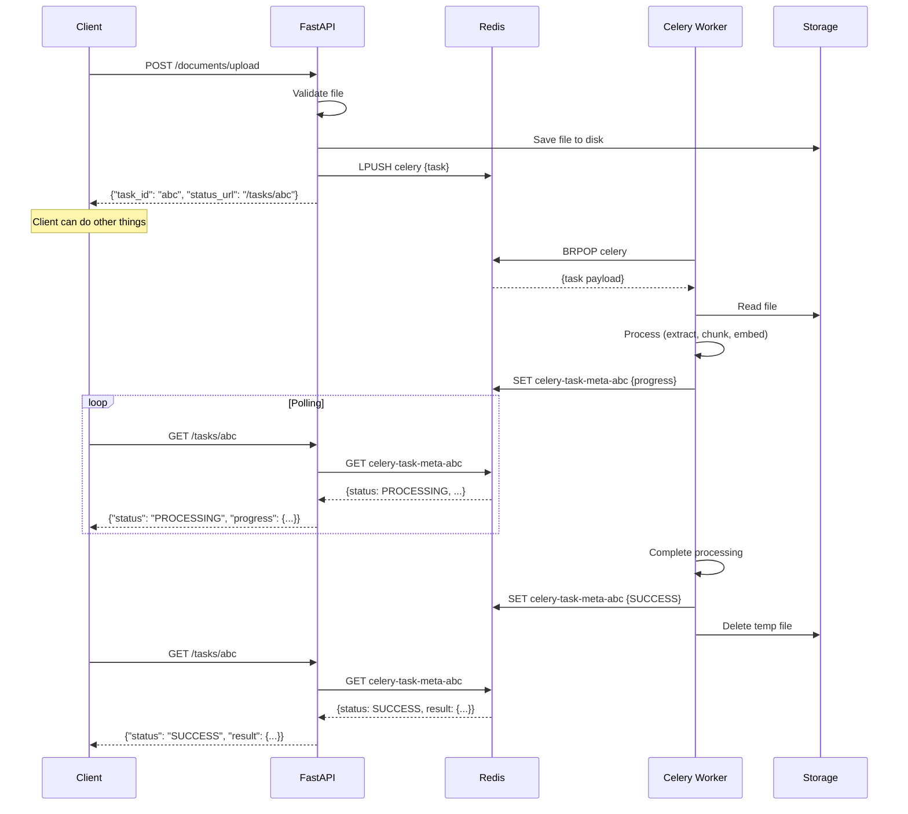

# Lesson 13.8: Celery + FastAPI

> **Duration**: 35 min | **Section**: B - Real-World Patterns

## 🎯 The Problem

You've learned Celery. You know FastAPI. Now you need to:
- Properly integrate them
- Share configuration
- Handle the request/response pattern
- Build production-ready endpoints

## 🔍 Project Structure

```
rag-api/
├── app/
│   ├── __init__.py
│   ├── main.py              # FastAPI app
│   ├── config.py            # Shared configuration
│   ├── dependencies.py      # FastAPI dependencies
│   └── api/
│       ├── __init__.py
│       ├── documents.py     # Document upload endpoints
│       └── tasks.py         # Task status endpoints
├── workers/
│   ├── __init__.py
│   ├── celery_app.py        # Celery configuration
│   └── tasks/
│       ├── __init__.py
│       ├── documents.py     # Document processing tasks
│       └── embeddings.py    # Embedding tasks
├── docker-compose.yml
└── requirements.txt
```

## 🔍 Step 1: Shared Configuration

```python
# app/config.py
from pydantic_settings import BaseSettings
from functools import lru_cache

class Settings(BaseSettings):
    """Application settings from environment."""
    
    # Redis
    redis_host: str = "localhost"
    redis_port: int = 6379
    
    # Celery
    celery_broker_db: int = 0
    celery_result_db: int = 1
    
    # File storage
    upload_dir: str = "/tmp/uploads"
    max_file_size: int = 50 * 1024 * 1024  # 50MB
    
    @property
    def celery_broker_url(self) -> str:
        return f"redis://{self.redis_host}:{self.redis_port}/{self.celery_broker_db}"
    
    @property
    def celery_result_backend(self) -> str:
        return f"redis://{self.redis_host}:{self.redis_port}/{self.celery_result_db}"
    
    class Config:
        env_file = ".env"

@lru_cache
def get_settings() -> Settings:
    return Settings()
```

## 🔍 Step 2: Celery App Configuration

```python
# workers/celery_app.py
from celery import Celery
from app.config import get_settings

settings = get_settings()

celery_app = Celery(
    "rag_workers",
    broker=settings.celery_broker_url,
    backend=settings.celery_result_backend,
)

celery_app.conf.update(
    # Serialization
    task_serializer="json",
    accept_content=["json"],
    result_serializer="json",
    
    # Timezone
    timezone="UTC",
    enable_utc=True,
    
    # Task settings
    task_track_started=True,
    task_time_limit=600,
    result_expires=3600,
    
    # Late ACK for reliability
    task_acks_late=True,
    task_reject_on_worker_lost=True,
)

# Auto-discover tasks
celery_app.autodiscover_tasks(["workers.tasks"])
```

## 🔍 Step 3: Task Definitions

```python
# workers/tasks/documents.py
import os
import logging
from workers.celery_app import celery_app
from app.config import get_settings

logger = logging.getLogger(__name__)
settings = get_settings()

@celery_app.task(
    name="documents.process",
    bind=True,
    max_retries=3,
    autoretry_for=(ConnectionError, TimeoutError),
    retry_backoff=True,
    time_limit=300,
    soft_time_limit=270
)
def process_document(
    self,
    file_path: str,
    user_id: str,
    options: dict | None = None
) -> dict:
    """
    Process uploaded document for RAG indexing.
    
    Args:
        file_path: Path to uploaded file
        user_id: Owner of the document
        options: Processing options
    """
    logger.info(f"Task {self.request.id}: Processing {file_path}")
    options = options or {}
    
    try:
        # Step 1: Extract text
        self.update_state(
            state="PROCESSING",
            meta={"step": "extracting", "progress": 10}
        )
        
        text = extract_text_from_file(file_path)
        
        # Step 2: Chunk text
        self.update_state(
            state="PROCESSING",
            meta={"step": "chunking", "progress": 30}
        )
        
        chunk_size = options.get("chunk_size", 500)
        chunks = chunk_text(text, chunk_size)
        
        # Step 3: Generate embeddings
        self.update_state(
            state="PROCESSING",
            meta={"step": "embedding", "progress": 50}
        )
        
        embeddings = generate_embeddings(chunks)
        
        # Step 4: Store in vector database
        self.update_state(
            state="PROCESSING",
            meta={"step": "storing", "progress": 80}
        )
        
        doc_id = store_document(
            file_path=file_path,
            chunks=chunks,
            embeddings=embeddings,
            user_id=user_id
        )
        
        # Cleanup uploaded file
        if os.path.exists(file_path):
            os.remove(file_path)
        
        logger.info(f"Task {self.request.id}: Completed - {len(chunks)} chunks")
        
        return {
            "status": "success",
            "document_id": doc_id,
            "chunk_count": len(chunks),
            "file_path": file_path
        }
        
    except Exception as e:
        logger.exception(f"Task {self.request.id}: Failed - {e}")
        raise
```

## 🔍 Step 4: FastAPI Endpoints

```python
# app/api/documents.py
import os
import uuid
from fastapi import APIRouter, UploadFile, HTTPException, Depends
from pydantic import BaseModel
from workers.tasks.documents import process_document
from app.config import Settings, get_settings

router = APIRouter(prefix="/documents", tags=["documents"])

class UploadResponse(BaseModel):
    task_id: str
    filename: str
    status: str
    status_url: str

class ProcessingOptions(BaseModel):
    chunk_size: int = 500
    overlap: int = 50

@router.post("/upload", response_model=UploadResponse)
async def upload_document(
    file: UploadFile,
    user_id: str,
    options: ProcessingOptions = ProcessingOptions(),
    settings: Settings = Depends(get_settings)
):
    """
    Upload a document for background processing.
    
    Returns immediately with task_id for status tracking.
    """
    # Validate file
    if not file.filename:
        raise HTTPException(400, "No filename provided")
    
    allowed_extensions = {".pdf", ".docx", ".txt", ".md"}
    ext = os.path.splitext(file.filename)[1].lower()
    if ext not in allowed_extensions:
        raise HTTPException(400, f"File type {ext} not allowed")
    
    # Check file size
    content = await file.read()
    if len(content) > settings.max_file_size:
        raise HTTPException(400, "File too large")
    
    # Save to temporary location
    file_id = str(uuid.uuid4())
    file_path = os.path.join(settings.upload_dir, f"{file_id}{ext}")
    
    os.makedirs(settings.upload_dir, exist_ok=True)
    with open(file_path, "wb") as f:
        f.write(content)
    
    # Queue background task
    task = process_document.delay(
        file_path=file_path,
        user_id=user_id,
        options=options.model_dump()
    )
    
    return UploadResponse(
        task_id=task.id,
        filename=file.filename,
        status="queued",
        status_url=f"/tasks/{task.id}"
    )
```

```python
# app/api/tasks.py
from fastapi import APIRouter, HTTPException
from pydantic import BaseModel
from celery.result import AsyncResult
from typing import Optional, Any

router = APIRouter(prefix="/tasks", tags=["tasks"])

class TaskStatusResponse(BaseModel):
    task_id: str
    status: str
    progress: Optional[dict] = None
    result: Optional[Any] = None
    error: Optional[str] = None

@router.get("/{task_id}", response_model=TaskStatusResponse)
async def get_task_status(task_id: str):
    """Get the status of a background task."""
    
    result = AsyncResult(task_id)
    
    # Build response based on state
    response = TaskStatusResponse(
        task_id=task_id,
        status=result.status
    )
    
    match result.status:
        case "PENDING":
            response.progress = {"message": "Task is waiting in queue"}
            
        case "STARTED":
            response.progress = {"message": "Task is starting"}
            
        case "PROCESSING":
            response.progress = result.info
            
        case "SUCCESS":
            response.result = result.result
            
        case "FAILURE":
            response.error = str(result.result)
            
        case "REVOKED":
            response.error = "Task was cancelled"
    
    return response

@router.delete("/{task_id}")
async def cancel_task(task_id: str):
    """Cancel a pending or running task."""
    
    result = AsyncResult(task_id)
    
    if result.status in ("SUCCESS", "FAILURE"):
        raise HTTPException(400, "Task already completed")
    
    result.revoke(terminate=True)
    
    return {"task_id": task_id, "status": "cancelled"}
```

## 🔍 Step 5: Main FastAPI App

```python
# app/main.py
from contextlib import asynccontextmanager
from fastapi import FastAPI
from app.api import documents, tasks
from app.config import get_settings

@asynccontextmanager
async def lifespan(app: FastAPI):
    """Application lifespan events."""
    settings = get_settings()
    
    # Startup
    import os
    os.makedirs(settings.upload_dir, exist_ok=True)
    
    yield
    
    # Shutdown (cleanup if needed)

app = FastAPI(
    title="RAG API",
    description="Document processing with background tasks",
    lifespan=lifespan
)

# Include routers
app.include_router(documents.router)
app.include_router(tasks.router)

@app.get("/health")
async def health_check():
    return {"status": "healthy"}
```

## 🔍 Step 6: Docker Compose

```yaml
# docker-compose.yml
version: "3.8"

services:
  redis:
    image: redis:7-alpine
    ports:
      - "6379:6379"
    volumes:
      - redis_data:/data
    command: redis-server --appendonly yes
    healthcheck:
      test: ["CMD", "redis-cli", "ping"]
      interval: 5s
      timeout: 3s
      retries: 5

  api:
    build: .
    command: uvicorn app.main:app --host 0.0.0.0 --port 8000
    ports:
      - "8000:8000"
    environment:
      - REDIS_HOST=redis
    volumes:
      - uploads:/tmp/uploads
    depends_on:
      redis:
        condition: service_healthy

  worker:
    build: .
    command: celery -A workers.celery_app worker --loglevel=info --concurrency=4
    environment:
      - REDIS_HOST=redis
    volumes:
      - uploads:/tmp/uploads
    depends_on:
      redis:
        condition: service_healthy
    deploy:
      replicas: 2  # Run 2 worker containers

volumes:
  redis_data:
  uploads:
```

## 🔍 Complete Flow



## 🔍 Testing the Integration

```bash
# Start everything
docker-compose up -d

# Upload a document
curl -X POST "http://localhost:8000/documents/upload" \
  -F "file=@test.pdf" \
  -F "user_id=user123"

# Response
# {"task_id": "abc-123", "filename": "test.pdf", "status": "queued", "status_url": "/tasks/abc-123"}

# Check status (repeat until SUCCESS)
curl "http://localhost:8000/tasks/abc-123"

# Response (processing)
# {"task_id": "abc-123", "status": "PROCESSING", "progress": {"step": "embedding", "progress": 50}}

# Response (complete)
# {"task_id": "abc-123", "status": "SUCCESS", "result": {"document_id": "doc-456", "chunk_count": 42}}
```

## 🎯 Practice

Add a batch upload endpoint:

```python
@router.post("/batch-upload")
async def batch_upload(
    files: list[UploadFile],
    user_id: str
):
    """
    Upload multiple documents.
    Should:
    1. Validate all files
    2. Save all files
    3. Queue a task for EACH file
    4. Return list of task IDs
    """
    # Your code here
    pass
```

<details>
<summary>Solution</summary>

```python
@router.post("/batch-upload")
async def batch_upload(
    files: list[UploadFile],
    user_id: str,
    settings: Settings = Depends(get_settings)
):
    """Upload multiple documents for processing."""
    
    if len(files) > 10:
        raise HTTPException(400, "Maximum 10 files per batch")
    
    results = []
    
    for file in files:
        # Validate
        ext = os.path.splitext(file.filename)[1].lower()
        if ext not in {".pdf", ".docx", ".txt", ".md"}:
            results.append({
                "filename": file.filename,
                "status": "rejected",
                "error": f"Invalid file type: {ext}"
            })
            continue
        
        # Save file
        content = await file.read()
        file_id = str(uuid.uuid4())
        file_path = os.path.join(settings.upload_dir, f"{file_id}{ext}")
        
        with open(file_path, "wb") as f:
            f.write(content)
        
        # Queue task
        task = process_document.delay(
            file_path=file_path,
            user_id=user_id
        )
        
        results.append({
            "filename": file.filename,
            "task_id": task.id,
            "status": "queued",
            "status_url": f"/tasks/{task.id}"
        })
    
    return {"batch_size": len(files), "tasks": results}
```

</details>

## 🔑 Key Takeaways

1. **Shared config** via pydantic-settings
2. **Separate concerns**: API handles HTTP, workers handle processing
3. **Shared volume** for file access between API and workers
4. **Task status endpoint** for progress tracking
5. **Docker Compose** orchestrates all services
6. **Health checks** ensure dependencies are ready

## ❓ Common Questions

| Question | Answer |
|----------|--------|
| How to share files between API and worker? | Shared volume or object storage (S3) |
| Can API and worker share code? | Yes! Same codebase, different entrypoints |
| How many workers do I need? | Start with 2-4, scale based on queue depth |
| What about WebSockets for real-time updates? | Possible! Worker publishes to Redis, API subscribes |

---

**Next**: 13.9 - Monitoring (Flower dashboard)
