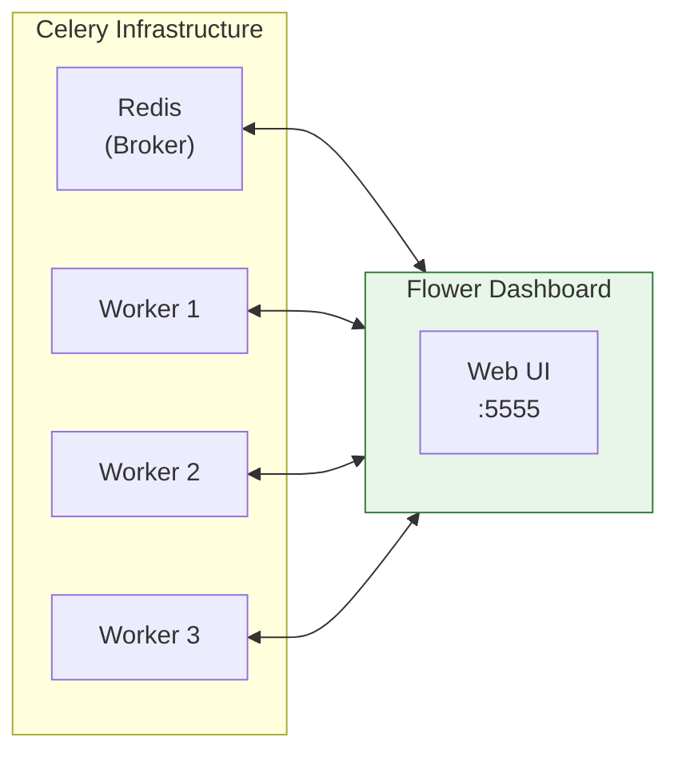

# Lesson 13.9: Monitoring with Flower

> **Duration**: 25 min | **Section**: B - Real-World Patterns

## 🎯 The Problem

Your background tasks are running. But you can't see:
- How many tasks are queued?
- Which workers are active?
- Why did that task fail?
- How long are tasks taking?

You're flying blind.

## 🔍 Under the Hood: What is Flower?

Flower is a **real-time web monitor** for Celery:



**What Flower shows:**
- Active workers and their status
- Task queue depth
- Task history (success/failure)
- Task details (args, result, traceback)
- Real-time task progress

## 🔍 Step 1: Install Flower

```bash
pip install flower
```

Or in `requirements.txt`:
```
flower==2.0.1
```

## 🔍 Step 2: Run Flower

```bash
# Basic
celery -A workers.celery_app flower

# With options
celery -A workers.celery_app flower \
  --port=5555 \
  --broker=redis://localhost:6379/0 \
  --basic_auth=admin:password
```

Open `http://localhost:5555` in your browser.

## 🔍 Step 3: Docker Compose Integration

```yaml
# docker-compose.yml
version: "3.8"

services:
  redis:
    image: redis:7-alpine
    ports:
      - "6379:6379"

  api:
    build: .
    command: uvicorn app.main:app --host 0.0.0.0 --port 8000
    ports:
      - "8000:8000"
    environment:
      - REDIS_HOST=redis

  worker:
    build: .
    command: celery -A workers.celery_app worker --loglevel=info
    environment:
      - REDIS_HOST=redis
    depends_on:
      - redis

  flower:
    build: .
    command: celery -A workers.celery_app flower --port=5555
    ports:
      - "5555:5555"
    environment:
      - REDIS_HOST=redis
      - FLOWER_BASIC_AUTH=admin:${FLOWER_PASSWORD:-changeme}
    depends_on:
      - redis
      - worker
```

## 🔍 Flower Dashboard Features

### Dashboard Overview

```
┌─────────────────────────────────────────────────────────────┐
│  FLOWER - Celery Monitor                                     │
├─────────────────────────────────────────────────────────────┤
│                                                              │
│  Workers: 3 active   Tasks: 142 succeeded, 3 failed         │
│                                                              │
│  ┌───────────────────────────────────────────────────────┐  │
│  │ Active Tasks                                          │  │
│  │ ─────────────────────────────────────────────────────│  │
│  │ documents.process  abc123  PROCESSING  worker-1       │  │
│  │ documents.process  def456  PROCESSING  worker-2       │  │
│  │ embeddings.batch   ghi789  STARTED     worker-3       │  │
│  └───────────────────────────────────────────────────────┘  │
│                                                              │
│  ┌───────────────────────────────────────────────────────┐  │
│  │ Queue Length: 47 tasks                                │  │
│  │ ████████████░░░░░░░░░░░░░░░░░░░░░░░░░░░░░░░░░░ 47%    │  │
│  └───────────────────────────────────────────────────────┘  │
│                                                              │
└─────────────────────────────────────────────────────────────┘
```

### Workers View

| Column | Description |
|--------|-------------|
| Name | Worker hostname |
| Status | Online/Offline |
| Active | Currently running tasks |
| Processed | Total completed tasks |
| Failed | Total failed tasks |
| Load Average | CPU load |

### Tasks View

| Column | Description |
|--------|-------------|
| Name | Task function name |
| UUID | Unique task ID |
| State | PENDING/STARTED/SUCCESS/FAILURE |
| Received | When task was queued |
| Started | When worker picked it up |
| Runtime | Execution duration |
| Worker | Which worker ran it |

### Task Detail View

Click any task to see:
- Full arguments and kwargs
- Return value or exception
- Full traceback for failures
- Retry history
- Timeline

## 🔍 Flower Configuration

```python
# workers/celery_app.py

celery_app.conf.update(
    # Enable events for Flower
    worker_send_task_events=True,
    task_send_sent_event=True,
)
```

### Environment Variables

```bash
# Flower configuration via environment
export FLOWER_BROKER_API=redis://localhost:6379/0
export FLOWER_PORT=5555
export FLOWER_BASIC_AUTH=admin:secretpassword
export FLOWER_URL_PREFIX=/flower  # For reverse proxy
export FLOWER_PERSISTENT=true      # Persist state
export FLOWER_DB=/data/flower.db   # State file
```

## 🔍 Authentication Options

### Basic Auth

```bash
celery -A app flower --basic_auth=user:password
```

### OAuth (GitHub, Google)

```bash
celery -A app flower \
  --auth_provider=flower.views.auth.GithubLoginHandler \
  --oauth2_key=YOUR_CLIENT_ID \
  --oauth2_secret=YOUR_CLIENT_SECRET \
  --oauth2_redirect_uri=http://localhost:5555/login
```

## 🔍 Flower API

Flower also provides a REST API:

```bash
# List workers
curl http://localhost:5555/api/workers

# Get task info
curl http://localhost:5555/api/task/info/abc-123

# Get task result
curl http://localhost:5555/api/task/result/abc-123

# Revoke a task
curl -X POST http://localhost:5555/api/task/revoke/abc-123

# Shutdown a worker
curl -X POST http://localhost:5555/api/worker/shutdown/celery@worker1
```

### API Response Example

```json
// GET /api/task/info/abc-123
{
  "uuid": "abc-123",
  "name": "documents.process",
  "state": "SUCCESS",
  "received": 1705312800.0,
  "started": 1705312801.0,
  "succeeded": 1705312830.0,
  "runtime": 29.0,
  "args": "['/tmp/uploads/doc.pdf', 'user123']",
  "kwargs": "{}",
  "result": "{'chunk_count': 42}",
  "worker": "celery@worker1"
}
```

## 🔍 Metrics and Alerts

### Prometheus Integration

```bash
celery -A app flower --enable_events
```

Flower exposes metrics at `/metrics`:

```
# HELP celery_tasks_total Total number of tasks
# TYPE celery_tasks_total counter
celery_tasks_total{name="documents.process",state="SUCCESS"} 142
celery_tasks_total{name="documents.process",state="FAILURE"} 3

# HELP celery_workers Number of workers
# TYPE celery_workers gauge
celery_workers 3
```

### Custom Alerts

Monitor queue depth:

```python
# monitoring.py
import requests

def check_queue_health():
    response = requests.get("http://flower:5555/api/queues/length")
    queues = response.json()
    
    for queue_name, length in queues.items():
        if length > 100:
            send_alert(f"Queue {queue_name} backed up: {length} tasks")
        
    return queues
```

## 🔍 Debugging Failed Tasks

When a task fails, Flower shows:

```
┌─────────────────────────────────────────────────────────────┐
│ Task: documents.process                                      │
│ UUID: abc-123-def-456                                        │
│ State: FAILURE                                               │
├─────────────────────────────────────────────────────────────┤
│ Args: ('/tmp/uploads/doc.pdf', 'user123')                   │
│ Kwargs: {'chunk_size': 500}                                 │
├─────────────────────────────────────────────────────────────┤
│ Exception:                                                   │
│ FileNotFoundError: /tmp/uploads/doc.pdf                     │
├─────────────────────────────────────────────────────────────┤
│ Traceback:                                                   │
│   File "workers/tasks/documents.py", line 42, in process    │
│     text = extract_text_from_file(file_path)                │
│   File "utils/extraction.py", line 15, in extract           │
│     with open(path, 'rb') as f:                             │
│   FileNotFoundError: /tmp/uploads/doc.pdf                   │
├─────────────────────────────────────────────────────────────┤
│ Retries: 3 (exhausted)                                      │
└─────────────────────────────────────────────────────────────┘
```

## 🔍 Production Best Practices

### 1. Secure the Dashboard

```yaml
# docker-compose.yml - DON'T expose in production
flower:
  # ports:
  #   - "5555:5555"  # Not directly exposed
  
# Instead, use nginx reverse proxy with auth
nginx:
  image: nginx
  ports:
    - "443:443"
  volumes:
    - ./nginx.conf:/etc/nginx/nginx.conf
```

### 2. Enable Persistence

```bash
celery -A app flower \
  --persistent=True \
  --db=/data/flower.db
```

### 3. Limit History

```bash
celery -A app flower \
  --max_tasks=10000  # Keep last 10k tasks
```

### 4. Health Check

```python
# FastAPI health endpoint that checks Flower
@app.get("/health/celery")
async def celery_health():
    try:
        response = requests.get("http://flower:5555/api/workers", timeout=5)
        workers = response.json()
        active = sum(1 for w in workers.values() if w.get("status"))
        
        return {
            "status": "healthy" if active > 0 else "degraded",
            "workers": active
        }
    except Exception as e:
        return {"status": "unhealthy", "error": str(e)}
```

## 🎯 Practice

Set up Flower with authentication and verify you can:

1. See all workers
2. View a task's progress
3. Inspect a failed task's traceback
4. Use the API to get queue length

```bash
# Your commands here
docker-compose up -d
curl http://localhost:5555/api/workers
```

## 🔑 Key Takeaways

1. **Flower** = Real-time Celery monitoring
2. **Dashboard** shows workers, tasks, queues at a glance
3. **Task details** include args, results, tracebacks
4. **REST API** enables programmatic access
5. **Always authenticate** in production
6. **Prometheus metrics** for alerting

## ❓ Common Questions

| Question | Answer |
|----------|--------|
| Does Flower impact performance? | Minimal - uses Celery events |
| Can I see tasks from last week? | Only if using `--persistent` and not purged |
| Multiple Celery apps? | Run multiple Flower instances |
| What about Grafana? | Export Flower metrics → Prometheus → Grafana |

---

**Next**: 13.10 - Task Patterns Q&A
