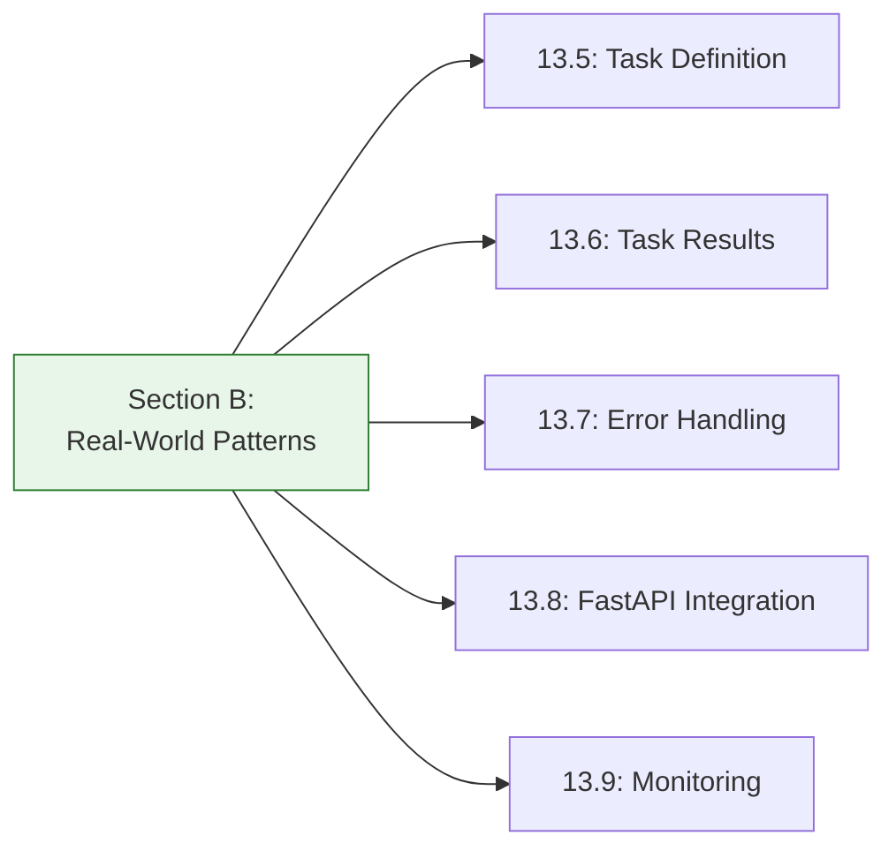
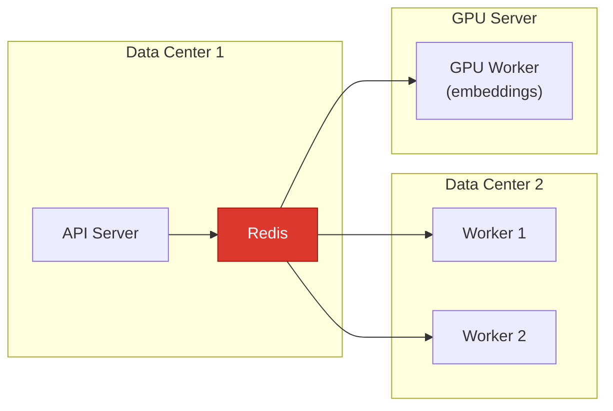

# Lesson 13.10: Task Patterns Q&A

> **Duration**: 10 min | **Section**: B - Real-World Patterns Recap

## 🔍 Section B: What We Learned



## 🔑 Quick Reference

### Task Definition

```python
@app.task(
    name="explicit.name",      # Stable name
    bind=True,                  # Access self
    max_retries=3,              # Retry limit
    autoretry_for=(Error,),     # Auto-retry exceptions
    retry_backoff=True,         # Exponential backoff
    time_limit=300,             # Hard timeout
    acks_late=True              # Reliable delivery
)
def my_task(self, arg1, arg2):
    self.update_state(state="PROCESSING", meta={"progress": 50})
    return result
```

### Task Results

```python
result = AsyncResult(task_id)
result.status    # PENDING, STARTED, PROCESSING, SUCCESS, FAILURE
result.info      # Progress info (for PROCESSING state)
result.result    # Return value (for SUCCESS state)
result.get(timeout=10)  # Wait for result
```

### Error Handling

```python
# Auto-retry
@app.task(autoretry_for=(ConnectionError,), retry_backoff=True)
def auto_retry_task(): ...

# Manual retry
@app.task(bind=True, max_retries=3)
def manual_retry_task(self):
    try:
        risky_operation()
    except TempError as e:
        self.retry(exc=e, countdown=60)
```

## ❓ Frequently Asked Questions

### Alternatives to Celery

**Q: What about Arq (async task queue)?**

| Aspect | Celery | Arq |
|--------|--------|-----|
| Async | No (sync by default) | Yes (native async) |
| Maturity | 10+ years | 4 years |
| Features | Very rich | Basic |
| Brokers | Redis, RabbitMQ, SQS | Redis only |
| Monitoring | Flower | Basic |
| Use case | Production apps | Async Python apps |

```python
# Arq example
import arq

async def process_document(ctx, file_path: str):
    # Native async!
    await async_operation(file_path)
    return {"status": "done"}

# Create queue
class WorkerSettings:
    functions = [process_document]
    redis_settings = arq.connections.RedisSettings()
```

**When to use Arq**: Small projects, native async, simpler needs.  
**When to use Celery**: Production, monitoring, complex workflows.

---

**Q: What about Dramatiq?**

Another Python task queue, middle ground between Celery and Arq:

```python
import dramatiq

@dramatiq.actor
def process_document(file_path: str):
    return {"status": "done"}

# Queue task
process_document.send(file_path)
```

| Aspect | Dramatiq |
|--------|----------|
| API | Simpler than Celery |
| Brokers | Redis, RabbitMQ |
| Async | No (sync) |
| Monitoring | Separate project |

---

### When NOT to Use Task Queues

**Q: When is a task queue overkill?**

| Situation | Better Alternative |
|-----------|-------------------|
| Simple async I/O | `asyncio.create_task()` |
| Fast operations (<1s) | Handle in request |
| Simple cron jobs | Celery Beat, or OS cron |
| One-off scripts | Just run the script |

```python
# Overkill for simple async
@app.post("/notify")
async def notify():
    task = send_notification.delay(user_id)  # Overkill!
    return {"task_id": task.id}

# Better for simple async
@app.post("/notify")
async def notify():
    asyncio.create_task(send_notification(user_id))  # Simpler
    return {"status": "sent"}
```

**Use task queues when**:
- Operations take > 30 seconds
- Need retries and persistence
- Need visibility and monitoring
- Scaling workers independently

---

### Architecture Questions

**Q: Can workers run on different machines?**

Yes! That's the point.



Workers just need network access to Redis. Run them anywhere.

---

**Q: How do I scale workers?**

```bash
# Kubernetes
kubectl scale deployment celery-worker --replicas=10

# Docker Compose
docker-compose up -d --scale worker=5

# Manual
celery -A app worker --concurrency=4 -n worker1
celery -A app worker --concurrency=4 -n worker2
```

---

**Q: What about priority queues?**

```python
# Define queues
celery_app.conf.update(
    task_queues=(
        Queue("high", routing_key="high"),
        Queue("default", routing_key="default"),
        Queue("low", routing_key="low"),
    ),
    task_default_queue="default"
)

# Route tasks
@app.task(queue="high")
def urgent_task(): ...

@app.task(queue="low")
def batch_task(): ...

# Start workers for specific queues
# celery -A app worker -Q high,default
# celery -A app worker -Q low
```

---

### Performance Questions

**Q: How many tasks can Celery handle?**

Depends on:
- Task duration
- Worker count
- Broker capacity

**Rough estimates**:
- Simple tasks (100ms): 10,000+ per second
- Medium tasks (1s): 1,000 per second per worker
- Long tasks (10s): 100 per second per worker

---

**Q: How to handle very large payloads?**

```python
# ❌ Don't pass large data
task.delay(huge_file_content)  # 100MB through Redis!

# ✅ Pass references
task.delay(s3_url)  # Just a URL
task.delay(file_path)  # Just a path
task.delay(db_id)  # Just an ID
```

---

## 💥 Common Pitfalls

### 1. Importing Celery App Wrong

```python
# ❌ Circular import
from app.main import celery_app

# ✅ Separate celery_app module
from workers.celery_app import celery_app
```

### 2. Not Testing Task Logic

```python
# ❌ Only testing with .delay()
def test_task():
    result = my_task.delay(arg).get()

# ✅ Test task logic directly
def test_task_logic():
    result = my_task(arg)  # Direct call
    assert result == expected
```

### 3. Ignoring Memory in Long-Running Workers

```python
# Workers can leak memory over time
# Solution: Restart after N tasks
celery_app.conf.update(
    worker_max_tasks_per_child=1000,  # Restart worker after 1000 tasks
)
```

### 4. No Task Idempotency

```python
# ❌ Not idempotent - creates duplicates on retry
@app.task
def create_order(user_id, product_id):
    Order.create(user_id=user_id, product_id=product_id)

# ✅ Idempotent - safe to retry
@app.task
def create_order(order_id, user_id, product_id):
    Order.get_or_create(id=order_id, user_id=user_id, product_id=product_id)
```

## 🎯 Quick Quiz

**Q1**: Which is better for a 50ms operation?

A) Celery task  
B) Handle in request

<details>
<summary>Answer</summary>
**B** - Too fast for task queue overhead. Handle in request.
</details>

**Q2**: Task fails with `ConnectionError`. Should you retry?

<details>
<summary>Answer</summary>
**Yes** - Connection errors are usually temporary. Use `autoretry_for=(ConnectionError,)`.
</details>

**Q3**: You need to process 10,000 images. How?

A) One task per image  
B) One task for all images  
C) Batch tasks (100 images each)

<details>
<summary>Answer</summary>
**C** - Batching reduces overhead while enabling parallelism.

```python
# Queue 100 batch tasks of 100 images each
for i in range(0, 10000, 100):
    process_image_batch.delay(image_ids[i:i+100])
```
</details>

## 🔑 Key Takeaways

1. **Celery** is production-ready, feature-rich
2. **Arq** is simpler, async-native alternative
3. **Don't use queues** for fast operations
4. **Scale** by adding workers, not changing code
5. **Idempotency** is critical for retries
6. **Monitor** with Flower or Prometheus

---

**Next**: 13.11 - Module Review
