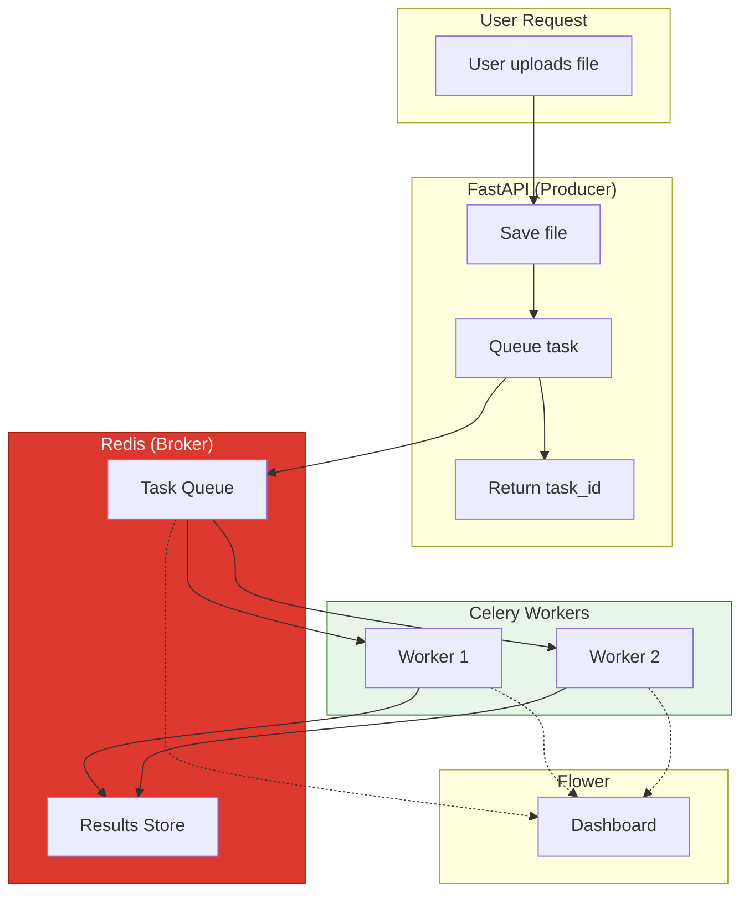
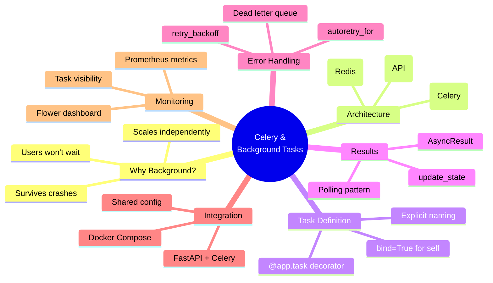

# Lesson 13.11: Module Review - Celery & Background Tasks

> **Duration**: 15 min | **Type**: Module Review

## 🎯 Module Objectives Recap

In this module, you learned to:

1. ✅ Understand why background processing matters
2. ✅ Differentiate sync, async I/O, and background tasks
3. ✅ Design producer-broker-worker architecture
4. ✅ Set up Celery with Redis
5. ✅ Define production-ready tasks
6. ✅ Track task progress and results
7. ✅ Handle errors with retries
8. ✅ Integrate Celery with FastAPI
9. ✅ Monitor with Flower

## 🔍 The Complete Mental Model



## 🔑 Key Concepts Map



## 📊 Decision Matrix

### When to Use Background Tasks

| Scenario | Background Task? | Why |
|----------|:----------------:|-----|
| Simple DB query (50ms) | ❌ | Too fast |
| LLM generation (3s) | Maybe | Borderline |
| Document processing (30s) | ✅ | Too slow for request |
| Batch embedding (5min) | ✅ | Way too slow |
| Sending email | ✅ | Fire and forget |
| Daily data sync | ✅ | Scheduled job |
| Health check | ❌ | Must be synchronous |

### Task Configuration Quick Reference

| Setting | When to Use |
|---------|-------------|
| `bind=True` | Need access to self (progress, retry) |
| `max_retries=3` | Operations that may temporarily fail |
| `autoretry_for=(...)` | Known temporary errors |
| `retry_backoff=True` | Avoid hammering failing services |
| `time_limit=300` | Prevent runaway tasks |
| `acks_late=True` | Critical tasks (survive crashes) |
| `ignore_result=True` | Fire-and-forget (emails, logs) |

### Error Handling Strategies

| Error Type | Strategy |
|------------|----------|
| Network timeout | Retry with backoff |
| Rate limited (429) | Retry with longer delay |
| Invalid input | Return error, no retry |
| Server error (5xx) | Retry with backoff |
| Auth error (401/403) | No retry, alert |
| File not found | No retry, log error |

## 💡 Code Patterns Cheatsheet

### Basic Task

```python
@app.task(name="tasks.simple")
def simple_task(arg: str) -> dict:
    return {"result": arg}

# Queue it
task = simple_task.delay("hello")
```

### Production Task

```python
@app.task(
    name="tasks.robust",
    bind=True,
    max_retries=3,
    autoretry_for=(ConnectionError,),
    retry_backoff=True,
    time_limit=300,
    acks_late=True
)
def robust_task(self, file_path: str) -> dict:
    self.update_state(state="PROCESSING", meta={"progress": 0})
    # ... work ...
    return {"status": "done"}
```

### Checking Results

```python
from celery.result import AsyncResult

result = AsyncResult(task_id)

if result.status == "PROCESSING":
    print(f"Progress: {result.info}")
elif result.status == "SUCCESS":
    print(f"Done: {result.result}")
elif result.status == "FAILURE":
    print(f"Failed: {result.result}")
```

### FastAPI Integration

```python
@app.post("/upload")
async def upload(file: UploadFile):
    file_path = save_file(file)
    task = process_file.delay(file_path)
    return {"task_id": task.id}

@app.get("/tasks/{task_id}")
async def get_status(task_id: str):
    result = AsyncResult(task_id)
    return {"status": result.status, "progress": result.info}
```

## 🎯 Independence Check

Can you answer these without looking back?

| Level | Question | Check |
|-------|----------|:-----:|
| **Know** | What are the three components of a task queue? | ☐ |
| **Understand** | Why use task queues instead of async/await? | ☐ |
| **Apply** | Set up Celery with Redis and create a task | ☐ |
| **Analyze** | Design retry strategy for an unreliable API | ☐ |
| **Create** | Build async document processing for RAG | ☐ |

## 🧪 Self-Assessment

### Scenario 1: Document Processing Pipeline

Design a task for processing uploaded PDFs:
- Extract text, chunk, embed, store
- Track progress at each step
- Retry on embedding API failures

<details>
<summary>Solution</summary>

```python
@app.task(
    name="documents.process",
    bind=True,
    max_retries=3,
    autoretry_for=(EmbeddingAPIError,),
    retry_backoff=True,
    time_limit=600
)
def process_document(self, file_path: str, user_id: str) -> dict:
    # Step 1: Extract
    self.update_state(state="PROCESSING", meta={"step": "extracting", "progress": 20})
    text = extract_text(file_path)
    
    # Step 2: Chunk
    self.update_state(state="PROCESSING", meta={"step": "chunking", "progress": 40})
    chunks = chunk_text(text)
    
    # Step 3: Embed (may retry)
    self.update_state(state="PROCESSING", meta={"step": "embedding", "progress": 60})
    embeddings = get_embeddings(chunks)
    
    # Step 4: Store
    self.update_state(state="PROCESSING", meta={"step": "storing", "progress": 80})
    doc_id = store_document(chunks, embeddings, user_id)
    
    return {"document_id": doc_id, "chunks": len(chunks)}
```

</details>

### Scenario 2: Rate-Limited API

You need to call an API that allows 10 requests/minute.

<details>
<summary>Solution</summary>

```python
@app.task(
    name="api.call",
    rate_limit="10/m",  # Celery enforces rate limit
    bind=True,
    max_retries=5
)
def call_api(self, data: dict) -> dict:
    try:
        response = requests.post(API_URL, json=data)
        
        if response.status_code == 429:
            retry_after = int(response.headers.get("Retry-After", 60))
            self.retry(countdown=retry_after)
        
        return response.json()
    except requests.Timeout as e:
        self.retry(exc=e, countdown=30)
```

</details>

### Scenario 3: Scaling Workers

Queue is backing up with 500 pending tasks. What do you do?

<details>
<summary>Solution</summary>

1. **Immediate**: Scale workers
```bash
docker-compose up -d --scale worker=5
```

2. **Check**: Monitor with Flower
```bash
curl http://flower:5555/api/queues/length
```

3. **Investigate**: Are tasks slow? Errors?

4. **Long-term**: Set up auto-scaling based on queue depth

</details>

## 🚀 What's Next?

With background tasks mastered, you're ready for:

| Module | Topic | How Celery Helps |
|--------|-------|------------------|
| 14 | pgvector | Batch embedding tasks |
| 15 | Kubernetes | Scale Celery workers |
| 11 | LLMOps | Async evaluation pipelines |

## 📚 Resources

- [Celery Documentation](https://docs.celeryq.dev/)
- [Celery Best Practices](https://docs.celeryq.dev/en/stable/userguide/tasks.html#tips-and-best-practices)
- [Flower Dashboard](https://flower.readthedocs.io/)
- [Redis + Celery](https://docs.celeryq.dev/en/stable/getting-started/backends-and-brokers/redis.html)

---

**Module Complete!** 🎉

You now understand background task processing from fundamentals through production patterns. In Module 14, you'll learn pgvector - running PostgreSQL as your vector database.
