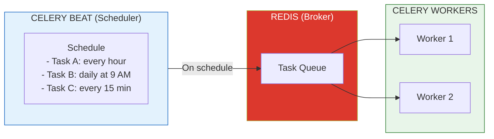
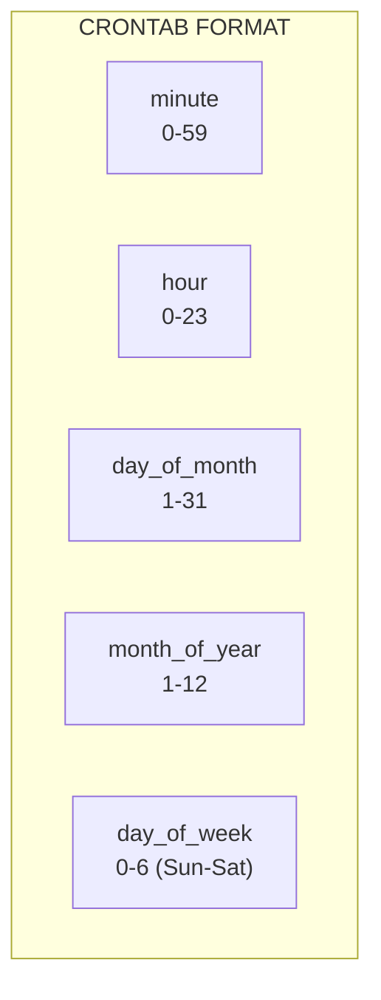

# Lesson 13.12: Celery Beat - Scheduled Tasks

> **Duration**: 30 min | **Section**: C - Advanced Patterns

## 🎯 The Problem

Your RAG system needs maintenance tasks:
- Refresh embeddings for updated documents (daily)
- Clean up expired cache entries (hourly)  
- Generate usage reports (weekly)
- Sync with external data sources (every 15 minutes)

You're running these manually. Or worse, you have cron jobs scattered across servers that nobody remembers.

> **Scenario**: Every Monday at 9 AM, you need to regenerate embeddings for documents updated in the past week. You set a reminder. You forget. Three weeks later, users complain that search results are stale. "I updated that document ages ago!"

## 🧪 Try It: The Naive Approach

```python
# Option 1: Manual cron on server
# /etc/crontab
# 0 9 * * 1 /usr/bin/python /app/scripts/refresh_embeddings.py

# Problems:
# - Not version controlled
# - Hard to monitor
# - Runs outside your app's context
# - Different servers, different crons

# Option 2: While loop in your app
import time

def scheduler():
    while True:
        refresh_embeddings()
        time.sleep(86400)  # Wait 24 hours

# Problems:
# - Blocks a process
# - Crashes = no more scheduling
# - Can't scale
# - No retry on failure
```

## 🔍 Under the Hood: Celery Beat



**Celery Beat** is a scheduler that runs alongside your Celery workers. It reads a schedule configuration and sends tasks to the queue at the right times.

---

## ✅ The Fix: Celery Beat Configuration

### Step 1: Define Scheduled Tasks

```python
# app/celery_config.py
from celery import Celery
from celery.schedules import crontab

celery_app = Celery(
    "tasks",
    broker="redis://localhost:6379/0",
    backend="redis://localhost:6379/1"
)

# Schedule configuration
celery_app.conf.beat_schedule = {
    # Run every 15 minutes
    "sync-external-data": {
        "task": "app.tasks.sync_external_data",
        "schedule": 900.0,  # 900 seconds = 15 minutes
    },
    
    # Run every hour at minute 0
    "cleanup-cache": {
        "task": "app.tasks.cleanup_expired_cache",
        "schedule": crontab(minute=0),
    },
    
    # Run daily at 2 AM
    "refresh-embeddings": {
        "task": "app.tasks.refresh_stale_embeddings",
        "schedule": crontab(hour=2, minute=0),
    },
    
    # Run every Monday at 9 AM
    "weekly-report": {
        "task": "app.tasks.generate_weekly_report",
        "schedule": crontab(hour=9, minute=0, day_of_week=1),
    },
    
    # Run on the 1st of every month
    "monthly-cleanup": {
        "task": "app.tasks.monthly_data_cleanup",
        "schedule": crontab(day_of_month=1, hour=3, minute=0),
    },
}

# Timezone for crontab
celery_app.conf.timezone = "Asia/Kolkata"
```

### Step 2: Implement the Tasks

```python
# app/tasks.py
from app.celery_config import celery_app
from datetime import datetime, timedelta
import logging

logger = logging.getLogger(__name__)

@celery_app.task(bind=True, max_retries=3)
def sync_external_data(self):
    """Sync data from external sources every 15 minutes."""
    try:
        logger.info("Starting external data sync")
        
        # Your sync logic here
        from app.services.sync import DataSyncer
        syncer = DataSyncer()
        result = syncer.sync_all_sources()
        
        logger.info(f"Synced {result['records_updated']} records")
        return result
        
    except Exception as e:
        logger.error(f"Sync failed: {e}")
        raise self.retry(exc=e, countdown=60)  # Retry in 1 minute


@celery_app.task
def cleanup_expired_cache():
    """Clean up expired cache entries hourly."""
    import redis
    
    r = redis.Redis(host="localhost", port=6379, db=0)
    
    # Redis handles TTL automatically, but we may have cleanup logic
    # For example, cleaning up orphaned keys
    pattern = "cache:query:*"
    deleted = 0
    
    for key in r.scan_iter(pattern):
        if r.ttl(key) == -1:  # No TTL set (orphaned)
            r.delete(key)
            deleted += 1
    
    logger.info(f"Cleaned up {deleted} orphaned cache entries")
    return {"deleted": deleted}


@celery_app.task(bind=True, max_retries=2)
def refresh_stale_embeddings(self):
    """Refresh embeddings for documents updated in the last 24 hours."""
    try:
        from app.services.embeddings import EmbeddingService
        from app.db import get_db
        
        db = get_db()
        embedding_service = EmbeddingService()
        
        # Find documents updated since last run
        cutoff = datetime.utcnow() - timedelta(hours=24)
        stale_docs = db.query(
            "SELECT id, content FROM documents WHERE updated_at > %s",
            [cutoff]
        )
        
        updated = 0
        for doc in stale_docs:
            embedding = embedding_service.embed(doc["content"])
            db.execute(
                "UPDATE documents SET embedding = %s WHERE id = %s",
                [embedding, doc["id"]]
            )
            updated += 1
        
        logger.info(f"Refreshed embeddings for {updated} documents")
        return {"refreshed": updated}
        
    except Exception as e:
        logger.error(f"Embedding refresh failed: {e}")
        raise self.retry(exc=e, countdown=300)  # Retry in 5 minutes


@celery_app.task
def generate_weekly_report():
    """Generate and send weekly usage report."""
    from app.services.reports import ReportGenerator
    from app.services.email import send_email
    
    generator = ReportGenerator()
    report = generator.generate_weekly_summary()
    
    # Send to admins
    send_email(
        to=["admin@company.com"],
        subject=f"RAG App Weekly Report - {datetime.now().strftime('%Y-%m-%d')}",
        body=report.to_html()
    )
    
    logger.info("Weekly report sent")
    return {"sent": True}


@celery_app.task
def monthly_data_cleanup():
    """Archive old data on the 1st of each month."""
    from app.db import get_db
    
    db = get_db()
    cutoff = datetime.utcnow() - timedelta(days=90)
    
    # Archive old chat sessions
    archived = db.execute(
        """
        INSERT INTO chat_sessions_archive 
        SELECT * FROM chat_sessions WHERE created_at < %s;
        
        DELETE FROM chat_sessions WHERE created_at < %s;
        """,
        [cutoff, cutoff]
    )
    
    logger.info(f"Archived {archived} old chat sessions")
    return {"archived": archived}
```

### Step 3: Run Celery Beat

```bash
# Terminal 1: Run workers
celery -A app.celery_config worker --loglevel=info

# Terminal 2: Run beat scheduler
celery -A app.celery_config beat --loglevel=info

# Or run both together (development only)
celery -A app.celery_config worker --beat --loglevel=info
```

---

## 📅 Crontab Reference

```python
from celery.schedules import crontab

# Every minute
crontab()

# Every hour at minute 0
crontab(minute=0)

# Every day at midnight
crontab(minute=0, hour=0)

# Every day at 2:30 AM
crontab(minute=30, hour=2)

# Every Monday at 9 AM
crontab(minute=0, hour=9, day_of_week=1)

# First day of every month at 3 AM
crontab(minute=0, hour=3, day_of_month=1)

# Every 15 minutes
crontab(minute="*/15")

# Every 2 hours
crontab(minute=0, hour="*/2")

# Weekdays at 9 AM
crontab(minute=0, hour=9, day_of_week="1-5")

# Multiple times per day
crontab(minute=0, hour="9,12,18")  # 9 AM, 12 PM, 6 PM
```



---

## 🔒 Production Best Practices

### Prevent Duplicate Runs

```python
from celery import Celery
from celery.schedules import crontab
import redis

celery_app = Celery("tasks", broker="redis://localhost:6379/0")

# Use Redis lock to prevent duplicate runs
@celery_app.task(bind=True)
def critical_task(self):
    """Task that must not run concurrently."""
    r = redis.Redis()
    lock_key = f"lock:{self.name}"
    
    # Try to acquire lock
    lock = r.set(lock_key, "1", nx=True, ex=3600)  # 1 hour expiry
    
    if not lock:
        logger.warning(f"Task {self.name} already running, skipping")
        return {"skipped": True}
    
    try:
        # Do the work
        result = do_critical_work()
        return result
    finally:
        r.delete(lock_key)
```

### Monitoring Scheduled Tasks

```python
# Check when tasks will run next
from celery.schedules import crontab
from datetime import datetime

schedule = crontab(hour=2, minute=0)
remaining = schedule.remaining_estimate(datetime.now())
print(f"Next run in: {remaining}")

# In Flower dashboard:
# http://localhost:5555/tasks
# Shows scheduled tasks and their timing
```

### Docker Compose Setup

```yaml
# docker-compose.yml
version: "3.8"

services:
  redis:
    image: redis:7-alpine
    ports:
      - "6379:6379"
  
  celery-worker:
    build: .
    command: celery -A app.celery_config worker --loglevel=info
    depends_on:
      - redis
    environment:
      - REDIS_URL=redis://redis:6379/0
  
  celery-beat:
    build: .
    command: celery -A app.celery_config beat --loglevel=info
    depends_on:
      - redis
      - celery-worker
    environment:
      - REDIS_URL=redis://redis:6379/0
    # Only run ONE beat instance!
    deploy:
      replicas: 1
  
  flower:
    build: .
    command: celery -A app.celery_config flower --port=5555
    ports:
      - "5555:5555"
    depends_on:
      - redis
```

---

## 📊 Dynamic Schedules

```python
# Store schedules in database for dynamic updates
from celery.beat import Scheduler
from django_celery_beat.models import PeriodicTask, IntervalSchedule

# Create schedule dynamically
schedule, _ = IntervalSchedule.objects.get_or_create(
    every=15,
    period=IntervalSchedule.MINUTES,
)

PeriodicTask.objects.create(
    interval=schedule,
    name="Dynamic task",
    task="app.tasks.my_task",
    args=json.dumps(["arg1", "arg2"]),
)

# For non-Django: use celery-sqlalchemy-scheduler or celery-redbeat
```

### Celery RedBeat (Redis-based dynamic scheduler)

```python
# pip install celery-redbeat

from celery import Celery

celery_app = Celery("tasks", broker="redis://localhost:6379/0")

# Use RedBeat scheduler
celery_app.conf.beat_scheduler = "redbeat.RedBeatScheduler"
celery_app.conf.redbeat_redis_url = "redis://localhost:6379/1"

# Now schedules are stored in Redis and can be modified dynamically
```

---

## 🎯 Practice

1. **Create a scheduled task** that runs every 5 minutes and logs "heartbeat"
2. **Add a daily task** that generates a summary report at 9 AM
3. **Implement locking** to prevent duplicate runs
4. **Run with Docker Compose** including beat and flower
5. **Monitor in Flower** to see scheduled tasks

```python
# Quick test task
@celery_app.task
def heartbeat():
    logger.info(f"Heartbeat at {datetime.now()}")
    return {"status": "alive", "time": datetime.now().isoformat()}

# Add to schedule
celery_app.conf.beat_schedule["heartbeat"] = {
    "task": "app.tasks.heartbeat",
    "schedule": 300.0,  # Every 5 minutes
}
```

## 🔑 Key Takeaways

- **Celery Beat** = scheduler that sends tasks at configured times
- **crontab()** = flexible cron-like scheduling
- **Run only ONE beat process** = multiple beats = duplicate tasks
- **Use locking** for critical tasks that must not overlap
- **Monitor with Flower** = visibility into scheduled tasks
- **Dynamic schedules** = RedBeat or django-celery-beat for runtime changes

## ❓ Common Questions

| Question | Answer |
|----------|--------|
| What if beat crashes? | Tasks resume when beat restarts, but missed runs are lost |
| Can I have multiple beat processes? | NO! This causes duplicate task execution |
| How do I test scheduled tasks? | Call task directly: `my_task.delay()` or `my_task()` |
| What about missed runs? | By default, Celery doesn't catch up - design tasks to be idempotent |

## 🔗 Further Reading

- [Celery Beat Documentation](https://docs.celeryq.dev/en/stable/userguide/periodic-tasks.html)
- [celery-redbeat](https://github.com/sibson/redbeat) - Redis-based scheduler
- [django-celery-beat](https://django-celery-beat.readthedocs.io/) - Database-backed scheduler
- [Cron Expression Generator](https://crontab.guru/)

---

**Next**: [Module 13 Review](Lesson-11-Module-Review.md) | **Up**: [Module 13 README](README.md)
