# Module 13: Background Tasks & Celery

> **Duration**: ~4 hours | **Lessons**: 12 | **Project**: Process Documents Asynchronously

## 🎯 Module Overview

Your RAG pipeline works. User uploads a document... then waits. And waits. 30 seconds. Timeout. Refresh. Duplicate processing. Users leave.

This module teaches you to return **instantly** and process **in the background**.

## 🗺️ Module Structure

| Section | Lessons | Focus |
|---------|:-------:|-------|
| **A: Task Queue Under the Hood** | 13.0 - 13.4 | Why background processing matters |
| **B: Real-World Patterns** | 13.5 - 13.11 | Production-ready Celery |

## 📚 Lessons

| # | Lesson | Topic | Duration |
|:-:|:-------|:------|:--------:|
| 13.0 | The Waiting Problem | Why instant response matters | 10 min |
| 13.1 | Sync vs Async | Blocking vs non-blocking execution | 20 min |
| 13.2 | Task Queue Architecture | Producer → Broker → Worker | 25 min |
| 13.3 | Celery Setup | Install, configure, first task | 30 min |
| 13.4 | Queue Basics Q&A | Worker crashes, scaling questions | 10 min |
| 13.5 | Task Definition | @celery.task decorator deep dive | 25 min |
| 13.6 | Task Results | AsyncResult and progress tracking | 25 min |
| 13.7 | Error Handling | Retries, backoff, dead letters | 30 min |
| 13.8 | Celery + FastAPI | Background processing in APIs | 35 min |
| 13.9 | Monitoring | Flower dashboard and visibility | 25 min |
| 13.10 | Task Patterns Q&A | Alternatives and when NOT to queue | 10 min |
| 13.11 | Module Review | Task queue mental model | 15 min |

## 🧠 The Mental Model

```mermaid
flowchart TD
    subgraph Without["❌ WITHOUT QUEUE"]
        W1["User uploads PDF"]
        W2["API processes (30s)"]
        W3["User waits..."]
        W4["Timeout or leaves"]
        W1 --> W2 --> W3 --> W4
    end
    
    subgraph With["✅ WITH QUEUE"]
        Q1["User uploads PDF"]
        Q2["API returns task_id"]
        Q3["User sees 'Processing...'"]
        Q4["Worker processes in background"]
        Q5["User polls for status"]
        Q6["Complete! Results ready"]
        Q1 --> Q2 --> Q3
        Q2 -.-> Q4
        Q3 --> Q5 --> Q6
    end
    
    style Without fill:#FFEBEE,stroke:#C62828
    style With fill:#E8F5E9,stroke:#2E7D32
```



## 🔑 Key Concepts

### The Producer-Broker-Worker Pattern


| Component | Role | Example |
|-----------|------|---------|
| **Producer** | Creates tasks | FastAPI endpoint |
| **Broker** | Message queue | Redis (you already know it!) |
| **Worker** | Executes tasks | Celery worker process |

### Sync vs Async Mental Model

| Sync (Blocking) | Async (Background) |
|-----------------|-------------------|
| Wait for result | Return immediately |
| User blocked | User continues |
| Simple code | Task tracking needed |
| Good for fast ops | Good for slow ops |

## 📊 Technology Stack

```
┌─────────────────────────────────────────────┐
│                 FastAPI                      │
│           (produces tasks)                   │
└────────────────────┬────────────────────────┘
                     │
                     ▼
┌─────────────────────────────────────────────┐
│                  Redis                       │
│        (message broker + results)            │
└────────────────────┬────────────────────────┘
                     │
          ┌──────────┼──────────┐
          ▼          ▼          ▼
      ┌───────┐  ┌───────┐  ┌───────┐
      │Worker │  │Worker │  │Worker │
      │   1   │  │   2   │  │   3   │
      └───────┘  └───────┘  └───────┘
```

## 🎯 Module Project

Build an async document processing pipeline:

1. User uploads PDF via API
2. API immediately returns `task_id`
3. Celery worker processes document in background
4. Client polls `/tasks/{task_id}` for status
5. When complete, client gets results

```python
# What you'll build
@app.post("/documents/upload")
async def upload_document(file: UploadFile):
    # Save file
    file_path = save_upload(file)
    
    # Queue background task (instant!)
    task = process_document.delay(file_path)
    
    # Return immediately
    return {"task_id": task.id, "status_url": f"/tasks/{task.id}"}

@app.get("/tasks/{task_id}")
async def get_task_status(task_id: str):
    result = AsyncResult(task_id)
    return {
        "task_id": task_id,
        "status": result.status,
        "progress": result.info.get("progress") if result.info else None
    }
```

## 🎯 Independence Check

By the end of this module, you should be able to:

| Level | Question |
|-------|----------|
| **Know** | What are the components of a task queue? |
| **Understand** | Why use background tasks instead of async/await? |
| **Apply** | Set up Celery with Redis and create tasks |
| **Analyze** | Design retry strategies for unreliable APIs |
| **Create** | Build async document processing for RAG |

## 📚 Prerequisites

- Module 12: Redis & Caching (Redis as broker)
- Module 5-6: FastAPI (API endpoints)
- Module 4: Docker (running Redis, workers)

## 🔗 External Resources

- [Celery Documentation](https://docs.celeryq.dev/)
- [Flower Monitoring](https://flower.readthedocs.io/)
- [Redis as Message Broker](https://docs.celeryq.dev/en/stable/getting-started/backends-and-brokers/redis.html)
- [Celery + FastAPI Tutorial](https://testdriven.io/blog/fastapi-and-celery/)
- [Celery Best Practices](https://docs.celeryq.dev/en/stable/userguide/tasks.html#best-practices)

---

**Ready?** → Start with [Lesson 13.0 - The Waiting Problem](Lesson-00-The-Waiting-Problem.md)
