# Lesson 14.0: The Two Database Problem

> **Duration**: 10 min | **Section**: A - pgvector Under the Hood

## 🎯 The Problem

Your RAG application has grown. Look at your architecture:


**You now have THREE databases to manage.**

## 🔍 Under the Hood: The Complexity Cost

### Deployment

```yaml
# docker-compose.yml - Getting complex!
services:
  postgres:
    image: postgres:16
    volumes:
      - pg_data:/var/lib/postgresql/data
    
  chromadb:
    image: chromadb/chroma
    volumes:
      - chroma_data:/chroma/chroma
    
  redis:
    image: redis:7-alpine
    volumes:
      - redis_data:/data
```

Three volumes. Three backup strategies. Three upgrade paths.

### Backups

```bash
# PostgreSQL backup
pg_dump -h postgres mydb > backup.sql

# ChromaDB backup... how?
# (It's just files in a volume, but what's the format?)

# Redis backup
redis-cli BGSAVE
```

**When do you run them? In sync? What if one fails?**

### Failure Modes

```mermaid
flowchart TD
    subgraph FAILURES["What Can Go Wrong"]
        F1["PostgreSQL down<br/>→ No user data"]
        F2["ChromaDB down<br/>→ No search"]
        F3["Redis down<br/>→ No cache"]
        F4["PG + Chroma desync<br/>→ Orphan vectors"]
    end
    
    style FAILURES fill:#FFEBEE,stroke:#C62828
```



| Problem | When | Impact |
|---------|------|--------|
| DB connection limits | High load | Some requests fail |
| Orphan embeddings | User deleted | Stale search results |
| Version mismatch | Upgrade time | Subtle bugs |
| Backup desync | Point-in-time recovery | Data inconsistency |

### The JOIN Problem

You want to search documents **for a specific user**:

```python
# With ChromaDB: Two round trips
user = await postgres.fetch("SELECT * FROM users WHERE id = $1", user_id)
if user.subscription != "premium":
    raise HTTPException(403, "Premium only")

# Then search ChromaDB
results = collection.query(
    query_embeddings=[embedding],
    where={"user_id": user_id}  # Limited filtering!
)
```

**You can't JOIN across databases!**

## 🔍 The Cost of Complexity


## 🔍 What If...?

What if PostgreSQL could store vectors?


**Benefits:**
- One backup command
- One monitoring dashboard
- Full SQL power
- Foreign keys work!
- Transactions work!
- JOINs work!

```sql
-- This becomes possible!
SELECT d.content, d.embedding <-> $1 AS distance
FROM documents d
JOIN users u ON d.user_id = u.id
WHERE u.subscription = 'premium'
  AND d.created_at > NOW() - INTERVAL '7 days'
ORDER BY distance
LIMIT 5;
```

## 🔍 When to Use pgvector vs ChromaDB

| Criteria | pgvector | ChromaDB |
|----------|----------|----------|
| You already use PostgreSQL | ✅ Yes | Maybe |
| Need JOINs with regular data | ✅ Yes | ❌ No |
| Need transactions | ✅ Yes | ❌ No |
| Want simple deployment | ✅ Yes | More services |
| Very large scale (100M+ vectors) | ⚠️ Limits | ⚠️ Also limits |
| Just prototyping | Either | ✅ Simpler |
| Need specialized vector features | ❌ Basic | ✅ More options |

**For most production RAG apps: pgvector wins.**

## 🔍 Real-World Example

### Before: Two Databases

```python
# User wants their similar documents
async def get_similar_docs(user_id: str, query: str):
    # 1. Check user exists (PostgreSQL)
    user = await db.fetch_one(
        "SELECT * FROM users WHERE id = $1", user_id
    )
    if not user:
        raise HTTPException(404)
    
    # 2. Get embedding (API call)
    embedding = await get_embedding(query)
    
    # 3. Search vectors (ChromaDB)
    results = collection.query(
        query_embeddings=[embedding],
        where={"user_id": user_id},
        n_results=5
    )
    
    # 4. Get full document data (PostgreSQL again!)
    doc_ids = [r["id"] for r in results["metadatas"][0]]
    docs = await db.fetch_all(
        "SELECT * FROM documents WHERE id = ANY($1)", doc_ids
    )
    
    return docs
```

**Four steps. Two databases. Multiple round trips.**

### After: One Database

```python
async def get_similar_docs(user_id: str, query: str):
    embedding = await get_embedding(query)
    
    # One query does it all!
    docs = await db.fetch_all("""
        SELECT d.*, u.name as owner_name,
               d.embedding <=> $1 AS distance
        FROM documents d
        JOIN users u ON d.user_id = u.id
        WHERE d.user_id = $2
        ORDER BY distance
        LIMIT 5
    """, embedding, user_id)
    
    return docs
```

**One query. Full SQL power. Foreign key validated.**

## 💡 Key Insight

> **pgvector turns PostgreSQL into a vector database without losing SQL.**

You don't need to learn a new database. You just add a data type.

## 🔑 Key Takeaways

1. **Multiple databases = Multiple problems** (backups, sync, monitoring)
2. **ChromaDB can't JOIN** with your regular data
3. **pgvector adds vectors to PostgreSQL** - one database for everything
4. **Full SQL power** - JOINs, transactions, foreign keys
5. **Simpler ops** - one backup, one upgrade, one monitor

## ❓ Questions to Consider

Before moving on, think about:

1. How many databases does your current project use?
2. What queries would be easier with JOINs?
3. What's your current backup strategy for vectors?

---

**Next**: 14.1 - What IS pgvector?
