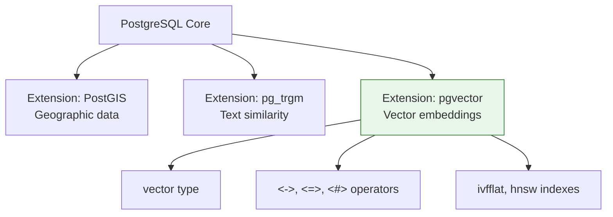
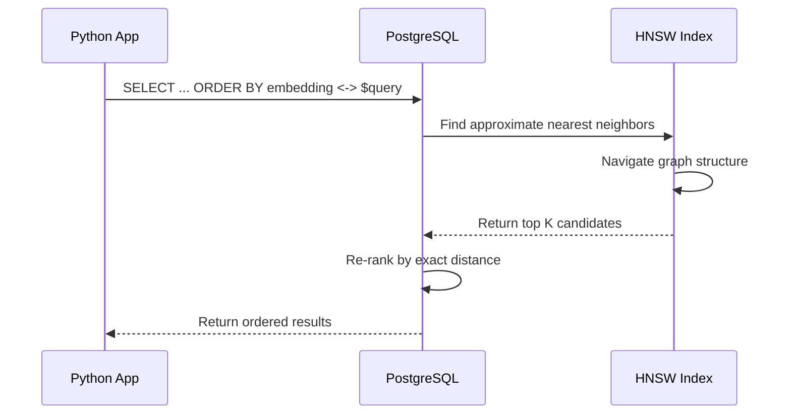
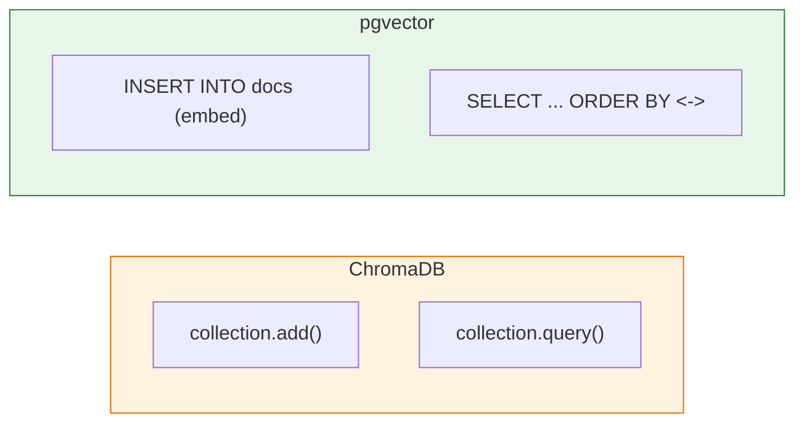

# Lesson 14.1: What IS pgvector?

> **Duration**: 20 min | **Section**: A - pgvector Under the Hood

## 🎯 The Problem

PostgreSQL has types: `INTEGER`, `TEXT`, `JSONB`, `TIMESTAMP`.

But no `VECTOR` type for embeddings.

**pgvector adds it.**

## 🔍 Under the Hood: PostgreSQL Extensions

PostgreSQL has an **extension system**. Extensions add:
- New data types
- New operators
- New functions
- New index types



**pgvector is just another extension** - like PostGIS for maps.

## 🔍 What pgvector Adds

### 1. The `vector` Type

```sql
-- Create a column that holds 1536-dimensional vectors
CREATE TABLE documents (
    id SERIAL PRIMARY KEY,
    content TEXT,
    embedding vector(1536)  -- 1536 dimensions (OpenAI)
);
```

**What's stored?**

A `vector` is an array of floating-point numbers:

```
[0.023, -0.041, 0.089, ..., 0.012]  -- 1536 numbers
```

### 2. Distance Operators

| Operator | Name | Returns |
|----------|------|---------|
| `<->` | Euclidean distance | sqrt(Σ(a-b)²) |
| `<=>` | Cosine distance | 1 - cosine_similarity |
| `<#>` | Negative inner product | -Σ(a×b) |

```sql
-- Find documents closest to query vector
SELECT content
FROM documents
ORDER BY embedding <-> '[0.1, 0.2, ...]'::vector
LIMIT 5;
```

### 3. Index Types

| Index | Algorithm | Speed | Accuracy | Memory |
|-------|-----------|-------|----------|--------|
| None | Exact search | Slow | 100% | Low |
| IVFFlat | Inverted file | Fast | ~95% | Medium |
| HNSW | Graph-based | Fastest | ~98% | High |

```sql
-- Create an HNSW index for fast search
CREATE INDEX ON documents 
USING hnsw (embedding vector_cosine_ops);
```

## 🔍 How Vector Search Works

### Step 1: Store Embeddings

```python
# Your Python code
embedding = get_embedding("Machine learning basics")
# → [0.023, -0.041, ..., 0.012] (1536 floats)

await db.execute("""
    INSERT INTO documents (content, embedding)
    VALUES ($1, $2)
""", "Machine learning basics", embedding)
```

### Step 2: Search

```python
query_embedding = get_embedding("What is ML?")

results = await db.fetch("""
    SELECT content, embedding <-> $1 AS distance
    FROM documents
    ORDER BY distance
    LIMIT 5
""", query_embedding)
```

### What Happens Under the Hood



## 🔍 Comparison with ChromaDB



| Aspect | ChromaDB | pgvector |
|--------|----------|----------|
| Language | Python API | SQL |
| Storage | Separate DB | PostgreSQL |
| Filtering | Limited WHERE | Full SQL |
| JOINs | ❌ No | ✅ Yes |
| Transactions | ❌ No | ✅ Yes |
| Maturity | 2 years | 3+ years |
| Scale | Good | Good |

## 🔍 Dimension Limits

pgvector supports vectors up to **16,000 dimensions**.

Common embedding models:

| Model | Dimensions | Fits? |
|-------|------------|-------|
| OpenAI text-embedding-3-small | 1536 | ✅ |
| OpenAI text-embedding-3-large | 3072 | ✅ |
| Cohere embed-v3 | 1024 | ✅ |
| Google text-embedding-004 | 768 | ✅ |
| BGE-large | 1024 | ✅ |

## 🔍 pgvector vs Dedicated Vector DBs

| Feature | pgvector | Pinecone | Weaviate |
|---------|----------|----------|----------|
| Self-hosted | ✅ | ❌ | ✅ |
| Managed option | ✅ (RDS, Supabase) | ✅ | ✅ |
| SQL integration | ✅ Native | ❌ | ❌ |
| Billions of vectors | ⚠️ Limits | ✅ | ✅ |
| Cost | Low | High | Medium |
| Complexity | Low | Low | Medium |

**When to use dedicated vector DBs:**
- Billions of vectors
- Specialized features (hybrid search built-in)
- Team already using it

**When to use pgvector:**
- Already using PostgreSQL
- Need SQL integration
- Want simpler ops

## 🔍 Real Numbers

Performance benchmarks (approximate):

| Operation | Time (1M vectors) |
|-----------|-------------------|
| Insert 1 vector | ~1ms |
| Search (no index) | ~500ms |
| Search (IVFFlat) | ~5ms |
| Search (HNSW) | ~1ms |

**With HNSW index, pgvector is production-ready fast.**

## 🎯 Practice

Think about your RAG application:

1. What embedding model are you using? How many dimensions?
2. How many vectors do you expect to store?
3. What metadata do you need to filter by?

Write down:
- Embedding dimensions: ____
- Expected vector count: ____
- Filter fields: ____

## 🔑 Key Takeaways

1. **pgvector is a PostgreSQL extension** - adds vector type
2. **Three distance operators**: `<->` (L2), `<=>` (cosine), `<#>` (inner product)
3. **Two index types**: IVFFlat (balanced), HNSW (fastest)
4. **Full SQL power** - JOINs, transactions, constraints
5. **Up to 16,000 dimensions** - fits all common models
6. **Production-ready** - millisecond search with indexes

## ❓ Common Questions

| Question | Answer |
|----------|--------|
| Does pgvector work with RDS? | Yes! AWS RDS supports it |
| What about Supabase? | Yes! pgvector is included |
| Can I migrate from ChromaDB? | Yes, export and reimport |
| Is it as fast as Pinecone? | Close, slightly slower at huge scale |

---

**Next**: 14.2 - Vector Math in SQL
