# Lesson 14.2: Vector Math in SQL

> **Duration**: 25 min | **Section**: A - pgvector Under the Hood

## 🎯 The Problem

You need to find "similar" vectors. But what does "similar" mean mathematically?

pgvector offers three distance functions. Which one should you use?

## 🔍 Under the Hood: What is Distance?

### Euclidean Distance (L2)

The straight-line distance between two points.


**Formula**: $d = \sqrt{\sum_{i=1}^{n}(a_i - b_i)^2}$

```sql
-- pgvector operator: <->
SELECT embedding <-> query_vector AS distance
FROM documents
ORDER BY distance;
```

**Interpretation**:
- 0 = identical
- Larger = more different
- No upper bound

### Cosine Distance

The angle between two vectors (direction, not magnitude).

```mermaid
graph TD
    O["Origin<br/>(0,0)"] --> A["Vector A"]
    O --> B["Vector B"]
    
    A -.-> |"θ = angle"| B
    
    style O fill:#FFF3E0,stroke:#EF6C00
```



**Formula**: $d = 1 - \frac{A \cdot B}{||A|| \times ||B||}$

```sql
-- pgvector operator: <=>
SELECT embedding <=> query_vector AS distance
FROM documents
ORDER BY distance;
```

**Interpretation**:
- 0 = same direction (identical meaning)
- 1 = perpendicular (unrelated)
- 2 = opposite direction

### Inner Product (Dot Product)

The "overlap" between vectors.

**Formula**: $d = -\sum_{i=1}^{n}a_i \times b_i$

```sql
-- pgvector operator: <#>
-- Note: Returns NEGATIVE for use with ORDER BY
SELECT embedding <#> query_vector AS neg_similarity
FROM documents
ORDER BY neg_similarity;  -- Lower is more similar
```

**Interpretation**:
- More negative = more similar
- Zero = unrelated
- Positive = opposite

## 🔍 Which Distance Function to Use?


| Distance | Best For | Why |
|----------|----------|-----|
| **Cosine** `<=>` | Text embeddings | Focuses on direction, ignores magnitude |
| **L2** `<->` | General use | Intuitive, works everywhere |
| **Inner Product** `<#>` | Pre-normalized | Fastest, same as cosine for normalized |

**For RAG with OpenAI/Cohere embeddings**: Use **cosine distance** (`<=>`)

## 🔍 Practical Examples

### Setup: Sample Vectors

```sql
-- Create test table
CREATE TABLE test_vectors (
    id SERIAL PRIMARY KEY,
    label TEXT,
    vec vector(3)  -- 3D for illustration
);

-- Insert test vectors
INSERT INTO test_vectors (label, vec) VALUES
    ('a', '[1, 0, 0]'),      -- Points along X axis
    ('b', '[0, 1, 0]'),      -- Points along Y axis
    ('c', '[1, 1, 0]'),      -- Diagonal
    ('d', '[0.5, 0.5, 0]'),  -- Same direction as c, shorter
    ('e', '[-1, 0, 0]');     -- Opposite of a
```

### Euclidean Distance

```sql
SELECT 
    label,
    vec <-> '[1, 0, 0]' AS l2_distance
FROM test_vectors
ORDER BY l2_distance;
```

| label | l2_distance |
|-------|-------------|
| a | 0 |
| d | 0.707 |
| c | 1 |
| b | 1.414 |
| e | 2 |

### Cosine Distance

```sql
SELECT 
    label,
    vec <=> '[1, 0, 0]' AS cosine_distance
FROM test_vectors
ORDER BY cosine_distance;
```

| label | cosine_distance |
|-------|-----------------|
| a | 0 |
| c | 0.293 |
| d | 0.293 |  -- Same as c! (same direction)
| b | 1 |
| e | 2 |

**Key insight**: `c` and `d` have the same cosine distance because they point in the same direction.

### Inner Product

```sql
SELECT 
    label,
    vec <#> '[1, 0, 0]' AS neg_inner_product
FROM test_vectors
ORDER BY neg_inner_product;
```

| label | neg_inner_product |
|-------|-------------------|
| a | -1 |
| c | -1 |
| d | -0.5 |
| b | 0 |
| e | 1 |

## 🔍 Converting Between Distances

### Cosine to Similarity

```sql
-- Cosine distance is 1 - similarity
-- So similarity = 1 - distance

SELECT 
    label,
    1 - (vec <=> '[1, 0, 0]') AS cosine_similarity
FROM test_vectors
ORDER BY cosine_similarity DESC;  -- Higher is better
```

| label | cosine_similarity |
|-------|-------------------|
| a | 1.0 |
| c | 0.707 |
| d | 0.707 |
| b | 0.0 |
| e | -1.0 |

### Threshold Filtering

```sql
-- Find vectors with cosine similarity > 0.8
SELECT label
FROM test_vectors
WHERE vec <=> '[1, 0, 0]' < 0.2;  -- distance < 0.2 means similarity > 0.8
```

## 🔍 Index Operator Classes

When creating indexes, specify the distance function:

```sql
-- For cosine distance (most common for embeddings)
CREATE INDEX ON documents 
USING hnsw (embedding vector_cosine_ops);

-- For L2 distance
CREATE INDEX ON documents 
USING hnsw (embedding vector_l2_ops);

-- For inner product
CREATE INDEX ON documents 
USING hnsw (embedding vector_ip_ops);
```

**Match your index to your queries!**

```sql
-- ✅ Index matches operator
CREATE INDEX ON documents USING hnsw (embedding vector_cosine_ops);
SELECT * FROM documents ORDER BY embedding <=> query;  -- Uses index

-- ❌ Index doesn't match
CREATE INDEX ON documents USING hnsw (embedding vector_l2_ops);
SELECT * FROM documents ORDER BY embedding <=> query;  -- Full scan!
```

## 🔍 Vector Functions

pgvector also provides utility functions:

```sql
-- Vector dimensions
SELECT vector_dims('[1,2,3]'::vector);  -- 3

-- L2 norm (magnitude)
SELECT l2_norm('[3,4]'::vector);  -- 5 (pythagorean!)

-- Normalize to unit vector
SELECT l2_normalize('[3,4]'::vector);  -- [0.6, 0.8]

-- Average of vectors
SELECT avg(embedding) FROM documents;
```

## 🎯 Practice

Given these documents:

```sql
INSERT INTO documents (content, embedding) VALUES
    ('Python programming', '[0.9, 0.1, 0.0]'),
    ('Java development', '[0.7, 0.3, 0.0]'),
    ('Cooking recipes', '[0.1, 0.1, 0.9]'),
    ('Baking bread', '[0.1, 0.2, 0.8]');
```

And query: `[0.8, 0.2, 0.0]` (about programming)

1. Which document is closest by L2 distance?
2. Which document is closest by cosine distance?
3. What's the cosine similarity of the closest match?

<details>
<summary>Solution</summary>

```sql
-- 1. L2 distance
SELECT content, embedding <-> '[0.8,0.2,0.0]' AS l2
FROM documents ORDER BY l2 LIMIT 1;
-- "Python programming" (L2 ≈ 0.14)

-- 2. Cosine distance  
SELECT content, embedding <=> '[0.8,0.2,0.0]' AS cosine
FROM documents ORDER BY cosine LIMIT 1;
-- "Python programming" (cosine ≈ 0.005)

-- 3. Cosine similarity
SELECT content, 1 - (embedding <=> '[0.8,0.2,0.0]') AS similarity
FROM documents ORDER BY similarity DESC LIMIT 1;
-- "Python programming" (similarity ≈ 0.995)
```

</details>

## 🔑 Key Takeaways

1. **Cosine (`<=>`)** = Best for text embeddings (direction matters)
2. **Euclidean (`<->`)** = General purpose (absolute distance)
3. **Inner Product (`<#>`)** = Fastest for normalized vectors
4. **Match index to operator** - Otherwise no index speedup
5. **Lower distance = more similar** (for all operators)
6. **Similarity = 1 - cosine_distance** when you need 0-1 scale

## ❓ Common Questions

| Question | Answer |
|----------|--------|
| Are OpenAI embeddings normalized? | Yes, unit vectors (magnitude = 1) |
| Which is fastest? | Inner product, then cosine, then L2 |
| Can I mix operators in one query? | Yes, but only one uses the index |
| What's a "good" cosine similarity? | >0.8 is usually relevant |

---

**Next**: 14.3 - pgvector Setup
