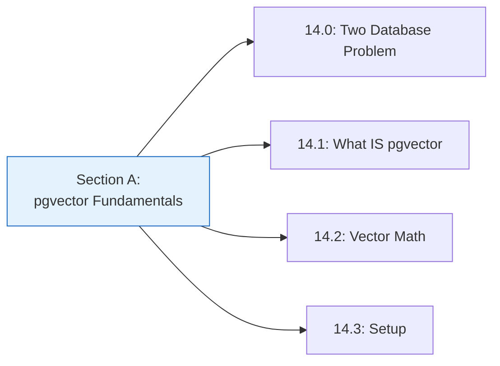
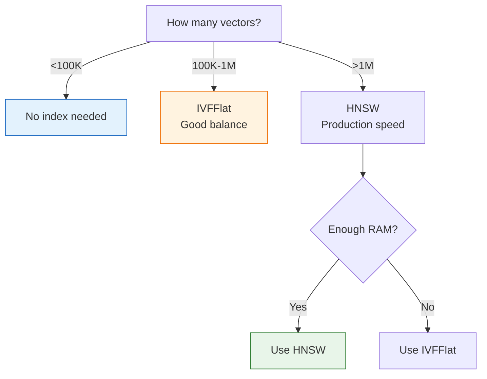

# Lesson 14.4: pgvector Basics Q&A

> **Duration**: 10 min | **Section**: A - pgvector Under the Hood Recap

## 🔍 Section A: What We Learned



### Core Concepts Summary

| Lesson | Key Concept |
|--------|-------------|
| 14.0 | One database is better than two |
| 14.1 | pgvector adds `vector` type to PostgreSQL |
| 14.2 | Three operators: `<->` (L2), `<=>` (cosine), `<#>` (IP) |
| 14.3 | Enable extension, create tables, add indexes |

## ❓ Frequently Asked Questions

### Performance Questions

**Q: How does pgvector compare to dedicated vector databases?**

| Metric | pgvector | Pinecone | Weaviate |
|--------|----------|----------|----------|
| Latency (1M vectors) | 1-5ms | 1-5ms | 1-5ms |
| Recall (accuracy) | 95-99% | 99%+ | 99%+ |
| Scale limit | ~100M | Billions | Billions |
| Ops complexity | Low | Low | Medium |
| Cost | DB cost | Higher | Medium |

**For most apps (<100M vectors), pgvector performs comparably.**

---

**Q: What's the maximum number of vectors pgvector can handle?**

Tested limits:
- **10M vectors**: Very performant
- **100M vectors**: Works, needs tuning
- **1B+ vectors**: Consider dedicated vector DB

The limit is usually your PostgreSQL instance size, not pgvector.

---

**Q: How much memory does each index type need?**

| Index | Memory Formula | 1M vectors (1536d) |
|-------|---------------|-------------------|
| None | 0 | 0 |
| IVFFlat | Low | ~2GB |
| HNSW | Higher | ~8GB |

HNSW is memory-hungry but much faster.

---

### Index Questions

**Q: IVFFlat vs HNSW - which should I use?**



**TL;DR**: Start with HNSW, fall back to IVFFlat if memory-constrained.

---

**Q: How do I tune IVFFlat lists parameter?**

```sql
-- Rule of thumb: sqrt(row_count)
-- For 1M rows: sqrt(1000000) = 1000 lists
CREATE INDEX ON documents 
USING ivfflat (embedding vector_cosine_ops)
WITH (lists = 1000);
```

More lists = faster search but slower build and lower recall.

---

**Q: How do I tune HNSW parameters?**

```sql
-- m: connections per node (16-64, higher = more accurate, more memory)
-- ef_construction: build quality (64-256, higher = better index, slower build)
CREATE INDEX ON documents 
USING hnsw (embedding vector_cosine_ops)
WITH (m = 16, ef_construction = 64);  -- Good defaults
```

For production, try `m = 32, ef_construction = 128`.

---

### Usage Questions

**Q: Can I update embeddings without rebuilding the index?**

Yes! HNSW supports incremental updates.

```sql
-- This works efficiently
UPDATE documents 
SET embedding = $1 
WHERE id = $2;
-- Index is updated in-place
```

IVFFlat also supports updates but may need periodic reindexing for optimal performance.

---

**Q: How do I filter and search at the same time?**

```sql
-- Filter first (uses regular index), then vector search
SELECT content
FROM documents
WHERE user_id = 123
  AND created_at > '2024-01-01'
ORDER BY embedding <=> $1
LIMIT 5;
```

For best performance, add a partial index:

```sql
-- Index only active users' documents
CREATE INDEX ON documents 
USING hnsw (embedding vector_cosine_ops)
WHERE deleted_at IS NULL;
```

---

**Q: What happens if I search with wrong dimensions?**

```sql
-- Your column is vector(1536)
-- You query with 768 dimensions
SELECT * FROM documents ORDER BY embedding <=> '[0.1, 0.2, ...]'::vector(768);

-- ERROR: different vector dimensions 1536 and 768
```

pgvector validates dimensions. Always use matching sizes.

---

### Migration Questions

**Q: How do I migrate from ChromaDB?**

```python
# 1. Export from ChromaDB
collection = client.get_collection("my_docs")
results = collection.get(include=["embeddings", "documents", "metadatas"])

# 2. Insert into pgvector
for i, (doc, emb, meta) in enumerate(zip(
    results["documents"],
    results["embeddings"],
    results["metadatas"]
)):
    await conn.execute("""
        INSERT INTO documents (content, embedding, metadata)
        VALUES ($1, $2, $3)
    """, doc, emb, json.dumps(meta))
```

---

**Q: Can I use pgvector with Django/SQLAlchemy?**

Yes! Both have pgvector support:

```python
# SQLAlchemy
from pgvector.sqlalchemy import Vector

class Document(Base):
    embedding = Column(Vector(1536))

# Django
from pgvector.django import VectorField

class Document(models.Model):
    embedding = VectorField(dimensions=1536)
```

---

## 💥 Common Pitfalls

### 1. Wrong Operator for Index

```sql
-- ❌ Index uses cosine, query uses L2
CREATE INDEX ON docs USING hnsw (embedding vector_cosine_ops);
SELECT * FROM docs ORDER BY embedding <-> $1;  -- No index used!

-- ✅ Match operator to index
CREATE INDEX ON docs USING hnsw (embedding vector_cosine_ops);
SELECT * FROM docs ORDER BY embedding <=> $1;  -- Uses index!
```

### 2. Forgetting to Index

```sql
-- Slow for large tables!
SELECT * FROM documents ORDER BY embedding <=> $1 LIMIT 5;

-- Add index first
CREATE INDEX ON documents USING hnsw (embedding vector_cosine_ops);
```

### 3. Casting Issues

```python
# ❌ Sending Python list without proper encoding
embedding = [0.1, 0.2, 0.3]
await conn.execute("INSERT INTO docs (embedding) VALUES ($1)", embedding)
# Error: can't cast list to vector

# ✅ Convert to proper format
embedding_str = "[" + ",".join(str(x) for x in embedding) + "]"
await conn.execute("INSERT INTO docs (embedding) VALUES ($1::vector)", embedding_str)
```

### 4. NULL Embeddings in Index

```sql
-- ❌ NULL embeddings break index operations
CREATE INDEX ON documents USING hnsw (embedding vector_cosine_ops);
-- Error if any embedding is NULL

-- ✅ Add NOT NULL constraint
ALTER TABLE documents ALTER COLUMN embedding SET NOT NULL;
-- Or use partial index
CREATE INDEX ON documents USING hnsw (embedding vector_cosine_ops)
WHERE embedding IS NOT NULL;
```

## 🎯 Quick Quiz

**Q1**: Which distance operator should you use for OpenAI embeddings?

<details>
<summary>Answer</summary>

**`<=>` (cosine distance)** - Text embeddings are normalized, cosine measures semantic similarity.

</details>

**Q2**: You have 500K vectors. Which index type?

<details>
<summary>Answer</summary>

**HNSW** - Fast and accurate. IVFFlat is also acceptable if memory is limited.

</details>

**Q3**: Your index uses `vector_cosine_ops`. Will `ORDER BY embedding <-> query` use the index?

<details>
<summary>Answer</summary>

**No!** `<->` is L2 distance. The index is for cosine (`<=>`). It will do a full scan.

</details>

## 🔑 Key Takeaways

1. **pgvector handles 10M+ vectors** easily
2. **HNSW** for production, IVFFlat if memory-limited
3. **Match operator to index** or no speedup
4. **Updates work** without full reindex
5. **ORM support** for SQLAlchemy, Django
6. **Migration is straightforward** from ChromaDB

---

**Next**: 14.5 - Basic Vector Operations
