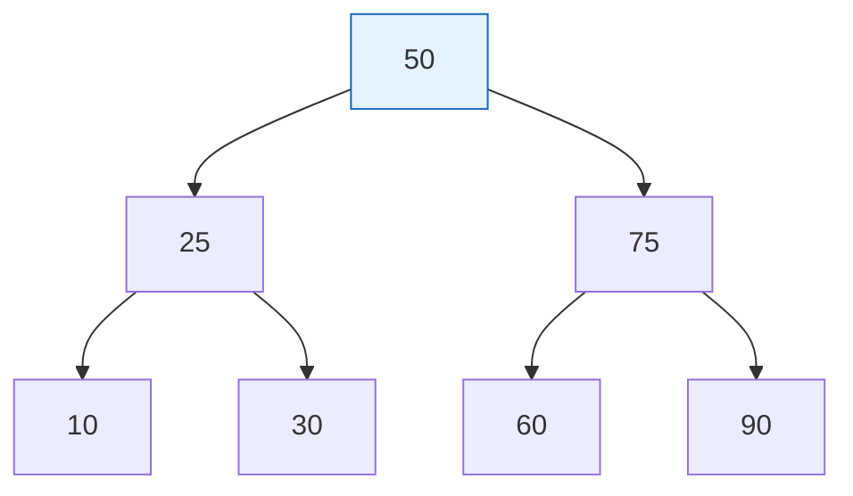
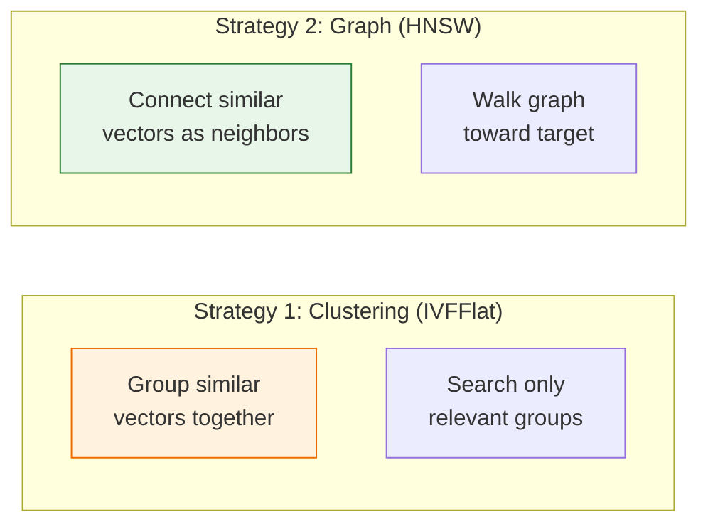
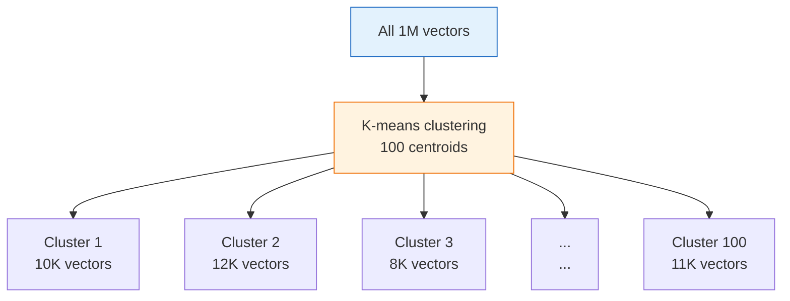
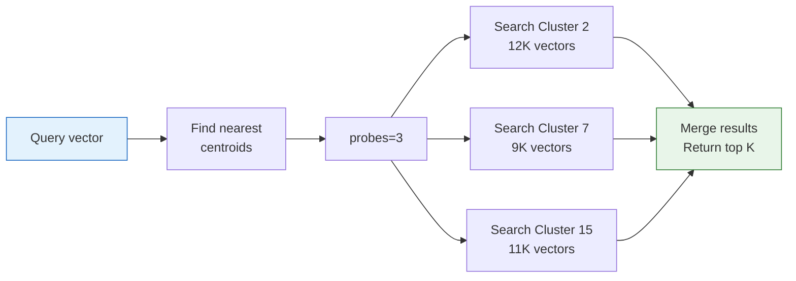
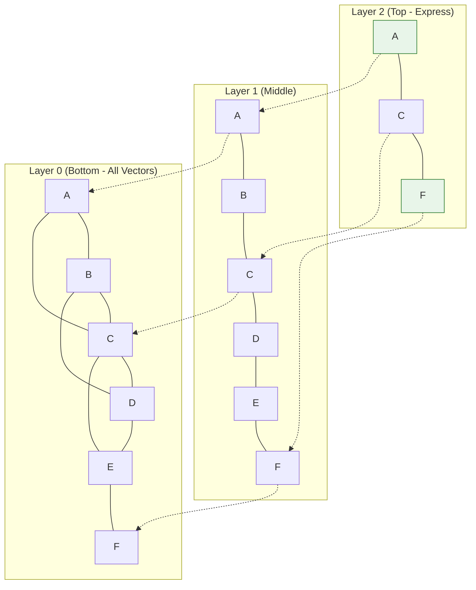
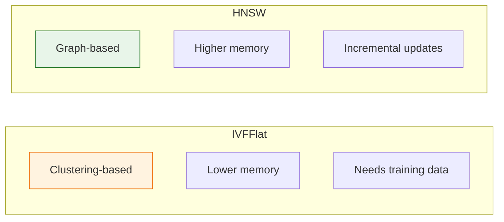
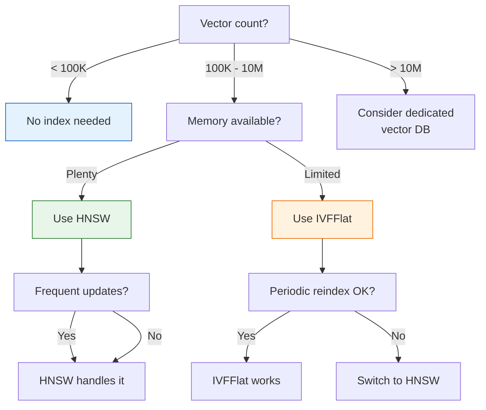

# Lesson 14.6: Indexing Under the Hood

> **"Why does my search take 10 seconds? It worked fine with 1000 docs!"**

## 📍 Learning Objectives

By the end of this lesson, you will:
1. Understand why brute-force search doesn't scale
2. Learn how IVFFlat uses clustering
3. Learn how HNSW builds a graph
4. Choose the right index for your use case

## 🔥 The Problem: 1 Million Vectors

```python
# 1,000 documents: 5ms search ✓
# 10,000 documents: 50ms search ✓
# 100,000 documents: 500ms search ⚠️
# 1,000,000 documents: 5000ms search ❌
```

**Linear scaling!** Each 10x more data = 10x slower.

With no index, PostgreSQL must:
1. Load every vector
2. Calculate distance to query
3. Sort all distances
4. Return top K

For 1M vectors of 1536 dimensions:
- **Memory**: 1M × 1536 × 4 bytes = **6GB** to scan
- **Operations**: 1M distance calculations per query

**We need indexes.**

---

## 🧠 How Regular Database Indexes Work

B-tree indexes (normal indexes) work by ordering data:



To find "30": ROOT → 25 branch → 30. **O(log n)** operations.

**But vectors can't be sorted!** There's no order where "similar" vectors are always adjacent.

---

## 📊 Vector Index Strategies

Two main approaches:



---

## 🎯 IVFFlat: Inverted File Index

### The Idea

**Divide vectors into clusters. Only search relevant clusters.**

### Building the Index



1. Run K-means to find cluster centers (centroids)
2. Assign each vector to nearest centroid
3. Store mapping: cluster → vectors

### Searching with IVFFlat



Instead of 1M vectors, we search:
- 3 clusters × ~10K vectors = **30K vectors**
- **33x faster!**

### Creating IVFFlat Index

```sql
-- lists = number of clusters (rule: sqrt(num_rows))
-- For 1M rows: sqrt(1000000) = 1000
CREATE INDEX documents_embedding_idx ON documents
USING ivfflat (embedding vector_cosine_ops)
WITH (lists = 1000);
```

### Tuning Search (probes)

```sql
-- Default: search 1 cluster (fast but may miss results)
SET ivfflat.probes = 1;

-- More probes = better recall, slower
SET ivfflat.probes = 10;

-- Recommended: 1-10% of lists
-- For 1000 lists: probes = 10-100
SET ivfflat.probes = 50;
```

### IVFFlat Trade-offs

| More Lists | Effect |
|------------|--------|
| ✅ | Faster search (smaller clusters) |
| ❌ | Lower recall (more chance to miss) |
| ❌ | Slower build time |

| More Probes | Effect |
|-------------|--------|
| ✅ | Better recall (check more clusters) |
| ❌ | Slower search |

**Sweet spot**: `lists = sqrt(n)`, `probes = lists / 10`

---

## 🕸️ HNSW: Hierarchical Navigable Small World

### The Idea

**Build a graph where similar vectors are connected. Navigate toward target.**

### The Inspiration: Six Degrees of Separation

You can reach anyone in the world through ~6 connections. HNSW builds this for vectors!

### Building the Graph



**Hierarchy**:
- **Top layers**: Few nodes, long-range connections (express lanes)
- **Bottom layers**: All nodes, local connections (local streets)

### Searching with HNSW


1. Start at top layer (express lane)
2. Greedily move toward query
3. Drop to next layer
4. Repeat until bottom
5. Return best neighbors

### Creating HNSW Index

```sql
-- m: max connections per node (default 16)
-- ef_construction: search depth during build (default 64)
CREATE INDEX documents_embedding_idx ON documents
USING hnsw (embedding vector_cosine_ops)
WITH (m = 16, ef_construction = 64);
```

### Tuning Parameters

**Build time (ef_construction)**:
```sql
-- Higher = better index quality, slower build
WITH (m = 16, ef_construction = 200)  -- Production quality
WITH (m = 16, ef_construction = 64)   -- Default, good enough
```

**Search time (ef_search)**:
```sql
-- Higher = better recall, slower search
SET hnsw.ef_search = 100;  -- Default 40
```

### HNSW Trade-offs

| Parameter | Higher Value Effect |
|-----------|-------------------|
| m | ✅ Better recall, ❌ More memory |
| ef_construction | ✅ Better index, ❌ Slower build |
| ef_search | ✅ Better recall, ❌ Slower search |

---

## ⚖️ IVFFlat vs HNSW Comparison



### Head-to-Head

| Feature | IVFFlat | HNSW |
|---------|---------|------|
| **Build Speed** | ✅ Fast | ❌ Slow |
| **Memory** | ✅ Low | ❌ 2-3x more |
| **Search Speed** | Good | ✅ Excellent |
| **Recall @ 95%** | 50ms | ✅ 5ms |
| **Incremental Updates** | ⚠️ Degrades | ✅ Maintains |
| **Best For** | Memory-limited | Production speed |

### Benchmark (1M vectors, 1536 dims)

| Index | Build Time | Memory | Search (10 QPS) | Recall |
|-------|-----------|--------|-----------------|--------|
| None | 0 | 6GB | 5000ms | 100% |
| IVFFlat | 5 min | 6.5GB | 50ms | 95% |
| HNSW | 30 min | 18GB | 5ms | 99% |

---

## 🎯 Decision Tree



---

## 📈 Monitoring Index Performance

### Check Index Usage

```sql
EXPLAIN ANALYZE
SELECT * FROM documents
ORDER BY embedding <=> '[0.1, 0.2, ...]'::vector
LIMIT 5;
```

**Good output (uses index)**:
```
Index Scan using documents_embedding_idx
  Rows Removed by Index Recheck: 0
  Planning Time: 0.5 ms
  Execution Time: 5.2 ms
```

**Bad output (no index)**:
```
Sort
  Sort Method: top-N heapsort
  Seq Scan on documents
  Execution Time: 5000 ms
```

### Index Size

```sql
SELECT 
    indexname,
    pg_size_pretty(pg_relation_size(indexname::text)) as size
FROM pg_indexes 
WHERE tablename = 'documents';
```

---

## 💻 Practical Index Setup

### Development/Testing

```sql
-- Fast to build, good enough for testing
CREATE INDEX ON documents
USING ivfflat (embedding vector_cosine_ops)
WITH (lists = 100);
```

### Production (HNSW)

```sql
-- Build with high quality
CREATE INDEX CONCURRENTLY ON documents
USING hnsw (embedding vector_cosine_ops)
WITH (m = 16, ef_construction = 128);

-- Tune search at runtime
SET hnsw.ef_search = 100;
```

### Production (IVFFlat, memory-limited)

```sql
-- Build with proper list count
CREATE INDEX CONCURRENTLY ON documents
USING ivfflat (embedding vector_cosine_ops)
WITH (lists = 1000);  -- sqrt(1M)

-- Tune probes at runtime
SET ivfflat.probes = 50;
```

---

## 🔑 Key Takeaways

| Concept | IVFFlat | HNSW |
|---------|---------|------|
| How it works | Cluster + search subset | Graph navigation |
| Build time | Fast | Slow |
| Memory | Low | High |
| Search speed | Good | Excellent |
| Updates | Degrade over time | Handle well |
| When to use | Memory-limited | Production |

**Rule of thumb**: Start with HNSW. Fall back to IVFFlat if memory is tight.

---

**Next**: 14.7 - Hybrid Search: Combining vectors with keyword and metadata filters
