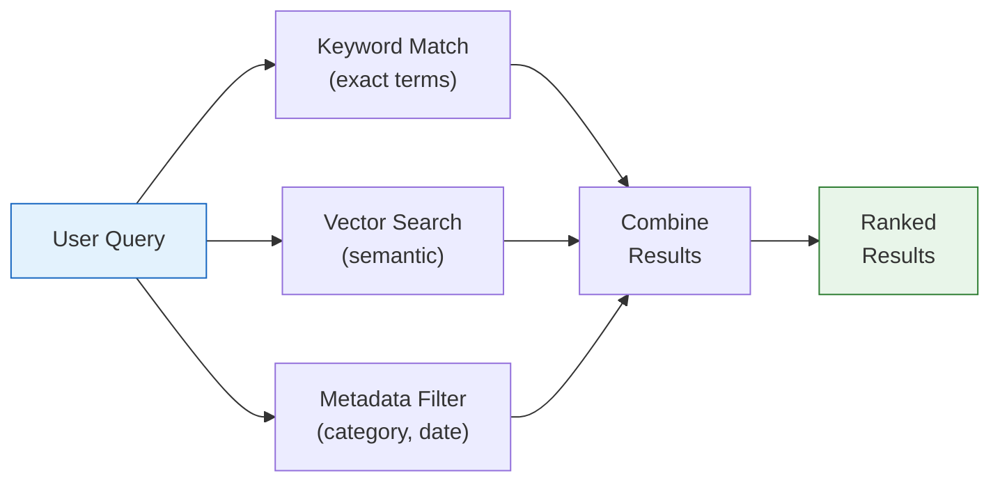
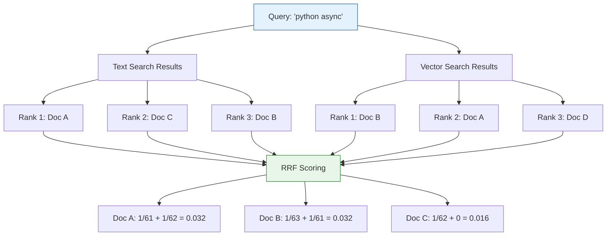

# Lesson 14.7: Hybrid Search

> **"Find documents about 'Python' from 2024 that are semantically similar to my query."**

## 📍 Learning Objectives

By the end of this lesson, you will:
1. Understand why vector search alone isn't enough
2. Combine vector similarity with keyword search
3. Add metadata filters efficiently
4. Build production-ready hybrid queries

## 🔥 The Problem: Vector Search Falls Short

### Scenario 1: The Exact Match Problem

```python
query = "What is RFC 2616?"

# Vector search returns documents ABOUT HTTP protocols
# But NOT the document literally containing "RFC 2616"
```

Vector search finds **semantically similar** content, not **exact matches**.

### Scenario 2: The Filter Problem

```python
# User wants: Python tutorials from 2024
query = "Python async await"

# Vector search might return:
# 1. JavaScript async/await (2023) - semantically similar!
# 2. Python threading (2022) - close topic
# 3. Python asyncio (2021) - right topic, wrong year
```

We need to **filter first, then search semantically**.

---

## 🎯 The Solution: Hybrid Search



---

## 📊 Strategy 1: Pre-filtering (Most Common)

**Apply filters BEFORE vector search.**

### Basic Metadata Filter

```sql
-- Find Python tutorials from 2024, similar to query
SELECT id, title, content,
       1 - (embedding <=> $1::vector) AS similarity
FROM documents
WHERE language = 'python'
  AND EXTRACT(YEAR FROM created_at) = 2024
ORDER BY embedding <=> $1::vector
LIMIT 5;
```

### Multi-Tenant Filtering

```python
async def search_user_workspace(
    pool: asyncpg.Pool,
    user_id: int,
    workspace_id: int,
    query_embedding: list[float],
    limit: int = 10
) -> list[dict]:
    """Search within a specific user's workspace."""
    query_str = to_pgvector(query_embedding)
    
    async with pool.acquire() as conn:
        rows = await conn.fetch("""
            SELECT 
                id, title, content,
                1 - (embedding <=> $1::vector) AS similarity
            FROM documents
            WHERE user_id = $2
              AND workspace_id = $3
              AND deleted_at IS NULL
            ORDER BY embedding <=> $1::vector
            LIMIT $4
        """, query_str, user_id, workspace_id, limit)
    
    return [dict(row) for row in rows]
```

### Partial Indexes for Common Filters

If you always filter by a condition, create a partial index:

```sql
-- Index only active documents
CREATE INDEX active_docs_embedding_idx ON documents
USING hnsw (embedding vector_cosine_ops)
WHERE deleted_at IS NULL;

-- Index per category
CREATE INDEX python_docs_embedding_idx ON documents
USING hnsw (embedding vector_cosine_ops)
WHERE category = 'python';
```

**Benefit**: Smaller index = faster search.

---

## 📝 Strategy 2: Full-Text Search + Vectors

PostgreSQL has powerful built-in full-text search. Combine it with vectors!

### Setup Full-Text Search

```sql
-- Add a tsvector column for full-text search
ALTER TABLE documents ADD COLUMN search_vector tsvector;

-- Populate it
UPDATE documents 
SET search_vector = to_tsvector('english', title || ' ' || content);

-- Create GIN index for full-text search
CREATE INDEX documents_search_idx ON documents USING GIN (search_vector);

-- Keep it updated automatically
CREATE TRIGGER documents_search_update
BEFORE INSERT OR UPDATE ON documents
FOR EACH ROW EXECUTE FUNCTION
tsvector_update_trigger(search_vector, 'pg_catalog.english', title, content);
```

### Hybrid Query: Keywords + Vectors

```sql
-- Find documents matching "async" that are semantically similar
SELECT 
    id, title, content,
    ts_rank(search_vector, websearch_to_tsquery('english', $1)) AS text_rank,
    1 - (embedding <=> $2::vector) AS vector_similarity
FROM documents
WHERE search_vector @@ websearch_to_tsquery('english', $1)
ORDER BY embedding <=> $2::vector
LIMIT 10;
```

### Weighted Hybrid Scoring

```python
async def hybrid_search(
    pool: asyncpg.Pool,
    query_text: str,
    query_embedding: list[float],
    text_weight: float = 0.3,
    vector_weight: float = 0.7,
    limit: int = 10
) -> list[dict]:
    """Combine text and vector search with custom weights."""
    query_str = to_pgvector(query_embedding)
    
    async with pool.acquire() as conn:
        rows = await conn.fetch("""
            WITH ranked AS (
                SELECT 
                    id, title, content,
                    ts_rank(search_vector, websearch_to_tsquery('english', $1)) AS text_score,
                    1 - (embedding <=> $2::vector) AS vector_score
                FROM documents
                WHERE search_vector @@ websearch_to_tsquery('english', $1)
                   OR 1 - (embedding <=> $2::vector) > 0.5
            )
            SELECT 
                id, title, content,
                text_score, vector_score,
                ($3 * COALESCE(text_score, 0) + $4 * vector_score) AS combined_score
            FROM ranked
            ORDER BY combined_score DESC
            LIMIT $5
        """, query_text, query_str, text_weight, vector_weight, limit)
    
    return [dict(row) for row in rows]
```

---

## 🔀 Strategy 3: Reciprocal Rank Fusion (RRF)

**RRF**: A robust way to combine multiple ranking systems.

```
RRF_score = Σ (1 / (k + rank_i))
```

Where `k` is a constant (usually 60) and `rank_i` is the position in each result list.

### Implementation

```python
async def rrf_search(
    pool: asyncpg.Pool,
    query_text: str,
    query_embedding: list[float],
    limit: int = 10,
    k: int = 60
) -> list[dict]:
    """Reciprocal Rank Fusion of text and vector search."""
    query_str = to_pgvector(query_embedding)
    
    async with pool.acquire() as conn:
        rows = await conn.fetch("""
            WITH text_results AS (
                SELECT id, ROW_NUMBER() OVER (
                    ORDER BY ts_rank(search_vector, websearch_to_tsquery('english', $1)) DESC
                ) AS text_rank
                FROM documents
                WHERE search_vector @@ websearch_to_tsquery('english', $1)
                LIMIT 100
            ),
            vector_results AS (
                SELECT id, ROW_NUMBER() OVER (
                    ORDER BY embedding <=> $2::vector
                ) AS vector_rank
                FROM documents
                LIMIT 100
            ),
            combined AS (
                SELECT 
                    COALESCE(t.id, v.id) AS id,
                    COALESCE(1.0 / ($3 + t.text_rank), 0) +
                    COALESCE(1.0 / ($3 + v.vector_rank), 0) AS rrf_score
                FROM text_results t
                FULL OUTER JOIN vector_results v ON t.id = v.id
            )
            SELECT 
                d.id, d.title, d.content, c.rrf_score
            FROM combined c
            JOIN documents d ON d.id = c.id
            ORDER BY c.rrf_score DESC
            LIMIT $4
        """, query_text, query_str, k, limit)
    
    return [dict(row) for row in rows]
```

### RRF Visualization



---

## 🎛️ Strategy 4: Dynamic Query Building

Build queries based on what the user provides:

```python
async def smart_search(
    pool: asyncpg.Pool,
    query: str,
    query_embedding: list[float],
    filters: dict | None = None,
    limit: int = 10
) -> list[dict]:
    """Build query dynamically based on available filters."""
    
    query_str = to_pgvector(query_embedding)
    conditions = []
    params = [query_str]
    param_idx = 2
    
    # Add text search if query has keywords
    if query and len(query.split()) <= 5:  # Short query = likely keywords
        conditions.append(f"search_vector @@ websearch_to_tsquery('english', ${param_idx})")
        params.append(query)
        param_idx += 1
    
    # Add metadata filters
    if filters:
        if "category" in filters:
            conditions.append(f"category = ${param_idx}")
            params.append(filters["category"])
            param_idx += 1
        
        if "date_from" in filters:
            conditions.append(f"created_at >= ${param_idx}")
            params.append(filters["date_from"])
            param_idx += 1
        
        if "user_id" in filters:
            conditions.append(f"user_id = ${param_idx}")
            params.append(filters["user_id"])
            param_idx += 1
    
    # Build WHERE clause
    where_clause = ""
    if conditions:
        where_clause = "WHERE " + " AND ".join(conditions)
    
    sql = f"""
        SELECT 
            id, title, content,
            1 - (embedding <=> $1::vector) AS similarity
        FROM documents
        {where_clause}
        ORDER BY embedding <=> $1::vector
        LIMIT ${param_idx}
    """
    params.append(limit)
    
    async with pool.acquire() as conn:
        rows = await conn.fetch(sql, *params)
    
    return [dict(row) for row in rows]
```

### Usage

```python
# Pure vector search
results = await smart_search(pool, "", embedding)

# Vector + category filter
results = await smart_search(pool, "", embedding, {"category": "python"})

# Keyword + vector + multi-filter
results = await smart_search(
    pool, 
    "async await",
    embedding,
    {"category": "python", "date_from": "2024-01-01", "user_id": 123}
)
```

---

## 📈 Performance Optimization

### 1. Composite Indexes for Common Filters

```sql
-- If you always filter by category, add it to the expression index
CREATE INDEX ON documents (category);

-- For date ranges
CREATE INDEX ON documents (created_at);

-- PostgreSQL will combine indexes in the query plan
```

### 2. Use EXPLAIN ANALYZE

```sql
EXPLAIN ANALYZE
SELECT * FROM documents
WHERE category = 'python'
ORDER BY embedding <=> '[...]'::vector
LIMIT 5;
```

Look for:
- ✅ `Index Scan using ... embedding_idx`
- ✅ `Filter: (category = 'python')`
- ❌ `Seq Scan` (no index used)

### 3. Materialized Views for Complex Queries

```sql
-- Pre-compute popular filtered views
CREATE MATERIALIZED VIEW python_docs AS
SELECT * FROM documents WHERE category = 'python';

-- Index the materialized view
CREATE INDEX ON python_docs USING hnsw (embedding vector_cosine_ops);

-- Refresh periodically
REFRESH MATERIALIZED VIEW CONCURRENTLY python_docs;
```

---

## 🎯 Complete Example: RAG Search API

```python
from dataclasses import dataclass
from datetime import datetime
import asyncpg

@dataclass
class SearchFilters:
    categories: list[str] | None = None
    date_from: datetime | None = None
    date_to: datetime | None = None
    user_id: int | None = None
    min_similarity: float = 0.5

async def rag_search(
    pool: asyncpg.Pool,
    query_text: str,
    query_embedding: list[float],
    filters: SearchFilters,
    limit: int = 5
) -> list[dict]:
    """Production RAG search with hybrid capabilities."""
    
    # Build the query dynamically
    select_parts = [
        "d.id", "d.title", "d.content",
        "1 - (d.embedding <=> $1::vector) AS similarity"
    ]
    
    from_parts = ["documents d"]
    where_parts = ["1 - (d.embedding <=> $1::vector) >= $2"]
    params = [to_pgvector(query_embedding), filters.min_similarity]
    param_idx = 3
    
    # Add text ranking if we have keywords
    if query_text:
        select_parts.append(
            f"ts_rank(d.search_vector, websearch_to_tsquery('english', ${param_idx})) AS text_rank"
        )
        params.append(query_text)
        param_idx += 1
    
    # Category filter
    if filters.categories:
        where_parts.append(f"d.category = ANY(${param_idx})")
        params.append(filters.categories)
        param_idx += 1
    
    # Date filters
    if filters.date_from:
        where_parts.append(f"d.created_at >= ${param_idx}")
        params.append(filters.date_from)
        param_idx += 1
    
    if filters.date_to:
        where_parts.append(f"d.created_at <= ${param_idx}")
        params.append(filters.date_to)
        param_idx += 1
    
    # User filter
    if filters.user_id:
        where_parts.append(f"d.user_id = ${param_idx}")
        params.append(filters.user_id)
        param_idx += 1
    
    # Add limit
    params.append(limit)
    
    sql = f"""
        SELECT {', '.join(select_parts)}
        FROM {', '.join(from_parts)}
        WHERE {' AND '.join(where_parts)}
        ORDER BY d.embedding <=> $1::vector
        LIMIT ${param_idx}
    """
    
    async with pool.acquire() as conn:
        rows = await conn.fetch(sql, *params)
    
    return [dict(row) for row in rows]


# Example usage
results = await rag_search(
    pool,
    query_text="async programming",
    query_embedding=embedding,
    filters=SearchFilters(
        categories=["python", "javascript"],
        date_from=datetime(2024, 1, 1),
        min_similarity=0.6
    ),
    limit=10
)
```

---

## 🔑 Key Takeaways

| Strategy | When to Use |
|----------|-------------|
| Pre-filtering | Always - apply metadata first |
| Full-text + Vector | Need exact keyword matches |
| RRF | Combining multiple ranking systems |
| Dynamic queries | User-driven search with optional filters |
| Partial indexes | Same filter applied repeatedly |

**Best Practice**: Start with pre-filtering, add full-text for keyword needs.

---

**Next**: 14.8 - LangChain pgvector: Replacing ChromaDB in your RAG pipeline
