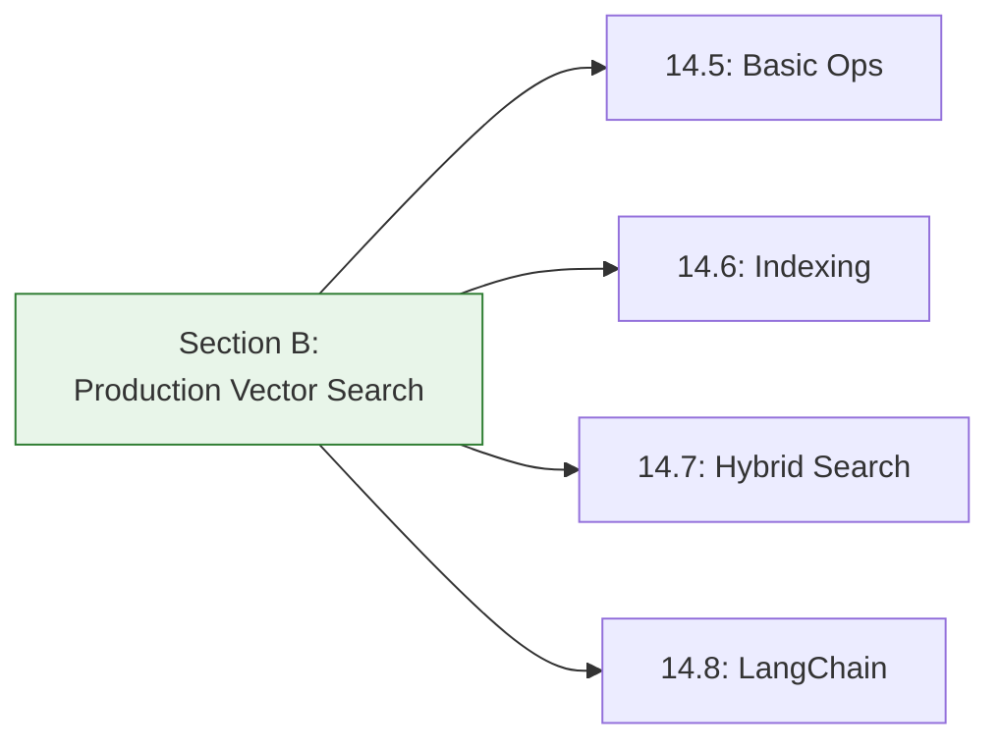
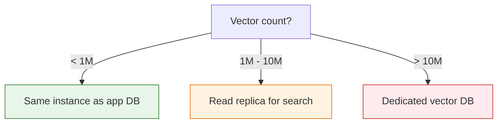
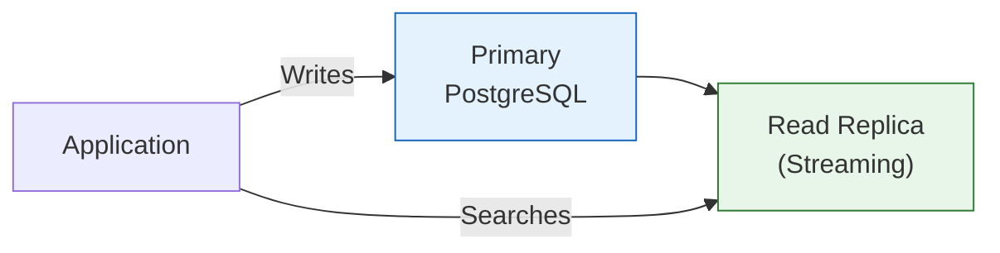

# Lesson 14.9: pgvector Production Q&A

> **Duration**: 10 min | **Section**: B - Vector Search in Production Recap

## 🔍 Section B: What We Learned



### Core Concepts Summary

| Lesson | Key Concept |
|--------|-------------|
| 14.5 | Insert with `::vector`, search with `ORDER BY <=> LIMIT` |
| 14.6 | IVFFlat = clusters, HNSW = graph. HNSW for production |
| 14.7 | Pre-filter → vector search. RRF for combining rankings |
| 14.8 | LangChain pgvector = same API as ChromaDB |

---

## ❓ Production Operations FAQ

### Scaling Questions

**Q: How many vectors can pgvector handle in production?**

| Scale | Works Well? | Notes |
|-------|-------------|-------|
| 1M | ✅ Excellent | Default PostgreSQL fine |
| 10M | ✅ Good | Tune `shared_buffers`, `work_mem` |
| 100M | ⚠️ Possible | Needs significant RAM (128GB+) |
| 1B+ | ❌ Consider alternatives | Pinecone, Milvus, etc. |

**For most applications (<10M vectors), pgvector is sufficient.**

---

**Q: How much RAM do I need?**

Rough formula:
```
RAM needed = vectors × dimensions × 4 bytes × 2-3x (for HNSW)

Example (1M vectors, 1536 dims):
1,000,000 × 1536 × 4 × 2.5 = 15GB for index
+ PostgreSQL overhead
≈ 24GB recommended
```

---

**Q: Should I use a dedicated PostgreSQL instance for vectors?**



**For most cases**: Use your existing PostgreSQL. Add a read replica if search load is high.

---

### Update and Maintenance

**Q: How do I update embeddings when my model changes?**

```python
async def reembed_all_documents(
    pool: asyncpg.Pool,
    new_model: str,
    batch_size: int = 100
):
    """Re-embed all documents with new model."""
    client = openai.AsyncOpenAI()
    
    async with pool.acquire() as conn:
        # Get all documents
        rows = await conn.fetch("SELECT id, content FROM documents")
        
        # Process in batches
        for i in range(0, len(rows), batch_size):
            batch = rows[i:i+batch_size]
            
            # Get new embeddings
            contents = [row["content"] for row in batch]
            response = await client.embeddings.create(
                model=new_model,
                input=contents
            )
            
            # Update in database
            for row, emb_data in zip(batch, response.data):
                emb_str = to_pgvector(emb_data.embedding)
                await conn.execute("""
                    UPDATE documents SET embedding = $1::vector
                    WHERE id = $2
                """, emb_str, row["id"])
            
            print(f"Updated {min(i + batch_size, len(rows))}/{len(rows)}")
```

**Important**: Update all documents at once! Mixed embeddings don't compare correctly.

---

**Q: How do I handle embedding dimension changes?**

```sql
-- Old: text-embedding-ada-002 (1536 dims)
-- New: text-embedding-3-small (1536 dims) - same dimensions, just update
-- Or: text-embedding-3-large (3072 dims) - different dimensions!

-- Option 1: Create new column
ALTER TABLE documents ADD COLUMN embedding_v2 vector(3072);

-- Option 2: Recreate table with migration
CREATE TABLE documents_v2 (
    id SERIAL PRIMARY KEY,
    content TEXT NOT NULL,
    embedding vector(3072)
);

-- Migrate data with new embeddings
INSERT INTO documents_v2 (id, content, embedding)
SELECT id, content, ... FROM documents;

-- Swap tables
ALTER TABLE documents RENAME TO documents_old;
ALTER TABLE documents_v2 RENAME TO documents;
```

---

**Q: Do I need to rebuild indexes after updates?**

| Index Type | After Row Updates | After Many Updates |
|------------|------------------|--------------------|
| HNSW | No rebuild needed | Monitor performance |
| IVFFlat | No rebuild needed | Periodic rebuild helps |

```sql
-- Check index health
SELECT 
    indexrelname,
    idx_scan,
    idx_tup_read,
    idx_tup_fetch
FROM pg_stat_user_indexes
WHERE indexrelname LIKE '%embedding%';

-- Rebuild if needed (CONCURRENTLY = no downtime)
REINDEX INDEX CONCURRENTLY documents_embedding_idx;
```

---

**Q: How do I handle bulk imports efficiently?**

```python
async def bulk_import_with_copy(
    pool: asyncpg.Pool,
    documents: list[dict]
):
    """Fastest way to import many documents."""
    
    async with pool.acquire() as conn:
        # Disable indexes temporarily
        await conn.execute("""
            ALTER TABLE documents 
            SET (autovacuum_enabled = false)
        """)
        
        try:
            # Use COPY for speed
            await conn.copy_records_to_table(
                "documents",
                records=[
                    (
                        doc["title"],
                        doc["content"],
                        to_pgvector(doc["embedding"])
                    )
                    for doc in documents
                ],
                columns=["title", "content", "embedding"]
            )
        finally:
            # Re-enable and vacuum
            await conn.execute("""
                ALTER TABLE documents 
                SET (autovacuum_enabled = true)
            """)
            await conn.execute("VACUUM ANALYZE documents")
```

**Speed comparison (100K documents)**:
| Method | Time |
|--------|------|
| Individual INSERTs | 30+ min |
| Batch INSERT (100 rows) | 5 min |
| COPY | 30 sec |

---

### Performance Tuning

**Q: How do I optimize query performance?**

```sql
-- PostgreSQL settings for vector workloads
-- In postgresql.conf:

-- More memory for queries
shared_buffers = '8GB'  -- 25% of RAM
work_mem = '256MB'       -- Per operation
maintenance_work_mem = '2GB'  -- For index builds

-- Parallel query (if available)
max_parallel_workers_per_gather = 4

-- HNSW search depth at runtime
SET hnsw.ef_search = 100;  -- Default 40
```

---

**Q: My queries are slow. How do I diagnose?**

```sql
-- Step 1: Check if index is being used
EXPLAIN ANALYZE
SELECT * FROM documents
ORDER BY embedding <=> '[...]'::vector
LIMIT 5;

-- Look for:
-- ✅ "Index Scan using documents_embedding_idx"
-- ❌ "Seq Scan on documents" (no index!)

-- Step 2: Check index size
SELECT 
    indexname,
    pg_size_pretty(pg_relation_size(indexname::text)) as size
FROM pg_indexes 
WHERE tablename = 'documents';

-- Step 3: Check for table bloat
SELECT 
    relname,
    n_dead_tup,
    n_live_tup,
    round(n_dead_tup * 100.0 / nullif(n_live_tup, 0), 2) as dead_pct
FROM pg_stat_user_tables
WHERE relname = 'documents';

-- Step 4: Vacuum if needed
VACUUM ANALYZE documents;
```

---

**Q: How do I monitor pgvector in production?**

Key metrics to track:
```python
METRICS_QUERIES = {
    "index_usage": """
        SELECT 
            schemaname, tablename, indexname,
            idx_scan as times_used,
            pg_size_pretty(pg_relation_size(indexname::text)) as size
        FROM pg_stat_user_indexes
        WHERE indexname LIKE '%embedding%'
    """,
    
    "table_size": """
        SELECT 
            pg_size_pretty(pg_total_relation_size('documents')) as total,
            pg_size_pretty(pg_relation_size('documents')) as data,
            pg_size_pretty(pg_indexes_size('documents')) as indexes
    """,
    
    "query_performance": """
        SELECT 
            query,
            calls,
            round(mean_exec_time::numeric, 2) as avg_ms,
            round(total_exec_time::numeric, 2) as total_ms
        FROM pg_stat_statements
        WHERE query LIKE '%embedding%'
        ORDER BY total_exec_time DESC
        LIMIT 5
    """
}
```

---

### Backup and Recovery

**Q: How do I back up vector data?**

```bash
# Standard pg_dump works!
pg_dump -Fc vectordb > vectordb_backup.dump

# Restore
pg_restore -d vectordb vectordb_backup.dump
```

**Important**: Backup includes embeddings. Large dumps!

For large vector tables:
```bash
# Compress more aggressively
pg_dump -Fc -Z 9 vectordb > vectordb_backup.dump

# Or use parallel dump
pg_dump -Fd -j 4 vectordb -f vectordb_backup/
```

---

**Q: How do I replicate vector data?**



Standard PostgreSQL streaming replication works. No special config needed for pgvector.

---

### Security

**Q: How do I secure vector data?**

```sql
-- Row-level security for multi-tenant
ALTER TABLE documents ENABLE ROW LEVEL SECURITY;

CREATE POLICY tenant_isolation ON documents
    USING (tenant_id = current_setting('app.current_tenant')::int);

-- In application
await conn.execute("SET app.current_tenant = $1", user.tenant_id)
results = await conn.fetch("""
    SELECT * FROM documents 
    ORDER BY embedding <=> $1::vector 
    LIMIT 5
""", query_embedding)
```

---

**Q: Should I encrypt embeddings?**

Usually no. Embeddings are:
- Derived from content (can be regenerated)
- High-dimensional noise (hard to reverse)
- Need to be compared (encryption breaks search)

**Instead**: Encrypt the source content, secure the database.

---

## 💡 Common Pitfalls

### 1. Wrong Operator for Index

```sql
-- ❌ Index uses cosine, query uses L2
CREATE INDEX ON docs USING hnsw (embedding vector_cosine_ops);
SELECT * FROM docs ORDER BY embedding <-> $1;  -- Uses L2!

-- ✅ Match operator to index
SELECT * FROM docs ORDER BY embedding <=> $1;  -- Uses cosine
```

### 2. Not Using Connection Pooling

```python
# ❌ New connection per request
async def search(query):
    conn = await asyncpg.connect(DATABASE_URL)
    try:
        return await conn.fetch(...)
    finally:
        await conn.close()

# ✅ Connection pool
pool = await asyncpg.create_pool(DATABASE_URL, min_size=5, max_size=20)

async def search(query):
    async with pool.acquire() as conn:
        return await conn.fetch(...)
```

### 3. Forgetting to Vacuum

```sql
-- After many updates/deletes
VACUUM ANALYZE documents;

-- Or enable auto-vacuum (default on)
ALTER TABLE documents SET (
    autovacuum_vacuum_scale_factor = 0.1,
    autovacuum_analyze_scale_factor = 0.05
);
```

### 4. Index on Empty Table

```sql
-- ❌ Creating index before data
CREATE INDEX ON documents USING hnsw (embedding vector_cosine_ops);
INSERT INTO documents ...;  -- Index built for 0 rows!

-- ✅ Load data first, then index
INSERT INTO documents ...;
CREATE INDEX ON documents USING hnsw (embedding vector_cosine_ops);
```

---

## 🎯 Quick Reference

### Index Creation

```sql
-- HNSW (recommended)
CREATE INDEX CONCURRENTLY ON documents
USING hnsw (embedding vector_cosine_ops)
WITH (m = 16, ef_construction = 128);

-- IVFFlat (memory-limited)
CREATE INDEX CONCURRENTLY ON documents  
USING ivfflat (embedding vector_cosine_ops)
WITH (lists = 1000);  -- sqrt(row_count)
```

### Runtime Tuning

```sql
-- HNSW search depth
SET hnsw.ef_search = 100;  -- Default 40

-- IVFFlat probes
SET ivfflat.probes = 50;   -- Default 1
```

### Health Checks

```sql
-- Index usage
SELECT idx_scan FROM pg_stat_user_indexes WHERE indexname LIKE '%embedding%';

-- Table bloat
SELECT n_dead_tup FROM pg_stat_user_tables WHERE relname = 'documents';

-- Vacuum if bloated
VACUUM ANALYZE documents;
```

---

## 🔑 Key Takeaways

1. **pgvector scales to 10M+** vectors with proper tuning
2. **Update all embeddings together** when changing models
3. **HNSW handles updates** without rebuild; IVFFlat may need periodic reindex
4. **Use COPY for bulk imports** (10-100x faster)
5. **Monitor index usage** with EXPLAIN ANALYZE
6. **Standard PostgreSQL ops** work: backup, replication, RLS

---

**Next**: 14.10 - Module Review: pgvector Mental Model
