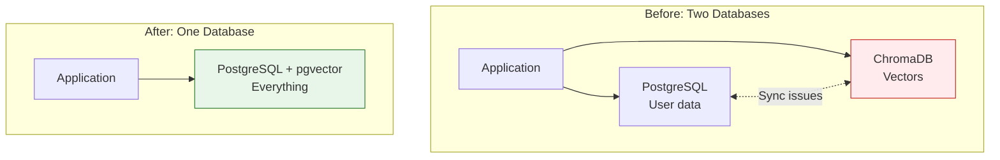
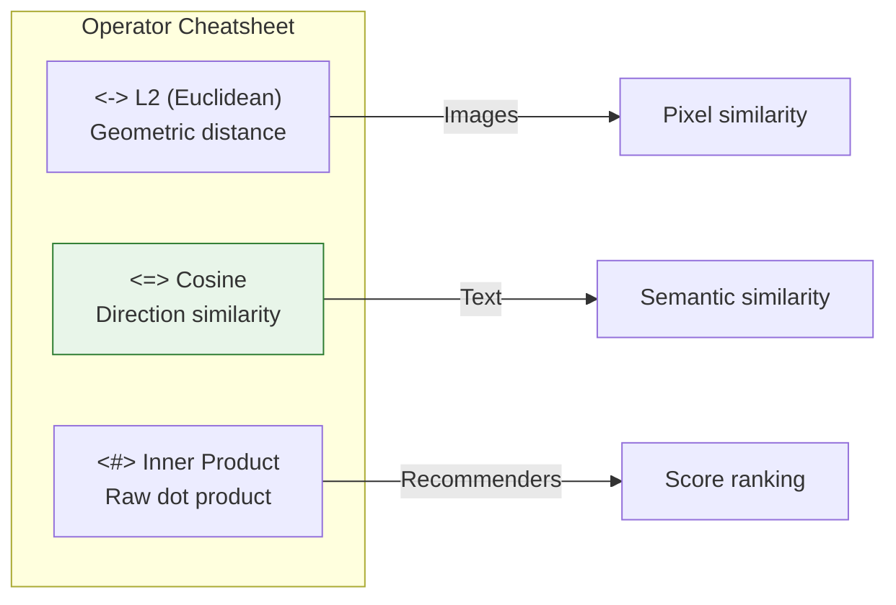
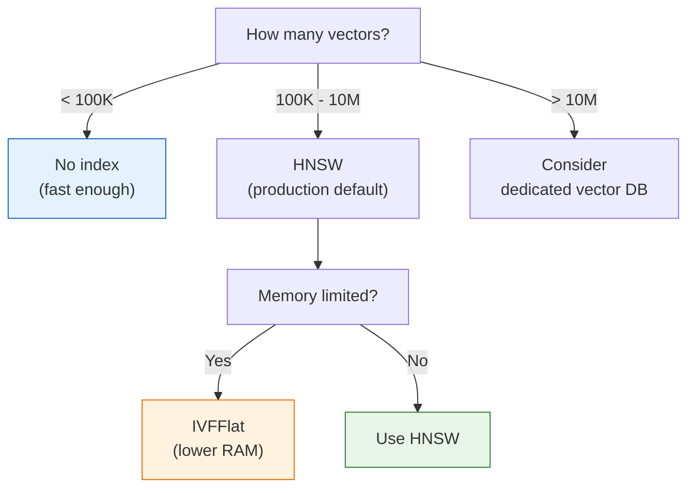

# Lesson 14.10: Module Review - pgvector Mental Model

> **"One database to rule them all."**

## 🎯 The Big Picture



**pgvector = Teaching PostgreSQL to understand vectors.**

---

## 🧠 Core Mental Model

### What pgvector Adds to PostgreSQL

```mermaid
flowchart LR
    subgraph "PostgreSQL Core"
        INT["int"]
        TEXT["text"]
        JSON["jsonb"]
        TS["timestamp"]
    end
    
    subgraph "pgvector Extension"
        VEC["vector(N)"]
        OPS["Distance operators<br/><-> <=> <#>"]
        IDX["IVFFlat, HNSW<br/>indexes"]
    end
    
    PG["PostgreSQL"] --> PostgreSQL Core
    PG --> pgvector Extension
    
    style VEC fill:#E8F5E9,stroke:#2E7D32
    style OPS fill:#E8F5E9,stroke:#2E7D32
    style IDX fill:#E8F5E9,stroke:#2E7D32
```

Think of it as: **Adding a new data type with special powers.**

---

## 📊 Module Summary

### Section A: Under the Hood

| Lesson | Concept | Key Insight |
|--------|---------|-------------|
| 14.0 | Two Database Problem | One database = simpler ops, ACID transactions |
| 14.1 | What IS pgvector | Extension adds `vector` type + operators |
| 14.2 | Vector Math | `<->` (L2), `<=>` (cosine), `<#>` (IP) |
| 14.3 | Setup | Docker, `CREATE EXTENSION vector`, HNSW index |
| 14.4 | Q&A | HNSW for production, match operator to index |

### Section B: Production Use

| Lesson | Concept | Key Insight |
|--------|---------|-------------|
| 14.5 | Basic Ops | `$1::vector` cast, `ORDER BY <=> LIMIT` |
| 14.6 | Indexing | IVFFlat = clusters, HNSW = graph (use HNSW) |
| 14.7 | Hybrid Search | Pre-filter → vector search, RRF for ranking |
| 14.8 | LangChain | Same API as ChromaDB, metadata filtering |
| 14.9 | Production Q&A | Scale to 10M+, COPY for bulk, VACUUM |

---

## 🎯 The Three Distance Operators



**Default choice**: `<=>` cosine for text embeddings (OpenAI, Cohere, etc.)

---

## 🏗️ The Index Decision



---

## 📝 Essential Code Patterns

### 1. Setup

```sql
CREATE EXTENSION vector;

CREATE TABLE documents (
    id SERIAL PRIMARY KEY,
    content TEXT NOT NULL,
    embedding vector(1536)
);

CREATE INDEX ON documents 
USING hnsw (embedding vector_cosine_ops);
```

### 2. Insert

```python
embedding_str = "[" + ",".join(str(x) for x in embedding) + "]"
await conn.execute("""
    INSERT INTO documents (content, embedding)
    VALUES ($1, $2::vector)
""", content, embedding_str)
```

### 3. Search

```python
results = await conn.fetch("""
    SELECT id, content, 1 - (embedding <=> $1::vector) AS similarity
    FROM documents
    ORDER BY embedding <=> $1::vector
    LIMIT 5
""", query_str)
```

### 4. Filtered Search

```python
results = await conn.fetch("""
    SELECT id, content, 1 - (embedding <=> $1::vector) AS similarity
    FROM documents
    WHERE category = $2 AND created_at > $3
    ORDER BY embedding <=> $1::vector
    LIMIT 5
""", query_str, category, since_date)
```

---

## ⚖️ Trade-offs Summary

### pgvector vs Dedicated Vector DBs

| Factor | pgvector | Pinecone/Weaviate |
|--------|----------|-------------------|
| **Operations** | ✅ Use existing DB | ❌ Additional service |
| **Scale** | Good to 10M+ | Excellent to 1B+ |
| **Features** | SQL + vectors | Vector-optimized |
| **Cost** | DB cost only | Additional service |
| **Best for** | Most apps | Massive scale |

### IVFFlat vs HNSW

| Factor | IVFFlat | HNSW |
|--------|---------|------|
| **Build time** | ✅ Fast | ❌ Slow |
| **Memory** | ✅ Lower | ❌ 2-3x more |
| **Search speed** | Good | ✅ Excellent |
| **Updates** | ⚠️ Degrades | ✅ Handles well |

---

## 🎯 Independence Check

### Know (Definition)
- [ ] What is pgvector?
- [ ] What do `<->`, `<=>`, `<#>` operators do?
- [ ] What are IVFFlat and HNSW?

### Understand (Why)
- [ ] Why use one database instead of PostgreSQL + ChromaDB?
- [ ] Why do we need indexes for vector search?
- [ ] Why use cosine distance for text embeddings?

### Apply (How)
- [ ] How do you create a table with vector column?
- [ ] How do you insert and search vectors?
- [ ] How do you add metadata filtering?

### Analyze (Limitations)
- [ ] When does pgvector NOT work well?
- [ ] What are the memory requirements?
- [ ] How do index updates affect performance?

### Create
- [ ] Can you build a complete RAG search with filtering?
- [ ] Can you migrate from ChromaDB to pgvector?
- [ ] Can you tune indexes for your workload?

---

## 🚀 Quick Reference Card

### SQL

```sql
-- Enable
CREATE EXTENSION vector;

-- Create table
CREATE TABLE docs (
    id SERIAL PRIMARY KEY,
    content TEXT NOT NULL,
    embedding vector(1536)
);

-- Add HNSW index
CREATE INDEX ON docs USING hnsw (embedding vector_cosine_ops);

-- Search
SELECT * FROM docs 
ORDER BY embedding <=> '[...]'::vector 
LIMIT 5;

-- Tune search
SET hnsw.ef_search = 100;
```

### Python (asyncpg)

```python
def to_pgvector(embedding: list[float]) -> str:
    return "[" + ",".join(str(x) for x in embedding) + "]"

async def search(pool, query_embedding, limit=5):
    async with pool.acquire() as conn:
        return await conn.fetch("""
            SELECT *, 1 - (embedding <=> $1::vector) AS similarity
            FROM documents
            ORDER BY embedding <=> $1::vector
            LIMIT $2
        """, to_pgvector(query_embedding), limit)
```

### LangChain

```python
from langchain_postgres import PGVector

vectorstore = PGVector.from_documents(
    documents=docs,
    embedding=embeddings,
    connection=CONNECTION_STRING,
    collection_name="my_docs"
)

results = vectorstore.similarity_search(
    query="...",
    k=5,
    filter={"category": "python"}
)
```

---

## 🔑 Module Takeaways

1. **pgvector consolidates** your data layer (vectors + relational in one DB)
2. **Three operators**: `<->` L2, `<=>` cosine, `<#>` IP (use cosine for text)
3. **HNSW for production**, IVFFlat if memory-limited
4. **Match operator to index** or you'll get sequential scans
5. **Pre-filter, then vector search** for hybrid queries
6. **LangChain integration** is seamless - same API as ChromaDB
7. **Scales to 10M+ vectors** with proper tuning

---

## 🎓 You Can Now...

✅ Set up pgvector in PostgreSQL  
✅ Create tables with vector columns  
✅ Insert and search embeddings  
✅ Choose and tune the right index  
✅ Build hybrid search with filters  
✅ Use pgvector with LangChain  
✅ Migrate from ChromaDB  
✅ Monitor and tune production workloads  

---

**Next Module**: Module 15 - Kubernetes: Container Orchestration for AI Apps
