# Lesson 14.11: pgvector Performance Tuning and Benchmarking

> **Duration**: 40 min | **Section**: D - Production Optimization

## 🎯 The Problem

Your RAG application is live. 10,000 documents, 50 queries per second. Everything works... until it doesn't.

- Queries start taking 500ms instead of 50ms
- Memory usage spikes during peak hours
- Adding new documents slows down searches
- You don't know if it's the index, the query, or PostgreSQL itself

> **Scenario**: Your product team asks, "Can we handle 1 million documents?" You have no idea. You've never benchmarked. You guess "probably?" and regret it when the demo crashes in front of investors.

## 🧪 Try It: The Naive Approach

```python
# "It works on my machine" testing
import time
from app.db import get_db

def test_search():
    start = time.time()
    results = db.execute(
        "SELECT * FROM documents ORDER BY embedding <-> %s LIMIT 10",
        [query_embedding]
    )
    print(f"Took: {time.time() - start:.3f}s")
    
# Run once, see 0.05s, declare victory
# Reality: 0.05s with 100 docs, 5s with 100k docs, timeout with 1M
```

## 🔍 Under the Hood: pgvector Index Types

```mermaid
flowchart TB
    subgraph INDEXES["PGVECTOR INDEX TYPES"]
        direction LR
        IVFFLAT["IVFFlat<br/>• Clusters vectors<br/>• Fast to build<br/>• Good for < 1M"]
        HNSW["HNSW<br/>• Graph-based<br/>• Slower to build<br/>• Better recall<br/>• Good for > 1M"]
    end
    
    subgraph TRADEOFFS["TRADEOFFS"]
        BUILD["Build Time"]
        QUERY["Query Speed"]
        RECALL["Recall Accuracy"]
        MEMORY["Memory Usage"]
    end
    
    IVFFLAT --> |"Fast"| BUILD
    HNSW --> |"Slow"| BUILD
    
    IVFFLAT --> |"O(√n)"| QUERY
    HNSW --> |"O(log n)"| QUERY
```



| Metric | IVFFlat | HNSW |
|--------|---------|------|
| Build time (1M vectors) | 5 min | 30 min |
| Query time | ~10ms | ~5ms |
| Recall @10 | 95% | 99% |
| Memory | Base | 2-3x Base |
| Best for | < 1M vectors | > 1M vectors |

---

## ✅ The Fix: Proper Benchmarking Setup

### Step 1: Create Benchmark Dataset

```python
# benchmark/generate_data.py
import numpy as np
from sentence_transformers import SentenceTransformer
import psycopg2
from tqdm import tqdm

# Configuration
VECTOR_DIM = 384
NUM_DOCUMENTS = 100_000

model = SentenceTransformer("all-MiniLM-L6-v2")

def generate_test_data(n: int):
    """Generate n random documents with embeddings."""
    conn = psycopg2.connect("postgresql://localhost/rag_benchmark")
    cur = conn.cursor()
    
    # Create table
    cur.execute("""
        DROP TABLE IF EXISTS benchmark_docs;
        CREATE TABLE benchmark_docs (
            id SERIAL PRIMARY KEY,
            content TEXT,
            embedding vector(384)
        );
    """)
    
    # Batch insert
    batch_size = 1000
    for i in tqdm(range(0, n, batch_size)):
        texts = [f"Document {j} with random content about topic {j % 100}" 
                 for j in range(i, min(i + batch_size, n))]
        embeddings = model.encode(texts)
        
        values = [(texts[k], embeddings[k].tolist()) 
                  for k in range(len(texts))]
        
        cur.executemany(
            "INSERT INTO benchmark_docs (content, embedding) VALUES (%s, %s)",
            values
        )
        conn.commit()
    
    print(f"Inserted {n} documents")
    return conn

# Generate 10k, 100k, 1M datasets
generate_test_data(100_000)
```

### Step 2: Benchmark Without Index (Baseline)

```python
# benchmark/run_benchmarks.py
import time
import statistics
import psycopg2
import numpy as np
from sentence_transformers import SentenceTransformer

model = SentenceTransformer("all-MiniLM-L6-v2")
conn = psycopg2.connect("postgresql://localhost/rag_benchmark")

def benchmark_query(n_queries: int = 100) -> dict:
    """Run n queries and measure latency."""
    cur = conn.cursor()
    
    latencies = []
    for i in range(n_queries):
        query_text = f"Random query about topic {i % 50}"
        query_embedding = model.encode(query_text).tolist()
        
        start = time.perf_counter()
        cur.execute("""
            SELECT id, content, embedding <-> %s::vector AS distance
            FROM benchmark_docs
            ORDER BY distance
            LIMIT 10
        """, [query_embedding])
        results = cur.fetchall()
        latencies.append(time.perf_counter() - start)
    
    return {
        "min": min(latencies) * 1000,
        "max": max(latencies) * 1000,
        "mean": statistics.mean(latencies) * 1000,
        "p50": statistics.median(latencies) * 1000,
        "p95": sorted(latencies)[int(n_queries * 0.95)] * 1000,
        "p99": sorted(latencies)[int(n_queries * 0.99)] * 1000,
    }

print("=== NO INDEX (Sequential Scan) ===")
results = benchmark_query(100)
print(f"Mean: {results['mean']:.2f}ms, P95: {results['p95']:.2f}ms, P99: {results['p99']:.2f}ms")
```

### Step 3: Add IVFFlat Index

```python
def create_ivfflat_index(lists: int = 100):
    """Create IVFFlat index with specified number of lists."""
    cur = conn.cursor()
    
    # Drop existing index
    cur.execute("DROP INDEX IF EXISTS benchmark_embedding_idx")
    
    # Create IVFFlat index
    start = time.perf_counter()
    cur.execute(f"""
        CREATE INDEX benchmark_embedding_idx 
        ON benchmark_docs 
        USING ivfflat (embedding vector_cosine_ops)
        WITH (lists = {lists})
    """)
    conn.commit()
    build_time = time.perf_counter() - start
    
    print(f"IVFFlat index created in {build_time:.2f}s with lists={lists}")
    return build_time

# Rule of thumb: lists = rows / 1000, minimum 10
# For 100k rows: lists = 100
create_ivfflat_index(lists=100)

# Set probes (how many lists to search)
# Higher probes = better recall, slower queries
def set_probes(probes: int):
    cur = conn.cursor()
    cur.execute(f"SET ivfflat.probes = {probes}")
    conn.commit()

print("\n=== IVFFlat probes=1 ===")
set_probes(1)
print(benchmark_query(100))

print("\n=== IVFFlat probes=10 ===")
set_probes(10)
print(benchmark_query(100))

print("\n=== IVFFlat probes=50 ===")
set_probes(50)
print(benchmark_query(100))
```

### Step 4: Add HNSW Index

```python
def create_hnsw_index(m: int = 16, ef_construction: int = 64):
    """Create HNSW index with specified parameters."""
    cur = conn.cursor()
    
    cur.execute("DROP INDEX IF EXISTS benchmark_embedding_idx")
    
    start = time.perf_counter()
    cur.execute(f"""
        CREATE INDEX benchmark_embedding_idx 
        ON benchmark_docs 
        USING hnsw (embedding vector_cosine_ops)
        WITH (m = {m}, ef_construction = {ef_construction})
    """)
    conn.commit()
    build_time = time.perf_counter() - start
    
    print(f"HNSW index created in {build_time:.2f}s (m={m}, ef={ef_construction})")
    return build_time

# HNSW parameters:
# m = connections per node (default 16, higher = better recall, more memory)
# ef_construction = search depth during build (default 64, higher = better recall, slower build)
create_hnsw_index(m=16, ef_construction=64)

# ef_search = search depth at query time
def set_ef_search(ef_search: int):
    cur = conn.cursor()
    cur.execute(f"SET hnsw.ef_search = {ef_search}")
    conn.commit()

print("\n=== HNSW ef_search=10 ===")
set_ef_search(10)
print(benchmark_query(100))

print("\n=== HNSW ef_search=40 ===")
set_ef_search(40)
print(benchmark_query(100))

print("\n=== HNSW ef_search=100 ===")
set_ef_search(100)
print(benchmark_query(100))
```

---

## 📊 Benchmark Results Template


| Config | Mean (ms) | P95 (ms) | P99 (ms) | Recall@10 |
|--------|-----------|----------|----------|-----------|
| No index | 450 | 500 | 520 | 100% |
| IVFFlat probes=1 | 3 | 5 | 8 | 75% |
| IVFFlat probes=10 | 12 | 20 | 25 | 95% |
| IVFFlat probes=50 | 45 | 65 | 80 | 99% |
| HNSW ef=10 | 2 | 4 | 6 | 85% |
| HNSW ef=40 | 5 | 10 | 12 | 98% |
| HNSW ef=100 | 12 | 18 | 22 | 99.5% |

---

## 🔧 PostgreSQL Tuning for Vectors

```sql
-- postgresql.conf tuning for vector workloads

-- Memory
shared_buffers = '4GB'           -- 25% of RAM
effective_cache_size = '12GB'    -- 75% of RAM
work_mem = '256MB'               -- Per-query memory
maintenance_work_mem = '2GB'     -- For index builds

-- Parallelism
max_parallel_workers = 8
max_parallel_workers_per_gather = 4

-- For IVFFlat
ivfflat.probes = 10              -- Default probes

-- For HNSW
hnsw.ef_search = 40              -- Default ef_search
```

```python
# Check current settings
cur.execute("SHOW shared_buffers")
print(cur.fetchone())

cur.execute("SHOW work_mem")
print(cur.fetchone())

# Check index usage
cur.execute("""
    EXPLAIN ANALYZE
    SELECT id, content
    FROM benchmark_docs
    ORDER BY embedding <-> %s::vector
    LIMIT 10
""", [query_embedding])
for row in cur.fetchall():
    print(row[0])
```

---

## 📈 Recall Measurement

```python
def measure_recall(n_queries: int = 100, top_k: int = 10) -> float:
    """
    Measure recall by comparing indexed results to brute-force results.
    """
    cur = conn.cursor()
    recalls = []
    
    for i in range(n_queries):
        query_embedding = model.encode(f"Query {i}").tolist()
        
        # Get brute-force ground truth (no index)
        cur.execute("SET enable_indexscan = off")
        cur.execute("""
            SELECT id FROM benchmark_docs
            ORDER BY embedding <-> %s::vector
            LIMIT %s
        """, [query_embedding, top_k])
        ground_truth = set(row[0] for row in cur.fetchall())
        
        # Get indexed results
        cur.execute("SET enable_indexscan = on")
        cur.execute("""
            SELECT id FROM benchmark_docs
            ORDER BY embedding <-> %s::vector
            LIMIT %s
        """, [query_embedding, top_k])
        indexed_results = set(row[0] for row in cur.fetchall())
        
        # Calculate recall
        recall = len(ground_truth & indexed_results) / top_k
        recalls.append(recall)
    
    cur.execute("SET enable_indexscan = on")  # Reset
    return statistics.mean(recalls)

print(f"Recall@10: {measure_recall() * 100:.1f}%")
```

---

## 🎯 Practice

1. **Generate test data** with 10k, 100k documents
2. **Benchmark without index** to establish baseline
3. **Create IVFFlat index** and test different probe values
4. **Create HNSW index** and test different ef_search values
5. **Measure recall** to ensure you're not sacrificing accuracy
6. **Document your results** in a table

```bash
# Quick benchmark script
python -c "
from benchmark.run_benchmarks import *

print('Generating 10k documents...')
generate_test_data(10000)

print('Baseline (no index):')
print(benchmark_query(50))

print('Adding IVFFlat...')
create_ivfflat_index(10)
set_probes(10)
print(benchmark_query(50))

print(f'Recall: {measure_recall(20) * 100:.1f}%')
"
```

## 🔑 Key Takeaways

- **Always benchmark** with realistic data sizes
- **IVFFlat** = faster build, good for < 1M vectors
- **HNSW** = slower build, better query performance for > 1M
- **Tune probes/ef_search** to balance speed vs recall
- **Measure recall** - fast but wrong is worse than slow but right
- **PostgreSQL tuning** matters for large datasets

## ❓ Common Questions

| Question | Answer |
|----------|--------|
| Which index to start with? | IVFFlat for prototyping, HNSW for production |
| How many lists for IVFFlat? | √n to n/1000 (100 for 100k rows) |
| HNSW m value? | 16 default, 32 for better recall |
| When to rebuild index? | After 10-20% data change |

## 🔗 Further Reading

- [pgvector Performance Guide](https://github.com/pgvector/pgvector#performance)
- [ANN Benchmarks](https://ann-benchmarks.com/)
- [PostgreSQL Tuning](https://pgtune.leopard.in.ua/)
- [HNSW Algorithm Paper](https://arxiv.org/abs/1603.09320)
- [Vector Database Benchmarks](https://qdrant.tech/benchmarks/)

---

**Previous**: [Lesson 10 - Module Review](Lesson-10-Module-Review.md) | **Up**: [Module 14 README](README.md)
