# Module 14: pgvector - PostgreSQL for Vectors

> **Duration**: ~4 hours | **Lessons**: 11 | **Project**: One Database for Everything

## 🎯 Module Overview

You have PostgreSQL for users and chat history. You have ChromaDB for vectors. Two databases. Two backups. Two failure modes. Complexity.

What if PostgreSQL could store vectors too? **One database. Full SQL power. JOINs between vectors and regular data.**

## 🗺️ Module Structure

| Section | Lessons | Focus |
|---------|:-------:|-------|
| **A: pgvector Under the Hood** | 14.0 - 14.4 | What pgvector is and how it works |
| **B: Vector Search in Production** | 14.5 - 14.10 | Real-world patterns and optimization |

## 📚 Lessons

| # | Lesson | Topic | Duration |
|:-:|:-------|:------|:--------:|
| 14.0 | The Two Database Problem | Why one database is better | 10 min |
| 14.1 | What IS pgvector? | PostgreSQL extension for vectors | 20 min |
| 14.2 | Vector Math in SQL | Distance operators and functions | 25 min |
| 14.3 | pgvector Setup | Enable extension, create tables | 20 min |
| 14.4 | pgvector Basics Q&A | Performance, limits, alternatives | 10 min |
| 14.5 | Basic Vector Operations | Insert, search, similarity | 30 min |
| 14.6 | Indexing Under the Hood | IVFFlat vs HNSW explained | 35 min |
| 14.7 | Hybrid Search | Vector + keyword + metadata | 35 min |
| 14.8 | LangChain + pgvector | Replace ChromaDB in your RAG | 30 min |
| 14.9 | pgvector Production Q&A | Scale, updates, maintenance | 10 min |
| 14.10 | Module Review | pgvector mental model | 15 min |

## 🧠 The Mental Model

```mermaid
flowchart LR
    subgraph Before["❌ Before: Two Databases"]
        PG1["PostgreSQL<br/>users, chats"]
        CHROMA["ChromaDB<br/>vectors"]
        
        PG1 -.-> |"Different systems"| CHROMA
    end
    
    subgraph After["✅ After: One Database"]
        PG2["PostgreSQL + pgvector<br/>users, chats, AND vectors"]
    end
    
    style Before fill:#FFEBEE,stroke:#C62828
    style After fill:#E8F5E9,stroke:#2E7D32
```



## 🔑 Key Concepts

### The Power of SQL + Vectors

```sql
-- ChromaDB: Can't do this
SELECT * FROM docs WHERE user_subscription = 'premium' AND similar_to(query)

-- pgvector: Full SQL power!
SELECT d.content, d.embedding <-> $query_vector AS distance
FROM documents d
JOIN users u ON d.user_id = u.id
WHERE u.subscription = 'premium'
  AND d.created_at > NOW() - INTERVAL '7 days'
ORDER BY distance
LIMIT 5;
```

### Distance Functions

```mermaid
flowchart LR
    subgraph FUNCS["Distance Operators"]
        L2["<-><br/>Euclidean (L2)"]
        IP["<#><br/>Inner Product"]
        COS["<=><br/>Cosine Distance"]
    end
    
    L2 --> |"sqrt(Σ(a-b)²)"| GEOM["Geometric distance"]
    IP --> |"-Σ(a×b)"| SIM["Similarity"]
    COS --> |"1 - cos(θ)"| ANG["Angular distance"]
    
    style FUNCS fill:#E3F2FD,stroke:#1565C0
```



| Operator | Name | Best For |
|----------|------|----------|
| `<->` | Euclidean | General use |
| `<#>` | Negative inner product | Normalized vectors |
| `<=>` | Cosine distance | Text embeddings |

### Indexing Comparison

| Index | Speed | Accuracy | Memory | Best For |
|-------|-------|----------|--------|----------|
| None (exact) | Slow | 100% | Low | Small datasets |
| IVFFlat | Fast | ~95% | Medium | Balanced |
| HNSW | Fastest | ~98% | High | Production |

## 📊 Architecture

```
┌─────────────────────────────────────────────────────────────┐
│                     PostgreSQL 16                            │
├─────────────────────────────────────────────────────────────┤
│                                                              │
│  ┌─────────────────┐  ┌─────────────────┐                   │
│  │     users       │  │    documents    │                   │
│  │ ──────────────  │  │ ──────────────  │                   │
│  │ id              │  │ id              │                   │
│  │ email           │  │ user_id (FK)    │                   │
│  │ subscription    │  │ content         │                   │
│  └─────────────────┘  │ embedding (vec) │  ← pgvector!      │
│          ▲            │ metadata        │                   │
│          │            └────────┬────────┘                   │
│          └─────────────────────┘                            │
│                     FOREIGN KEY                              │
│                                                              │
│  pgvector extension: vector type + operators + indexes       │
│                                                              │
└─────────────────────────────────────────────────────────────┘
```

## 🎯 Module Project

Migrate your RAG application from ChromaDB to pgvector:

1. Set up PostgreSQL with pgvector extension
2. Create documents table with vector column
3. Implement similarity search with SQL
4. Add hybrid search (vector + keyword)
5. Create a query: "Similar documents from MY conversations only"

```python
# What you'll build
async def search_my_documents(
    user_id: str,
    query: str,
    limit: int = 5
) -> list[Document]:
    """Search for similar documents owned by this user."""
    
    query_embedding = await get_embedding(query)
    
    result = await db.execute("""
        SELECT content, metadata, 
               embedding <=> $1 AS distance
        FROM documents
        WHERE user_id = $2
        ORDER BY distance
        LIMIT $3
    """, query_embedding, user_id, limit)
    
    return [Document(**row) for row in result]
```

## 🎯 Independence Check

By the end of this module, you should be able to:

| Level | Question |
|-------|----------|
| **Know** | What is pgvector and what does it add to PostgreSQL? |
| **Understand** | Why combine vectors with regular SQL data? |
| **Apply** | Create tables with vector columns and search them |
| **Analyze** | Choose between IVFFlat and HNSW indexes |
| **Create** | Build hybrid search combining vectors + metadata |

## 📚 Prerequisites

- Module 3: SQL & PostgreSQL (schemas, queries)
- Module 7: RAG Fundamentals (embeddings, similarity)
- Module 12: Redis (optional, for caching embeddings)

## 🔗 External Resources

- [pgvector GitHub](https://github.com/pgvector/pgvector)
- [pgvector Python](https://github.com/pgvector/pgvector-python)
- [HNSW Paper](https://arxiv.org/abs/1603.09320)
- [LangChain pgvector Integration](https://python.langchain.com/docs/integrations/vectorstores/pgvector)
- [PostgreSQL Extensions Guide](https://www.postgresql.org/docs/current/extend-extensions.html)

---

**Ready?** → Start with [Lesson 14.0 - The Two Database Problem](Lesson-00-The-Two-Database-Problem.md)
