# Lesson 15.0: The Scale Problem

> **"Your app is running. Then Black Friday hits."**

## 📍 Learning Objectives

By the end of this lesson, you will:
1. Understand why Docker Compose isn't enough for production
2. Know what container orchestration solves
3. See why Kubernetes exists

## 🔥 The Problem: 3 AM on Black Friday

### The Scenario

You've built a RAG API. It's deployed with Docker Compose:

```yaml
# docker-compose.yml
services:
  api:
    image: my-rag-api:latest
    ports:
      - "8000:8000"
    deploy:
      replicas: 3
```

Life is good. Then...

```
Friday, 6:00 AM: Traffic normal. 3 containers.
Friday, 9:00 AM: Marketing campaign launches. Traffic 2x.
Friday, 2:00 PM: Traffic 5x. Responses slow.
Friday, 8:00 PM: BLACK FRIDAY SALE. Traffic 20x.
Friday, 8:15 PM: API DOWN. 
Saturday, 3:00 AM: Phone rings. "The site is broken."
```

**You** have to:
1. SSH into the server
2. Change `replicas: 30`
3. Restart Docker Compose
4. Hope nothing breaks
5. At 3 AM
6. On Black Friday

---

## 💥 What Goes Wrong with Docker Compose

```mermaid
flowchart TD
    subgraph "Docker Compose Limitations"
        L1["Single Machine"]
        L2["Manual Scaling"]
        L3["No Self-Healing"]
        L4["Downtime Deploys"]
        L5["No Load Balancing"]
    end
    
    L1 -->|"Traffic exceeds<br/>machine capacity"| FAIL1["🔥 DOWN"]
    L2 -->|"3 AM scale-up<br/>required"| FAIL2["😴 YOU"]
    L3 -->|"Container crashes"| FAIL3["❌ STAYS DOWN"]
    L4 -->|"Deploy new version"| FAIL4["⏸️ DOWNTIME"]
    
    style FAIL1 fill:#FFEBEE,stroke:#C62828
    style FAIL2 fill:#FFEBEE,stroke:#C62828
    style FAIL3 fill:#FFEBEE,stroke:#C62828
    style FAIL4 fill:#FFEBEE,stroke:#C62828
```



### Problem 1: Single Machine Limit

```
Server: 64GB RAM, 16 CPUs

Each container: 2GB RAM, 0.5 CPU

Maximum containers: 32 (limited by RAM)

Black Friday needs: 100 containers

Result: 💥
```

Docker Compose runs on **one machine**. When you need more than that machine can handle, you're stuck.

### Problem 2: Manual Scaling

```bash
# Current state
docker compose ps
# NAME          STATUS   REPLICAS
# rag-api       Up       3/3

# Need to scale up (requires YOU)
docker compose up -d --scale api=30

# What if it's 3 AM?
# What if you're asleep?
# What if traffic spikes while you're debugging something else?
```

**Nobody** should be manually scaling production at 3 AM.

### Problem 3: No Self-Healing

```bash
# Container 2 crashes (memory leak, bug, anything)
docker compose ps
# NAME          STATUS    REPLICAS
# rag-api       Up        2/3    # One died!

# Docker Compose: "Not my problem."
# You: *still asleep*
# Users: "Why is everything slow?"
```

Docker Compose doesn't automatically restart crashed containers in the same way a true orchestrator does.

### Problem 4: Deploy = Downtime

```bash
# New version ready
docker compose down    # All containers stop
docker compose up -d   # New containers start

# Gap = downtime
# Users see: "Connection refused"
```

No rolling updates. All down, then all up.

---

## 🎯 What We Actually Need

| Need | Description |
|------|-------------|
| **Multi-machine** | Spread across many servers |
| **Auto-scaling** | Scale based on load, not humans |
| **Self-healing** | Restart crashed containers automatically |
| **Rolling updates** | Deploy without downtime |
| **Load balancing** | Distribute traffic evenly |

---

## 💡 Enter: Container Orchestration


**Container orchestration** = automated management of container lifecycle across multiple machines.

You **declare** what you want:
```yaml
replicas: 5
minReady: 3
maxCPU: 80%
autoScale: true
```

The orchestrator **makes it happen**:
- Starts containers across machines
- Monitors health
- Restarts failures
- Scales up when busy
- Scales down when quiet

---

## 🔄 The Before and After

### Before: Docker Compose


### After: Kubernetes


---

## 📊 Orchestration Options

| Tool | Managed By | Complexity | Best For |
|------|-----------|------------|----------|
| **Docker Swarm** | Docker | Low | Simple multi-node |
| **AWS ECS** | AWS | Medium | AWS shops |
| **Kubernetes** | CNCF | High | Industry standard |
| **Nomad** | HashiCorp | Medium | HashiCorp stack |

**Kubernetes won.** It's the industry standard for container orchestration.

- 96% of organizations use or are evaluating K8s
- All major clouds offer managed K8s (EKS, GKE, AKS)
- Largest open-source project after Linux

---

## 🤔 When Do You Need This?

### You DON'T need Kubernetes if:

- ✅ Single server handles your load
- ✅ Downtime during deploys is acceptable
- ✅ You can manually scale
- ✅ Your team is small
- ✅ Traffic is predictable

**Use Docker Compose.** It's simpler.

### You NEED container orchestration if:

- ❌ Traffic spikes unpredictably
- ❌ Downtime costs money
- ❌ You need 99.9%+ uptime
- ❌ Scale exceeds one machine
- ❌ You're on call at 3 AM

**The complexity is worth it** when the alternative is humans doing what machines should do.

---

## 🎯 What Kubernetes Will Give You

By the end of this module:

```yaml
# You write this:
apiVersion: apps/v1
kind: Deployment
metadata:
  name: rag-api
spec:
  replicas: 3
  selector:
    matchLabels:
      app: rag-api
  template:
    spec:
      containers:
      - name: api
        image: my-rag-api:latest
        resources:
          requests:
            cpu: "500m"
            memory: "256Mi"
```

And Kubernetes:
- Runs 3 containers across your cluster
- Restarts any that crash
- Spreads them across machines
- Load balances traffic
- Rolls out updates without downtime

**You sleep at 3 AM. Kubernetes doesn't.**

---

## 🔑 Key Takeaways

| Problem | Docker Compose | Kubernetes |
|---------|---------------|------------|
| Scale limit | One machine | Cluster of machines |
| Scaling | Manual | Automatic |
| Crash recovery | Manual restart | Self-healing |
| Deploys | Downtime | Rolling updates |
| Load balancing | Basic | Built-in |

**The core insight**: Declare what you want, let the system make it happen.

---

## 🧠 Think About It

> "Kubernetes is complex."

Yes. But it solves complex problems:
- Multi-machine deployments
- Auto-scaling
- Self-healing
- Zero-downtime deploys

**Complexity you choose** (learning K8s) vs **complexity you suffer** (3 AM pages, manual scaling, downtime).

---

**Next**: 15.1 - What IS Kubernetes? The container operating system
