# Lesson 15.1: What IS Kubernetes?

> **"The operating system for your containers."**

## 📍 Learning Objectives

By the end of this lesson, you will:
1. Understand what Kubernetes is at its core
2. Know the declarative model it uses
3. See how it differs from traditional deployment

## 🔥 The Problem: Managing Many Containers

You have:
- 50 containers across 10 machines
- Different versions of apps
- Some need GPUs, some don't
- Some talk to databases, others don't
- Updates happening constantly

**How do you manage this?**

---

## 💡 What is Kubernetes?


**Kubernetes (K8s)** is a container orchestration platform that:
- Runs containers across a cluster of machines
- Keeps them healthy and scaled
- Handles networking between them
- Manages configuration and secrets

Think of it like this:

| Analogy | Linux OS | Kubernetes |
|---------|----------|------------|
| Manages | Processes | Containers |
| Resources | CPU, RAM | Nodes (machines) |
| Scheduling | Process scheduler | Pod scheduler |
| Networking | iptables, routes | Service mesh |

**Kubernetes is the OS for your distributed application.**

---

## 🎯 The Declarative Model

### The Traditional Way (Imperative)

```bash
# You tell the system WHAT TO DO
docker run -d --name api-1 my-api:v1
docker run -d --name api-2 my-api:v1
docker run -d --name api-3 my-api:v1

# Container 2 dies
docker start api-2

# Need to scale
docker run -d --name api-4 my-api:v1
docker run -d --name api-5 my-api:v1

# Upgrade to v2
docker stop api-1
docker rm api-1
docker run -d --name api-1 my-api:v2
# ... repeat for each
```

**You manage state.** You track what's running. You fix problems.

### The Kubernetes Way (Declarative)

```yaml
# You declare WHAT YOU WANT
apiVersion: apps/v1
kind: Deployment
metadata:
  name: api
spec:
  replicas: 3
  template:
    spec:
      containers:
      - name: api
        image: my-api:v1
```

```bash
kubectl apply -f deployment.yaml
```

**Kubernetes manages state.** You declare intent. K8s makes it real.

---

## 🔄 The Reconciliation Loop


Kubernetes constantly:
1. **Observes** what's actually running
2. **Compares** to what you declared
3. **Acts** to close the gap
4. **Repeats** forever

### Example: Self-Healing

```mermaid
sequenceDiagram
    participant You
    participant K8s
    participant Cluster
    
    You->>K8s: replicas: 3
    K8s->>Cluster: Start 3 pods
    Note over Cluster: Pod 2 crashes
    K8s->>K8s: Observe: 2 running, want 3
    K8s->>Cluster: Start new pod
    Note over Cluster: 3 pods running again
    You->>You: 😴 (sleeping)
```



You didn't do anything. Kubernetes noticed the difference and fixed it.

---

## 📦 What Kubernetes Provides

### 1. Workload Management
```yaml
# "Run 5 copies of this container"
replicas: 5
```

### 2. Service Discovery
```yaml
# "These pods are reachable at 'api-service'"
kind: Service
metadata:
  name: api-service
```

### 3. Load Balancing
```yaml
# "Distribute traffic across all pods"
type: LoadBalancer
```

### 4. Configuration
```yaml
# "Use these environment variables"
envFrom:
  - configMapRef:
      name: app-config
```

### 5. Secrets
```yaml
# "Inject this secret securely"
envFrom:
  - secretRef:
      name: api-secrets
```

### 6. Storage
```yaml
# "Attach this persistent volume"
volumes:
  - name: data
    persistentVolumeClaim:
      claimName: my-pvc
```

---

## 🌐 The Kubernetes Cluster


| Component | Role |
|-----------|------|
| **Control Plane** | The brain - makes decisions |
| **API Server** | Entry point for all commands |
| **etcd** | Stores all cluster state |
| **Scheduler** | Decides WHERE to run pods |
| **Controller Manager** | Runs reconciliation loops |
| **Worker Nodes** | Machines that run your containers |

---

## 🆚 What Kubernetes IS and ISN'T

### IS ✅

- Container orchestrator
- Declarative configuration
- Self-healing platform
- Service discovery / load balancing
- Configuration management

### ISN'T ❌

- A PaaS (Platform as a Service)
- A CI/CD system
- Source code to container (you build images separately)
- A monitoring solution (you add that)
- Magic (there's a learning curve)

---

## 📝 Core Terminology

| Term | Meaning |
|------|---------|
| **Cluster** | All machines running K8s together |
| **Node** | One machine in the cluster |
| **Pod** | Smallest deployable unit (1+ containers) |
| **Deployment** | Manages replicas of pods |
| **Service** | Stable network endpoint for pods |
| **Namespace** | Virtual cluster (isolation) |
| **kubectl** | CLI tool to talk to K8s |

---

## 🎯 The Core Insight


**You shift from managing systems to declaring desired states.**

---

## 🤔 Why "Kubernetes"?

The name comes from Greek for "helmsman" or "pilot" - the person who steers a ship.

**K8s** is shorthand (K + 8 letters + s).

Originally developed at Google based on 15+ years of running containers at massive scale (Borg system).

Now maintained by CNCF (Cloud Native Computing Foundation).

---

## 🔑 Key Takeaways

1. **Kubernetes = container operating system** for distributed apps
2. **Declarative model** - you describe what you want, not how to do it
3. **Reconciliation loop** - K8s continuously makes reality match your declaration
4. **Self-healing** - crashed containers restart automatically
5. **Cluster** - control plane (brain) + worker nodes (muscles)

---

## 🧠 Think About It

Traditional ops:
```
Problem → Human notices → Human fixes → System stable
```

Kubernetes ops:
```
Problem → K8s notices → K8s fixes → System stable
```

**What takes longer: training K8s or training humans to be on-call 24/7?**

---

**Next**: 15.2 - K8s Architecture: Control plane, nodes, and how it all fits together
