# Lesson 15.2: K8s Architecture

> **"Understanding the control plane and worker nodes."**

## 📍 Learning Objectives

By the end of this lesson, you will:
1. Understand the control plane components
2. Know what runs on worker nodes
3. See how components communicate
4. Trace what happens when you deploy

## 🏗️ The Big Picture


Kubernetes has two main parts:
1. **Control Plane** - Makes decisions, stores state
2. **Worker Nodes** - Run your actual workloads

---

## 🧠 Control Plane Components

### 1. API Server (`kube-apiserver`)


The **single entry point** for all cluster operations:

- Receives all API requests (REST)
- Validates and processes requests
- Updates state in etcd
- Authenticates and authorizes

```bash
# Every kubectl command talks to the API server
kubectl get pods
# GET /api/v1/namespaces/default/pods
```

### 2. etcd

The **cluster's database**:

- Key-value store
- Stores ALL cluster state
- Highly available (usually 3+ replicas)
- Only the API server talks to it directly

```
# What's stored in etcd:
/registry/pods/default/my-pod
/registry/deployments/default/my-deployment
/registry/services/default/my-service
/registry/configmaps/default/my-config
```

**etcd is the single source of truth.** If it's lost, the cluster is lost.

### 3. Scheduler (`kube-scheduler`)

Decides **where** to run pods:


**Filtering** (can this node run it?):
- Enough CPU?
- Enough memory?
- Matching labels?
- Taints/tolerations?

**Scoring** (which is best?):
- Resource balance
- Affinity preferences
- Custom priorities

### 4. Controller Manager (`kube-controller-manager`)

Runs the **reconciliation loops**:


Each controller:
1. Watches current state
2. Compares to desired state
3. Takes action to reconcile

**Example: Replication Controller**
```
Desired: 3 replicas
Current: 2 pods running
Action: Create 1 more pod
```

---

## 💪 Worker Node Components

Each worker node runs:


### 1. kubelet

The **node agent** that:

- Registers node with cluster
- Watches API server for pod assignments
- Starts/stops containers via runtime
- Reports node and pod status
- Runs health checks (liveness/readiness probes)


### 2. kube-proxy

The **network proxy** that:

- Implements Services (virtual IPs)
- Routes traffic to pods
- Handles load balancing
- Uses iptables or IPVS


### 3. Container Runtime

The software that **actually runs containers**:

- containerd (most common)
- CRI-O
- Docker (deprecated as runtime)

Kubernetes doesn't run containers directly - it tells the runtime what to do.

---

## 🔄 What Happens When You Deploy

Let's trace `kubectl apply -f deployment.yaml`:

```mermaid
sequenceDiagram
    participant YOU as You (kubectl)
    participant API as API Server
    participant ETCD as etcd
    participant CM as Controller Manager
    participant SCHED as Scheduler
    participant KL as kubelet
    
    YOU->>API: POST /deployments
    API->>API: Validate & authenticate
    API->>ETCD: Store deployment
    API->>YOU: Deployment created
    
    CM->>API: Watch deployments
    CM->>CM: Deployment needs 3 pods
    CM->>API: Create ReplicaSet
    
    CM->>API: ReplicaSet needs 3 pods
    CM->>API: Create Pod 1, Pod 2, Pod 3
    
    SCHED->>API: Watch unscheduled pods
    SCHED->>SCHED: Score nodes
    SCHED->>API: Bind Pod 1 → Node A
    SCHED->>API: Bind Pod 2 → Node B
    SCHED->>API: Bind Pod 3 → Node A
    
    KL->>API: Watch pods for my node
    KL->>KL: Pod 1 assigned to me
    KL->>KL: Start container
    KL->>API: Pod 1 status: Running
```



### Step by Step

1. **You** run kubectl apply
2. **API Server** validates and stores in etcd
3. **Controller Manager** sees new deployment, creates ReplicaSet
4. **Controller Manager** sees ReplicaSet, creates Pods
5. **Scheduler** sees unscheduled pods, assigns to nodes
6. **kubelets** see pods assigned, start containers
7. **kubelets** report status back to API

**All components work independently**, watching the API and reacting.

---

## 🌐 Networking Overview


Kubernetes networking rules:
1. **Every pod gets an IP**
2. **Pods can reach any pod** (no NAT)
3. **Services get stable IPs** (virtual)
4. **DNS resolves service names**

---

## 🔐 High Availability

Production clusters have:


- Multiple API servers behind load balancer
- etcd cluster (3 or 5 nodes) for quorum
- Scheduler and Controller Manager run in leader-elected mode

**Managed K8s (EKS, GKE, AKS)** handles this for you.

---

## 📊 Component Summary

| Component | Location | Role |
|-----------|----------|------|
| API Server | Control Plane | Entry point, validation |
| etcd | Control Plane | State storage |
| Scheduler | Control Plane | Pod placement |
| Controller Manager | Control Plane | Reconciliation |
| kubelet | Every Node | Pod lifecycle |
| kube-proxy | Every Node | Networking |
| Container Runtime | Every Node | Run containers |

---

## 🎯 The Key Insight

Kubernetes is a **distributed system** where:

1. **State is centralized** (etcd via API server)
2. **Components are decoupled** (watch and react)
3. **Reconciliation is continuous** (desired vs actual)
4. **Failures are expected** (self-healing by design)

---

## 🔑 Key Takeaways

1. **Control Plane** = brain (API, etcd, scheduler, controllers)
2. **Worker Nodes** = muscle (kubelet, kube-proxy, runtime)
3. **API Server** = single source of truth access
4. **etcd** = stores all cluster state
5. **Everything watches and reacts** to the API

---

**Next**: 15.3 - Local Kubernetes: Setting up minikube or k3d for development
