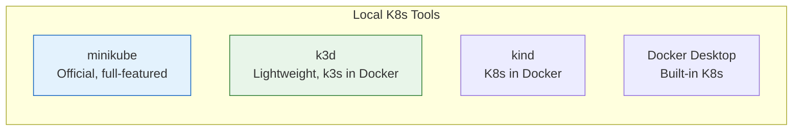
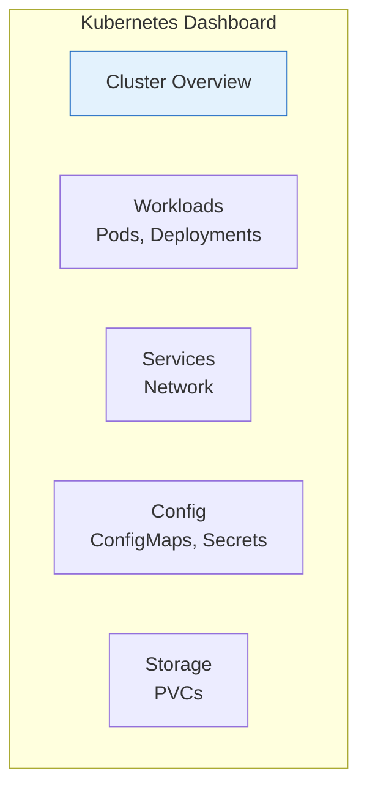

# Lesson 15.3: Local Kubernetes

> **"Learn K8s without cloud costs."**

## 📍 Learning Objectives

By the end of this lesson, you will:
1. Understand local K8s options
2. Install minikube or k3d
3. Run your first cluster
4. Access the Kubernetes dashboard

## 🔥 The Problem: K8s Clusters Cost Money

Real Kubernetes clusters:
- **EKS**: ~$75/month just for control plane + node costs
- **GKE**: Similar pricing
- **Self-managed**: Hardware, networking, maintenance

For learning? That's expensive.

**Solution**: Run K8s locally on your laptop.

---

## 📊 Local K8s Options



| Tool | Best For | Resources | Multi-node |
|------|----------|-----------|------------|
| **minikube** | Learning, official tool | Medium | Yes |
| **k3d** | Fast, lightweight | Low | Yes |
| **kind** | CI/CD testing | Low | Yes |
| **Docker Desktop** | Already have Docker | Medium | No |

**Recommendation**: 
- **minikube** for learning (more features, better docs)
- **k3d** for speed (faster startup, lower resources)

---

## 🚀 Option 1: minikube

### Install minikube

**macOS**:
```bash
brew install minikube
```

**Linux**:
```bash
curl -LO https://storage.googleapis.com/minikube/releases/latest/minikube-linux-amd64
sudo install minikube-linux-amd64 /usr/local/bin/minikube
```

**Windows** (PowerShell as Admin):
```powershell
choco install minikube
```

### Install kubectl

```bash
# macOS
brew install kubectl

# Linux
curl -LO "https://dl.k8s.io/release/$(curl -L -s https://dl.k8s.io/release/stable.txt)/bin/linux/amd64/kubectl"
sudo install kubectl /usr/local/bin/kubectl

# Windows
choco install kubernetes-cli
```

### Start Your First Cluster

```bash
# Start minikube (uses Docker by default)
minikube start

# Check status
minikube status

# Output:
# minikube
# type: Control Plane
# host: Running
# kubelet: Running
# apiserver: Running
```

### Verify kubectl Works

```bash
# Check cluster info
kubectl cluster-info

# Output:
# Kubernetes control plane is running at https://127.0.0.1:xxxxx
# CoreDNS is running at https://127.0.0.1:xxxxx/api/v1/...

# Check nodes
kubectl get nodes

# Output:
# NAME       STATUS   ROLES           AGE   VERSION
# minikube   Ready    control-plane   1m    v1.28.0
```

### minikube Commands

```bash
# Start/stop
minikube start
minikube stop

# Delete cluster
minikube delete

# SSH into the node
minikube ssh

# Get minikube IP
minikube ip

# Open dashboard
minikube dashboard

# Add more nodes
minikube node add
```

---

## 🚀 Option 2: k3d

### What is k3d?

k3d runs [k3s](https://k3s.io/) (lightweight Kubernetes) inside Docker containers.

**Advantages**:
- Faster startup (~30 seconds)
- Lower memory usage
- Easy multi-node clusters
- Works great in CI/CD

### Install k3d

```bash
# macOS
brew install k3d

# Linux/macOS (script)
curl -s https://raw.githubusercontent.com/k3d-io/k3d/main/install.sh | bash

# Windows
choco install k3d
```

### Create a Cluster

```bash
# Create simple cluster
k3d cluster create my-cluster

# Create with multiple nodes
k3d cluster create my-cluster --agents 2

# Create with specific ports exposed
k3d cluster create my-cluster -p "8080:80@loadbalancer"
```

### Verify

```bash
# kubectl is automatically configured
kubectl get nodes

# Output:
# NAME                      STATUS   ROLES                  AGE   VERSION
# k3d-my-cluster-server-0   Ready    control-plane,master   1m    v1.27.4+k3s1
# k3d-my-cluster-agent-0    Ready    <none>                 1m    v1.27.4+k3s1
# k3d-my-cluster-agent-1    Ready    <none>                 1m    v1.27.4+k3s1
```

### k3d Commands

```bash
# List clusters
k3d cluster list

# Stop cluster (keeps data)
k3d cluster stop my-cluster

# Start again
k3d cluster start my-cluster

# Delete cluster
k3d cluster delete my-cluster

# Get kubeconfig
k3d kubeconfig get my-cluster
```

---

## 🎛️ The Kubernetes Dashboard

### minikube Dashboard

```bash
# Opens in browser automatically
minikube dashboard
```

### k3d Dashboard (manual install)

```bash
# Deploy dashboard
kubectl apply -f https://raw.githubusercontent.com/kubernetes/dashboard/v2.7.0/aio/deploy/recommended.yaml

# Create admin user
kubectl create serviceaccount dashboard-admin -n kubernetes-dashboard
kubectl create clusterrolebinding dashboard-admin --clusterrole=cluster-admin --serviceaccount=kubernetes-dashboard:dashboard-admin

# Get token
kubectl create token dashboard-admin -n kubernetes-dashboard

# Start proxy
kubectl proxy

# Open browser to:
# http://localhost:8001/api/v1/namespaces/kubernetes-dashboard/services/https:kubernetes-dashboard:/proxy/
```

### Dashboard Overview



The dashboard shows:
- Cluster health
- Running workloads
- Resource usage
- Logs and events
- YAML editing

---

## 📝 First Deployment Test

Let's verify everything works:

```bash
# Create a simple deployment
kubectl create deployment hello --image=nginx

# Check deployment
kubectl get deployments
# NAME    READY   UP-TO-DATE   AVAILABLE   AGE
# hello   1/1     1            1           30s

# Check pods
kubectl get pods
# NAME                     READY   STATUS    RESTARTS   AGE
# hello-xxxxx-xxxxx        1/1     Running   0          30s

# Expose as a service
kubectl expose deployment hello --port=80 --type=NodePort

# Get service URL (minikube)
minikube service hello --url

# Or for k3d with port mapping
kubectl port-forward service/hello 8080:80
# Then open http://localhost:8080

# Clean up
kubectl delete deployment hello
kubectl delete service hello
```

---

## ⚙️ Configuring kubectl

### View Current Context

```bash
kubectl config current-context
# minikube (or k3d-my-cluster)

kubectl config get-contexts
# Shows all available clusters
```

### Switch Contexts

```bash
# If you have multiple clusters
kubectl config use-context minikube
kubectl config use-context k3d-my-cluster
```

### kubeconfig File

Located at `~/.kube/config`:

```yaml
apiVersion: v1
kind: Config
clusters:
  - name: minikube
    cluster:
      server: https://127.0.0.1:xxxxx
      certificate-authority: /path/to/ca.crt
contexts:
  - name: minikube
    context:
      cluster: minikube
      user: minikube
current-context: minikube
users:
  - name: minikube
    user:
      client-certificate: /path/to/client.crt
      client-key: /path/to/client.key
```

---

## 💻 Resource Requirements

### Minimum Requirements

| Tool | CPU | RAM | Disk |
|------|-----|-----|------|
| minikube | 2 cores | 2GB | 20GB |
| k3d | 1 core | 512MB | 2GB |

### Recommended

| Tool | CPU | RAM | Disk |
|------|-----|-----|------|
| minikube | 4 cores | 4GB | 40GB |
| k3d | 2 cores | 2GB | 10GB |

### Adjusting Resources

```bash
# minikube with more resources
minikube start --cpus=4 --memory=4096

# minikube with different driver
minikube start --driver=docker
minikube start --driver=hyperkit  # macOS
minikube start --driver=hyperv    # Windows
```

---

## 🔄 Multi-Node Clusters

### minikube Multi-Node

```bash
# Start with multiple nodes
minikube start --nodes=3

# Add a node later
minikube node add

# List nodes
kubectl get nodes
# NAME           STATUS   ROLES           AGE   VERSION
# minikube       Ready    control-plane   5m    v1.28.0
# minikube-m02   Ready    <none>          2m    v1.28.0
# minikube-m03   Ready    <none>          1m    v1.28.0
```

### k3d Multi-Node

```bash
# Create with 1 server + 3 agents
k3d cluster create dev --servers 1 --agents 3

kubectl get nodes
# NAME                  STATUS   ROLES                  AGE
# k3d-dev-server-0      Ready    control-plane,master   1m
# k3d-dev-agent-0       Ready    <none>                 1m
# k3d-dev-agent-1       Ready    <none>                 1m
# k3d-dev-agent-2       Ready    <none>                 1m
```

---

## 🎯 Quick Reference

### minikube Cheatsheet

```bash
minikube start              # Start cluster
minikube stop               # Stop cluster
minikube delete             # Delete cluster
minikube status             # Check status
minikube dashboard          # Open dashboard
minikube ssh                # SSH into node
minikube ip                 # Get cluster IP
minikube service <name>     # Open service in browser
```

### k3d Cheatsheet

```bash
k3d cluster create <name>   # Create cluster
k3d cluster delete <name>   # Delete cluster
k3d cluster list            # List clusters
k3d cluster start <name>    # Start stopped cluster
k3d cluster stop <name>     # Stop cluster
k3d node list               # List nodes
```

### kubectl Basics

```bash
kubectl get nodes           # List nodes
kubectl get pods            # List pods
kubectl get services        # List services
kubectl cluster-info        # Cluster info
kubectl config get-contexts # List contexts
```

---

## 🔑 Key Takeaways

1. **minikube** = official, full-featured, good for learning
2. **k3d** = lightweight, fast, good for CI/CD
3. **kubectl** = CLI to interact with any K8s cluster
4. **Dashboard** = visual cluster management
5. **Contexts** = switch between clusters easily

---

**Next**: 15.4 - kubectl Basics: The essential commands you'll use daily
