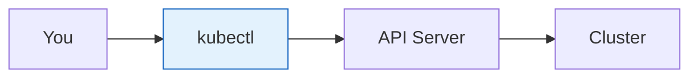
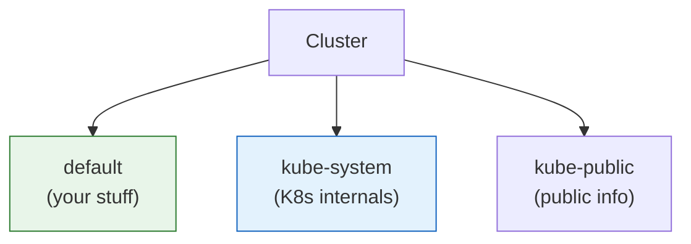

# Lesson 15.4: kubectl Basics

> **"The K8s CLI you'll use every day."**

## 📍 Learning Objectives

By the end of this lesson, you will:
1. Master essential kubectl commands
2. Navigate pods, deployments, and services
3. Debug running containers
4. Understand resource output formats

## 🔥 What is kubectl?

**kubectl** (kube-control) is the command-line interface for Kubernetes.



Every interaction with K8s goes through kubectl → API server.

---

## 📋 Command Structure

```bash
kubectl <verb> <resource> [name] [flags]
```

| Part | Examples |
|------|----------|
| **verb** | get, describe, create, apply, delete |
| **resource** | pods, deployments, services, nodes |
| **name** | my-pod, my-deployment (optional) |
| **flags** | -n namespace, -o yaml, --all |

---

## 🎯 Essential Commands

### 1. GET - View Resources

```bash
# List all pods
kubectl get pods

# Output:
# NAME                     READY   STATUS    RESTARTS   AGE
# nginx-7c5ddbdf54-x2j4k   1/1     Running   0          5m

# List all deployments
kubectl get deployments

# List all services
kubectl get services

# List all (common resources)
kubectl get all

# List nodes
kubectl get nodes
```

### Get with Options

```bash
# Wide output (more columns)
kubectl get pods -o wide
# Shows NODE, IP, etc.

# YAML output
kubectl get pod my-pod -o yaml

# JSON output
kubectl get pod my-pod -o json

# Watch for changes (live updates)
kubectl get pods -w

# All namespaces
kubectl get pods -A
kubectl get pods --all-namespaces

# Specific namespace
kubectl get pods -n kube-system
```

### 2. DESCRIBE - Detailed Info

```bash
# Full details of a pod
kubectl describe pod nginx-7c5ddbdf54-x2j4k

# Output includes:
# - Labels, Annotations
# - Container details
# - Events (crucial for debugging!)
# - Conditions

# Describe a deployment
kubectl describe deployment nginx

# Describe a node
kubectl describe node minikube
```

**Pro tip**: The **Events** section at the bottom shows what's happening/went wrong.

### 3. LOGS - Container Output

```bash
# View logs
kubectl logs nginx-7c5ddbdf54-x2j4k

# Follow logs (like tail -f)
kubectl logs -f nginx-7c5ddbdf54-x2j4k

# Last 100 lines
kubectl logs --tail=100 nginx-7c5ddbdf54-x2j4k

# Logs from specific container (multi-container pods)
kubectl logs nginx-7c5ddbdf54-x2j4k -c nginx

# Logs from previous crashed container
kubectl logs nginx-7c5ddbdf54-x2j4k --previous
```

### 4. EXEC - Run Commands in Container

```bash
# Run a command
kubectl exec nginx-7c5ddbdf54-x2j4k -- ls /

# Interactive shell
kubectl exec -it nginx-7c5ddbdf54-x2j4k -- /bin/sh
kubectl exec -it nginx-7c5ddbdf54-x2j4k -- /bin/bash

# Specific container
kubectl exec -it my-pod -c my-container -- /bin/sh
```

### 5. APPLY - Create/Update Resources

```bash
# Apply a YAML file
kubectl apply -f deployment.yaml

# Apply all files in a directory
kubectl apply -f ./k8s/

# Apply from URL
kubectl apply -f https://example.com/manifest.yaml

# Dry run (see what would happen)
kubectl apply -f deployment.yaml --dry-run=client
```

### 6. DELETE - Remove Resources

```bash
# Delete a pod
kubectl delete pod nginx-7c5ddbdf54-x2j4k

# Delete a deployment
kubectl delete deployment nginx

# Delete from file
kubectl delete -f deployment.yaml

# Delete all pods in namespace
kubectl delete pods --all

# Force delete stuck pod
kubectl delete pod my-pod --force --grace-period=0
```

---

## 🔍 Common Resource Types

```bash
# Short names make commands faster
kubectl get po    # pods
kubectl get deploy # deployments
kubectl get svc   # services
kubectl get no    # nodes
kubectl get ns    # namespaces
kubectl get cm    # configmaps
kubectl get secrets
kubectl get pv    # persistentvolumes
kubectl get pvc   # persistentvolumeclaims
kubectl get ing   # ingress
```

### See All Resource Types

```bash
kubectl api-resources

# Output (truncated):
# NAME         SHORTNAMES   KIND         NAMESPACED
# pods         po           Pod          true
# services     svc          Service      true
# deployments  deploy       Deployment   true
# nodes        no           Node         false
```

---

## 🛠️ Creating Resources

### Imperative (Quick & Dirty)

```bash
# Create deployment
kubectl create deployment nginx --image=nginx

# Create service
kubectl expose deployment nginx --port=80

# Run a one-off pod
kubectl run debug --image=busybox -it --rm -- sh

# Scale
kubectl scale deployment nginx --replicas=5
```

### Declarative (Production Way)

```bash
# Generate YAML without creating
kubectl create deployment nginx --image=nginx --dry-run=client -o yaml > deployment.yaml

# Edit and apply
kubectl apply -f deployment.yaml
```

---

## 📝 Working with Namespaces



```bash
# List namespaces
kubectl get namespaces

# Create namespace
kubectl create namespace dev

# Get pods in specific namespace
kubectl get pods -n kube-system

# Set default namespace for session
kubectl config set-context --current --namespace=dev

# Check current namespace
kubectl config view --minify | grep namespace
```

---

## 🔧 Debugging Commands

### 1. Events

```bash
# All events
kubectl get events

# Events for specific pod (via describe)
kubectl describe pod my-pod

# Sort by time
kubectl get events --sort-by='.lastTimestamp'
```

### 2. Resource Usage

```bash
# Node resources
kubectl top nodes

# Pod resources
kubectl top pods

# Requires metrics-server (minikube addons enable metrics-server)
```

### 3. Port Forwarding

```bash
# Forward local port to pod
kubectl port-forward pod/nginx-xxx 8080:80
# Now localhost:8080 → pod's port 80

# Forward to service
kubectl port-forward svc/nginx 8080:80
```

### 4. Copy Files

```bash
# Copy from pod to local
kubectl cp my-pod:/path/to/file ./local-file

# Copy from local to pod
kubectl cp ./local-file my-pod:/path/to/file
```

---

## 📊 Output Formatting

### JSON Path

```bash
# Extract specific fields
kubectl get pods -o jsonpath='{.items[*].metadata.name}'

# Get all pod IPs
kubectl get pods -o jsonpath='{.items[*].status.podIP}'
```

### Custom Columns

```bash
kubectl get pods -o custom-columns=NAME:.metadata.name,IP:.status.podIP,NODE:.spec.nodeName
```

### Sorting

```bash
# Sort by creation time
kubectl get pods --sort-by='.metadata.creationTimestamp'

# Sort by restart count
kubectl get pods --sort-by='.status.containerStatuses[0].restartCount'
```

---

## ⌨️ Productivity Tips

### 1. Aliases

Add to `~/.bashrc` or `~/.zshrc`:

```bash
alias k='kubectl'
alias kg='kubectl get'
alias kd='kubectl describe'
alias kl='kubectl logs'
alias ke='kubectl exec -it'
alias ka='kubectl apply -f'
alias kdel='kubectl delete'
```

Now: `k get po` instead of `kubectl get pods`

### 2. Auto-completion

```bash
# Bash
source <(kubectl completion bash)

# Zsh
source <(kubectl completion zsh)

# Add to shell profile for persistence
echo 'source <(kubectl completion bash)' >> ~/.bashrc
```

Now: `kubectl get p<TAB>` auto-completes to `pods`

### 3. kubectx & kubens

Tools for fast context/namespace switching:

```bash
# Install
brew install kubectx

# Switch context
kubectx my-cluster

# Switch namespace
kubens development
```

---

## 📋 Common Workflows

### Deploy an App

```bash
# 1. Create deployment
kubectl apply -f deployment.yaml

# 2. Check status
kubectl get pods

# 3. View logs
kubectl logs -f <pod-name>

# 4. Expose service
kubectl expose deployment myapp --port=80

# 5. Test locally
kubectl port-forward svc/myapp 8080:80
```

### Debug a Failing Pod

```bash
# 1. Check pod status
kubectl get pods
# STATUS: CrashLoopBackOff

# 2. Describe pod (check Events)
kubectl describe pod <pod-name>

# 3. Check logs
kubectl logs <pod-name>
kubectl logs <pod-name> --previous

# 4. Shell in (if it's running)
kubectl exec -it <pod-name> -- /bin/sh
```

### Update an App

```bash
# 1. Edit deployment
kubectl edit deployment myapp
# Or update YAML and reapply
kubectl apply -f deployment.yaml

# 2. Watch rollout
kubectl rollout status deployment/myapp

# 3. Rollback if needed
kubectl rollout undo deployment/myapp
```

---

## 🎯 Quick Reference Card

| Command | Purpose |
|---------|---------|
| `kubectl get pods` | List pods |
| `kubectl describe pod <name>` | Pod details + events |
| `kubectl logs <pod>` | Container logs |
| `kubectl logs -f <pod>` | Follow logs |
| `kubectl exec -it <pod> -- sh` | Shell into container |
| `kubectl apply -f <file>` | Create/update resources |
| `kubectl delete <resource> <name>` | Delete resource |
| `kubectl port-forward <pod> 8080:80` | Local port forward |
| `kubectl scale deploy <name> --replicas=N` | Scale up/down |
| `kubectl rollout status deploy/<name>` | Watch deployment |

---

## 🔑 Key Takeaways

1. **kubectl = your K8s remote control**
2. **get** for listing, **describe** for details
3. **logs** for troubleshooting, **exec** for debugging
4. **apply** for declarative, **create** for imperative
5. **Set up aliases** - you'll type these commands hundreds of times

---

**Next**: 15.5 - K8s Basics Q&A: Common questions and when K8s is overkill
