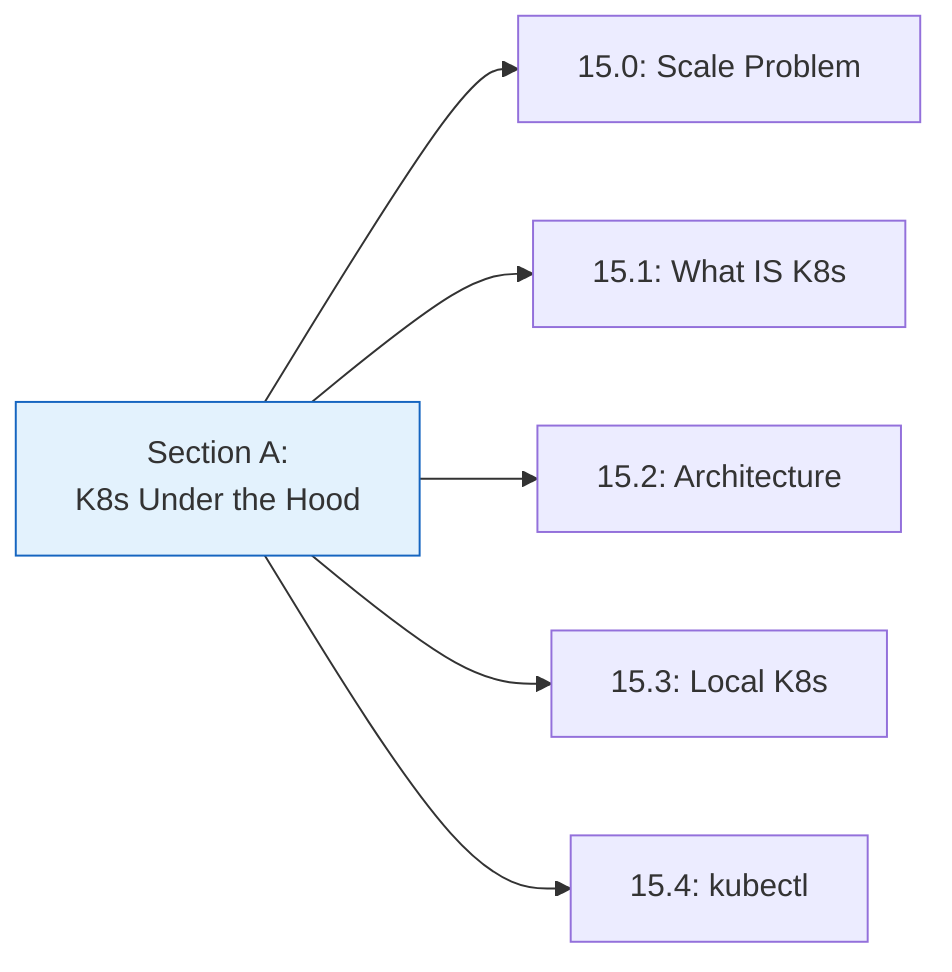
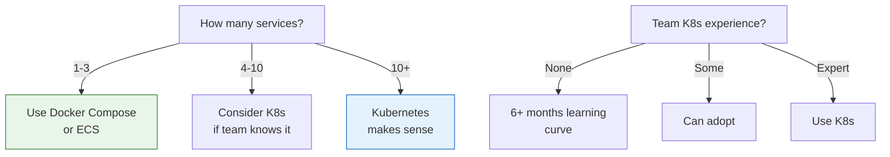
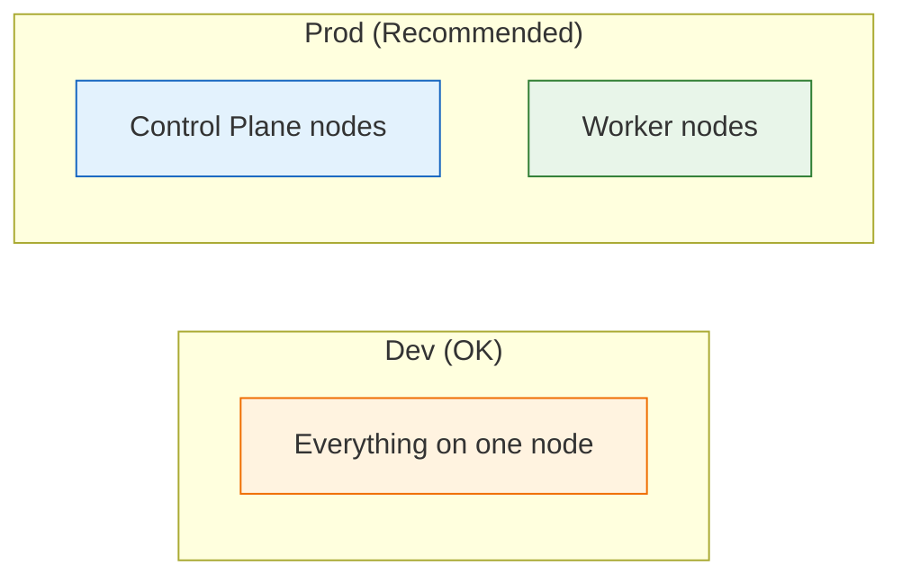
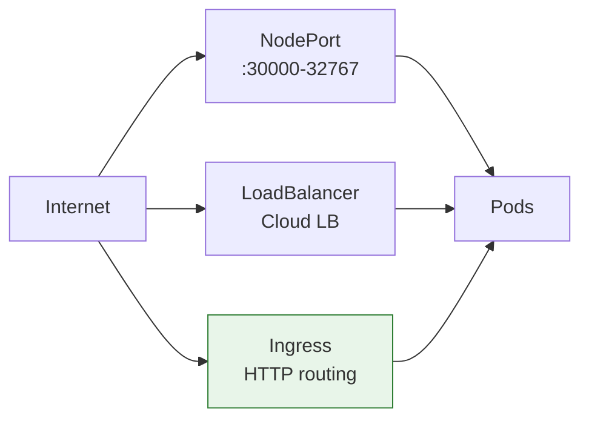
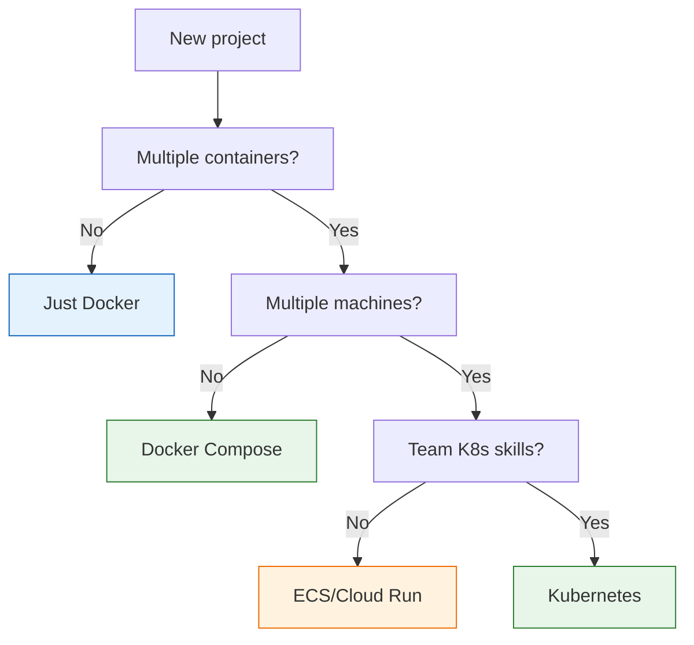

# Lesson 15.5: K8s Basics Q&A

> **Duration**: 10 min | **Section**: A - Kubernetes Under the Hood Recap

## 🔍 Section A: What We Learned



### Core Concepts Summary

| Lesson | Key Concept |
|--------|-------------|
| 15.0 | Docker Compose doesn't scale, orchestration does |
| 15.1 | K8s = container OS, declarative model |
| 15.2 | Control plane (brain) + worker nodes (muscles) |
| 15.3 | minikube/k3d for local development |
| 15.4 | kubectl for all cluster operations |

---

## ❓ Frequently Asked Questions

### Comparison Questions

**Q: Kubernetes vs ECS - which should I use?**

| Factor | Kubernetes | AWS ECS |
|--------|-----------|---------|
| **Portability** | ✅ Any cloud | ❌ AWS only |
| **Complexity** | ❌ Higher | ✅ Lower |
| **Learning curve** | ❌ Steep | ✅ Easier |
| **Features** | ✅ Everything | ⚠️ AWS ecosystem |
| **Community** | ✅ Massive | ⚠️ AWS focused |
| **Cost** | Variable | EKS = $72/mo + nodes |

**Choose ECS if**:
- All-in on AWS
- Smaller team
- Want managed simplicity

**Choose Kubernetes if**:
- Multi-cloud or hybrid
- Larger team with K8s skills
- Need portability

---

**Q: When is Kubernetes overkill?**



**K8s is overkill when**:
- ✅ Traffic fits on one machine
- ✅ Fewer than 5 microservices
- ✅ No team experience
- ✅ Simple deployment needs

**K8s makes sense when**:
- ❌ Need auto-scaling
- ❌ Zero-downtime deploys critical
- ❌ Multi-cloud strategy
- ❌ Running 10+ services

---

**Q: EKS vs GKE vs AKS - which managed K8s?**

| Provider | Best For | Notes |
|----------|----------|-------|
| **EKS** | AWS shops | Tight AWS integration |
| **GKE** | K8s newcomers | Most polished, auto-upgrades |
| **AKS** | Azure/.NET shops | Azure ecosystem |

**GKE is considered the best K8s experience** (Google created K8s).

---

### Architecture Questions

**Q: Can the control plane run on the same machine as workloads?**

Yes, but not recommended for production.

- **minikube/k3d**: Single node runs everything
- **Production**: Separate control plane from workers



---

**Q: What if etcd goes down?**

| Scenario | Impact |
|----------|--------|
| Single etcd node fails | **Cluster unusable** |
| 1 of 3 etcd nodes fails | Cluster continues |
| 2 of 3 etcd nodes fail | **Cluster unusable** |

That's why production runs **3 or 5 etcd nodes** (odd number for quorum).

---

**Q: What's the difference between kubectl apply and kubectl create?**

```bash
# create: Imperative - errors if exists
kubectl create deployment nginx --image=nginx
# Error if nginx deployment already exists

# apply: Declarative - creates or updates
kubectl apply -f deployment.yaml
# Works whether it exists or not
```

**Best practice**: Use `apply` for reproducibility.

---

### Practical Questions

**Q: How do I access my app from outside the cluster?**



| Type | Use Case |
|------|----------|
| **NodePort** | Development, testing |
| **LoadBalancer** | Single service exposure |
| **Ingress** | Multiple services, HTTP routing |

---

**Q: How do I debug a CrashLoopBackOff?**

```bash
# Step 1: Get pod name
kubectl get pods

# Step 2: Check events
kubectl describe pod <name>
# Look at "Events" section

# Step 3: Check logs
kubectl logs <name>
kubectl logs <name> --previous  # If container restarted

# Common causes:
# - Missing config/secrets
# - Wrong image tag
# - Failed health checks
# - Application crash
```

---

**Q: Can I use docker commands inside a K8s cluster?**

```bash
# minikube: yes
minikube ssh
docker ps

# k3d: yes (it's Docker containers)
docker ps | grep k3d

# Production K8s: Usually no
# containerd is the runtime, not Docker
# Use crictl instead
crictl ps
```

---

**Q: How do I see resource usage?**

```bash
# Enable metrics server (minikube)
minikube addons enable metrics-server

# Wait a minute, then:
kubectl top nodes
kubectl top pods

# For detailed metrics, use:
# - Prometheus + Grafana
# - Datadog
# - Cloud-specific monitoring
```

---

### Cost Questions

**Q: How much does Kubernetes cost?**

| Component | Self-Managed | EKS | GKE |
|-----------|-------------|-----|-----|
| **Control Plane** | Your servers | $72/month | Free (standard) |
| **Worker Nodes** | Your servers | EC2 costs | GCE costs |
| **Load Balancer** | - | ALB costs | GLB costs |

**Rule of thumb**: Managed K8s adds ~$75-150/month overhead.

---

**Q: Is there a serverless Kubernetes option?**

Yes!

| Service | Provider | How it works |
|---------|----------|--------------|
| **AWS Fargate** | AWS | EKS without managing nodes |
| **GKE Autopilot** | GCP | GKE without managing nodes |
| **Azure Container Apps** | Azure | Serverless containers |

You pay per pod resource usage, not per node.

---

## 💡 Common Mistakes

### 1. Starting with K8s Too Early

```
❌ "We have 2 services, let's use Kubernetes!"
✅ "We have 2 services, Docker Compose is perfect."
```

### 2. Not Using Namespaces

```yaml
# ❌ Everything in default namespace
# ✅ Separate by environment
namespaces:
  - dev
  - staging  
  - production
```

### 3. Skipping Resource Limits

```yaml
# ❌ No limits = runaway containers
# ✅ Always set limits
resources:
  requests:
    memory: "256Mi"
    cpu: "250m"
  limits:
    memory: "512Mi"
    cpu: "500m"
```

### 4. Not Learning kubectl

```bash
# ❌ Only using dashboards
# ✅ Master the CLI first
kubectl get pods -A -o wide
kubectl describe pod <name>
kubectl logs -f <pod>
```

---

## 🎯 Quick Decision Framework



---

## 🔑 Key Takeaways

1. **K8s vs ECS**: K8s for portability, ECS for simplicity
2. **K8s is overkill** for small, simple deployments
3. **kubectl is essential** - learn it well
4. **Managed K8s** (EKS, GKE) handles control plane
5. **Serverless K8s** (Fargate, Autopilot) eliminates node management

---

**Next**: 15.6 - Pods: The smallest deployable unit in Kubernetes
